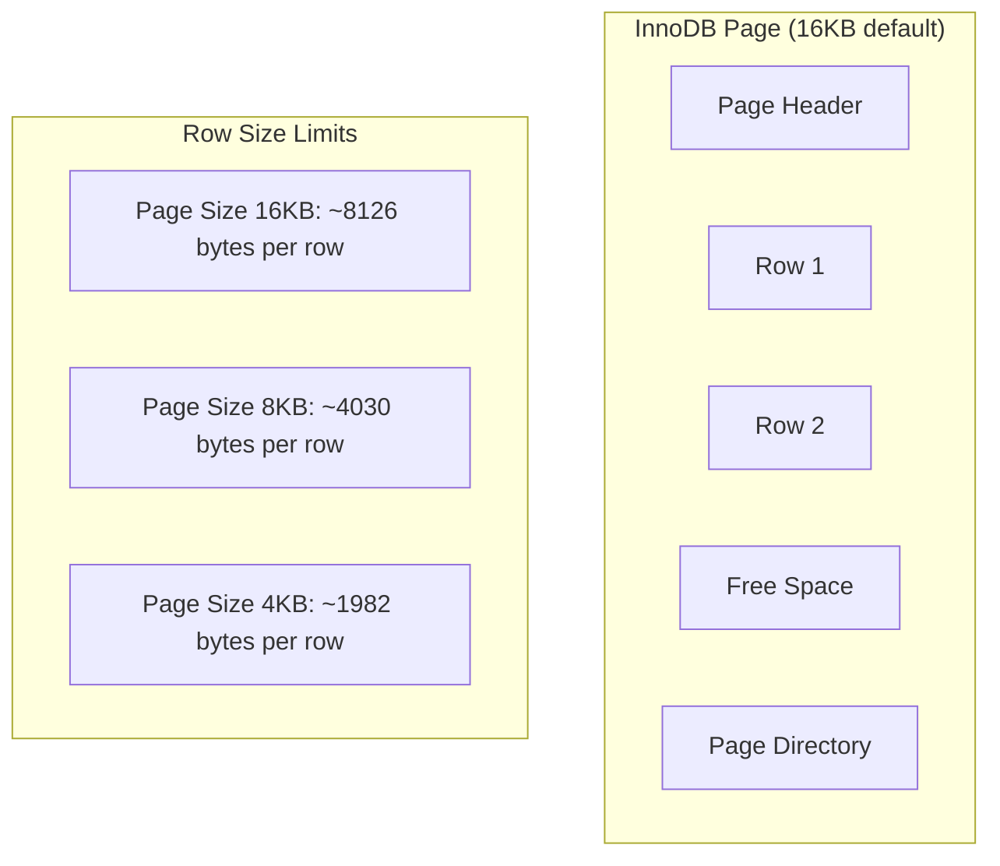

# How to Fix 'Row Size Too Large' Errors in MySQL

Author: [nawazdhandala](https://www.github.com/nawazdhandala)

Tags: MySQL, InnoDB, Database, Troubleshooting, Schema Design

Description: Learn how to diagnose and fix MySQL 'Row size too large' errors by understanding InnoDB row size limits and optimizing your table structure.

---

The "Row size too large" error in MySQL can be frustrating because it often appears unexpectedly when you try to create or alter a table. This error occurs when the combined size of all columns in a row exceeds InnoDB's maximum row size limit. Understanding why this happens and how to fix it requires knowledge of how InnoDB stores data internally.

## Understanding the Error

The error message typically looks like this:

```
ERROR 1118 (42000): Row size too large (> 8126). Changing some columns to TEXT or BLOB may help.
In current row format, BLOB prefix of 768 bytes is stored inline.
```

InnoDB has a maximum row size of approximately 65,535 bytes, but the practical limit depends on your page size and row format.



## Why This Error Occurs

### InnoDB Page Layout

InnoDB stores data in pages (default 16KB). At least two rows must fit on each page, which limits the maximum row size to about half the page size minus overhead.

### Row Format Impact

Different row formats store data differently:

| Row Format | BLOB/TEXT Storage | VARCHAR Storage | Max Inline |
|------------|------------------|-----------------|------------|
| REDUNDANT | 768 bytes inline | All inline | ~8000 bytes |
| COMPACT | 768 bytes inline | All inline | ~8000 bytes |
| DYNAMIC | 20-byte pointer | Overflow if needed | ~8000 bytes |
| COMPRESSED | 20-byte pointer | Overflow if needed | ~8000 bytes |

## Diagnosing the Problem

### Check Current Row Size

Calculate the approximate row size for your table:

```sql
-- Calculate column sizes for a table
SELECT
    COLUMN_NAME,
    DATA_TYPE,
    CHARACTER_MAXIMUM_LENGTH,
    CASE
        WHEN DATA_TYPE = 'varchar' THEN CHARACTER_MAXIMUM_LENGTH * 4 + 2
        WHEN DATA_TYPE = 'char' THEN CHARACTER_MAXIMUM_LENGTH * 4
        WHEN DATA_TYPE = 'text' THEN 768  -- Inline portion for COMPACT
        WHEN DATA_TYPE = 'mediumtext' THEN 768
        WHEN DATA_TYPE = 'longtext' THEN 768
        WHEN DATA_TYPE = 'blob' THEN 768
        WHEN DATA_TYPE = 'int' THEN 4
        WHEN DATA_TYPE = 'bigint' THEN 8
        WHEN DATA_TYPE = 'datetime' THEN 8
        WHEN DATA_TYPE = 'timestamp' THEN 4
        WHEN DATA_TYPE = 'decimal' THEN
            FLOOR((NUMERIC_PRECISION - NUMERIC_SCALE) / 9) * 4 +
            CEIL(((NUMERIC_PRECISION - NUMERIC_SCALE) % 9) / 2) +
            FLOOR(NUMERIC_SCALE / 9) * 4 +
            CEIL((NUMERIC_SCALE % 9) / 2)
        ELSE 8
    END as estimated_bytes
FROM information_schema.COLUMNS
WHERE TABLE_SCHEMA = 'your_database'
AND TABLE_NAME = 'your_table';

-- Sum up the total
SELECT
    TABLE_NAME,
    SUM(
        CASE
            WHEN DATA_TYPE = 'varchar' THEN CHARACTER_MAXIMUM_LENGTH * 4 + 2
            WHEN DATA_TYPE = 'char' THEN CHARACTER_MAXIMUM_LENGTH * 4
            WHEN DATA_TYPE IN ('text', 'mediumtext', 'longtext', 'blob') THEN 768
            WHEN DATA_TYPE = 'int' THEN 4
            WHEN DATA_TYPE = 'bigint' THEN 8
            WHEN DATA_TYPE = 'datetime' THEN 8
            WHEN DATA_TYPE = 'timestamp' THEN 4
            ELSE 8
        END
    ) as estimated_row_size
FROM information_schema.COLUMNS
WHERE TABLE_SCHEMA = 'your_database'
AND TABLE_NAME = 'your_table'
GROUP BY TABLE_NAME;
```

### Check Table Row Format

```sql
-- Check current row format
SELECT
    TABLE_NAME,
    ROW_FORMAT,
    ENGINE
FROM information_schema.TABLES
WHERE TABLE_SCHEMA = 'your_database'
AND TABLE_NAME = 'your_table';

-- Check InnoDB settings
SHOW VARIABLES LIKE 'innodb_file_format';
SHOW VARIABLES LIKE 'innodb_default_row_format';
SHOW VARIABLES LIKE 'innodb_page_size';
```

## Solutions

### Solution 1: Use DYNAMIC or COMPRESSED Row Format

The DYNAMIC row format stores large columns off-page, keeping only a 20-byte pointer inline:

```sql
-- Change table to DYNAMIC row format
ALTER TABLE your_table ROW_FORMAT=DYNAMIC;

-- Or specify when creating
CREATE TABLE new_table (
    id INT PRIMARY KEY,
    title VARCHAR(255),
    content LONGTEXT,
    metadata JSON
) ENGINE=InnoDB ROW_FORMAT=DYNAMIC;
```

For MySQL 5.6, you may need to enable the Barracuda file format first:

```sql
-- MySQL 5.6 - enable Barracuda
SET GLOBAL innodb_file_format = Barracuda;
SET GLOBAL innodb_file_per_table = ON;

-- Then alter the table
ALTER TABLE your_table ROW_FORMAT=DYNAMIC;
```

### Solution 2: Convert Large VARCHAR to TEXT

VARCHAR columns are stored inline, but TEXT columns can overflow to separate pages:

```sql
-- Before: Many large VARCHAR columns
CREATE TABLE articles (
    id INT PRIMARY KEY,
    title VARCHAR(500),
    summary VARCHAR(2000),
    content VARCHAR(10000),      -- This uses a lot of inline space
    author_bio VARCHAR(5000),
    meta_description VARCHAR(1000)
);

-- After: Convert large VARCHAR to TEXT
ALTER TABLE articles
    MODIFY content TEXT,
    MODIFY author_bio TEXT;
```

Here is a script to identify candidates for conversion:

```python
import mysql.connector

def find_large_varchar_columns(connection, database, min_length=500):
    """
    Find VARCHAR columns that could be converted to TEXT.
    """
    cursor = connection.cursor(dictionary=True)

    cursor.execute("""
        SELECT
            TABLE_NAME,
            COLUMN_NAME,
            CHARACTER_MAXIMUM_LENGTH
        FROM information_schema.COLUMNS
        WHERE TABLE_SCHEMA = %s
        AND DATA_TYPE = 'varchar'
        AND CHARACTER_MAXIMUM_LENGTH >= %s
        ORDER BY CHARACTER_MAXIMUM_LENGTH DESC
    """, (database, min_length))

    results = cursor.fetchall()

    print(f"Large VARCHAR columns (>= {min_length} chars):")
    for row in results:
        print(f"  {row['TABLE_NAME']}.{row['COLUMN_NAME']}: "
              f"VARCHAR({row['CHARACTER_MAXIMUM_LENGTH']})")

        # Generate ALTER statement
        print(f"    ALTER TABLE {row['TABLE_NAME']} "
              f"MODIFY {row['COLUMN_NAME']} TEXT;")

    return results

# Usage
connection = mysql.connector.connect(
    host='localhost',
    user='root',
    password='password',
    database='myapp'
)
find_large_varchar_columns(connection, 'myapp', 1000)
```

### Solution 3: Split the Table (Vertical Partitioning)

If you have many columns, consider splitting the table:

```sql
-- Before: One wide table
CREATE TABLE users (
    id INT PRIMARY KEY,
    username VARCHAR(50),
    email VARCHAR(100),
    -- ... many more columns
    profile_bio TEXT,
    preferences JSON,
    activity_log LONGTEXT
);

-- After: Split into core and extended tables
CREATE TABLE users (
    id INT PRIMARY KEY,
    username VARCHAR(50),
    email VARCHAR(100)
    -- Core columns only
) ENGINE=InnoDB;

CREATE TABLE user_profiles (
    user_id INT PRIMARY KEY,
    profile_bio TEXT,
    preferences JSON,
    FOREIGN KEY (user_id) REFERENCES users(id)
) ENGINE=InnoDB;

CREATE TABLE user_activity (
    user_id INT PRIMARY KEY,
    activity_log LONGTEXT,
    FOREIGN KEY (user_id) REFERENCES users(id)
) ENGINE=InnoDB;
```


### Solution 4: Reduce Column Sizes

Often columns are oversized for their actual data:

```sql
-- Analyze actual data sizes
SELECT
    MAX(LENGTH(title)) as max_title,
    MAX(LENGTH(description)) as max_description,
    MAX(LENGTH(content)) as max_content
FROM articles;

-- Resize columns based on actual usage
ALTER TABLE articles
    MODIFY title VARCHAR(200),        -- Was VARCHAR(500)
    MODIFY description VARCHAR(500);  -- Was VARCHAR(2000)
```

### Solution 5: Increase InnoDB Page Size (New Databases Only)

For new installations, you can use larger page sizes:

```ini
# my.cnf - Must be set before creating the database
[mysqld]
innodb_page_size = 32K  # Options: 4K, 8K, 16K (default), 32K, 64K
```

Note: This requires reinitializing the data directory and is not suitable for existing databases.

## Working Example: Fixing a Real Error

Let us walk through fixing a common scenario:

```sql
-- This table definition causes the error
CREATE TABLE products (
    id INT AUTO_INCREMENT PRIMARY KEY,
    sku VARCHAR(50),
    name VARCHAR(500),
    short_description VARCHAR(2000),
    long_description VARCHAR(10000),
    specifications VARCHAR(5000),
    features VARCHAR(3000),
    warranty_info VARCHAR(2000),
    shipping_details VARCHAR(2000),
    meta_title VARCHAR(500),
    meta_description VARCHAR(1000),
    meta_keywords VARCHAR(500),
    created_at DATETIME,
    updated_at DATETIME
) ENGINE=InnoDB;

-- Error: Row size too large (> 8126)
```

The fix involves multiple approaches:

```sql
-- Step 1: Use DYNAMIC row format
-- Step 2: Convert appropriate columns to TEXT
-- Step 3: Reduce oversized columns

CREATE TABLE products (
    id INT AUTO_INCREMENT PRIMARY KEY,
    sku VARCHAR(50),
    name VARCHAR(255),                    -- Reduced from 500
    short_description TEXT,               -- Changed from VARCHAR(2000)
    long_description MEDIUMTEXT,          -- Changed from VARCHAR(10000)
    specifications TEXT,                  -- Changed from VARCHAR(5000)
    features TEXT,                        -- Changed from VARCHAR(3000)
    warranty_info TEXT,                   -- Changed from VARCHAR(2000)
    shipping_details TEXT,                -- Changed from VARCHAR(2000)
    meta_title VARCHAR(200),              -- Reduced from 500
    meta_description VARCHAR(500),        -- Reduced from 1000
    meta_keywords VARCHAR(255),           -- Reduced from 500
    created_at DATETIME,
    updated_at DATETIME
) ENGINE=InnoDB ROW_FORMAT=DYNAMIC;
```

## Prevention Checklist

1. **Use DYNAMIC row format** by default for new tables
2. **Use TEXT for large content** instead of oversized VARCHAR
3. **Right-size your columns** based on actual data requirements
4. **Monitor row sizes** during schema design
5. **Consider vertical partitioning** for very wide tables
6. **Test schema changes** in development before production

## Quick Reference

```sql
-- Check row format
SELECT TABLE_NAME, ROW_FORMAT
FROM information_schema.TABLES
WHERE TABLE_SCHEMA = 'mydb';

-- Change to DYNAMIC format
ALTER TABLE mytable ROW_FORMAT=DYNAMIC;

-- Convert VARCHAR to TEXT
ALTER TABLE mytable MODIFY large_column TEXT;

-- Estimate row size (rough)
SELECT SUM(
    CASE
        WHEN DATA_TYPE = 'varchar' THEN CHARACTER_MAXIMUM_LENGTH * 4 + 2
        WHEN DATA_TYPE IN ('text','blob') THEN 768
        ELSE 8
    END
) as bytes
FROM information_schema.COLUMNS
WHERE TABLE_NAME = 'mytable';
```

The "Row size too large" error is usually straightforward to fix once you understand InnoDB's storage model. The DYNAMIC row format combined with appropriate use of TEXT columns will resolve most cases, while vertical partitioning handles extreme situations with many columns.
