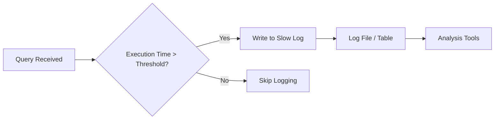
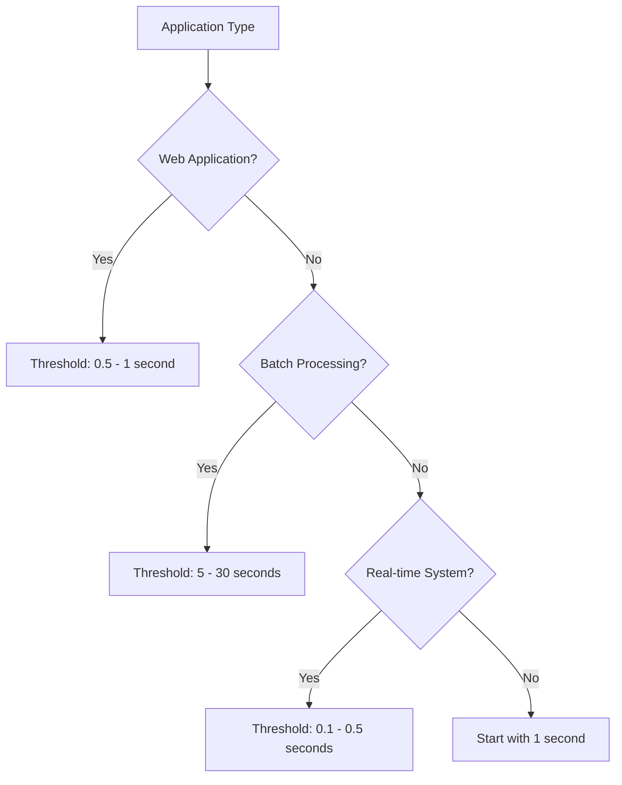

# How to Configure MySQL Slow Query Log

Author: [nawazdhandala](https://www.github.com/nawazdhandala)

Tags: MySQL, Database, Performance, Slow Query Log, Monitoring, Optimization

Description: Learn how to configure and use MySQL slow query log to identify and optimize poorly performing database queries.

---

Slow queries are silent killers of application performance. A query that takes 5 seconds to execute might go unnoticed during development but brings your production server to its knees when hundreds of users hit it simultaneously. MySQL's slow query log is your first line of defense against these performance problems.

This guide walks you through configuring the slow query log, analyzing the output, and using the insights to speed up your database.

## How the Slow Query Log Works

The slow query log captures queries that exceed a specified execution time threshold. MySQL writes these queries to a file along with useful metadata like execution time, rows examined, and lock time.



By default, the slow query log is disabled. You need to enable it explicitly and configure the threshold that makes sense for your application.

## Enabling the Slow Query Log

You can enable the slow query log at runtime without restarting MySQL:

```sql
-- Enable the slow query log
SET GLOBAL slow_query_log = 'ON';

-- Set the threshold to 1 second (queries taking longer get logged)
SET GLOBAL long_query_time = 1;

-- Specify the log file location
SET GLOBAL slow_query_log_file = '/var/log/mysql/slow-query.log';

-- Verify the settings
SHOW VARIABLES LIKE 'slow_query%';
SHOW VARIABLES LIKE 'long_query_time';
```

For permanent configuration, add these settings to your MySQL configuration file:

```ini
# /etc/mysql/mysql.conf.d/mysqld.cnf

[mysqld]
# Enable slow query logging
slow_query_log = 1

# Log file location
slow_query_log_file = /var/log/mysql/slow-query.log

# Threshold in seconds (can use decimals like 0.5)
long_query_time = 1

# Log queries that don't use indexes
log_queries_not_using_indexes = 1

# Limit logging of index-less queries to avoid flooding
log_throttle_queries_not_using_indexes = 10
```

Restart MySQL after modifying the configuration file:

```bash
sudo systemctl restart mysql
```

## Configuring Additional Logging Options

MySQL offers several options to capture more details about slow queries.

### Log Queries Not Using Indexes

Queries without proper indexes often become slow as data grows:

```sql
-- Enable logging of queries not using indexes
SET GLOBAL log_queries_not_using_indexes = 'ON';

-- Throttle to prevent log flooding (logs max 10 per minute)
SET GLOBAL log_throttle_queries_not_using_indexes = 10;
```

### Log Slow Admin Statements

Administrative statements like `OPTIMIZE TABLE` and `ALTER TABLE` can also be slow:

```sql
-- Include slow admin statements in the log
SET GLOBAL log_slow_admin_statements = 'ON';
```

### Log to a Table Instead of File

You can store slow queries in a MySQL table for easier querying:

```sql
-- Switch to table output
SET GLOBAL log_output = 'TABLE';

-- Or log to both file and table
SET GLOBAL log_output = 'FILE,TABLE';

-- Query the slow log table
SELECT * FROM mysql.slow_log
ORDER BY start_time DESC
LIMIT 10;
```

## Understanding the Slow Query Log Format

A typical slow query log entry looks like this:

```
# Time: 2026-01-24T10:15:23.456789Z
# User@Host: webapp[webapp] @ localhost []  Id: 12345
# Query_time: 3.456789  Lock_time: 0.000123 Rows_sent: 1000  Rows_examined: 5000000
SET timestamp=1737713723;
SELECT * FROM orders WHERE customer_id = 12345 AND status = 'pending';
```

Here is what each field means:

| Field | Description |
|-------|-------------|
| Time | When the query started |
| User@Host | Database user and connection source |
| Query_time | Total execution time in seconds |
| Lock_time | Time spent waiting for locks |
| Rows_sent | Number of rows returned |
| Rows_examined | Number of rows scanned (high number = potential problem) |

The ratio of Rows_examined to Rows_sent is critical. If you examine 5 million rows to return 1000, you have an optimization opportunity.

## Analyzing Slow Queries with mysqldumpslow

MySQL includes `mysqldumpslow`, a tool that summarizes slow query logs:

```bash
# Show the 10 slowest queries by average time
mysqldumpslow -s at -t 10 /var/log/mysql/slow-query.log

# Show queries with the most total time
mysqldumpslow -s t -t 10 /var/log/mysql/slow-query.log

# Show queries that examine the most rows
mysqldumpslow -s ar -t 10 /var/log/mysql/slow-query.log
```

Common sorting options:

- `-s t` - Sort by total time
- `-s at` - Sort by average time
- `-s c` - Sort by count (frequency)
- `-s ar` - Sort by average rows examined

Example output:

```
Count: 1523  Time=2.45s (3735s)  Lock=0.00s (0s)  Rows=1.0 (1523), webapp[webapp]@localhost
  SELECT * FROM orders WHERE customer_id = N AND status = 'S'
```

This tells you the query ran 1523 times, averaging 2.45 seconds per execution.

## Using pt-query-digest for Advanced Analysis

Percona Toolkit's `pt-query-digest` provides more detailed analysis:

```bash
# Install Percona Toolkit
sudo apt-get install percona-toolkit

# Analyze the slow query log
pt-query-digest /var/log/mysql/slow-query.log > analysis.txt

# Analyze queries from the last hour
pt-query-digest --since '1h' /var/log/mysql/slow-query.log
```

The output includes query fingerprints, execution statistics, and EXPLAIN plans:

```
# Profile
# Rank Query ID           Response time  Calls  R/Call  V/M   Item
# ==== ================== ============== ====== ======= ===== ====
#    1 0xABCD1234...      1500.0000 45.0%  1500  1.0000  0.02 SELECT orders
#    2 0xEFGH5678...       800.0000 24.0%   200  4.0000  0.10 SELECT users
```

## Setting Appropriate Thresholds

Choosing the right `long_query_time` depends on your application:



Start with a conservative threshold and adjust based on the log volume:

```sql
-- Start with 1 second for most applications
SET GLOBAL long_query_time = 1;

-- If log grows too fast, increase threshold
SET GLOBAL long_query_time = 2;

-- For high-performance requirements, lower threshold
SET GLOBAL long_query_time = 0.5;
```

## Managing Log File Size

Slow query logs can grow large quickly. Implement log rotation:

```bash
# /etc/logrotate.d/mysql-slow-log
/var/log/mysql/slow-query.log {
    daily
    rotate 7
    compress
    delaycompress
    missingok
    notifempty
    create 640 mysql mysql
    postrotate
        /usr/bin/mysqladmin flush-logs
    endscript
}
```

Or rotate manually when needed:

```sql
-- Flush the current log and start fresh
SET GLOBAL slow_query_log = 'OFF';
-- Move or archive the log file
-- Then re-enable
SET GLOBAL slow_query_log = 'ON';
```

## Optimizing Identified Slow Queries

Once you identify slow queries, use EXPLAIN to understand why they are slow:

```sql
-- Analyze a slow query
EXPLAIN SELECT * FROM orders
WHERE customer_id = 12345
AND status = 'pending';

-- More detailed analysis
EXPLAIN ANALYZE SELECT * FROM orders
WHERE customer_id = 12345
AND status = 'pending';
```

Common fixes include:

```sql
-- Add missing indexes
CREATE INDEX idx_orders_customer_status
ON orders(customer_id, status);

-- Rewrite to avoid full table scans
-- Bad: SELECT * FROM orders WHERE YEAR(created_at) = 2026
-- Good: SELECT * FROM orders WHERE created_at >= '2026-01-01' AND created_at < '2027-01-01'

-- Limit result sets
SELECT id, customer_id, total
FROM orders
WHERE status = 'pending'
LIMIT 100;
```

## Best Practices

1. **Enable slow query logging in all environments.** Production catches real issues, but development logging helps prevent problems from reaching production.

2. **Review slow query logs weekly.** Performance issues creep in gradually. Regular review catches them early.

3. **Use microsecond precision for busy systems.** Set `long_query_time = 0.1` for applications where even 100ms queries matter.

4. **Combine with query profiling.** The slow log tells you which queries are slow, but `SET profiling = 1` and `SHOW PROFILE` reveal why.

5. **Monitor the Rows_examined/Rows_sent ratio.** A high ratio indicates missing indexes or inefficient query patterns.

The slow query log is one of MySQL's most valuable tools for maintaining database performance. Enable it today and make slow query review part of your regular maintenance routine.
