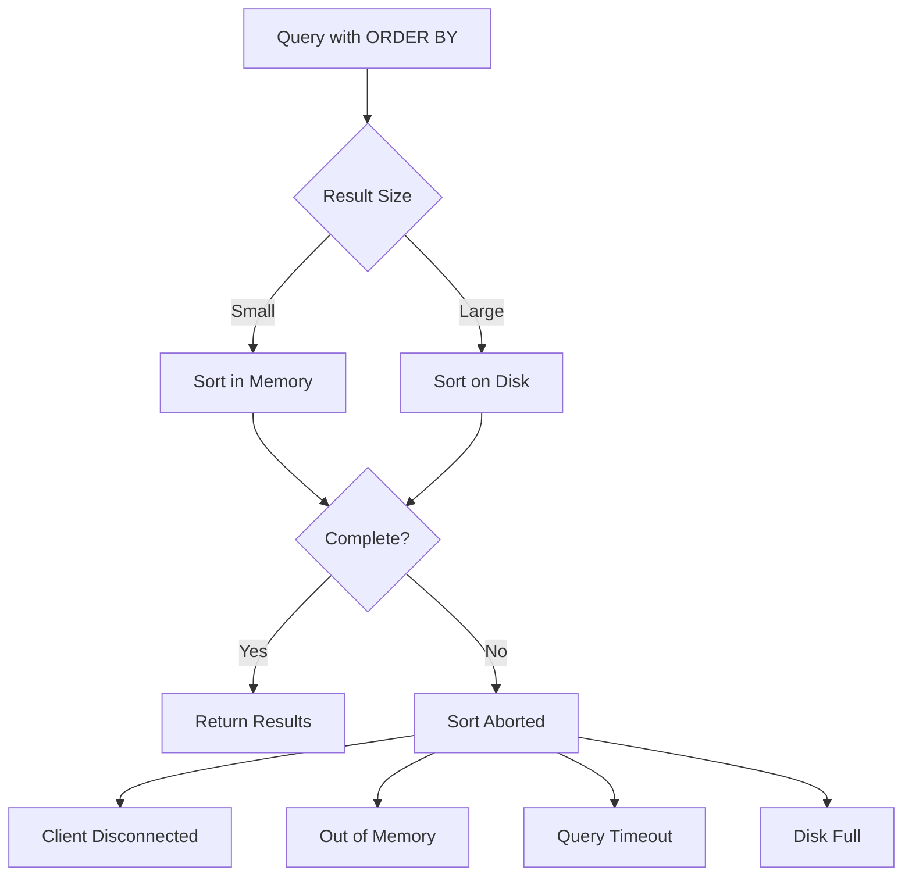
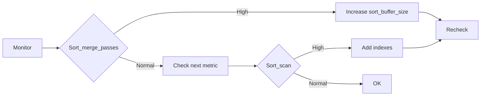

# How to Fix 'Sort Aborted' Query Errors in MySQL

Author: [nawazdhandala](https://www.github.com/nawazdhandala)

Tags: MySQL, Database, Troubleshooting, Performance, Sorting, Query Optimization

Description: Learn how to diagnose and fix MySQL 'Sort aborted' errors caused by memory limits, client disconnections, and query timeouts.

---

The "Sort aborted" message in MySQL error logs indicates that a sorting operation failed to complete. While sometimes harmless (client disconnected), it often signals memory pressure, timeout issues, or inefficient queries. This guide explains the causes and provides solutions for each scenario.

## Understanding Sort Operations

MySQL sorts data in memory when possible, but falls back to disk-based sorting for large result sets. Both methods can be aborted for various reasons.



## Common Causes

### 1. Client Disconnection

The most benign cause is when the client disconnects before receiving all results. This is common with web applications that impose timeouts.

```sql
-- Check the error log for details
-- Look for entries like:
-- [Note] Aborted connection X to db: 'mydb' user: 'myuser' (Got timeout reading communication packets)

-- View connection timeouts
SHOW VARIABLES LIKE '%timeout%';

-- Key variables:
-- wait_timeout: Idle connection timeout (default 28800 seconds)
-- net_read_timeout: Time to wait for data from client (default 30 seconds)
-- net_write_timeout: Time to wait to write data to client (default 60 seconds)
```

**Fix**: Increase timeouts or optimize queries to return faster.

```sql
-- Increase timeouts for long-running queries
SET GLOBAL net_read_timeout = 120;
SET GLOBAL net_write_timeout = 120;

-- For specific sessions
SET SESSION net_read_timeout = 300;
```

### 2. Sort Buffer Overflow

When the sort buffer is too small, MySQL writes to temporary files. If those files grow too large or disk space runs out, the sort aborts.

```sql
-- Check current sort buffer size
SHOW VARIABLES LIKE 'sort_buffer_size';

-- Default is usually 256KB, which is often too small
-- Increase for sessions that need large sorts
SET SESSION sort_buffer_size = 4 * 1024 * 1024;  -- 4MB

-- Check how many sorts are using disk
SHOW GLOBAL STATUS LIKE 'Sort%';

-- Key metrics:
-- Sort_merge_passes: High values indicate disk-based sorting
-- Sort_rows: Total rows sorted
-- Sort_scan: Sorts from full table scans
```

**Fix**: Tune sort buffer and temp table sizes.

```sql
-- my.cnf configuration
[mysqld]
sort_buffer_size = 4M
tmp_table_size = 64M
max_heap_table_size = 64M

-- Verify temp directory has enough space
SHOW VARIABLES LIKE 'tmpdir';
```

### 3. Query Killed or Timeout

Long-running sorts may be killed by the query timeout or manually by administrators.

```sql
-- Check for killed queries in process list
SHOW PROCESSLIST;

-- Look for State = "Killed" or recent "Sort aborted" in error log

-- Check max execution time (MySQL 5.7.8+)
SHOW VARIABLES LIKE 'max_execution_time';

-- Set query timeout (milliseconds)
SET GLOBAL max_execution_time = 30000;  -- 30 seconds

-- Per-query timeout using optimizer hint
SELECT /*+ MAX_EXECUTION_TIME(5000) */ *
FROM large_table
ORDER BY created_at
LIMIT 1000;
```

### 4. Memory Exhaustion

When the server runs low on memory, MySQL may abort sorts to prevent crashes.

```sql
-- Check memory-related variables
SHOW VARIABLES LIKE '%buffer%';
SHOW VARIABLES LIKE '%cache%';

-- Monitor memory usage
SHOW GLOBAL STATUS LIKE 'Innodb_buffer_pool%';

-- Check if the query is the problem
EXPLAIN SELECT * FROM orders ORDER BY created_at;

-- Look for:
-- Using filesort (sorting required)
-- Using temporary (temp table needed)
-- rows: High numbers indicate memory pressure
```

## Diagnosing Sort Aborted Errors

### Enable Logging

```sql
-- Enable general log temporarily to see failing queries
SET GLOBAL general_log = 'ON';
SET GLOBAL general_log_file = '/var/log/mysql/general.log';

-- Check error log for sort aborted messages
-- Location varies by system, check:
SHOW VARIABLES LIKE 'log_error';

-- After diagnosis, disable general log (it's expensive)
SET GLOBAL general_log = 'OFF';
```

### Use Performance Schema

```sql
-- Find queries that were aborted
SELECT
    DIGEST_TEXT,
    COUNT_STAR,
    SUM_ERRORS,
    SUM_WARNINGS,
    ROUND(AVG_TIMER_WAIT/1000000000, 2) AS avg_ms
FROM performance_schema.events_statements_summary_by_digest
WHERE SUM_ERRORS > 0 OR SUM_WARNINGS > 0
ORDER BY SUM_ERRORS DESC
LIMIT 20;

-- Check for sorts in progress
SELECT
    THREAD_ID,
    SQL_TEXT,
    ROUND(TIMER_WAIT/1000000000000, 2) AS seconds,
    STATE
FROM performance_schema.events_statements_current
WHERE STATE LIKE '%sort%';
```

### Analyze Problematic Queries

```sql
-- Get the EXPLAIN plan for sorting queries
EXPLAIN FORMAT=JSON
SELECT * FROM orders
WHERE status = 'pending'
ORDER BY created_at DESC
LIMIT 100;

-- Look for these warning signs in the output:
-- "using_filesort": true
-- "using_temporary_table": true
-- "rows_examined_per_scan": large number
```

## Optimization Solutions

### Add Appropriate Indexes

```sql
-- Bad: Sorting without index support
EXPLAIN SELECT * FROM orders
WHERE customer_id = 100
ORDER BY created_at DESC;
-- Will show "Using filesort"

-- Create composite index for the query pattern
CREATE INDEX idx_customer_created
ON orders(customer_id, created_at DESC);

-- Good: Index now covers filter AND sort
EXPLAIN SELECT * FROM orders
WHERE customer_id = 100
ORDER BY created_at DESC;
-- No more filesort
```

### Reduce Result Set Size

```sql
-- Problem: Sorting entire table before limiting
SELECT * FROM logs ORDER BY timestamp DESC LIMIT 10;
-- Must sort ALL rows, then take 10

-- Better: Use indexed column
CREATE INDEX idx_timestamp ON logs(timestamp DESC);
-- Now returns quickly using index

-- If you must filter on non-indexed columns, consider:
-- 1. Add the filter column to the index
-- 2. Use a covering index
-- 3. Limit data first with a subquery

-- Example with subquery
SELECT l.* FROM logs l
JOIN (
    SELECT id FROM logs
    WHERE category = 'error'
    ORDER BY timestamp DESC
    LIMIT 10
) sub ON l.id = sub.id
ORDER BY l.timestamp DESC;
```

### Optimize Sorting Memory

```sql
-- Check current memory usage for sorts
SHOW GLOBAL STATUS LIKE 'Sort_merge_passes';

-- If Sort_merge_passes is high, increase buffer
SET GLOBAL sort_buffer_size = 8388608;  -- 8MB

-- For specific large sorts, use session variable
SET SESSION sort_buffer_size = 16777216;  -- 16MB
SELECT * FROM large_table ORDER BY column LIMIT 1000;
SET SESSION sort_buffer_size = DEFAULT;
```

### Use Query Hints

MySQL 8.0+ provides optimizer hints to control sort behavior.

```sql
-- Limit memory for this query
SELECT /*+ SET_VAR(sort_buffer_size=16M) */
    *
FROM orders
ORDER BY amount DESC
LIMIT 100;

-- Force index usage
SELECT /*+ INDEX(orders idx_created) */
    *
FROM orders
ORDER BY created_at DESC
LIMIT 50;
```

## Handling Large Sorts

When you must sort large datasets, use these strategies.

```sql
-- Strategy 1: Chunked processing
-- Instead of sorting millions of rows at once,
-- process in date ranges

DELIMITER //
CREATE PROCEDURE ProcessLargeSort()
BEGIN
    DECLARE done INT DEFAULT FALSE;
    DECLARE chunk_date DATE;

    DECLARE date_cursor CURSOR FOR
        SELECT DISTINCT DATE(created_at)
        FROM orders
        ORDER BY DATE(created_at);

    DECLARE CONTINUE HANDLER FOR NOT FOUND SET done = TRUE;

    OPEN date_cursor;

    read_loop: LOOP
        FETCH date_cursor INTO chunk_date;
        IF done THEN
            LEAVE read_loop;
        END IF;

        -- Process one day at a time
        INSERT INTO processed_orders
        SELECT * FROM orders
        WHERE DATE(created_at) = chunk_date
        ORDER BY amount DESC;

    END LOOP;

    CLOSE date_cursor;
END//
DELIMITER ;

-- Strategy 2: Use a materialized view approach
-- Pre-sort data into a summary table

CREATE TABLE orders_sorted AS
SELECT * FROM orders ORDER BY created_at DESC;

ALTER TABLE orders_sorted ADD PRIMARY KEY (id);

-- Refresh periodically
TRUNCATE orders_sorted;
INSERT INTO orders_sorted SELECT * FROM orders ORDER BY created_at DESC;
```

## Monitoring and Alerting

Set up monitoring to catch sort issues before they become critical.

```sql
-- Create a monitoring query
SELECT
    VARIABLE_NAME,
    VARIABLE_VALUE
FROM performance_schema.global_status
WHERE VARIABLE_NAME IN (
    'Sort_merge_passes',
    'Sort_range',
    'Sort_rows',
    'Sort_scan',
    'Created_tmp_disk_tables',
    'Created_tmp_tables'
);

-- Alert thresholds (example values)
-- Sort_merge_passes > 100 per minute: Warning
-- Sort_scan > 1000 per minute: Warning (indicates missing indexes)
-- Created_tmp_disk_tables/Created_tmp_tables > 0.25: Warning
```



## Summary

| Cause | Symptom | Solution |
|-------|---------|----------|
| Client timeout | Intermittent errors | Increase net_write_timeout |
| Small sort buffer | Sort_merge_passes high | Increase sort_buffer_size |
| Query timeout | Consistent failures | Optimize query or increase timeout |
| Missing index | Using filesort in EXPLAIN | Add composite index |
| Large result set | Memory exhaustion | Paginate or chunk results |
| Disk full | tmp directory issues | Monitor disk space |

The key to fixing "Sort aborted" errors is identifying the root cause through logging and performance schema analysis. Most issues resolve by adding proper indexes, tuning buffer sizes, or restructuring queries to reduce the amount of data being sorted. For unavoidable large sorts, chunked processing prevents memory exhaustion and timeouts.
