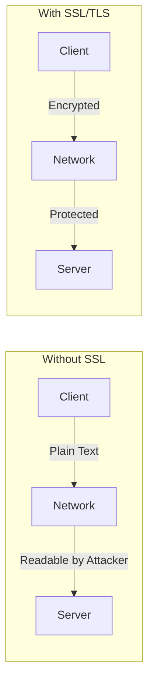
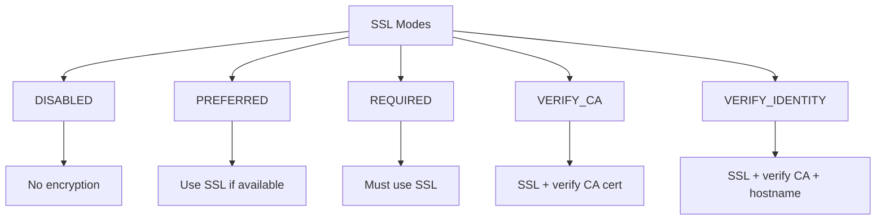

# How to Configure MySQL SSL Connections

Author: [nawazdhandala](https://www.github.com/nawazdhandala)

Tags: MySQL, SSL, TLS, Security, Encryption, Database Administration

Description: A practical guide to configuring SSL/TLS connections in MySQL for secure data transmission, including certificate generation, server configuration, and client setup.

---

Encrypting MySQL connections with SSL/TLS is essential for protecting sensitive data in transit. This guide covers the complete process of setting up SSL connections, from generating certificates to configuring both server and client applications.

## Why Use SSL for MySQL?

Without SSL, MySQL traffic travels in plaintext, making it vulnerable to:

- Eavesdropping on database queries and results
- Man-in-the-middle attacks
- Credential theft
- Data manipulation



## Check Current SSL Status

First, verify your current SSL configuration:

```sql
-- Check if SSL is available
SHOW VARIABLES LIKE '%ssl%';

-- Check SSL status
SHOW STATUS LIKE 'Ssl%';

-- Check current connection encryption
SELECT
    user,
    host,
    ssl_type,
    ssl_cipher
FROM mysql.user
WHERE user = CURRENT_USER();

-- Verify current connection is using SSL
SHOW STATUS LIKE 'Ssl_cipher';
```

## Generate SSL Certificates

### Option 1: Use mysql_ssl_rsa_setup (Recommended)

MySQL 5.7+ includes a utility to generate certificates automatically:

```bash
# Generate SSL certificates
mysql_ssl_rsa_setup --datadir=/var/lib/mysql

# This creates:
# - ca.pem (CA certificate)
# - ca-key.pem (CA private key)
# - server-cert.pem (Server certificate)
# - server-key.pem (Server private key)
# - client-cert.pem (Client certificate)
# - client-key.pem (Client private key)

# Set proper permissions
chown mysql:mysql /var/lib/mysql/*.pem
chmod 600 /var/lib/mysql/*-key.pem
chmod 644 /var/lib/mysql/*.pem
```

### Option 2: Generate Certificates with OpenSSL

For production environments, you may want more control:

```bash
#!/bin/bash
# SSL certificate generation script for MySQL

SSL_DIR="/etc/mysql/ssl"
DAYS_VALID=3650
COUNTRY="US"
STATE="California"
CITY="San Francisco"
ORG="MyCompany"
CN_CA="MySQL-CA"
CN_SERVER="mysql-server"
CN_CLIENT="mysql-client"

mkdir -p $SSL_DIR
cd $SSL_DIR

# Generate CA certificate
openssl genrsa 4096 > ca-key.pem

openssl req -new -x509 -nodes -days $DAYS_VALID \
    -key ca-key.pem \
    -out ca.pem \
    -subj "/C=$COUNTRY/ST=$STATE/L=$CITY/O=$ORG/CN=$CN_CA"

# Generate server certificate
openssl req -newkey rsa:4096 -nodes \
    -keyout server-key.pem \
    -out server-req.pem \
    -subj "/C=$COUNTRY/ST=$STATE/L=$CITY/O=$ORG/CN=$CN_SERVER"

openssl x509 -req -days $DAYS_VALID \
    -in server-req.pem \
    -CA ca.pem \
    -CAkey ca-key.pem \
    -CAcreateserial \
    -out server-cert.pem

# Generate client certificate
openssl req -newkey rsa:4096 -nodes \
    -keyout client-key.pem \
    -out client-req.pem \
    -subj "/C=$COUNTRY/ST=$STATE/L=$CITY/O=$ORG/CN=$CN_CLIENT"

openssl x509 -req -days $DAYS_VALID \
    -in client-req.pem \
    -CA ca.pem \
    -CAkey ca-key.pem \
    -CAcreateserial \
    -out client-cert.pem

# Clean up request files
rm -f server-req.pem client-req.pem

# Set permissions
chown mysql:mysql *.pem
chmod 600 *-key.pem
chmod 644 *.pem ca.pem *-cert.pem

# Verify certificates
echo "Verifying server certificate..."
openssl verify -CAfile ca.pem server-cert.pem

echo "Verifying client certificate..."
openssl verify -CAfile ca.pem client-cert.pem

echo "Certificate generation complete!"
ls -la $SSL_DIR
```

## Configure MySQL Server

### Edit MySQL Configuration

```ini
# /etc/mysql/mysql.conf.d/mysqld.cnf or /etc/my.cnf

[mysqld]
# SSL certificate paths
ssl-ca=/etc/mysql/ssl/ca.pem
ssl-cert=/etc/mysql/ssl/server-cert.pem
ssl-key=/etc/mysql/ssl/server-key.pem

# Require SSL for all connections (optional but recommended)
require_secure_transport=ON

# TLS version settings (MySQL 8.0+)
tls_version=TLSv1.2,TLSv1.3

# Cipher suite configuration (MySQL 8.0+)
ssl_cipher=ECDHE-RSA-AES256-GCM-SHA384:ECDHE-RSA-AES128-GCM-SHA256

# For MySQL 5.7, use:
# tls_version=TLSv1.1,TLSv1.2
```

### Restart MySQL and Verify

```bash
# Restart MySQL
systemctl restart mysql

# Check SSL is enabled
mysql -e "SHOW VARIABLES LIKE '%ssl%';"

# Expected output should show:
# have_ssl: YES
# ssl_ca: /etc/mysql/ssl/ca.pem
# ssl_cert: /etc/mysql/ssl/server-cert.pem
# ssl_key: /etc/mysql/ssl/server-key.pem
```

## Configure SSL Requirements per User

You can require SSL for specific users:

```sql
-- Create user requiring SSL
CREATE USER 'secure_user'@'%'
IDENTIFIED BY 'strong_password'
REQUIRE SSL;

-- Create user requiring X509 certificate
CREATE USER 'cert_user'@'%'
IDENTIFIED BY 'strong_password'
REQUIRE X509;

-- Create user requiring specific certificate subject
CREATE USER 'specific_user'@'%'
IDENTIFIED BY 'strong_password'
REQUIRE SUBJECT '/C=US/ST=California/L=San Francisco/O=MyCompany/CN=mysql-client';

-- Create user requiring specific issuer
CREATE USER 'issuer_user'@'%'
IDENTIFIED BY 'strong_password'
REQUIRE ISSUER '/C=US/ST=California/L=San Francisco/O=MyCompany/CN=MySQL-CA';

-- Modify existing user to require SSL
ALTER USER 'existing_user'@'%' REQUIRE SSL;

-- Check user SSL requirements
SELECT user, host, ssl_type, ssl_cipher, x509_issuer, x509_subject
FROM mysql.user
WHERE ssl_type != '';
```

## Client Configuration

### MySQL Command Line Client

```bash
# Connect with SSL
mysql -h hostname \
    --ssl-ca=/path/to/ca.pem \
    --ssl-cert=/path/to/client-cert.pem \
    --ssl-key=/path/to/client-key.pem \
    -u username -p

# Connect with SSL verification
mysql -h hostname \
    --ssl-mode=VERIFY_IDENTITY \
    --ssl-ca=/path/to/ca.pem \
    -u username -p

# Verify SSL is being used
mysql> SHOW STATUS LIKE 'Ssl_cipher';
```

### Client Configuration File

```ini
# ~/.my.cnf or /etc/mysql/conf.d/client-ssl.cnf

[client]
ssl-ca=/path/to/ca.pem
ssl-cert=/path/to/client-cert.pem
ssl-key=/path/to/client-key.pem
ssl-mode=VERIFY_IDENTITY
```

### SSL Modes Explained



```bash
# SSL mode options:
# DISABLED - No SSL
# PREFERRED - Use SSL if available (default)
# REQUIRED - Must use SSL, no verification
# VERIFY_CA - Verify server certificate against CA
# VERIFY_IDENTITY - Verify CA and hostname match (recommended)

mysql --ssl-mode=VERIFY_IDENTITY -h db.example.com -u user -p
```

## Application Connection Examples

### Python with mysql-connector-python

```python
import mysql.connector
from mysql.connector import Error

# Basic SSL connection
config = {
    'host': 'db.example.com',
    'user': 'app_user',
    'password': 'secure_password',
    'database': 'myapp',
    'ssl_ca': '/path/to/ca.pem',
    'ssl_cert': '/path/to/client-cert.pem',
    'ssl_key': '/path/to/client-key.pem',
    'ssl_verify_cert': True,
    'ssl_verify_identity': True
}

try:
    connection = mysql.connector.connect(**config)

    if connection.is_connected():
        cursor = connection.cursor()
        cursor.execute("SHOW STATUS LIKE 'Ssl_cipher'")
        result = cursor.fetchone()
        print(f"Connected with SSL cipher: {result[1]}")

except Error as e:
    print(f"Error connecting to MySQL: {e}")
finally:
    if connection.is_connected():
        cursor.close()
        connection.close()
```

### Node.js with mysql2

```javascript
const mysql = require('mysql2/promise');
const fs = require('fs');

async function connectWithSSL() {
    const connection = await mysql.createConnection({
        host: 'db.example.com',
        user: 'app_user',
        password: 'secure_password',
        database: 'myapp',
        ssl: {
            ca: fs.readFileSync('/path/to/ca.pem'),
            cert: fs.readFileSync('/path/to/client-cert.pem'),
            key: fs.readFileSync('/path/to/client-key.pem'),
            rejectUnauthorized: true
        }
    });

    // Verify SSL connection
    const [rows] = await connection.execute("SHOW STATUS LIKE 'Ssl_cipher'");
    console.log('SSL Cipher:', rows[0].Value);

    await connection.end();
}

connectWithSSL().catch(console.error);
```

### Java with JDBC

```java
import java.sql.*;
import java.util.Properties;

public class MySQLSSLConnection {
    public static void main(String[] args) {
        String url = "jdbc:mysql://db.example.com:3306/myapp";

        Properties props = new Properties();
        props.setProperty("user", "app_user");
        props.setProperty("password", "secure_password");
        props.setProperty("useSSL", "true");
        props.setProperty("requireSSL", "true");
        props.setProperty("verifyServerCertificate", "true");
        props.setProperty("trustCertificateKeyStoreUrl",
            "file:/path/to/truststore.jks");
        props.setProperty("trustCertificateKeyStorePassword", "changeit");
        props.setProperty("clientCertificateKeyStoreUrl",
            "file:/path/to/keystore.jks");
        props.setProperty("clientCertificateKeyStorePassword", "changeit");

        try (Connection conn = DriverManager.getConnection(url, props)) {
            Statement stmt = conn.createStatement();
            ResultSet rs = stmt.executeQuery("SHOW STATUS LIKE 'Ssl_cipher'");
            if (rs.next()) {
                System.out.println("SSL Cipher: " + rs.getString(2));
            }
        } catch (SQLException e) {
            e.printStackTrace();
        }
    }
}
```

## Troubleshooting SSL Issues

### Common Problems and Solutions

```bash
# Check certificate validity
openssl x509 -in /path/to/server-cert.pem -text -noout

# Verify certificate chain
openssl verify -CAfile /path/to/ca.pem /path/to/server-cert.pem

# Test SSL connection
openssl s_client -connect db.example.com:3306 -starttls mysql

# Check for certificate expiration
openssl x509 -enddate -noout -in /path/to/server-cert.pem
```

### MySQL Error Log Analysis

```bash
# Check MySQL error log for SSL issues
tail -f /var/log/mysql/error.log | grep -i ssl

# Common errors:
# SSL_CTX_set_default_verify_paths failed - Check certificate paths
# SSL error: Unable to get certificate - File permissions issue
# SSL connection error - Certificate verification failed
```

### Debug Connection Issues

```sql
-- Check SSL errors on server
SHOW GLOBAL STATUS LIKE 'Ssl_accept_renegotiates';
SHOW GLOBAL STATUS LIKE 'Ssl_client_connects';

-- Check for connection attempts
SELECT * FROM performance_schema.events_errors_summary_global_by_error
WHERE error_name LIKE '%SSL%';
```

## Security Best Practices

1. **Always use VERIFY_IDENTITY**: Prevents man-in-the-middle attacks
2. **Use TLS 1.2 or higher**: Disable older, vulnerable protocols
3. **Rotate certificates**: Replace certificates before expiration
4. **Protect private keys**: Use proper file permissions (600)
5. **Use strong ciphers**: Configure cipher suites explicitly
6. **Monitor certificate expiration**: Set up alerts for expiring certificates

```bash
# Certificate expiration monitoring script
#!/bin/bash
CERT_PATH="/etc/mysql/ssl/server-cert.pem"
DAYS_WARNING=30

EXPIRY=$(openssl x509 -enddate -noout -in $CERT_PATH | cut -d= -f2)
EXPIRY_EPOCH=$(date -d "$EXPIRY" +%s)
NOW_EPOCH=$(date +%s)
DAYS_LEFT=$(( (EXPIRY_EPOCH - NOW_EPOCH) / 86400 ))

if [ $DAYS_LEFT -lt $DAYS_WARNING ]; then
    echo "WARNING: MySQL SSL certificate expires in $DAYS_LEFT days"
    # Send alert notification here
fi
```

By properly configuring SSL/TLS for your MySQL connections, you ensure that all data transmitted between clients and the database server is encrypted and protected from interception. Regular certificate maintenance and monitoring are essential for maintaining a secure database environment.
