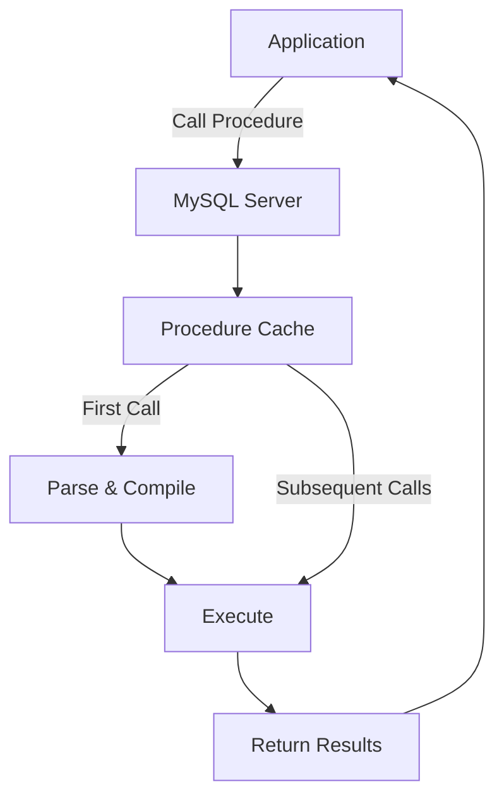
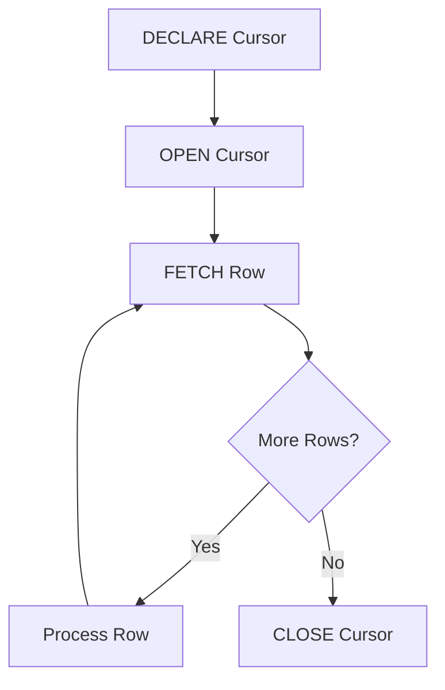
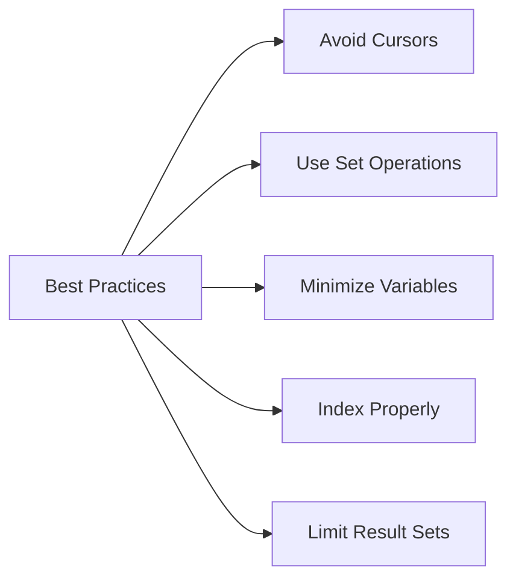

# How to Handle Stored Procedures in MySQL

Author: [nawazdhandala](https://www.github.com/nawazdhandala)

Tags: MySQL, Database, Stored Procedures, SQL, Performance, DevOps

Description: Learn how to create, manage, and optimize MySQL stored procedures with practical examples and best practices.

---

Stored procedures are precompiled SQL programs stored in the database. They encapsulate business logic, improve performance, and provide a security layer between applications and data. This guide covers everything you need to know about working with stored procedures in MySQL.

## Understanding Stored Procedures



Stored procedures offer several advantages:

- **Reduced network traffic** - Execute multiple SQL statements with a single call
- **Improved performance** - Procedures are parsed and compiled once
- **Code reusability** - Write once, call from anywhere
- **Enhanced security** - Grant procedure access without table access
- **Encapsulated logic** - Keep business rules in the database

## Creating Your First Stored Procedure

Basic syntax:

```sql
DELIMITER //

CREATE PROCEDURE procedure_name(parameters)
BEGIN
    -- SQL statements
END //

DELIMITER ;
```

### Simple Example: Get User by ID

```sql
DELIMITER //

CREATE PROCEDURE GetUserById(IN user_id INT)
BEGIN
    SELECT
        id,
        username,
        email,
        created_at
    FROM users
    WHERE id = user_id;
END //

DELIMITER ;

-- Call the procedure
CALL GetUserById(42);
```

### Parameter Types

MySQL supports three parameter types:

```sql
DELIMITER //

CREATE PROCEDURE DemoParameters(
    IN input_param INT,      -- Read-only, passed in
    OUT output_param INT,    -- Write-only, returned to caller
    INOUT both_param INT     -- Read and write
)
BEGIN
    -- IN: Can read, cannot modify
    SELECT input_param;

    -- OUT: Can write, initial value is NULL
    SET output_param = input_param * 2;

    -- INOUT: Can read initial value and modify
    SET both_param = both_param + input_param;
END //

DELIMITER ;

-- Using OUT and INOUT parameters
SET @result = 0;
SET @counter = 10;
CALL DemoParameters(5, @result, @counter);
SELECT @result, @counter;  -- Returns 10, 15
```

## Variables and Control Flow

### Declaring Variables

```sql
DELIMITER //

CREATE PROCEDURE CalculateOrderTotal(IN order_id INT, OUT total DECIMAL(10,2))
BEGIN
    -- Declare local variables
    DECLARE subtotal DECIMAL(10,2) DEFAULT 0;
    DECLARE tax_rate DECIMAL(4,2) DEFAULT 0.08;
    DECLARE shipping DECIMAL(10,2) DEFAULT 0;

    -- Calculate subtotal
    SELECT SUM(quantity * price) INTO subtotal
    FROM order_items
    WHERE order_id = order_id;

    -- Get shipping cost
    SELECT shipping_cost INTO shipping
    FROM orders
    WHERE id = order_id;

    -- Calculate total
    SET total = subtotal + (subtotal * tax_rate) + shipping;
END //

DELIMITER ;
```

### Conditional Logic with IF

```sql
DELIMITER //

CREATE PROCEDURE GetCustomerDiscount(
    IN customer_id INT,
    OUT discount_percent DECIMAL(5,2)
)
BEGIN
    DECLARE order_count INT;
    DECLARE total_spent DECIMAL(12,2);

    -- Get customer stats
    SELECT COUNT(*), COALESCE(SUM(total), 0)
    INTO order_count, total_spent
    FROM orders
    WHERE customer_id = customer_id AND status = 'completed';

    -- Determine discount tier
    IF total_spent >= 10000 THEN
        SET discount_percent = 15.00;
    ELSEIF total_spent >= 5000 THEN
        SET discount_percent = 10.00;
    ELSEIF total_spent >= 1000 THEN
        SET discount_percent = 5.00;
    ELSEIF order_count >= 5 THEN
        SET discount_percent = 2.50;
    ELSE
        SET discount_percent = 0.00;
    END IF;
END //

DELIMITER ;
```

### CASE Statements

```sql
DELIMITER //

CREATE PROCEDURE GetOrderStatus(IN order_id INT, OUT status_text VARCHAR(50))
BEGIN
    DECLARE status_code INT;

    SELECT status INTO status_code
    FROM orders
    WHERE id = order_id;

    CASE status_code
        WHEN 1 THEN SET status_text = 'Pending';
        WHEN 2 THEN SET status_text = 'Processing';
        WHEN 3 THEN SET status_text = 'Shipped';
        WHEN 4 THEN SET status_text = 'Delivered';
        WHEN 5 THEN SET status_text = 'Cancelled';
        ELSE SET status_text = 'Unknown';
    END CASE;
END //

DELIMITER ;
```

## Loops and Cursors

### WHILE Loop

```sql
DELIMITER //

CREATE PROCEDURE GenerateTestData(IN num_records INT)
BEGIN
    DECLARE i INT DEFAULT 1;

    WHILE i <= num_records DO
        INSERT INTO test_table (name, value, created_at)
        VALUES (
            CONCAT('Item_', i),
            RAND() * 1000,
            NOW()
        );
        SET i = i + 1;
    END WHILE;
END //

DELIMITER ;

-- Generate 1000 test records
CALL GenerateTestData(1000);
```

### Cursors for Row-by-Row Processing



```sql
DELIMITER //

CREATE PROCEDURE ProcessExpiredSubscriptions()
BEGIN
    DECLARE done INT DEFAULT FALSE;
    DECLARE sub_id INT;
    DECLARE user_email VARCHAR(255);

    -- Declare cursor
    DECLARE expired_cursor CURSOR FOR
        SELECT id, email
        FROM subscriptions s
        JOIN users u ON s.user_id = u.id
        WHERE s.expires_at < NOW() AND s.status = 'active';

    -- Handler for when no more rows
    DECLARE CONTINUE HANDLER FOR NOT FOUND SET done = TRUE;

    OPEN expired_cursor;

    read_loop: LOOP
        FETCH expired_cursor INTO sub_id, user_email;

        IF done THEN
            LEAVE read_loop;
        END IF;

        -- Update subscription status
        UPDATE subscriptions
        SET status = 'expired', updated_at = NOW()
        WHERE id = sub_id;

        -- Log the expiration
        INSERT INTO subscription_logs (subscription_id, action, email, created_at)
        VALUES (sub_id, 'expired', user_email, NOW());
    END LOOP;

    CLOSE expired_cursor;

    -- Return count of processed subscriptions
    SELECT ROW_COUNT() AS processed_count;
END //

DELIMITER ;
```

## Error Handling

```sql
DELIMITER //

CREATE PROCEDURE TransferFunds(
    IN from_account INT,
    IN to_account INT,
    IN amount DECIMAL(12,2),
    OUT result VARCHAR(100)
)
BEGIN
    DECLARE from_balance DECIMAL(12,2);
    DECLARE EXIT HANDLER FOR SQLEXCEPTION
    BEGIN
        -- Rollback on any error
        ROLLBACK;
        SET result = 'Transaction failed due to database error';
    END;

    -- Start transaction
    START TRANSACTION;

    -- Check source account balance
    SELECT balance INTO from_balance
    FROM accounts
    WHERE id = from_account
    FOR UPDATE;  -- Lock the row

    IF from_balance IS NULL THEN
        ROLLBACK;
        SET result = 'Source account not found';
    ELSEIF from_balance < amount THEN
        ROLLBACK;
        SET result = 'Insufficient funds';
    ELSE
        -- Perform transfer
        UPDATE accounts SET balance = balance - amount WHERE id = from_account;
        UPDATE accounts SET balance = balance + amount WHERE id = to_account;

        -- Log the transaction
        INSERT INTO transactions (from_account, to_account, amount, created_at)
        VALUES (from_account, to_account, amount, NOW());

        COMMIT;
        SET result = 'Transfer successful';
    END IF;
END //

DELIMITER ;

-- Execute transfer
SET @msg = '';
CALL TransferFunds(1001, 1002, 500.00, @msg);
SELECT @msg;
```

## Managing Stored Procedures

### List All Procedures

```sql
-- Show all procedures in current database
SHOW PROCEDURE STATUS WHERE Db = DATABASE();

-- Show procedure definition
SHOW CREATE PROCEDURE procedure_name;

-- Get procedure info from information_schema
SELECT
    ROUTINE_NAME,
    ROUTINE_TYPE,
    CREATED,
    LAST_ALTERED,
    DEFINER
FROM information_schema.ROUTINES
WHERE ROUTINE_SCHEMA = DATABASE()
AND ROUTINE_TYPE = 'PROCEDURE';
```

### Modify or Drop Procedures

```sql
-- You cannot ALTER a procedure's body, must drop and recreate
DROP PROCEDURE IF EXISTS GetUserById;

-- Then recreate with changes
DELIMITER //
CREATE PROCEDURE GetUserById(IN user_id INT)
BEGIN
    -- Updated logic here
END //
DELIMITER ;
```

### Granting Permissions

```sql
-- Grant execute permission
GRANT EXECUTE ON PROCEDURE mydb.GetUserById TO 'app_user'@'localhost';

-- Grant execute on all procedures in database
GRANT EXECUTE ON mydb.* TO 'app_user'@'localhost';

-- Revoke permission
REVOKE EXECUTE ON PROCEDURE mydb.GetUserById FROM 'app_user'@'localhost';
```

## Calling Procedures from Applications

### Python Example

```python
import mysql.connector

def call_procedure_with_out_param():
    conn = mysql.connector.connect(
        host='localhost',
        user='user',
        password='password',
        database='mydb'
    )
    cursor = conn.cursor()

    # Call procedure with OUT parameter
    args = [42, 0]  # IN user_id, OUT discount
    cursor.callproc('GetCustomerDiscount', args)

    # Get OUT parameter value
    cursor.execute('SELECT @_GetCustomerDiscount_1')
    result = cursor.fetchone()
    print(f"Discount: {result[0]}%")

    cursor.close()
    conn.close()

def call_procedure_with_results():
    conn = mysql.connector.connect(
        host='localhost',
        user='user',
        password='password',
        database='mydb'
    )
    cursor = conn.cursor(dictionary=True)

    # Call procedure that returns result set
    cursor.callproc('GetUserById', [42])

    # Fetch results
    for result in cursor.stored_results():
        users = result.fetchall()
        for user in users:
            print(user)

    cursor.close()
    conn.close()
```

### Node.js Example

```javascript
const mysql = require('mysql2/promise');

async function callProcedure() {
    const conn = await mysql.createConnection({
        host: 'localhost',
        user: 'user',
        password: 'password',
        database: 'mydb'
    });

    // Call procedure with OUT parameter
    await conn.query('SET @discount = 0');
    await conn.query('CALL GetCustomerDiscount(?, @discount)', [42]);
    const [rows] = await conn.query('SELECT @discount AS discount');
    console.log('Discount:', rows[0].discount);

    // Call procedure returning result set
    const [results] = await conn.query('CALL GetUserById(?)', [42]);
    console.log('User:', results[0]);

    await conn.end();
}
```

## Performance Best Practices



1. **Prefer set-based operations over cursors** - Cursors process row by row; SQL operations work on sets
2. **Use appropriate indexes** - Stored procedures benefit from indexes just like regular queries
3. **Avoid excessive variables** - Each variable consumes memory
4. **Keep procedures focused** - One procedure, one task
5. **Use LIMIT when possible** - Return only needed data

```sql
-- Bad: Using cursor for simple aggregation
-- Good: Use SQL directly
CREATE PROCEDURE GetDepartmentStats()
BEGIN
    SELECT
        department_id,
        COUNT(*) as employee_count,
        AVG(salary) as avg_salary,
        SUM(salary) as total_salary
    FROM employees
    GROUP BY department_id;
END;
```

## Debugging Stored Procedures

MySQL does not have a built-in debugger, but you can use these techniques:

```sql
DELIMITER //

CREATE PROCEDURE DebugExample(IN input_value INT)
BEGIN
    -- Create debug log table if needed
    CREATE TABLE IF NOT EXISTS debug_log (
        id INT AUTO_INCREMENT PRIMARY KEY,
        message TEXT,
        created_at TIMESTAMP DEFAULT CURRENT_TIMESTAMP
    );

    -- Log entry point
    INSERT INTO debug_log (message) VALUES (CONCAT('Started with input: ', input_value));

    -- Your logic here
    -- ...

    -- Log important checkpoints
    INSERT INTO debug_log (message) VALUES ('Checkpoint 1 reached');

    -- Log exit
    INSERT INTO debug_log (message) VALUES ('Procedure completed');
END //

DELIMITER ;
```

---

Stored procedures are a powerful tool for encapsulating business logic, improving performance, and securing data access. Start with simple procedures and gradually add complexity as needed. Remember to handle errors properly, use transactions for data integrity, and prefer set-based operations over cursors for better performance.
