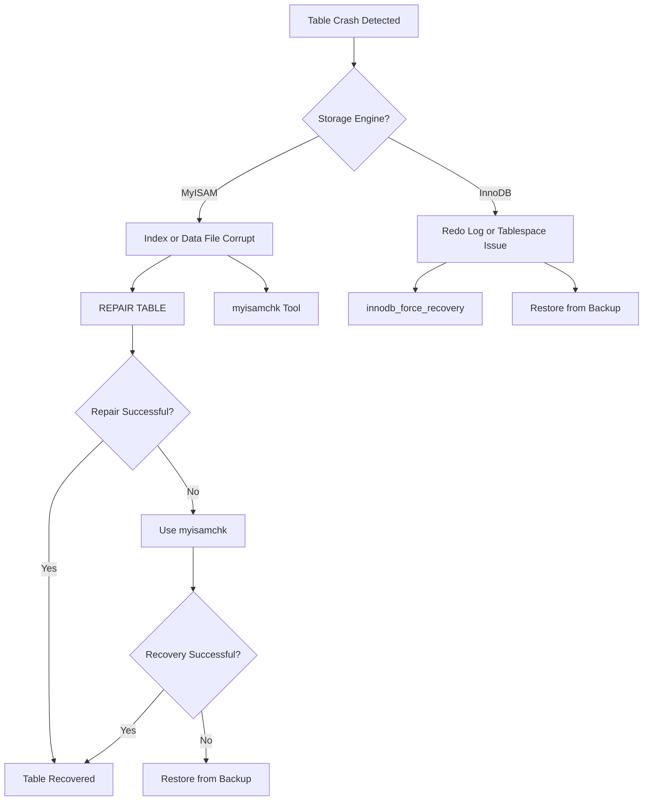

# How to Fix "Table Is Marked as Crashed" Errors

Author: [nawazdhandala](https://www.github.com/nawazdhandala)

Tags: MySQL, Database, Crash Recovery, MyISAM, InnoDB, Troubleshooting, Data Recovery

Description: Learn how to diagnose and repair MySQL tables marked as crashed including MyISAM repair, InnoDB recovery, and prevention strategies.

---

When MySQL reports "Table is marked as crashed and should be repaired", your table has become corrupted. This usually happens after unexpected shutdowns, disk failures, or bugs. The repair process depends on whether you are using MyISAM or InnoDB storage engines.

## Understanding Table Crashes



## Identifying the Problem

**Check the error message:**

```
ERROR 145 (HY000): Table './database/tablename' is marked as crashed and should be repaired
ERROR 1194 (HY000): Table 'tablename' is marked as crashed and last (automatic?) repair failed
```

**Check table status:**

```sql
-- Check specific table
CHECK TABLE your_table;

-- Check all tables in database
mysqlcheck -u root -p --check your_database

-- Check all databases
mysqlcheck -u root -p --check --all-databases
```

**Identify storage engine:**

```sql
SELECT TABLE_NAME, ENGINE
FROM INFORMATION_SCHEMA.TABLES
WHERE TABLE_SCHEMA = 'your_database'
  AND TABLE_NAME = 'your_table';
```

## Fixing MyISAM Tables

MyISAM tables are most prone to crashes because they lack crash recovery.

### Method 1: REPAIR TABLE (Online)

```sql
-- Basic repair
REPAIR TABLE your_table;

-- Extended repair for more thorough recovery
REPAIR TABLE your_table EXTENDED;

-- Quick repair (only repairs index, not data)
REPAIR TABLE your_table QUICK;

-- Use local to prevent writing to binary log
REPAIR LOCAL TABLE your_table;
```

**Repair multiple tables:**

```sql
-- Repair all tables at once
REPAIR TABLE table1, table2, table3;
```

### Method 2: myisamchk (Offline)

For severe corruption, use myisamchk when MySQL is stopped.

**Stop MySQL first:**

```bash
# Stop MySQL service
sudo systemctl stop mysql

# Navigate to data directory
cd /var/lib/mysql/your_database/
```

**Check the table:**

```bash
# Check for errors
myisamchk your_table.MYI

# Verbose check with more information
myisamchk -v your_table.MYI

# Extended check
myisamchk -e your_table.MYI
```

**Repair the table:**

```bash
# Standard repair
myisamchk -r your_table.MYI

# Safe repair (slower but preserves more data)
myisamchk -r -q your_table.MYI

# Force repair (last resort, may lose some data)
myisamchk -r -f your_table.MYI

# Recover with best effort
myisamchk -r -o your_table.MYI
```

**Full recovery command sequence:**

```bash
# Stop MySQL
sudo systemctl stop mysql

# Navigate to database directory
cd /var/lib/mysql/your_database/

# Check the table
myisamchk -e your_table

# Repair index
myisamchk -r your_table

# If that fails, try safe recovery
myisamchk -r -q your_table

# If still failing, force recovery
myisamchk -r -f your_table

# Fix ownership after repair
sudo chown mysql:mysql your_table.*

# Restart MySQL
sudo systemctl start mysql
```

### Method 3: mysqlcheck (Online)

```bash
# Repair single table
mysqlcheck -u root -p --repair your_database your_table

# Repair all tables in database
mysqlcheck -u root -p --repair your_database

# Repair all databases
mysqlcheck -u root -p --repair --all-databases

# Auto-repair during check
mysqlcheck -u root -p --auto-repair your_database
```

## Fixing InnoDB Tables

InnoDB handles crashes differently. It has built-in crash recovery, so manual repair is rarely needed.

### Method 1: Let InnoDB Auto-Recover

Simply restart MySQL. InnoDB automatically replays redo logs:

```bash
# Restart MySQL
sudo systemctl restart mysql

# Check error log for recovery messages
sudo tail -100 /var/log/mysql/error.log
```

### Method 2: Force Recovery Mode

If normal startup fails, use forced recovery:

**Edit MySQL configuration:**

```bash
sudo nano /etc/mysql/mysql.conf.d/mysqld.cnf
```

**Add recovery setting:**

```ini
[mysqld]
# Start with lowest level, increase if needed
innodb_force_recovery = 1
```

**Recovery levels:**

| Level | Action |
|-------|--------|
| 1 | Skip corrupt pages |
| 2 | Skip background operations |
| 3 | Skip transaction rollback |
| 4 | Skip insert buffer merge |
| 5 | Skip undo logs |
| 6 | Skip redo log roll forward |

**Start with level 1 and increase only if needed:**

```bash
# Try level 1 first
sudo systemctl start mysql

# If it fails, try level 2, then 3, etc.
# Higher levels may result in data loss
```

**Export data in recovery mode:**

```bash
# Connect to MySQL in recovery mode
mysql -u root -p

# Export the database
mysqldump -u root -p your_database > backup.sql

# Remove force recovery setting
sudo nano /etc/mysql/mysql.conf.d/mysqld.cnf
# Remove or comment out: innodb_force_recovery = 1

# Restart normally
sudo systemctl restart mysql

# Restore the database
mysql -u root -p your_database < backup.sql
```

### Method 3: Rebuild InnoDB Table

```sql
-- Online rebuild (MySQL 5.6+)
ALTER TABLE your_table ENGINE=InnoDB;

-- Or use OPTIMIZE
OPTIMIZE TABLE your_table;
```

## Emergency Data Extraction

When repair fails, try to extract what data you can.

**For MyISAM:**

```bash
# Create recovery table structure
mysql -u root -p -e "CREATE TABLE your_database.recovered LIKE your_database.your_table"

# Use myisamchk to extract rows
myisamchk -r -q /var/lib/mysql/your_database/your_table

# Copy data from damaged table
mysql -u root -p -e "INSERT IGNORE INTO your_database.recovered SELECT * FROM your_database.your_table"
```

**For InnoDB using Percona Data Recovery:**

```bash
# Install Percona Toolkit
sudo apt install percona-toolkit

# Extract data from InnoDB tablespace
# This is complex and requires the table definition
```

## Prevention Strategies

### Convert MyISAM to InnoDB

InnoDB is crash-safe. Convert your tables:

```sql
-- Convert single table
ALTER TABLE your_table ENGINE=InnoDB;

-- Generate conversion script for all MyISAM tables
SELECT CONCAT('ALTER TABLE `', TABLE_SCHEMA, '`.`', TABLE_NAME, '` ENGINE=InnoDB;')
FROM INFORMATION_SCHEMA.TABLES
WHERE ENGINE = 'MyISAM'
  AND TABLE_SCHEMA NOT IN ('mysql', 'information_schema', 'performance_schema');
```

### Enable InnoDB Doublewrite Buffer

This is on by default, but verify:

```sql
SHOW VARIABLES LIKE 'innodb_doublewrite';
-- Should return ON
```

### Configure Proper Shutdown

```ini
[mysqld]
# Wait for transactions to complete
innodb_fast_shutdown = 0
```

### Regular Backups

```bash
# Schedule daily backups
mysqldump -u root -p --all-databases --single-transaction > /backups/mysql_$(date +%Y%m%d).sql

# Binary backup with xtrabackup
xtrabackup --backup --target-dir=/backups/mysql_$(date +%Y%m%d)
```

### Monitor Table Health

```sql
-- Create monitoring procedure
DELIMITER //
CREATE PROCEDURE check_all_tables()
BEGIN
    DECLARE done INT DEFAULT FALSE;
    DECLARE tbl_name VARCHAR(255);
    DECLARE cur CURSOR FOR
        SELECT TABLE_NAME FROM INFORMATION_SCHEMA.TABLES
        WHERE TABLE_SCHEMA = DATABASE();
    DECLARE CONTINUE HANDLER FOR NOT FOUND SET done = TRUE;

    OPEN cur;
    read_loop: LOOP
        FETCH cur INTO tbl_name;
        IF done THEN
            LEAVE read_loop;
        END IF;
        SET @sql = CONCAT('CHECK TABLE `', tbl_name, '`');
        PREPARE stmt FROM @sql;
        EXECUTE stmt;
        DEALLOCATE PREPARE stmt;
    END LOOP;
    CLOSE cur;
END //
DELIMITER ;

-- Run weekly
CALL check_all_tables();
```

## Automated Repair Script

```bash
#!/bin/bash
# auto_repair.sh - Automatically repair crashed MySQL tables

LOG_FILE="/var/log/mysql_repair.log"
MYSQL_USER="root"
MYSQL_PASS="your_password"

echo "$(date) - Starting table check and repair" >> $LOG_FILE

# Check and repair all databases
mysqlcheck -u $MYSQL_USER -p$MYSQL_PASS --auto-repair --all-databases 2>&1 >> $LOG_FILE

# Log results
if [ $? -eq 0 ]; then
    echo "$(date) - Repair completed successfully" >> $LOG_FILE
else
    echo "$(date) - Repair encountered errors" >> $LOG_FILE
fi
```

## Quick Reference

| Scenario | Command |
|----------|---------|
| Check table | `CHECK TABLE your_table;` |
| Repair MyISAM online | `REPAIR TABLE your_table;` |
| Repair MyISAM offline | `myisamchk -r table.MYI` |
| Repair all tables | `mysqlcheck -u root -p --repair --all-databases` |
| InnoDB forced recovery | Set `innodb_force_recovery = 1` in my.cnf |
| Rebuild InnoDB table | `ALTER TABLE your_table ENGINE=InnoDB;` |

Table crashes are stressful but usually recoverable. The key is having good backups and using InnoDB instead of MyISAM for production tables. When crashes do happen, start with the least invasive repair method and only escalate to more aggressive options if needed.
