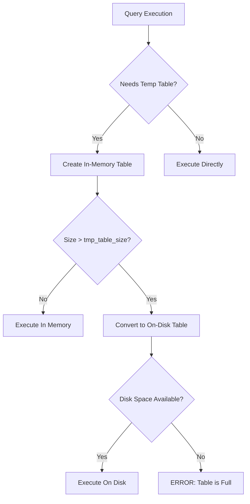
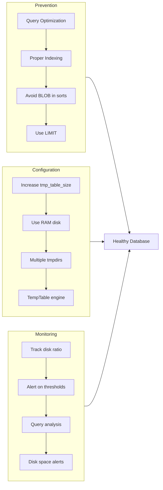

# How to Fix 'Temporary Table' Space Errors

Author: [nawazdhandala](https://github.com/nawazdhandala)

Tags: MySQL, Database, Troubleshooting, Performance, Storage

Description: Learn how to diagnose and fix MySQL temporary table space errors including disk space issues, configuration problems, and optimization strategies for complex queries.

---

When MySQL runs out of space for temporary tables, your queries fail with cryptic errors like "The table is full" or "No space left on device." These errors typically occur during complex queries involving sorting, grouping, or joining large datasets. Understanding how MySQL handles temporary tables and configuring them properly is essential for database reliability.

## Understanding Temporary Tables in MySQL

MySQL creates temporary tables for various operations:

- Sorting results (ORDER BY)
- Grouping data (GROUP BY)
- DISTINCT operations
- UNION queries
- Subqueries and derived tables
- Complex JOIN operations



## Common Error Messages

You might encounter these errors related to temporary tables:

```
ERROR 1114 (HY000): The table 'sql_xxx' is full
ERROR 1030 (HY000): Got error 28 from storage engine
ERROR 3 (HY000): Error writing file '/tmp/MYxxxxx' (Errcode: 28 - No space left on device)
```

## Diagnosing the Problem

### Check Current Configuration

First, examine your temporary table settings:

```sql
-- Check temporary table related variables
SHOW VARIABLES LIKE '%tmp%';
SHOW VARIABLES LIKE '%heap%';

-- Typical output:
-- tmp_table_size          | 16777216  (16MB)
-- max_heap_table_size     | 16777216  (16MB)
-- tmpdir                  | /tmp
-- internal_tmp_mem_storage_engine | TempTable (MySQL 8.0+)
```

### Check Disk Space

```bash
# Check disk space on the temporary directory
df -h /tmp

# Check disk space on the MySQL data directory
df -h /var/lib/mysql

# Find large files in temp directory
du -sh /tmp/* | sort -h | tail -20
```

### Monitor Temporary Table Creation

```sql
-- Check how many temporary tables are being created
SHOW GLOBAL STATUS LIKE 'Created_tmp%';

-- Created_tmp_disk_tables: Tables written to disk
-- Created_tmp_tables: Total temporary tables created

-- Calculate the ratio of disk tables
SELECT
    Created_tmp_disk_tables,
    Created_tmp_tables,
    ROUND((Created_tmp_disk_tables / Created_tmp_tables) * 100, 2) AS disk_ratio_pct
FROM (
    SELECT
        (SELECT VARIABLE_VALUE FROM performance_schema.global_status
         WHERE VARIABLE_NAME = 'Created_tmp_disk_tables') AS Created_tmp_disk_tables,
        (SELECT VARIABLE_VALUE FROM performance_schema.global_status
         WHERE VARIABLE_NAME = 'Created_tmp_tables') AS Created_tmp_tables
) AS stats;
```

### Identify Problematic Queries

```sql
-- Find queries creating temporary tables (requires performance_schema)
SELECT
    DIGEST_TEXT,
    COUNT_STAR AS exec_count,
    SUM_CREATED_TMP_TABLES AS tmp_tables,
    SUM_CREATED_TMP_DISK_TABLES AS disk_tmp_tables,
    ROUND(AVG_TIMER_WAIT/1000000000, 2) AS avg_latency_ms
FROM performance_schema.events_statements_summary_by_digest
WHERE SUM_CREATED_TMP_DISK_TABLES > 0
ORDER BY SUM_CREATED_TMP_DISK_TABLES DESC
LIMIT 10;
```

## Solutions

### 1. Increase Memory for Temporary Tables

```sql
-- Increase both settings together (they work as a pair)
SET GLOBAL tmp_table_size = 268435456;        -- 256MB
SET GLOBAL max_heap_table_size = 268435456;   -- 256MB

-- For permanent changes, add to my.cnf
```

Add to `/etc/mysql/mysql.conf.d/mysqld.cnf`:

```ini
[mysqld]
# Temporary table settings
tmp_table_size = 256M
max_heap_table_size = 256M

# For MySQL 8.0+, configure TempTable storage engine
temptable_max_ram = 1G
temptable_max_mmap = 1G
```

### 2. Change Temporary Directory

Move temporary files to a larger partition:

```ini
[mysqld]
# Single directory
tmpdir = /var/lib/mysql-tmp

# Multiple directories (round-robin)
tmpdir = /var/lib/mysql-tmp:/data/mysql-tmp:/fast-ssd/mysql-tmp
```

Create and configure the directory:

```bash
# Create the directory
mkdir -p /var/lib/mysql-tmp

# Set ownership and permissions
chown mysql:mysql /var/lib/mysql-tmp
chmod 750 /var/lib/mysql-tmp

# If using SELinux, set the context
semanage fcontext -a -t mysqld_tmp_t "/var/lib/mysql-tmp(/.*)?"
restorecon -Rv /var/lib/mysql-tmp
```

### 3. Use a RAM Disk for Temporary Tables

For high-performance systems, use a RAM disk:

```bash
# Create a RAM disk mount point
mkdir -p /mnt/mysql-ramdisk

# Mount a 2GB RAM disk
mount -t tmpfs -o size=2G tmpfs /mnt/mysql-ramdisk

# Set ownership
chown mysql:mysql /mnt/mysql-ramdisk

# Add to /etc/fstab for persistence
echo "tmpfs /mnt/mysql-ramdisk tmpfs size=2G,mode=0750,uid=mysql,gid=mysql 0 0" >> /etc/fstab
```

Update MySQL configuration:

```ini
[mysqld]
tmpdir = /mnt/mysql-ramdisk
```

### 4. Optimize Queries to Avoid Temporary Tables

Analyze queries with EXPLAIN to understand temporary table usage:

```sql
-- Check if a query uses temporary tables
EXPLAIN SELECT
    customer_id,
    COUNT(*) as order_count,
    SUM(total) as total_spent
FROM orders
GROUP BY customer_id
ORDER BY total_spent DESC;

-- Look for "Using temporary" and "Using filesort" in Extra column
```

#### Add Appropriate Indexes

```sql
-- Before: Query creates temporary table for sorting
SELECT customer_id, order_date, total
FROM orders
WHERE status = 'completed'
ORDER BY order_date DESC;

-- Add index to support the query
CREATE INDEX idx_orders_status_date ON orders(status, order_date DESC);

-- After: Query uses index, no temporary table needed
```

#### Avoid Functions on Indexed Columns

```sql
-- Bad: Cannot use index, may create temp table
SELECT * FROM users
WHERE YEAR(created_at) = 2024
ORDER BY created_at;

-- Good: Index can be used
SELECT * FROM users
WHERE created_at >= '2024-01-01' AND created_at < '2025-01-01'
ORDER BY created_at;
```

#### Use Covering Indexes

```sql
-- Create covering index for common queries
CREATE INDEX idx_orders_covering ON orders(
    customer_id,
    status,
    order_date,
    total
);

-- Query can be satisfied entirely from index
SELECT customer_id, order_date, total
FROM orders
WHERE customer_id = 12345 AND status = 'completed'
ORDER BY order_date DESC;
```

### 5. Handle BLOB and TEXT Columns

Temporary tables with BLOB or TEXT columns always go to disk. Minimize their impact:

```sql
-- Bad: Forces disk-based temporary table
SELECT id, title, content, created_at  -- content is TEXT
FROM articles
ORDER BY created_at DESC
LIMIT 100;

-- Better: Fetch IDs first, then get full content
SELECT a.id, a.title, a.content, a.created_at
FROM articles a
INNER JOIN (
    SELECT id
    FROM articles
    ORDER BY created_at DESC
    LIMIT 100
) AS ids ON a.id = ids.id
ORDER BY a.created_at DESC;
```

### 6. MySQL 8.0 TempTable Storage Engine

MySQL 8.0 introduced the TempTable storage engine with better performance:

```sql
-- Check current internal temp storage engine
SHOW VARIABLES LIKE 'internal_tmp_mem_storage_engine';

-- Configure TempTable settings
SET GLOBAL temptable_max_ram = 1073741824;  -- 1GB
SET GLOBAL temptable_max_mmap = 1073741824; -- 1GB overflow to mmap
```

```ini
[mysqld]
# MySQL 8.0+ TempTable configuration
internal_tmp_mem_storage_engine = TempTable
temptable_max_ram = 1G
temptable_max_mmap = 1G
temptable_use_mmap = ON
```

## Monitoring Script

Create a monitoring script to track temporary table usage:

```bash
#!/bin/bash
# monitor_temp_tables.sh

MYSQL_USER="monitor"
MYSQL_PASS="secure_password"

# Get current stats
mysql -u${MYSQL_USER} -p${MYSQL_PASS} -e "
SELECT
    NOW() as check_time,
    (SELECT VARIABLE_VALUE FROM performance_schema.global_status
     WHERE VARIABLE_NAME = 'Created_tmp_tables') AS total_tmp_tables,
    (SELECT VARIABLE_VALUE FROM performance_schema.global_status
     WHERE VARIABLE_NAME = 'Created_tmp_disk_tables') AS disk_tmp_tables,
    (SELECT ROUND(
        (SELECT VARIABLE_VALUE FROM performance_schema.global_status
         WHERE VARIABLE_NAME = 'Created_tmp_disk_tables') /
        (SELECT VARIABLE_VALUE FROM performance_schema.global_status
         WHERE VARIABLE_NAME = 'Created_tmp_tables') * 100, 2
    )) AS disk_ratio_pct;
"

# Check disk space
echo "Temp directory space:"
df -h $(mysql -u${MYSQL_USER} -p${MYSQL_PASS} -N -e "SELECT @@tmpdir" | cut -d: -f1)
```

## Prevention Architecture



## Quick Reference

| Setting | Default | Recommended | Purpose |
|---------|---------|-------------|---------|
| tmp_table_size | 16MB | 256MB-1GB | Max size of in-memory temp tables |
| max_heap_table_size | 16MB | 256MB-1GB | Max size of MEMORY tables |
| temptable_max_ram | 1GB | 1-4GB | TempTable RAM limit (MySQL 8.0) |
| temptable_max_mmap | 1GB | 1-4GB | TempTable overflow to mmap |

## Summary

Temporary table space errors typically result from insufficient memory allocation, disk space issues, or inefficient queries. The fix usually involves a combination of increasing memory limits, optimizing the temporary directory location, and rewriting queries to minimize temporary table usage. Monitor the ratio of disk-based temporary tables to catch problems before they cause outages, and consider using MySQL 8.0's TempTable engine for better performance.
