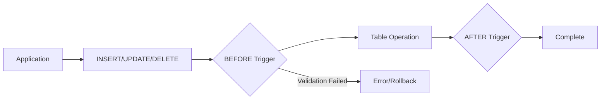
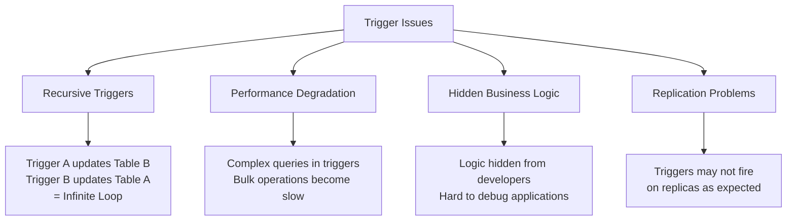

# How to Handle Triggers in MySQL

Author: [nawazdhandala](https://www.github.com/nawazdhandala)

Tags: MySQL, Database, Triggers, SQL, Automation, Data Integrity

Description: Learn how to create, manage, and debug MySQL triggers for automating database operations and maintaining data integrity.

---

Triggers are powerful database objects that automatically execute in response to specific events on a table. They help maintain data integrity, enforce business rules, and automate repetitive tasks without requiring application code changes. This guide covers everything you need to know about MySQL triggers in production environments.

## Understanding Trigger Basics

A trigger fires automatically when an INSERT, UPDATE, or DELETE operation occurs on a table. You can execute code before or after the operation, giving you control over validation and side effects.



## Creating Your First Trigger

MySQL supports six types of triggers based on timing (BEFORE/AFTER) and event (INSERT/UPDATE/DELETE). Here is a basic trigger that logs all changes to an audit table.

```sql
-- Create an audit table to track changes
CREATE TABLE employees_audit (
    audit_id INT AUTO_INCREMENT PRIMARY KEY,
    employee_id INT,
    action VARCHAR(10),
    old_salary DECIMAL(10,2),
    new_salary DECIMAL(10,2),
    changed_at TIMESTAMP DEFAULT CURRENT_TIMESTAMP,
    changed_by VARCHAR(100)
);

-- Create a trigger that fires after salary updates
DELIMITER //
CREATE TRIGGER employees_after_update
AFTER UPDATE ON employees
FOR EACH ROW
BEGIN
    -- Only log if salary actually changed
    IF OLD.salary != NEW.salary THEN
        INSERT INTO employees_audit (
            employee_id,
            action,
            old_salary,
            new_salary,
            changed_by
        ) VALUES (
            NEW.id,
            'UPDATE',
            OLD.salary,
            NEW.salary,
            CURRENT_USER()
        );
    END IF;
END//
DELIMITER ;
```

The `OLD` keyword references column values before the operation, while `NEW` references values after. For INSERT triggers, only `NEW` is available. For DELETE triggers, only `OLD` is available.

## BEFORE Triggers for Validation

BEFORE triggers are ideal for validating or modifying data before it reaches the table. This example ensures email addresses are lowercase and validates format.

```sql
DELIMITER //
CREATE TRIGGER users_before_insert
BEFORE INSERT ON users
FOR EACH ROW
BEGIN
    -- Normalize email to lowercase
    SET NEW.email = LOWER(TRIM(NEW.email));

    -- Validate email format using regex
    IF NEW.email NOT REGEXP '^[A-Za-z0-9._%+-]+@[A-Za-z0-9.-]+\.[A-Za-z]{2,}$' THEN
        SIGNAL SQLSTATE '45000'
        SET MESSAGE_TEXT = 'Invalid email format';
    END IF;

    -- Auto-generate created_at timestamp
    SET NEW.created_at = NOW();
END//
DELIMITER ;
```

The `SIGNAL` statement raises an error that prevents the operation from completing. Use SQLSTATE '45000' for custom application errors.

## Maintaining Referential Integrity

Triggers can enforce complex business rules that foreign keys alone cannot handle. This example maintains a denormalized order total when line items change.

```sql
-- Update order total when items are added
DELIMITER //
CREATE TRIGGER order_items_after_insert
AFTER INSERT ON order_items
FOR EACH ROW
BEGIN
    UPDATE orders
    SET total_amount = (
        SELECT COALESCE(SUM(quantity * unit_price), 0)
        FROM order_items
        WHERE order_id = NEW.order_id
    ),
    updated_at = NOW()
    WHERE id = NEW.order_id;
END//
DELIMITER ;

-- Update order total when items are modified
CREATE TRIGGER order_items_after_update
AFTER UPDATE ON order_items
FOR EACH ROW
BEGIN
    UPDATE orders
    SET total_amount = (
        SELECT COALESCE(SUM(quantity * unit_price), 0)
        FROM order_items
        WHERE order_id = NEW.order_id
    ),
    updated_at = NOW()
    WHERE id = NEW.order_id;
END//
DELIMITER ;

-- Update order total when items are deleted
CREATE TRIGGER order_items_after_delete
AFTER DELETE ON order_items
FOR EACH ROW
BEGIN
    UPDATE orders
    SET total_amount = (
        SELECT COALESCE(SUM(quantity * unit_price), 0)
        FROM order_items
        WHERE order_id = OLD.order_id
    ),
    updated_at = NOW()
    WHERE id = OLD.order_id;
END//
DELIMITER ;
```

## Handling Soft Deletes

Many applications use soft deletes instead of physically removing records. A trigger can automatically handle this pattern.

```sql
-- Instead of deleting, mark records as deleted
DELIMITER //
CREATE TRIGGER products_before_delete
BEFORE DELETE ON products
FOR EACH ROW
BEGIN
    -- Archive the product instead of deleting
    INSERT INTO products_archive
    SELECT *, NOW() as archived_at
    FROM products
    WHERE id = OLD.id;
END//
DELIMITER ;

-- Alternative: prevent hard deletes entirely
CREATE TRIGGER prevent_hard_delete
BEFORE DELETE ON important_records
FOR EACH ROW
BEGIN
    SIGNAL SQLSTATE '45000'
    SET MESSAGE_TEXT = 'Hard deletes not allowed. Use UPDATE to set deleted_at.';
END//
DELIMITER ;
```

## Managing Triggers

View all triggers in your database and understand their current state.

```sql
-- List all triggers
SHOW TRIGGERS;

-- Show triggers for a specific table
SHOW TRIGGERS LIKE 'employees';

-- Get detailed trigger information
SELECT
    TRIGGER_NAME,
    EVENT_MANIPULATION,
    EVENT_OBJECT_TABLE,
    ACTION_TIMING,
    ACTION_STATEMENT
FROM INFORMATION_SCHEMA.TRIGGERS
WHERE TRIGGER_SCHEMA = DATABASE();

-- Drop a trigger
DROP TRIGGER IF EXISTS employees_after_update;

-- Temporarily disable triggers by removing privileges
-- (no direct DISABLE TRIGGER in MySQL)
```

## Debugging Triggers

Debugging triggers is challenging because they execute silently. Use logging tables or conditional logic to trace execution.

```sql
-- Create a debug log table
CREATE TABLE trigger_debug_log (
    id INT AUTO_INCREMENT PRIMARY KEY,
    trigger_name VARCHAR(100),
    message TEXT,
    logged_at TIMESTAMP DEFAULT CURRENT_TIMESTAMP
);

-- Add debug logging to your trigger
DELIMITER //
CREATE TRIGGER employees_after_update_debug
AFTER UPDATE ON employees
FOR EACH ROW
BEGIN
    -- Log trigger execution for debugging
    INSERT INTO trigger_debug_log (trigger_name, message)
    VALUES (
        'employees_after_update',
        CONCAT('Updated employee ', NEW.id,
               ' salary from ', OLD.salary,
               ' to ', NEW.salary)
    );

    -- Your actual trigger logic here
    IF OLD.salary != NEW.salary THEN
        INSERT INTO employees_audit (employee_id, action, old_salary, new_salary)
        VALUES (NEW.id, 'UPDATE', OLD.salary, NEW.salary);
    END IF;
END//
DELIMITER ;
```

## Trigger Execution Order

When you have multiple triggers for the same event, MySQL 5.7+ lets you control execution order with FOLLOWS and PRECEDES.

```sql
-- First trigger
DELIMITER //
CREATE TRIGGER audit_first
AFTER UPDATE ON employees
FOR EACH ROW
BEGIN
    INSERT INTO audit_log (action) VALUES ('First trigger');
END//
DELIMITER ;

-- Second trigger that runs after the first
DELIMITER //
CREATE TRIGGER audit_second
AFTER UPDATE ON employees
FOR EACH ROW
FOLLOWS audit_first
BEGIN
    INSERT INTO audit_log (action) VALUES ('Second trigger');
END//
DELIMITER ;
```

## Performance Considerations

Triggers add overhead to every affected operation. Follow these best practices for production systems.

```sql
-- Bad: Complex calculations in trigger
DELIMITER //
CREATE TRIGGER slow_trigger
AFTER INSERT ON orders
FOR EACH ROW
BEGIN
    -- This runs for EVERY insert and will slow down bulk operations
    UPDATE customer_stats
    SET total_orders = (SELECT COUNT(*) FROM orders WHERE customer_id = NEW.customer_id),
        total_spent = (SELECT SUM(total) FROM orders WHERE customer_id = NEW.customer_id)
    WHERE customer_id = NEW.customer_id;
END//
DELIMITER ;

-- Better: Incremental updates only
DELIMITER //
CREATE TRIGGER efficient_trigger
AFTER INSERT ON orders
FOR EACH ROW
BEGIN
    -- Increment counters instead of recalculating
    UPDATE customer_stats
    SET total_orders = total_orders + 1,
        total_spent = total_spent + NEW.total
    WHERE customer_id = NEW.customer_id;
END//
DELIMITER ;
```

## Common Pitfalls



Avoid these common mistakes:

1. **Recursive triggers**: A trigger on table A modifies table B, whose trigger modifies table A. MySQL prevents this within the same trigger but not across different triggers.

2. **Heavy operations**: Keep trigger logic minimal. Move complex processing to application code or background jobs.

3. **Hidden side effects**: Document triggers thoroughly. Developers may not realize why data changes unexpectedly.

## Testing Triggers

Always test triggers with various scenarios before deploying to production.

```sql
-- Test INSERT trigger
START TRANSACTION;
INSERT INTO employees (name, email, salary) VALUES ('Test User', 'test@example.com', 50000);
SELECT * FROM employees_audit WHERE employee_id = LAST_INSERT_ID();
ROLLBACK;

-- Test UPDATE trigger
START TRANSACTION;
UPDATE employees SET salary = salary * 1.1 WHERE id = 1;
SELECT * FROM employees_audit ORDER BY audit_id DESC LIMIT 1;
ROLLBACK;

-- Test validation trigger
START TRANSACTION;
INSERT INTO users (email) VALUES ('invalid-email');  -- Should fail
ROLLBACK;
```

## Summary

| Trigger Type | Use Case | Best Practice |
|-------------|----------|---------------|
| BEFORE INSERT | Validation, normalization | Keep logic simple |
| AFTER INSERT | Audit logging, notifications | Avoid heavy queries |
| BEFORE UPDATE | Data validation | Use SIGNAL for errors |
| AFTER UPDATE | Maintaining aggregates | Incremental updates |
| BEFORE DELETE | Archiving records | Log before removal |
| AFTER DELETE | Cleanup related data | Check for orphans |

Triggers are powerful for maintaining data integrity and automating database operations. Use them judiciously, keep the logic simple, and always document their existence for other developers. When trigger complexity grows, consider moving logic to stored procedures or application code where it is easier to test and maintain.
