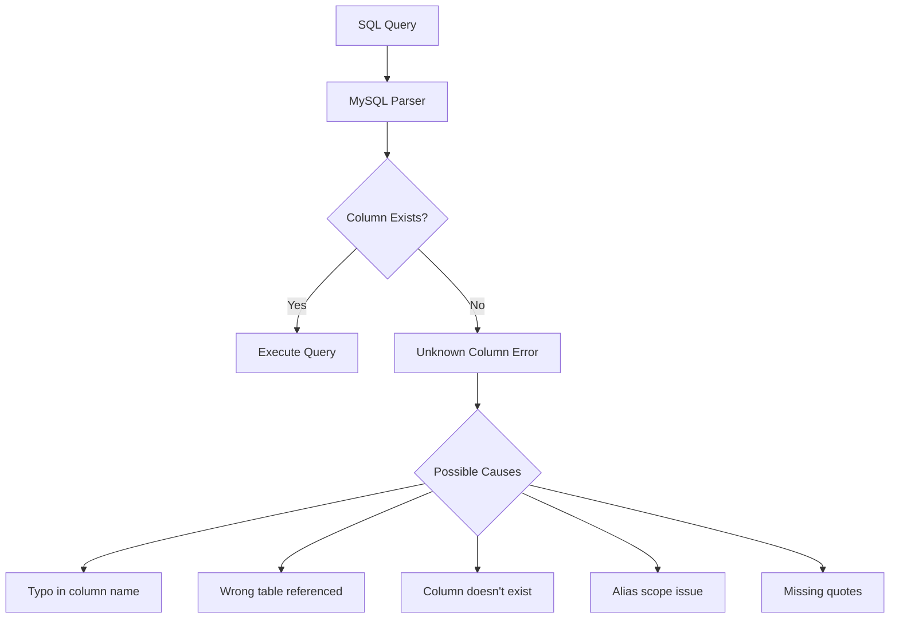
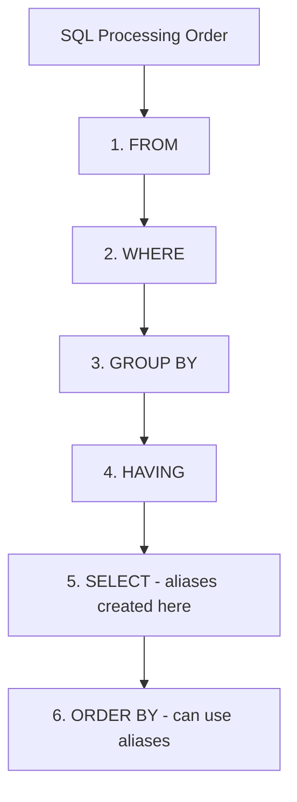

# How to Fix 'Unknown Column' Errors in MySQL

Author: [nawazdhandala](https://www.github.com/nawazdhandala)

Tags: MySQL, Database, Troubleshooting, SQL, Schema, Debugging

Description: Learn how to diagnose and fix MySQL 'Unknown column' errors caused by typos, missing columns, scope issues, and schema mismatches.

---

The "Unknown column" error is one of the most common MySQL errors developers encounter. While it seems straightforward, it can have several underlying causes. This guide helps you quickly identify and fix the issue.

## Understanding the Error



The error message looks like this:

```
ERROR 1054 (42S22): Unknown column 'column_name' in 'field list'
```

The error message tells you:
- The column name MySQL could not find
- Where it looked: 'field list', 'where clause', 'on clause', etc.

## Quick Diagnosis

```sql
-- Check what columns actually exist in the table
DESCRIBE your_table;

-- Or get more detail
SHOW COLUMNS FROM your_table;

-- Check the exact column names (case sensitivity matters on some systems)
SELECT COLUMN_NAME
FROM INFORMATION_SCHEMA.COLUMNS
WHERE TABLE_SCHEMA = DATABASE()
AND TABLE_NAME = 'your_table';
```

## Common Causes and Solutions

### Cause 1: Typo in Column Name

The most common cause is a simple spelling mistake:

```sql
-- Wrong: Typo in column name
SELECT usernme FROM users;
-- Error: Unknown column 'usernme' in 'field list'

-- Correct: Fixed spelling
SELECT username FROM users;
```

**Solution:** Double-check the column name spelling against the table schema.

```sql
-- List all columns to find the correct name
SHOW COLUMNS FROM users;
```

### Cause 2: Column Does Not Exist

You might be querying a column that was never created or has been dropped:

```sql
-- This column doesn't exist in the table
SELECT middle_name FROM users;
-- Error: Unknown column 'middle_name' in 'field list'
```

**Solution:** Add the missing column or remove it from your query.

```sql
-- Option 1: Add the column if needed
ALTER TABLE users ADD COLUMN middle_name VARCHAR(50);

-- Option 2: Remove from query if not needed
SELECT first_name, last_name FROM users;
```

### Cause 3: Wrong Table in JOIN

When joining tables, you might reference a column in the wrong table:

```sql
-- Wrong: 'email' is in users, not orders
SELECT o.id, o.email, o.total
FROM orders o
JOIN users u ON u.id = o.user_id;
-- Error: Unknown column 'o.email' in 'field list'

-- Correct: Use the right table alias
SELECT o.id, u.email, o.total
FROM orders o
JOIN users u ON u.id = o.user_id;
```

**Solution:** Verify which table contains each column.

```sql
-- Find which tables have a column named 'email'
SELECT TABLE_NAME, COLUMN_NAME
FROM INFORMATION_SCHEMA.COLUMNS
WHERE TABLE_SCHEMA = DATABASE()
AND COLUMN_NAME = 'email';
```

### Cause 4: Missing Table Alias

When using aliases, you must use them consistently:

```sql
-- Wrong: Table aliased as 'u' but referenced as 'users'
SELECT users.id, users.name
FROM users u
WHERE users.active = 1;
-- Error: Unknown column 'users.id' in 'field list'

-- Correct: Use the alias consistently
SELECT u.id, u.name
FROM users u
WHERE u.active = 1;
```

### Cause 5: Column Alias Used Too Early

You cannot use a column alias in the same SELECT clause or in the WHERE clause:

```sql
-- Wrong: Using alias in WHERE
SELECT
    price * quantity AS total
FROM order_items
WHERE total > 100;
-- Error: Unknown column 'total' in 'where clause'

-- Correct: Repeat the expression or use HAVING with GROUP BY
SELECT
    price * quantity AS total
FROM order_items
WHERE price * quantity > 100;

-- Or use a subquery
SELECT * FROM (
    SELECT
        price * quantity AS total
    FROM order_items
) AS subq
WHERE total > 100;
```



### Cause 6: Unquoted Reserved Words

If your column name is a MySQL reserved word, it needs backticks:

```sql
-- Wrong: 'order' is a reserved word
SELECT id, order, status FROM transactions;
-- Error: Syntax error or unknown column

-- Correct: Use backticks for reserved words
SELECT id, `order`, status FROM transactions;
```

**Common reserved words used as column names:**
- order, key, index, table, column
- group, select, where, from, join
- status, type, name, value, date

**Solution:** Always use backticks for reserved words or rename the column.

```sql
-- Better: Rename to avoid confusion
ALTER TABLE transactions CHANGE COLUMN `order` order_number VARCHAR(50);
```

### Cause 7: Case Sensitivity Issues

On Linux, table and column names can be case-sensitive:

```sql
-- On case-sensitive systems
SELECT UserName FROM Users;  -- Might fail
SELECT username FROM users;  -- Correct
```

**Solution:** Check the actual case in the table definition.

```sql
-- Check exact column names
SELECT COLUMN_NAME
FROM INFORMATION_SCHEMA.COLUMNS
WHERE TABLE_SCHEMA = DATABASE()
AND LOWER(TABLE_NAME) = 'users';
```

### Cause 8: Schema Mismatch Between Environments

Your development database schema might differ from production:

```sql
-- Works in development, fails in production
SELECT new_feature_column FROM users;
-- Error in production: Unknown column 'new_feature_column'
```

**Solution:** Synchronize database schemas.

```bash
# Compare schemas between databases
mysqldump --no-data -u root -p dev_db > dev_schema.sql
mysqldump --no-data -u root -p prod_db > prod_schema.sql
diff dev_schema.sql prod_schema.sql
```

Use migration tools to keep schemas in sync:

```sql
-- Create migration script
ALTER TABLE users ADD COLUMN new_feature_column VARCHAR(100);
```

### Cause 9: ORM or Query Builder Issues

When using ORMs, the generated SQL might reference non-existent columns:

```python
# SQLAlchemy example - model doesn't match database
class User(Base):
    __tablename__ = 'users'
    id = Column(Integer, primary_key=True)
    full_name = Column(String)  # But database has 'name', not 'full_name'

# This generates: SELECT users.full_name FROM users
# Error: Unknown column 'users.full_name'
```

**Solution:** Keep your model definitions in sync with the database.

```python
# Option 1: Fix the model
class User(Base):
    __tablename__ = 'users'
    id = Column(Integer, primary_key=True)
    name = Column(String)  # Match database column name

# Option 2: Map to different column name
class User(Base):
    __tablename__ = 'users'
    id = Column(Integer, primary_key=True)
    full_name = Column('name', String)  # Map 'name' column to full_name attribute
```

## Debugging Complex Queries

For complex queries, isolate the problem:

```sql
-- Start with the base table
SELECT * FROM users LIMIT 1;

-- Add columns one by one
SELECT id FROM users LIMIT 1;
SELECT id, username FROM users LIMIT 1;
SELECT id, username, emial FROM users LIMIT 1;  -- Error found here!

-- For JOINs, test each table separately
SELECT * FROM orders LIMIT 1;
SELECT * FROM users LIMIT 1;

-- Then test the join
SELECT o.*, u.*
FROM orders o
JOIN users u ON u.id = o.user_id
LIMIT 1;
```

## Prevention Strategies

### Use Explicit Column Lists

```sql
-- Bad: SELECT * hides column issues until runtime
SELECT * FROM users;

-- Good: Explicit columns catch issues at development time
SELECT id, username, email, created_at FROM users;
```

### Validate Queries Before Deployment

```python
def validate_query(connection, query):
    """Validate a query without executing it."""
    try:
        cursor = connection.cursor()
        cursor.execute(f"EXPLAIN {query}")
        return True
    except mysql.connector.Error as e:
        if e.errno == 1054:  # Unknown column
            print(f"Query validation failed: {e.msg}")
            return False
        raise
```

### Keep Schema Documentation Updated

```sql
-- Generate current schema documentation
SELECT
    TABLE_NAME,
    COLUMN_NAME,
    DATA_TYPE,
    IS_NULLABLE,
    COLUMN_DEFAULT,
    COLUMN_COMMENT
FROM INFORMATION_SCHEMA.COLUMNS
WHERE TABLE_SCHEMA = DATABASE()
ORDER BY TABLE_NAME, ORDINAL_POSITION;
```

### Use Database Migrations

```sql
-- Keep track of schema changes with versioned migrations
-- migrations/001_add_middle_name.sql
ALTER TABLE users ADD COLUMN middle_name VARCHAR(50) AFTER first_name;

-- migrations/002_add_phone_number.sql
ALTER TABLE users ADD COLUMN phone_number VARCHAR(20);
```

## Troubleshooting Checklist

When you see "Unknown column":

- [ ] Check the exact column name in the error message
- [ ] Verify spelling against actual table schema
- [ ] Confirm the column exists: `DESCRIBE table_name`
- [ ] Check if using correct table alias in JOINs
- [ ] Verify you are not using a SELECT alias in WHERE
- [ ] Check for reserved words needing backticks
- [ ] Verify case sensitivity if on Linux
- [ ] Compare schema between environments
- [ ] Check ORM model matches database schema

## Quick Reference: Finding Columns

```sql
-- Find all tables with a specific column
SELECT TABLE_NAME
FROM INFORMATION_SCHEMA.COLUMNS
WHERE TABLE_SCHEMA = DATABASE()
AND COLUMN_NAME = 'user_id';

-- Find columns matching a pattern
SELECT TABLE_NAME, COLUMN_NAME
FROM INFORMATION_SCHEMA.COLUMNS
WHERE TABLE_SCHEMA = DATABASE()
AND COLUMN_NAME LIKE '%email%';

-- Get full column details
SELECT *
FROM INFORMATION_SCHEMA.COLUMNS
WHERE TABLE_SCHEMA = DATABASE()
AND TABLE_NAME = 'users';
```

---

The "Unknown column" error is almost always caused by one of these issues: typos, missing columns, wrong table references, or alias scope problems. Start by checking the exact column name against your schema, and work through the common causes systematically. With proper schema management and explicit column lists in your queries, you can catch most of these errors before they reach production.
