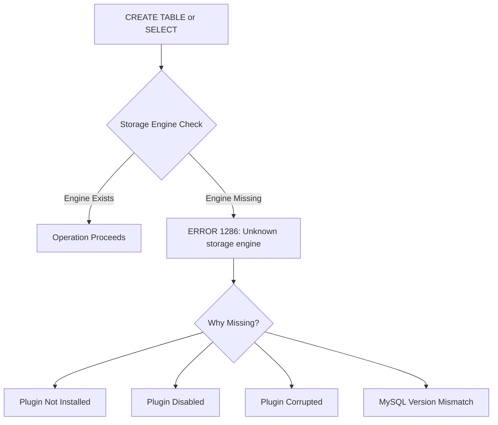
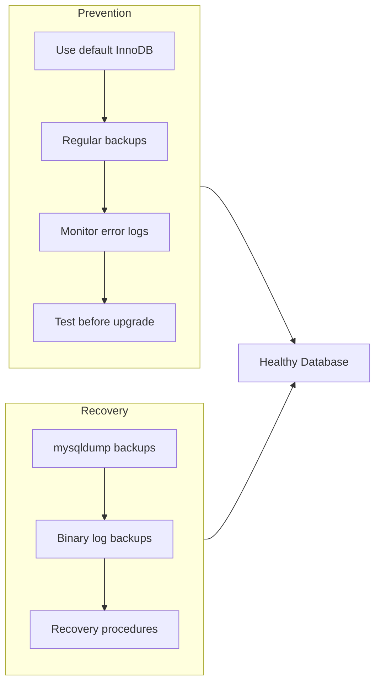

# How to Fix "Unknown Storage Engine" Errors

Author: [nawazdhandala](https://github.com/nawazdhandala)

Tags: MySQL, Database, Troubleshooting, Storage Engines, InnoDB

Description: Learn how to diagnose and fix MySQL "Unknown storage engine" errors including missing engine plugins, disabled engines, and table recovery strategies.

---

The "Unknown storage engine" error in MySQL occurs when you try to create or access a table using a storage engine that is not available. This can happen when an engine plugin is not installed, disabled, or corrupted. Understanding MySQL storage engines and how to manage them is essential for database administration.

## Understanding the Error



## Common Error Messages

```
ERROR 1286 (42000): Unknown storage engine 'InnoDB'
ERROR 1286 (42000): Unknown storage engine 'MyISAM'
ERROR 1286 (42000): Unknown storage engine 'MEMORY'
ERROR 1286 (42000): Unknown storage engine 'ARCHIVE'
ERROR 1146 (42S02): Table 'database.table' doesn't exist
```

## Diagnosing the Problem

### Check Available Storage Engines

```sql
-- List all available storage engines
SHOW ENGINES;

-- Expected output:
-- +--------------------+---------+----------------------------------------------------------------+
-- | Engine             | Support | Comment                                                        |
-- +--------------------+---------+----------------------------------------------------------------+
-- | InnoDB             | DEFAULT | Supports transactions, row-level locking, and foreign keys     |
-- | MRG_MYISAM         | YES     | Collection of identical MyISAM tables                          |
-- | MEMORY             | YES     | Hash based, stored in memory, useful for temporary tables      |
-- | BLACKHOLE          | YES     | /dev/null storage engine (anything you write disappears)       |
-- | MyISAM             | YES     | MyISAM storage engine                                          |
-- | CSV                | YES     | CSV storage engine                                             |
-- | ARCHIVE            | YES     | Archive storage engine                                         |
-- | PERFORMANCE_SCHEMA | YES     | Performance Schema                                             |
-- | FEDERATED          | NO      | Federated MySQL storage engine                                 |
-- +--------------------+---------+----------------------------------------------------------------+

-- Check specific engine
SELECT ENGINE, SUPPORT FROM INFORMATION_SCHEMA.ENGINES WHERE ENGINE = 'InnoDB';
```

### Check Installed Plugins

```sql
-- List all plugins
SHOW PLUGINS;

-- Check specific plugin status
SELECT PLUGIN_NAME, PLUGIN_STATUS, PLUGIN_TYPE
FROM INFORMATION_SCHEMA.PLUGINS
WHERE PLUGIN_TYPE = 'STORAGE ENGINE';
```

### Check MySQL Error Log

```bash
# Find error log location
mysql -e "SHOW VARIABLES LIKE 'log_error'"

# Common locations
cat /var/log/mysql/error.log
cat /var/log/mysqld.log
cat /var/lib/mysql/*.err
```

Look for messages like:
```
[ERROR] InnoDB: Unable to lock ./ibdata1
[ERROR] Plugin 'InnoDB' init function returned error
[ERROR] Plugin 'InnoDB' registration as a STORAGE ENGINE failed
[ERROR] Unknown/unsupported storage engine: InnoDB
```

## Fixing InnoDB Issues

InnoDB problems are the most common cause of "Unknown storage engine" errors.

### Scenario 1: InnoDB Disabled

```sql
-- Check if InnoDB is disabled
SHOW VARIABLES LIKE 'have_innodb';
-- If it shows DISABLED, InnoDB is turned off
```

**Fix**: Remove or comment out the disable option in your MySQL configuration.

Check `/etc/mysql/mysql.conf.d/mysqld.cnf` or `/etc/my.cnf`:

```ini
# Remove or comment out these lines:
# skip-innodb
# innodb = OFF
# disabled_storage_engines = "InnoDB"
```

Restart MySQL:

```bash
sudo systemctl restart mysql
```

### Scenario 2: Corrupted InnoDB System Tablespace

```bash
# Check for InnoDB files
ls -la /var/lib/mysql/ibdata1
ls -la /var/lib/mysql/ib_logfile*
```

**Recovery Steps**:

```ini
# Add to my.cnf for recovery mode
[mysqld]
innodb_force_recovery = 1
```

Recovery levels:

| Level | Description |
|-------|-------------|
| 1 | Skip corrupt pages |
| 2 | Skip background operations |
| 3 | Skip transaction rollback |
| 4 | Skip insert buffer merge |
| 5 | Skip undo logs |
| 6 | Skip redo log roll-forward |

```bash
# Start with level 1, increase if needed
sudo systemctl start mysql

# Export data while in recovery mode
mysqldump --all-databases > backup.sql

# Stop MySQL, remove recovery option
sudo systemctl stop mysql

# Optionally, remove corrupted files (DANGEROUS - only if you have backup)
# rm /var/lib/mysql/ibdata1
# rm /var/lib/mysql/ib_logfile*

# Restart without recovery mode
sudo systemctl start mysql

# Restore data
mysql < backup.sql
```

### Scenario 3: Insufficient Memory for InnoDB

```sql
-- Check InnoDB buffer pool size
SHOW VARIABLES LIKE 'innodb_buffer_pool_size';
```

If the buffer pool is too large for available memory, InnoDB may fail to initialize.

```ini
[mysqld]
# Reduce buffer pool size (adjust based on available RAM)
innodb_buffer_pool_size = 128M
```

### Scenario 4: Missing InnoDB Files After Migration

When moving MySQL data directory:

```bash
# Ensure all files are present
ls -la /var/lib/mysql/
# Should include: ibdata1, ib_logfile0, ib_logfile1

# Check permissions
chown -R mysql:mysql /var/lib/mysql/
chmod 750 /var/lib/mysql/
chmod 660 /var/lib/mysql/ibdata1
```

## Fixing Other Storage Engine Issues

### Enable FEDERATED Engine

FEDERATED is disabled by default:

```ini
[mysqld]
federated = ON
```

Or load dynamically:

```sql
INSTALL PLUGIN FEDERATED SONAME 'ha_federated.so';
```

### Enable ARCHIVE Engine

```sql
-- Check if available
SHOW PLUGINS;

-- If not loaded, install it
INSTALL PLUGIN ARCHIVE SONAME 'ha_archive.so';
```

### Enable BLACKHOLE Engine

```sql
INSTALL PLUGIN BLACKHOLE SONAME 'ha_blackhole.so';
```

## Handling Tables with Unavailable Engines

### Check Table Engine

```sql
-- Check what engine a table was created with
SELECT TABLE_NAME, ENGINE
FROM INFORMATION_SCHEMA.TABLES
WHERE TABLE_SCHEMA = 'your_database';

-- Or from the .frm file (MySQL 5.7)
SHOW CREATE TABLE your_table;
```

### Convert Table to Available Engine

```sql
-- Convert MyISAM table to InnoDB
ALTER TABLE your_table ENGINE = InnoDB;

-- Convert to different engine during restore
# In mysqldump output, replace:
# ENGINE=MyISAM
# With:
# ENGINE=InnoDB
```

### Bulk Engine Conversion Script

```sql
-- Generate ALTER statements for all MyISAM tables
SELECT CONCAT('ALTER TABLE `', TABLE_SCHEMA, '`.`', TABLE_NAME, '` ENGINE=InnoDB;')
FROM INFORMATION_SCHEMA.TABLES
WHERE ENGINE = 'MyISAM'
  AND TABLE_SCHEMA NOT IN ('mysql', 'information_schema', 'performance_schema');
```

Or use a stored procedure:

```sql
DELIMITER //

CREATE PROCEDURE convert_all_to_innodb()
BEGIN
    DECLARE done INT DEFAULT FALSE;
    DECLARE tbl_name VARCHAR(255);
    DECLARE tbl_schema VARCHAR(255);

    DECLARE cur CURSOR FOR
        SELECT TABLE_NAME, TABLE_SCHEMA
        FROM INFORMATION_SCHEMA.TABLES
        WHERE ENGINE = 'MyISAM'
          AND TABLE_SCHEMA NOT IN ('mysql', 'information_schema', 'performance_schema');

    DECLARE CONTINUE HANDLER FOR NOT FOUND SET done = TRUE;

    OPEN cur;

    read_loop: LOOP
        FETCH cur INTO tbl_name, tbl_schema;
        IF done THEN
            LEAVE read_loop;
        END IF;

        SET @sql = CONCAT('ALTER TABLE `', tbl_schema, '`.`', tbl_name, '` ENGINE=InnoDB');
        PREPARE stmt FROM @sql;
        EXECUTE stmt;
        DEALLOCATE PREPARE stmt;

        SELECT CONCAT('Converted: ', tbl_schema, '.', tbl_name) AS status;
    END LOOP;

    CLOSE cur;
END //

DELIMITER ;

-- Run the conversion
CALL convert_all_to_innodb();
```

## MySQL Version-Specific Issues

### Migrating from MySQL 5.7 to 8.0

MySQL 8.0 removed support for some features:

```sql
-- Check for incompatible table types before upgrade
mysqlcheck --all-databases --check-upgrade

-- Fix issues
mysql_upgrade --force
```

### Handling Removed Engines

Some engines were removed in newer versions:

| Engine | Status in MySQL 8.0 |
|--------|---------------------|
| PARTITION | Merged into InnoDB |
| HEAP | Use MEMORY instead |
| ISAM | Removed (use MyISAM) |
| BDB | Removed |
| MERGE | Renamed to MRG_MYISAM |

## Prevention Strategies



### Best Practices

1. **Use InnoDB as default** - It is the recommended engine for most workloads

```ini
[mysqld]
default_storage_engine = InnoDB
```

2. **Always specify engine explicitly** - Do not rely on defaults

```sql
CREATE TABLE users (
    id INT PRIMARY KEY,
    name VARCHAR(100)
) ENGINE=InnoDB;
```

3. **Regular backups with mysqldump**

```bash
# Include engine specification in dumps
mysqldump --all-databases --routines --triggers > backup.sql
```

4. **Monitor InnoDB status**

```sql
SHOW ENGINE INNODB STATUS\G
```

5. **Check before migrations**

```sql
-- Identify non-InnoDB tables
SELECT TABLE_SCHEMA, TABLE_NAME, ENGINE
FROM INFORMATION_SCHEMA.TABLES
WHERE ENGINE != 'InnoDB'
  AND TABLE_SCHEMA NOT IN ('mysql', 'information_schema', 'performance_schema', 'sys');
```

## Quick Reference: Storage Engine Commands

```sql
-- List all engines
SHOW ENGINES;

-- Check default engine
SELECT @@default_storage_engine;

-- Set default engine (session)
SET default_storage_engine = InnoDB;

-- Install engine plugin
INSTALL PLUGIN engine_name SONAME 'plugin_file.so';

-- Uninstall engine plugin
UNINSTALL PLUGIN engine_name;

-- Convert table engine
ALTER TABLE table_name ENGINE = InnoDB;

-- Check table engine
SELECT ENGINE FROM INFORMATION_SCHEMA.TABLES WHERE TABLE_NAME = 'your_table';
```

## Summary

"Unknown storage engine" errors typically occur when:

1. A required engine plugin is not installed or loaded
2. The engine is explicitly disabled in configuration
3. InnoDB system files are corrupted or missing
4. Tables were created with an engine that is no longer available

The fix depends on the specific situation:

- Enable the disabled engine in configuration
- Install the missing plugin
- Recover corrupted InnoDB tablespace
- Convert tables to an available engine

For production systems, stick with InnoDB, maintain regular backups, and test upgrades in a staging environment before applying them to production.
