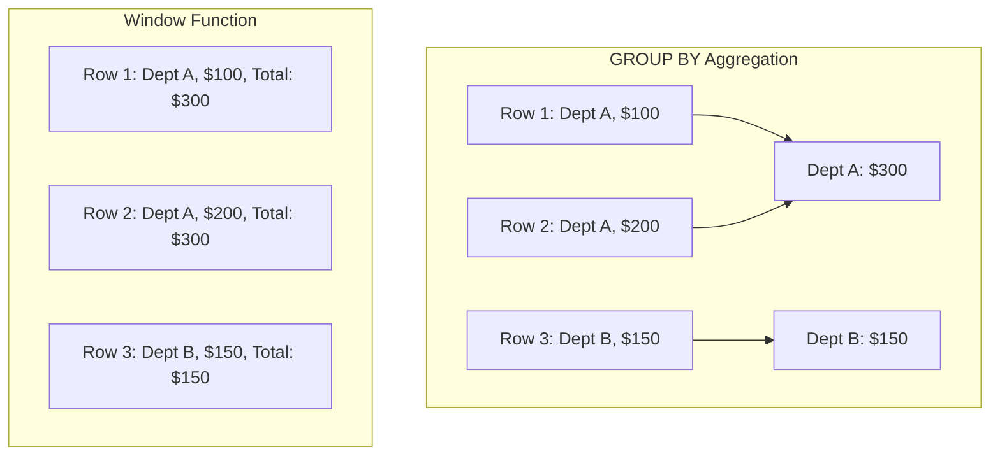
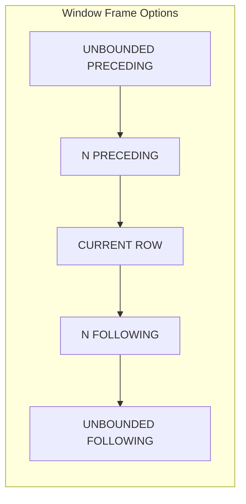

# How to Handle Window Functions in MySQL 8

Author: [nawazdhandala](https://www.github.com/nawazdhandala)

Tags: MySQL, Window Functions, SQL, Analytics, Database, MySQL 8

Description: A comprehensive guide to using window functions in MySQL 8 for advanced analytics, including ranking, running totals, moving averages, and performance optimization.

---

Window functions are one of the most powerful features introduced in MySQL 8.0. They allow you to perform calculations across a set of rows related to the current row without collapsing the result set like GROUP BY does. This guide covers practical use cases and best practices for window functions.

## What Are Window Functions?

Window functions operate on a "window" of rows defined by the OVER clause. Unlike aggregate functions with GROUP BY, window functions preserve individual rows while adding computed values.



## Basic Window Function Syntax

```sql
-- General syntax
SELECT
    column1,
    column2,
    window_function(column) OVER (
        PARTITION BY partition_column
        ORDER BY order_column
        frame_specification
    ) AS result
FROM table_name;
```

## Ranking Functions

### ROW_NUMBER, RANK, and DENSE_RANK

```sql
-- Create sample data
CREATE TABLE sales (
    id INT AUTO_INCREMENT PRIMARY KEY,
    salesperson VARCHAR(50),
    region VARCHAR(50),
    amount DECIMAL(10,2),
    sale_date DATE
);

INSERT INTO sales (salesperson, region, amount, sale_date) VALUES
('Alice', 'North', 5000, '2024-01-15'),
('Bob', 'North', 5000, '2024-01-16'),
('Alice', 'North', 3000, '2024-01-17'),
('Carol', 'South', 7000, '2024-01-15'),
('Dave', 'South', 4000, '2024-01-16'),
('Carol', 'South', 7000, '2024-01-18');

-- Compare ranking functions
SELECT
    salesperson,
    region,
    amount,
    ROW_NUMBER() OVER (ORDER BY amount DESC) AS row_num,
    RANK() OVER (ORDER BY amount DESC) AS rank_val,
    DENSE_RANK() OVER (ORDER BY amount DESC) AS dense_rank_val
FROM sales;

-- Result:
-- salesperson | region | amount  | row_num | rank_val | dense_rank_val
-- Carol       | South  | 7000.00 | 1       | 1        | 1
-- Carol       | South  | 7000.00 | 2       | 1        | 1
-- Alice       | North  | 5000.00 | 3       | 3        | 2
-- Bob         | North  | 5000.00 | 4       | 3        | 2
-- Dave        | South  | 4000.00 | 5       | 5        | 3
-- Alice       | North  | 3000.00 | 6       | 6        | 4
```

### Ranking Within Partitions

```sql
-- Rank salespeople within each region
SELECT
    salesperson,
    region,
    amount,
    RANK() OVER (
        PARTITION BY region
        ORDER BY amount DESC
    ) AS region_rank
FROM sales;

-- Get top performer in each region
WITH ranked_sales AS (
    SELECT
        salesperson,
        region,
        SUM(amount) AS total_sales,
        RANK() OVER (
            PARTITION BY region
            ORDER BY SUM(amount) DESC
        ) AS region_rank
    FROM sales
    GROUP BY salesperson, region
)
SELECT salesperson, region, total_sales
FROM ranked_sales
WHERE region_rank = 1;
```

### NTILE for Percentile Buckets

```sql
-- Divide salespeople into quartiles
SELECT
    salesperson,
    SUM(amount) AS total_sales,
    NTILE(4) OVER (ORDER BY SUM(amount) DESC) AS quartile
FROM sales
GROUP BY salesperson;
```

## Aggregate Window Functions

### Running Totals

```sql
-- Running total of sales by date
SELECT
    sale_date,
    salesperson,
    amount,
    SUM(amount) OVER (
        ORDER BY sale_date
        ROWS BETWEEN UNBOUNDED PRECEDING AND CURRENT ROW
    ) AS running_total
FROM sales
ORDER BY sale_date;

-- Running total per salesperson
SELECT
    sale_date,
    salesperson,
    amount,
    SUM(amount) OVER (
        PARTITION BY salesperson
        ORDER BY sale_date
        ROWS BETWEEN UNBOUNDED PRECEDING AND CURRENT ROW
    ) AS salesperson_running_total
FROM sales
ORDER BY salesperson, sale_date;
```

### Moving Averages

```sql
-- 3-day moving average
SELECT
    sale_date,
    amount,
    AVG(amount) OVER (
        ORDER BY sale_date
        ROWS BETWEEN 2 PRECEDING AND CURRENT ROW
    ) AS moving_avg_3day
FROM sales
ORDER BY sale_date;

-- Moving average with null handling
SELECT
    sale_date,
    amount,
    ROUND(
        AVG(amount) OVER (
            ORDER BY sale_date
            ROWS BETWEEN 6 PRECEDING AND CURRENT ROW
        ), 2
    ) AS moving_avg_7day,
    COUNT(*) OVER (
        ORDER BY sale_date
        ROWS BETWEEN 6 PRECEDING AND CURRENT ROW
    ) AS days_in_window
FROM sales
ORDER BY sale_date;
```

## Value Functions

### LAG and LEAD

```sql
-- Compare with previous sale
SELECT
    sale_date,
    salesperson,
    amount,
    LAG(amount, 1) OVER (
        PARTITION BY salesperson
        ORDER BY sale_date
    ) AS previous_sale,
    amount - LAG(amount, 1) OVER (
        PARTITION BY salesperson
        ORDER BY sale_date
    ) AS change_from_previous
FROM sales
ORDER BY salesperson, sale_date;

-- Predict next sale date pattern
SELECT
    salesperson,
    sale_date,
    LEAD(sale_date, 1) OVER (
        PARTITION BY salesperson
        ORDER BY sale_date
    ) AS next_sale_date,
    DATEDIFF(
        LEAD(sale_date, 1) OVER (
            PARTITION BY salesperson
            ORDER BY sale_date
        ),
        sale_date
    ) AS days_until_next_sale
FROM sales
ORDER BY salesperson, sale_date;
```

### FIRST_VALUE and LAST_VALUE

```sql
-- Compare each sale to first and last in period
SELECT
    salesperson,
    sale_date,
    amount,
    FIRST_VALUE(amount) OVER (
        PARTITION BY salesperson
        ORDER BY sale_date
        ROWS BETWEEN UNBOUNDED PRECEDING AND UNBOUNDED FOLLOWING
    ) AS first_sale,
    LAST_VALUE(amount) OVER (
        PARTITION BY salesperson
        ORDER BY sale_date
        ROWS BETWEEN UNBOUNDED PRECEDING AND UNBOUNDED FOLLOWING
    ) AS last_sale
FROM sales
ORDER BY salesperson, sale_date;
```

### NTH_VALUE

```sql
-- Get second highest sale per region
SELECT DISTINCT
    region,
    NTH_VALUE(amount, 2) OVER (
        PARTITION BY region
        ORDER BY amount DESC
        ROWS BETWEEN UNBOUNDED PRECEDING AND UNBOUNDED FOLLOWING
    ) AS second_highest_sale
FROM sales;
```

## Frame Specifications

Understanding frame specifications is crucial for correct results.



```sql
-- Different frame specifications
SELECT
    sale_date,
    amount,
    -- All rows from start to current
    SUM(amount) OVER (
        ORDER BY sale_date
        ROWS BETWEEN UNBOUNDED PRECEDING AND CURRENT ROW
    ) AS running_total,

    -- 2 rows before to 2 rows after (5-row window)
    AVG(amount) OVER (
        ORDER BY sale_date
        ROWS BETWEEN 2 PRECEDING AND 2 FOLLOWING
    ) AS centered_avg,

    -- Current row to end
    SUM(amount) OVER (
        ORDER BY sale_date
        ROWS BETWEEN CURRENT ROW AND UNBOUNDED FOLLOWING
    ) AS remaining_total
FROM sales
ORDER BY sale_date;
```

## Named Windows

Reuse window definitions for cleaner code:

```sql
-- Using named windows
SELECT
    salesperson,
    sale_date,
    amount,
    SUM(amount) OVER sales_window AS running_total,
    AVG(amount) OVER sales_window AS running_avg,
    COUNT(*) OVER sales_window AS sale_count
FROM sales
WINDOW sales_window AS (
    PARTITION BY salesperson
    ORDER BY sale_date
    ROWS BETWEEN UNBOUNDED PRECEDING AND CURRENT ROW
)
ORDER BY salesperson, sale_date;
```

## Practical Use Cases

### Year-over-Year Comparison

```sql
-- Monthly sales with YoY comparison
WITH monthly_sales AS (
    SELECT
        DATE_FORMAT(sale_date, '%Y-%m') AS month,
        SUM(amount) AS total_sales
    FROM sales
    GROUP BY DATE_FORMAT(sale_date, '%Y-%m')
)
SELECT
    month,
    total_sales,
    LAG(total_sales, 12) OVER (ORDER BY month) AS same_month_last_year,
    ROUND(
        (total_sales - LAG(total_sales, 12) OVER (ORDER BY month)) /
        LAG(total_sales, 12) OVER (ORDER BY month) * 100,
        2
    ) AS yoy_growth_percent
FROM monthly_sales
ORDER BY month;
```

### Percentage of Total

```sql
-- Each sale as percentage of total
SELECT
    salesperson,
    region,
    amount,
    ROUND(
        amount / SUM(amount) OVER () * 100,
        2
    ) AS pct_of_total,
    ROUND(
        amount / SUM(amount) OVER (PARTITION BY region) * 100,
        2
    ) AS pct_of_region
FROM sales;
```

### Gap Analysis

```sql
-- Find gaps in sequential data
WITH numbered AS (
    SELECT
        id,
        sale_date,
        LAG(sale_date) OVER (ORDER BY sale_date) AS prev_date,
        DATEDIFF(sale_date, LAG(sale_date) OVER (ORDER BY sale_date)) AS days_gap
    FROM sales
)
SELECT *
FROM numbered
WHERE days_gap > 1
ORDER BY sale_date;
```

## Performance Optimization

### Index Considerations

```sql
-- Create indexes for window function performance
-- Index should match PARTITION BY and ORDER BY columns
CREATE INDEX idx_sales_region_date ON sales(region, sale_date);
CREATE INDEX idx_sales_person_date ON sales(salesperson, sale_date);

-- Check execution plan
EXPLAIN ANALYZE
SELECT
    salesperson,
    sale_date,
    amount,
    SUM(amount) OVER (
        PARTITION BY salesperson
        ORDER BY sale_date
    ) AS running_total
FROM sales;
```

### Avoid Multiple Passes

```sql
-- Inefficient: multiple window definitions
SELECT
    sale_date,
    SUM(amount) OVER (ORDER BY sale_date) AS running_total,
    AVG(amount) OVER (ORDER BY sale_date) AS running_avg
FROM sales;

-- Better: use named window
SELECT
    sale_date,
    SUM(amount) OVER w AS running_total,
    AVG(amount) OVER w AS running_avg
FROM sales
WINDOW w AS (ORDER BY sale_date);
```

## Common Mistakes to Avoid

1. **Forgetting frame specification**: Default frame with ORDER BY is `RANGE BETWEEN UNBOUNDED PRECEDING AND CURRENT ROW`, not `ROWS`
2. **Using LAST_VALUE without proper frame**: Always specify `ROWS BETWEEN UNBOUNDED PRECEDING AND UNBOUNDED FOLLOWING`
3. **Ignoring NULL handling**: LAG and LEAD return NULL for non-existent rows
4. **Missing indexes**: Window functions can be slow without proper indexes

Window functions in MySQL 8 enable sophisticated analytics directly in SQL. Master these patterns and you can replace complex application logic with efficient database queries.
