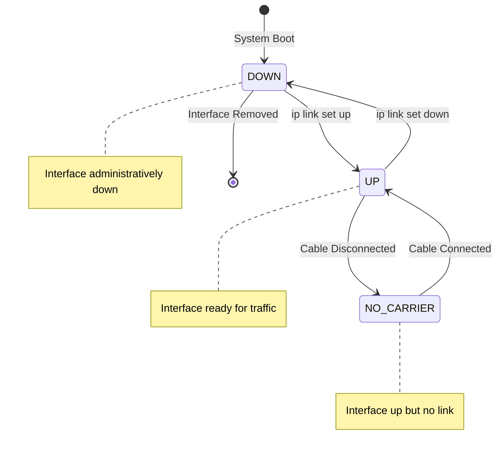
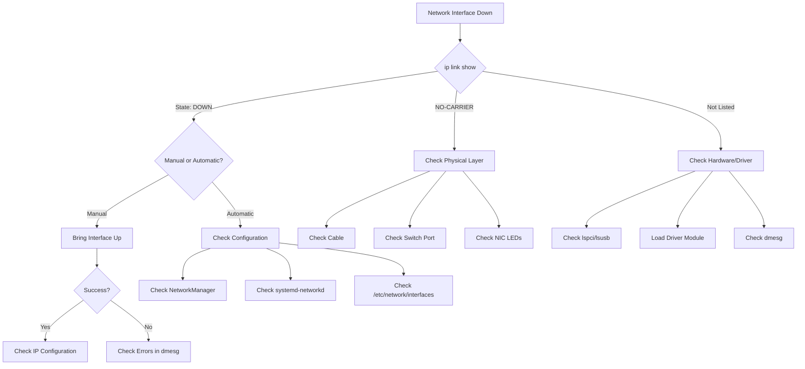
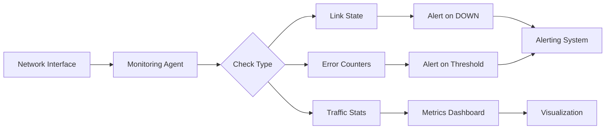

# How to Fix 'Network Interface Down' Errors

Author: [nawazdhandala](https://www.github.com/nawazdhandala)

Tags: Linux, Networking, System Administration, Troubleshooting, Network Interface, systemd-networkd, NetworkManager

Description: A practical guide to diagnosing and resolving network interface failures on Linux systems, covering hardware checks, driver issues, and configuration problems.

---

> Network interface failures can bring services offline instantly. Knowing how to quickly diagnose whether the issue is hardware, driver, or configuration-related is essential for minimizing downtime.

This guide provides a systematic approach to troubleshooting network interface problems, from basic connectivity checks to advanced driver and kernel-level debugging.

---

## Understanding Network Interface States

Network interfaces can be in several states:



---

## Initial Diagnosis

### Step 1: Check Interface Status

```bash
# List all network interfaces with their states
# Shows whether interfaces are UP, DOWN, or have NO-CARRIER
ip link show

# Example output:
# 1: lo: <LOOPBACK,UP,LOWER_UP> mtu 65536 state UNKNOWN
# 2: eth0: <BROADCAST,MULTICAST,UP,LOWER_UP> mtu 1500 state UP
# 3: eth1: <BROADCAST,MULTICAST> mtu 1500 state DOWN

# Get detailed information about a specific interface
ip link show eth0

# Check if interface has an IP address
ip addr show eth0

# Alternative: Use traditional ifconfig (if available)
ifconfig -a
```

### Step 2: Check Physical Connectivity

```bash
# Check link state (cable connected, speed negotiated)
# ethtool provides physical layer information
ethtool eth0

# Key fields to check:
# - Link detected: yes/no
# - Speed: 1000Mb/s
# - Duplex: Full

# Example output for a connected interface:
# Settings for eth0:
#     Supported link modes:   10baseT/Half 10baseT/Full
#                             100baseT/Half 100baseT/Full
#                             1000baseT/Full
#     Link detected: yes

# Check for errors and statistics
ethtool -S eth0 | grep -i error

# Check driver information
ethtool -i eth0
```

### Step 3: Review System Logs

```bash
# Check kernel messages for network-related errors
dmesg | grep -i "eth0\|link\|network\|nic" | tail -30

# Check systemd journal for networking events
journalctl -u NetworkManager --since "10 minutes ago"
# Or for systemd-networkd
journalctl -u systemd-networkd --since "10 minutes ago"

# Look for link state changes
journalctl -k | grep -i "link is\|carrier\|eth0"
```

---

## Diagnostic Workflow



---

## Common Issues and Solutions

### Issue 1: Interface Administratively Down

The interface exists but is in DOWN state:

```bash
# Check current state
ip link show eth0

# Bring the interface up
sudo ip link set eth0 up

# Verify the change
ip link show eth0

# If using NetworkManager, use nmcli
nmcli device status
nmcli device connect eth0

# Make the change persistent (systemd-networkd)
# Create or edit the network file
cat > /etc/systemd/network/10-eth0.network << 'EOF'
[Match]
Name=eth0

[Network]
DHCP=yes
EOF

# Restart networkd to apply
systemctl restart systemd-networkd
```

### Issue 2: No Carrier (Physical Layer Problem)

```bash
# Check link status
ethtool eth0 | grep "Link detected"

# If no link detected, check physical connections:
# 1. Verify cable is plugged in at both ends
# 2. Try a different cable
# 3. Try a different switch port
# 4. Check switch port status

# Force link speed/duplex (if auto-negotiation fails)
# WARNING: Both ends must match
sudo ethtool -s eth0 speed 1000 duplex full autoneg off

# Reset to auto-negotiation
sudo ethtool -s eth0 autoneg on
```

### Issue 3: Missing Network Interface

```bash
# List all PCI network devices
lspci | grep -i network
lspci | grep -i ethernet

# List USB network devices
lsusb | grep -i network

# Check if driver is loaded
# First, find the driver name from lspci
lspci -k | grep -A 3 -i ethernet

# Example output:
# 00:1f.6 Ethernet controller: Intel Corporation Ethernet Connection
#     Kernel driver in use: e1000e
#     Kernel modules: e1000e

# If no driver in use, load it manually
sudo modprobe e1000e

# Check if module is loaded
lsmod | grep e1000e

# Check dmesg for driver errors
dmesg | grep -i e1000e
```

### Issue 4: Driver/Firmware Issues

```bash
# Check for driver errors
dmesg | grep -i "eth0\|error\|fail" | tail -20

# Reload the network driver
# First, identify the driver
ethtool -i eth0

# Unload and reload the driver
sudo modprobe -r e1000e
sudo modprobe e1000e

# Check if firmware is needed
dmesg | grep -i firmware

# Install firmware packages if needed
# Debian/Ubuntu
sudo apt-get install linux-firmware

# RHEL/CentOS
sudo dnf install linux-firmware
```

---

## Network Manager Solutions

### Using NetworkManager (nmcli)

```bash
# Check all devices and their states
nmcli device status

# Example output:
# DEVICE  TYPE      STATE         CONNECTION
# eth0    ethernet  disconnected  --
# eth1    ethernet  connected     Wired connection 1
# lo      loopback  unmanaged     --

# Show detailed device information
nmcli device show eth0

# Connect a disconnected interface
nmcli device connect eth0

# Create a new connection profile
nmcli connection add type ethernet \
    con-name "eth0-static" \
    ifname eth0 \
    ipv4.addresses 192.168.1.100/24 \
    ipv4.gateway 192.168.1.1 \
    ipv4.dns "8.8.8.8,8.8.4.4" \
    ipv4.method manual

# Activate the connection
nmcli connection up eth0-static

# Reload connection files after manual edits
nmcli connection reload
```

### Using systemd-networkd

```bash
# Check networkd status
networkctl status

# Check specific interface
networkctl status eth0

# Create network configuration
cat > /etc/systemd/network/10-eth0.network << 'EOF'
[Match]
Name=eth0

[Network]
# Use DHCP
DHCP=yes

# Or static configuration:
# Address=192.168.1.100/24
# Gateway=192.168.1.1
# DNS=8.8.8.8
# DNS=8.8.4.4

[Link]
# Wait for link to be detected
RequiredForOnline=yes
EOF

# Set correct permissions
chmod 644 /etc/systemd/network/10-eth0.network

# Restart networkd
systemctl restart systemd-networkd

# Check status
networkctl status eth0
```

### Using Traditional /etc/network/interfaces (Debian)

```bash
# Edit the interfaces file
cat > /etc/network/interfaces << 'EOF'
# Loopback interface
auto lo
iface lo inet loopback

# Primary network interface with DHCP
auto eth0
iface eth0 inet dhcp

# Or static configuration:
# auto eth0
# iface eth0 inet static
#     address 192.168.1.100
#     netmask 255.255.255.0
#     gateway 192.168.1.1
#     dns-nameservers 8.8.8.8 8.8.4.4
EOF

# Restart networking
systemctl restart networking

# Or bring interface up/down manually
ifdown eth0 && ifup eth0
```

---

## Advanced Troubleshooting

### Check for Hardware Errors

```bash
# Check for NIC hardware errors
ethtool -S eth0 | grep -E "error|drop|miss|collision"

# Example problematic output:
# rx_crc_errors: 1523      # Bad cables or interference
# rx_missed_errors: 45     # NIC overwhelmed
# tx_carrier_errors: 12    # Link problems
# collisions: 0            # Should be 0 for full duplex

# Check PCI bus for errors
lspci -vvv -s 00:1f.6 | grep -i "status\|error"

# Check if card is in correct PCI slot
lspci -tv
```

### Network Namespace Issues

```bash
# List network namespaces
ip netns list

# Check if interface is in a different namespace
ip netns exec namespace_name ip link show

# Move interface back to default namespace
ip netns exec namespace_name ip link set eth0 netns 1
```

### Bonding/Teaming Issues

```bash
# Check bond status
cat /proc/net/bonding/bond0

# Check team status (RHEL/CentOS)
teamdctl team0 state

# Verify slave interfaces are up
ip link show | grep -E "eth0|eth1|bond0"

# Restart bond interface
ip link set bond0 down
ip link set bond0 up
```

---

## Automated Recovery Script

```bash
#!/bin/bash
# network_recovery.sh - Attempt automatic network interface recovery

INTERFACE="${1:-eth0}"
LOG_FILE="/var/log/network_recovery.log"

log() {
    echo "$(date '+%Y-%m-%d %H:%M:%S') - $1" | tee -a "$LOG_FILE"
}

check_interface_exists() {
    if ! ip link show "$INTERFACE" &>/dev/null; then
        log "ERROR: Interface $INTERFACE does not exist"
        return 1
    fi
    return 0
}

check_link_state() {
    local state
    state=$(ip link show "$INTERFACE" | grep -oP "state \K\w+")
    echo "$state"
}

check_carrier() {
    local carrier
    carrier=$(cat "/sys/class/net/$INTERFACE/carrier" 2>/dev/null)
    echo "${carrier:-0}"
}

attempt_recovery() {
    log "Starting recovery for $INTERFACE"

    # Check if interface exists
    if ! check_interface_exists; then
        log "Attempting to load driver"
        # Try common drivers
        for driver in e1000e igb ixgbe i40e mlx5_core; do
            modprobe "$driver" 2>/dev/null
        done
        sleep 2
        check_interface_exists || return 1
    fi

    # Check current state
    local state
    state=$(check_link_state)
    log "Current state: $state"

    if [ "$state" = "DOWN" ]; then
        log "Bringing interface up"
        ip link set "$INTERFACE" up
        sleep 2
    fi

    # Check carrier
    local carrier
    carrier=$(check_carrier)
    if [ "$carrier" = "0" ]; then
        log "WARNING: No carrier detected - check physical connection"
    fi

    # Check for IP address
    local ip_addr
    ip_addr=$(ip addr show "$INTERFACE" | grep "inet " | awk '{print $2}')

    if [ -z "$ip_addr" ]; then
        log "No IP address - requesting via DHCP"
        dhclient -v "$INTERFACE" 2>&1 | tee -a "$LOG_FILE"
    else
        log "IP address: $ip_addr"
    fi

    # Final verification
    if ping -I "$INTERFACE" -c 3 -W 2 8.8.8.8 &>/dev/null; then
        log "SUCCESS: Interface $INTERFACE is operational"
        return 0
    else
        log "WARNING: Interface up but no connectivity"
        return 1
    fi
}

# Main execution
log "=========================================="
attempt_recovery
exit $?
```

---

## Monitoring Network Interfaces



### Monitoring Script

```bash
#!/bin/bash
# monitor_interfaces.sh - Monitor network interface health

INTERFACES="eth0 eth1"
ERROR_THRESHOLD=100

for iface in $INTERFACES; do
    # Check if interface exists
    if ! ip link show "$iface" &>/dev/null; then
        echo "CRITICAL: Interface $iface not found"
        continue
    fi

    # Check link state
    state=$(ip link show "$iface" | grep -oP "state \K\w+")
    if [ "$state" != "UP" ]; then
        echo "WARNING: Interface $iface state is $state"
    fi

    # Check for errors
    if [ -f "/sys/class/net/$iface/statistics/rx_errors" ]; then
        rx_errors=$(cat "/sys/class/net/$iface/statistics/rx_errors")
        tx_errors=$(cat "/sys/class/net/$iface/statistics/tx_errors")

        if [ "$rx_errors" -gt "$ERROR_THRESHOLD" ] || [ "$tx_errors" -gt "$ERROR_THRESHOLD" ]; then
            echo "WARNING: High error count on $iface - RX: $rx_errors, TX: $tx_errors"
        fi
    fi

    # Output stats
    echo "OK: $iface - State: $state, RX errors: ${rx_errors:-N/A}, TX errors: ${tx_errors:-N/A}"
done
```

---

## Quick Reference Commands

| Command | Purpose |
|---------|---------|
| `ip link show` | List all interfaces and states |
| `ip link set eth0 up` | Bring interface up |
| `ip addr show eth0` | Show IP configuration |
| `ethtool eth0` | Physical layer info |
| `ethtool -S eth0` | Interface statistics |
| `ethtool -i eth0` | Driver information |
| `nmcli device status` | NetworkManager status |
| `networkctl status` | systemd-networkd status |
| `dmesg \| grep eth0` | Kernel messages for interface |
| `lspci \| grep -i ethernet` | List PCI network devices |

---

## Best Practices

1. **Document your network configuration**: Keep records of IP addresses, VLANs, and interface mappings

2. **Use consistent naming**: Predictable network interface names (like systemd's) help avoid confusion

3. **Monitor proactively**: Set up alerts for interface state changes and error thresholds

4. **Keep spare hardware**: Have replacement cables and NICs available for quick swaps

5. **Test failover regularly**: If using bonding or teaming, verify failover works correctly

6. **Update drivers carefully**: Test driver updates in non-production before rolling out

---

## Conclusion

Network interface failures require systematic diagnosis to identify whether the issue is physical, driver-related, or configuration-based. By following the troubleshooting workflow and using the appropriate tools for each layer, you can quickly identify and resolve network connectivity issues.

Remember to check the simple things first (cables, switch ports) before diving into complex driver or kernel debugging. Most network interface issues are resolved at the physical layer or through simple configuration corrections.
