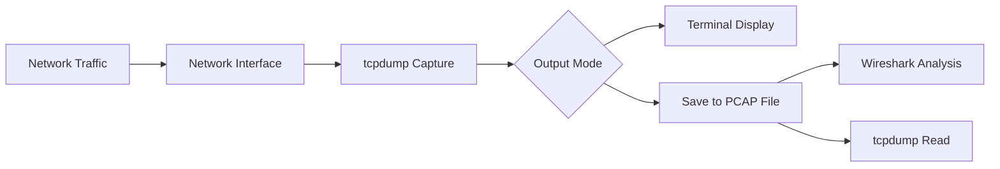
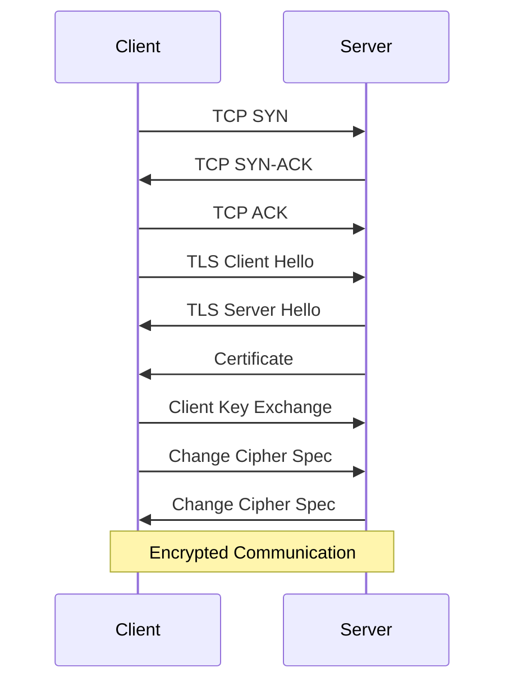
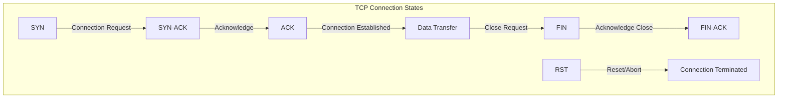

# How to Handle Network Troubleshooting with tcpdump

Author: [nawazdhandala](https://www.github.com/nawazdhandala)

Tags: Linux, Networking, tcpdump, Packet Analysis, Troubleshooting, System Administration, Security

Description: Master tcpdump for capturing and analyzing network traffic to diagnose connectivity issues, performance problems, and security incidents.

---

tcpdump is the most powerful command-line packet analyzer available on Linux systems. It captures network packets in real-time, allowing you to see exactly what is happening on your network. This guide covers practical tcpdump usage for diagnosing real-world network problems.

## Understanding tcpdump Basics

tcpdump captures packets that pass through a network interface and displays them in a human-readable format or saves them for later analysis.



### Basic Syntax

```bash
tcpdump [options] [filter expression]
```

### Essential Options

| Option | Description |
|--------|-------------|
| `-i <interface>` | Capture on specific interface |
| `-n` | Do not resolve hostnames |
| `-nn` | Do not resolve hostnames or ports |
| `-v`, `-vv`, `-vvv` | Increase verbosity |
| `-c <count>` | Capture only N packets |
| `-w <file>` | Write to file |
| `-r <file>` | Read from file |
| `-A` | Print packet content in ASCII |
| `-X` | Print packet content in hex and ASCII |
| `-s <size>` | Snapshot length (0 = full packet) |

## Getting Started

### List Available Interfaces

```bash
# Show all interfaces
tcpdump -D

# Common output:
# 1.eth0 [Up, Running]
# 2.lo [Up, Running, Loopback]
# 3.any (Pseudo-device that captures all interfaces)
```

### Basic Capture

```bash
# Capture all traffic on eth0 (requires root)
sudo tcpdump -i eth0

# Capture with no name resolution (faster)
sudo tcpdump -i eth0 -nn

# Capture first 100 packets
sudo tcpdump -i eth0 -c 100

# Capture on all interfaces
sudo tcpdump -i any
```

## Filtering Traffic

### Filter by Host

```bash
# Traffic to or from a specific host
sudo tcpdump -i eth0 host 192.168.1.100

# Traffic from a specific source
sudo tcpdump -i eth0 src host 192.168.1.100

# Traffic to a specific destination
sudo tcpdump -i eth0 dst host 192.168.1.100

# Traffic between two hosts
sudo tcpdump -i eth0 host 192.168.1.100 and host 192.168.1.200
```

### Filter by Network

```bash
# Traffic to or from a subnet
sudo tcpdump -i eth0 net 192.168.1.0/24

# Traffic from a source network
sudo tcpdump -i eth0 src net 10.0.0.0/8

# Exclude a network
sudo tcpdump -i eth0 not net 192.168.1.0/24
```

### Filter by Port

```bash
# Traffic on specific port
sudo tcpdump -i eth0 port 80

# Traffic on source port
sudo tcpdump -i eth0 src port 443

# Traffic on destination port
sudo tcpdump -i eth0 dst port 22

# Traffic on port range
sudo tcpdump -i eth0 portrange 8000-9000

# Multiple ports
sudo tcpdump -i eth0 port 80 or port 443
```

### Filter by Protocol

```bash
# TCP traffic only
sudo tcpdump -i eth0 tcp

# UDP traffic only
sudo tcpdump -i eth0 udp

# ICMP traffic only
sudo tcpdump -i eth0 icmp

# ARP traffic
sudo tcpdump -i eth0 arp

# IPv6 traffic
sudo tcpdump -i eth0 ip6
```

## Common Troubleshooting Scenarios

### Debugging HTTP Traffic

```bash
# Capture HTTP requests and responses
sudo tcpdump -i eth0 -nn -A -s 0 'tcp port 80'

# Capture HTTP GET requests
sudo tcpdump -i eth0 -nn -A -s 0 'tcp port 80 and (((ip[2:2] - ((ip[0]&0xf)<<2)) - ((tcp[12]&0xf0)>>2)) != 0)'

# Capture specific HTTP host
sudo tcpdump -i eth0 -nn -A -s 0 'tcp port 80' | grep -i 'host:'
```

### Debugging HTTPS/TLS Issues

```bash
# Capture TLS handshake packets
sudo tcpdump -i eth0 -nn 'tcp port 443 and (tcp[((tcp[12:1] & 0xf0) >> 2):1] = 0x16)'

# Watch TLS connection establishment
sudo tcpdump -i eth0 -nn 'tcp port 443' -c 50
```



### Debugging DNS Issues

```bash
# Capture all DNS traffic
sudo tcpdump -i eth0 -nn port 53

# Capture DNS queries with details
sudo tcpdump -i eth0 -nn -vvv port 53

# Capture DNS queries to specific server
sudo tcpdump -i eth0 -nn dst host 8.8.8.8 and port 53

# Save DNS traffic for analysis
sudo tcpdump -i eth0 -nn -w dns-capture.pcap port 53
```

### Debugging SSH Connections

```bash
# Capture SSH traffic
sudo tcpdump -i eth0 -nn port 22

# Watch SSH connection establishment
sudo tcpdump -i eth0 -nn 'tcp port 22 and (tcp-syn|tcp-ack) != 0'

# Debug SSH connection to specific host
sudo tcpdump -i eth0 -nn host 192.168.1.100 and port 22 -c 100
```

### Debugging Database Connections

```bash
# MySQL traffic (port 3306)
sudo tcpdump -i eth0 -nn port 3306

# PostgreSQL traffic (port 5432)
sudo tcpdump -i eth0 -nn port 5432

# Redis traffic (port 6379)
sudo tcpdump -i eth0 -nn port 6379

# MongoDB traffic (port 27017)
sudo tcpdump -i eth0 -nn port 27017
```

### Debugging SMTP/Email Issues

```bash
# Capture SMTP traffic
sudo tcpdump -i eth0 -nn -A port 25

# Capture SMTP with TLS
sudo tcpdump -i eth0 -nn port 587 or port 465

# Watch email sending
sudo tcpdump -i eth0 -nn -A 'tcp port 25' | grep -E 'MAIL FROM|RCPT TO|DATA'
```

## Advanced Filtering

### TCP Flags

```bash
# Capture SYN packets (connection initiations)
sudo tcpdump -i eth0 'tcp[tcpflags] & tcp-syn != 0'

# Capture SYN-ACK packets
sudo tcpdump -i eth0 'tcp[tcpflags] & (tcp-syn|tcp-ack) == (tcp-syn|tcp-ack)'

# Capture RST packets (connection resets)
sudo tcpdump -i eth0 'tcp[tcpflags] & tcp-rst != 0'

# Capture FIN packets (connection terminations)
sudo tcpdump -i eth0 'tcp[tcpflags] & tcp-fin != 0'

# Capture packets with only SYN flag (no ACK) - useful for SYN flood detection
sudo tcpdump -i eth0 'tcp[tcpflags] == tcp-syn'
```



### Packet Size Filters

```bash
# Capture large packets (possible MTU issues)
sudo tcpdump -i eth0 'greater 1000'

# Capture small packets
sudo tcpdump -i eth0 'less 100'

# Capture packets of specific length
sudo tcpdump -i eth0 'len == 64'
```

### Complex Filters

```bash
# HTTP traffic excluding localhost
sudo tcpdump -i eth0 'tcp port 80 and not host 127.0.0.1'

# All traffic except SSH and DNS
sudo tcpdump -i eth0 'not port 22 and not port 53'

# ICMP echo request (ping)
sudo tcpdump -i eth0 'icmp[icmptype] == icmp-echo'

# ICMP echo reply
sudo tcpdump -i eth0 'icmp[icmptype] == icmp-echoreply'
```

## Saving and Analyzing Captures

### Save to File

```bash
# Save capture to PCAP file
sudo tcpdump -i eth0 -w capture.pcap

# Save with packet limit
sudo tcpdump -i eth0 -c 10000 -w capture.pcap

# Save with time limit (run for 60 seconds)
timeout 60 sudo tcpdump -i eth0 -w capture.pcap

# Rotate capture files (100MB each, keep 10 files)
sudo tcpdump -i eth0 -w capture-%Y%m%d-%H%M%S.pcap -G 3600 -W 10

# Save only specific traffic
sudo tcpdump -i eth0 -w http-traffic.pcap 'tcp port 80 or tcp port 443'
```

### Read from File

```bash
# Read and display capture
sudo tcpdump -r capture.pcap

# Read with filters
sudo tcpdump -r capture.pcap host 192.168.1.100

# Read and convert to text
sudo tcpdump -r capture.pcap -nn -A > traffic.txt

# Count packets by type
sudo tcpdump -r capture.pcap -nn | awk '{print $3}' | sort | uniq -c | sort -rn
```

### Analyze Capture Statistics

```bash
# Quick packet count by source IP
sudo tcpdump -r capture.pcap -nn | \
    awk '{print $3}' | \
    cut -d. -f1-4 | \
    sort | uniq -c | sort -rn | head -20

# Count connections by port
sudo tcpdump -r capture.pcap -nn 'tcp' | \
    awk '{print $5}' | \
    grep -oE '\.[0-9]+$' | \
    sort | uniq -c | sort -rn | head -20
```

## Performance Monitoring

### Bandwidth Estimation

```bash
# Capture for analysis
sudo tcpdump -i eth0 -nn -c 1000 -w bandwidth-test.pcap

# Quick bandwidth check (packets per second)
sudo tcpdump -i eth0 -nn -c 1000 2>&1 | tail -1
```

### Connection Analysis

```bash
# Watch new connections being established
sudo tcpdump -i eth0 -nn 'tcp[tcpflags] == tcp-syn'

# Count active connections to a port
sudo tcpdump -i eth0 -nn 'tcp port 443 and tcp-syn' -c 100 2>&1 | \
    grep "packets captured"
```

## Security Monitoring

### Detect Suspicious Activity

```bash
# Detect potential port scanning
sudo tcpdump -i eth0 -nn 'tcp[tcpflags] == tcp-syn' | \
    awk '{print $3}' | sort | uniq -c | sort -rn

# Watch for unusual ICMP traffic
sudo tcpdump -i eth0 -nn 'icmp' -c 100

# Detect potential ARP spoofing
sudo tcpdump -i eth0 -nn 'arp' | grep -i reply
```

### Monitor for Data Exfiltration

```bash
# Watch large outbound transfers
sudo tcpdump -i eth0 -nn 'src net 192.168.1.0/24 and greater 1000'

# Monitor DNS tunneling attempts (large DNS packets)
sudo tcpdump -i eth0 -nn 'udp port 53 and greater 512'
```

## Practical Troubleshooting Scripts

### Connection Tester

```bash
#!/bin/bash
# /usr/local/bin/test-connection.sh
# Test connectivity to a host and capture packets

TARGET_HOST="$1"
TARGET_PORT="${2:-80}"
DURATION="${3:-10}"

if [ -z "$TARGET_HOST" ]; then
    echo "Usage: $0 <host> [port] [duration]"
    exit 1
fi

echo "Testing connection to $TARGET_HOST:$TARGET_PORT for $DURATION seconds"
echo "Starting packet capture..."

# Start tcpdump in background
sudo tcpdump -i any -nn host "$TARGET_HOST" and port "$TARGET_PORT" \
    -w "/tmp/conn-test-$(date +%Y%m%d-%H%M%S).pcap" &
TCPDUMP_PID=$!

# Wait a moment for tcpdump to start
sleep 1

# Attempt connection
echo "Attempting connection..."
timeout "$DURATION" bash -c "while true; do
    nc -zv $TARGET_HOST $TARGET_PORT 2>&1
    sleep 1
done"

# Stop tcpdump
sudo kill $TCPDUMP_PID 2>/dev/null

echo "Capture saved. Results:"
sudo tcpdump -r "/tmp/conn-test-*.pcap" -nn 2>/dev/null | tail -20
```

### Traffic Monitor

```bash
#!/bin/bash
# /usr/local/bin/traffic-monitor.sh
# Monitor traffic patterns on an interface

INTERFACE="${1:-eth0}"
DURATION="${2:-60}"

echo "Monitoring traffic on $INTERFACE for $DURATION seconds..."

# Capture traffic
timeout "$DURATION" sudo tcpdump -i "$INTERFACE" -nn -c 10000 2>/dev/null | \
    awk '{
        # Extract protocol
        if ($0 ~ /ICMP/) proto="ICMP"
        else if ($0 ~ /UDP/) proto="UDP"
        else proto="TCP"

        # Count protocols
        count[proto]++
    }
    END {
        print "\nTraffic Summary:"
        for (p in count) {
            printf "  %s: %d packets\n", p, count[p]
        }
    }'
```

## tcpdump Output Format

### Understanding the Output

```text
10:15:32.123456 IP 192.168.1.100.45678 > 93.184.216.34.80: Flags [S], seq 12345, win 65535, length 0
```

| Field | Meaning |
|-------|---------|
| `10:15:32.123456` | Timestamp |
| `IP` | Protocol (IP, IP6, ARP) |
| `192.168.1.100.45678` | Source IP and port |
| `>` | Direction |
| `93.184.216.34.80` | Destination IP and port |
| `Flags [S]` | TCP flags (S=SYN, .=ACK, F=FIN, R=RST, P=PUSH) |
| `seq 12345` | Sequence number |
| `win 65535` | Window size |
| `length 0` | Payload length |

### TCP Flags Reference

| Flag | Symbol | Meaning |
|------|--------|---------|
| SYN | S | Synchronize - start connection |
| ACK | . | Acknowledge |
| FIN | F | Finish - end connection |
| RST | R | Reset - abort connection |
| PSH | P | Push - send data immediately |
| URG | U | Urgent data |

## Quick Reference

```bash
# Most common commands for troubleshooting

# See all traffic on interface
sudo tcpdump -i eth0 -nn

# Capture HTTP traffic
sudo tcpdump -i eth0 -nn port 80 -A

# Debug connection to specific host
sudo tcpdump -i eth0 -nn host 192.168.1.100

# Watch DNS queries
sudo tcpdump -i eth0 -nn port 53

# Capture to file for Wireshark
sudo tcpdump -i eth0 -s 0 -w capture.pcap

# Read capture file
sudo tcpdump -r capture.pcap -nn

# Count packets by source
sudo tcpdump -i eth0 -nn -c 1000 | awk '{print $3}' | sort | uniq -c

# Watch for SYN floods
sudo tcpdump -i eth0 -nn 'tcp[tcpflags] == tcp-syn'
```

## Troubleshooting Checklist

1. **Start simple**: Begin with basic captures, then add filters
2. **Use -nn**: Disable name resolution for faster captures
3. **Limit captures**: Use `-c` to limit packet count
4. **Save to file**: Use `-w` for complex analysis
5. **Filter early**: Apply filters to reduce noise
6. **Check permissions**: tcpdump requires root access
7. **Monitor resources**: Large captures can fill disk space

---

tcpdump is an essential tool for any system administrator. While Wireshark provides a graphical interface for analysis, tcpdump allows you to capture and analyze traffic directly on servers without a GUI. Master these commands, and you will be able to diagnose network issues quickly and effectively.
