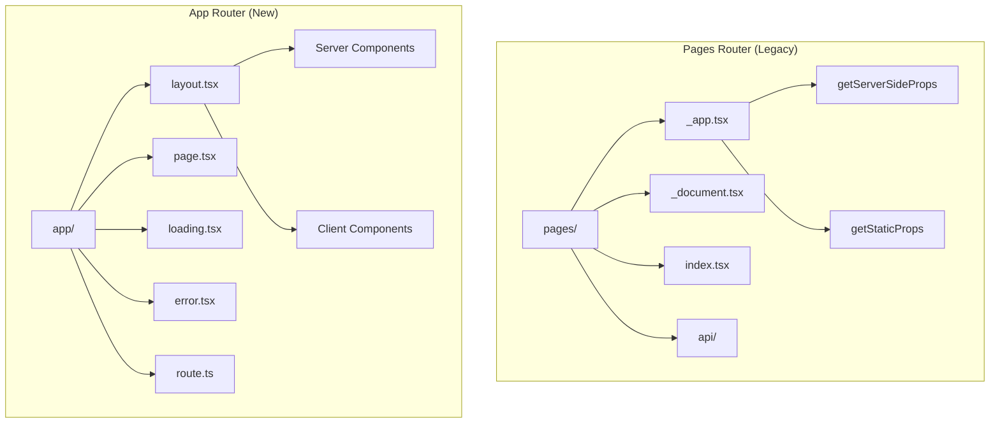
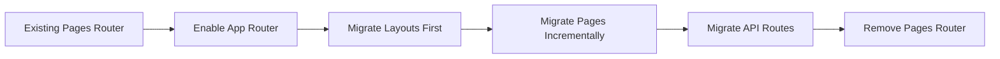
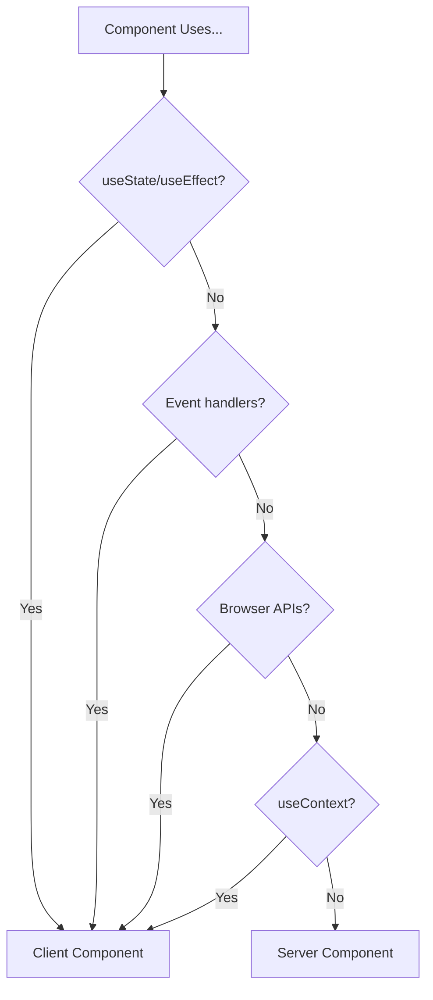

# How to Handle App Router Migration in Next.js 13

Author: [nawazdhandala](https://www.github.com/nawazdhandala)

Tags: Next.js, App Router, Migration, React Server Components, Pages Router, Routing, TypeScript

Description: A comprehensive guide to migrating from Next.js Pages Router to App Router, covering routing changes, data fetching patterns, and common migration pitfalls.

---

> The Next.js App Router represents a fundamental shift in how Next.js applications handle routing, data fetching, and rendering. This guide provides a step-by-step approach to migrating from the Pages Router while maintaining application stability.

Next.js 13 introduced the App Router with React Server Components, bringing significant improvements in performance and developer experience. However, migration requires careful planning and understanding of the new paradigms.

---

## Understanding the Architecture Differences

Before migrating, understand the key differences between the two routers.



### Key Differences

| Feature | Pages Router | App Router |
|---------|--------------|------------|
| File location | `pages/` | `app/` |
| Layout system | `_app.tsx` | `layout.tsx` (nested) |
| Data fetching | `getServerSideProps` | async Server Components |
| API routes | `pages/api/` | `app/*/route.ts` |
| Default rendering | Client Components | Server Components |
| Streaming | Not supported | Built-in support |

---

## Migration Strategy Overview

The recommended approach is incremental migration, allowing both routers to coexist.



---

## Step 1: Enable the App Router

Start by creating the app directory alongside your existing pages directory.

```typescript
// next.config.js
// Both routers can coexist during migration

/** @type {import('next').NextConfig} */
const nextConfig = {
  // App Router is enabled by default in Next.js 13.4+
  // No special configuration needed

  // Optional: Configure experimental features
  experimental: {
    // Enable if using Server Actions
    serverActions: true,
  },
};

module.exports = nextConfig;
```

Create the basic app directory structure.

```bash
# Create the app directory
mkdir app

# Create essential files
touch app/layout.tsx
touch app/page.tsx
```

---

## Step 2: Migrate the Root Layout

Replace `_app.tsx` and `_document.tsx` with a root layout.

### Before: Pages Router

```typescript
// pages/_app.tsx (OLD)
import type { AppProps } from "next/app";
import { ThemeProvider } from "../contexts/theme";
import "../styles/globals.css";

export default function MyApp({ Component, pageProps }: AppProps) {
  return (
    <ThemeProvider>
      <Component {...pageProps} />
    </ThemeProvider>
  );
}

// pages/_document.tsx (OLD)
import { Html, Head, Main, NextScript } from "next/document";

export default function Document() {
  return (
    <Html lang="en">
      <Head>
        <link rel="icon" href="/favicon.ico" />
      </Head>
      <body>
        <Main />
        <NextScript />
      </body>
    </Html>
  );
}
```

### After: App Router

```typescript
// app/layout.tsx (NEW)
// Root layout replaces both _app.tsx and _document.tsx

import { Metadata } from "next";
import { ThemeProvider } from "@/contexts/theme";
import "@/styles/globals.css";

// Metadata replaces Head component
export const metadata: Metadata = {
  title: {
    default: "My App",
    template: "%s | My App",
  },
  description: "Welcome to my application",
  icons: {
    icon: "/favicon.ico",
  },
};

// Root layout must include html and body tags
export default function RootLayout({
  children,
}: {
  children: React.ReactNode;
}) {
  return (
    <html lang="en">
      <body>
        {/* Providers that need client-side state */}
        <ThemeProvider>{children}</ThemeProvider>
      </body>
    </html>
  );
}
```

### Converting Context Providers

Providers using React state must be Client Components.

```typescript
// contexts/theme.tsx
// Mark as Client Component since it uses React state

"use client";

import { createContext, useContext, useState, ReactNode } from "react";

type Theme = "light" | "dark";

interface ThemeContextType {
  theme: Theme;
  toggleTheme: () => void;
}

const ThemeContext = createContext<ThemeContextType | undefined>(undefined);

export function ThemeProvider({ children }: { children: ReactNode }) {
  const [theme, setTheme] = useState<Theme>("light");

  const toggleTheme = () => {
    setTheme((prev) => (prev === "light" ? "dark" : "light"));
  };

  return (
    <ThemeContext.Provider value={{ theme, toggleTheme }}>
      <div data-theme={theme}>{children}</div>
    </ThemeContext.Provider>
  );
}

export function useTheme() {
  const context = useContext(ThemeContext);
  if (!context) {
    throw new Error("useTheme must be used within ThemeProvider");
  }
  return context;
}
```

---

## Step 3: Migrate Data Fetching

The most significant change is how data fetching works.

### Before: Pages Router with getServerSideProps

```typescript
// pages/posts/[id].tsx (OLD)
import { GetServerSideProps } from "next";

interface Post {
  id: string;
  title: string;
  content: string;
}

interface PostPageProps {
  post: Post;
}

// Data fetching happens in getServerSideProps
export const getServerSideProps: GetServerSideProps<PostPageProps> = async (
  context
) => {
  const { id } = context.params!;

  const res = await fetch(`https://api.example.com/posts/${id}`);
  const post = await res.json();

  if (!post) {
    return { notFound: true };
  }

  return {
    props: { post },
  };
};

export default function PostPage({ post }: PostPageProps) {
  return (
    <article>
      <h1>{post.title}</h1>
      <div>{post.content}</div>
    </article>
  );
}
```

### After: App Router with Server Components

```typescript
// app/posts/[id]/page.tsx (NEW)
// Server Components can fetch data directly

import { notFound } from "next/navigation";
import { Metadata } from "next";

interface Post {
  id: string;
  title: string;
  content: string;
}

// Type for page params
interface PostPageProps {
  params: Promise<{ id: string }>;
}

// Fetch function with caching
async function getPost(id: string): Promise<Post | null> {
  const res = await fetch(`https://api.example.com/posts/${id}`, {
    // Configure caching behavior
    next: {
      revalidate: 3600, // Revalidate every hour
      tags: [`post-${id}`], // Tag for on-demand revalidation
    },
  });

  if (!res.ok) return null;
  return res.json();
}

// Generate metadata dynamically
export async function generateMetadata({
  params,
}: PostPageProps): Promise<Metadata> {
  const { id } = await params;
  const post = await getPost(id);

  if (!post) {
    return { title: "Post Not Found" };
  }

  return {
    title: post.title,
    description: post.content.substring(0, 160),
  };
}

// Page component fetches data directly
export default async function PostPage({ params }: PostPageProps) {
  const { id } = await params;
  const post = await getPost(id);

  if (!post) {
    notFound();
  }

  return (
    <article>
      <h1>{post.title}</h1>
      <div>{post.content}</div>
    </article>
  );
}
```

---

## Step 4: Migrate getStaticProps and getStaticPaths

Static generation patterns also change significantly.

### Before: Pages Router Static Generation

```typescript
// pages/blog/[slug].tsx (OLD)
import { GetStaticProps, GetStaticPaths } from "next";

export const getStaticPaths: GetStaticPaths = async () => {
  const posts = await getAllPosts();

  return {
    paths: posts.map((post) => ({
      params: { slug: post.slug },
    })),
    fallback: "blocking",
  };
};

export const getStaticProps: GetStaticProps = async ({ params }) => {
  const post = await getPostBySlug(params?.slug as string);

  if (!post) {
    return { notFound: true };
  }

  return {
    props: { post },
    revalidate: 60,
  };
};
```

### After: App Router Static Generation

```typescript
// app/blog/[slug]/page.tsx (NEW)
// Static generation with generateStaticParams

import { notFound } from "next/navigation";

interface BlogPageProps {
  params: Promise<{ slug: string }>;
}

// Replace getStaticPaths with generateStaticParams
export async function generateStaticParams() {
  const posts = await getAllPosts();

  return posts.map((post) => ({
    slug: post.slug,
  }));
}

// Control dynamic behavior
export const dynamicParams = true; // Allow params not in generateStaticParams
export const revalidate = 60; // Revalidate every 60 seconds

// Fetch and render in the same component
export default async function BlogPage({ params }: BlogPageProps) {
  const { slug } = await params;
  const post = await getPostBySlug(slug);

  if (!post) {
    notFound();
  }

  return (
    <article>
      <h1>{post.title}</h1>
      <div dangerouslySetInnerHTML={{ __html: post.content }} />
    </article>
  );
}
```

---

## Step 5: Migrate API Routes

API routes move from `pages/api` to `app/*/route.ts`.

### Before: Pages Router API

```typescript
// pages/api/posts/[id].ts (OLD)
import type { NextApiRequest, NextApiResponse } from "next";

export default async function handler(
  req: NextApiRequest,
  res: NextApiResponse
) {
  const { id } = req.query;

  if (req.method === "GET") {
    const post = await getPost(id as string);
    if (!post) {
      return res.status(404).json({ error: "Not found" });
    }
    return res.status(200).json(post);
  }

  if (req.method === "PUT") {
    const updated = await updatePost(id as string, req.body);
    return res.status(200).json(updated);
  }

  if (req.method === "DELETE") {
    await deletePost(id as string);
    return res.status(204).end();
  }

  res.setHeader("Allow", ["GET", "PUT", "DELETE"]);
  res.status(405).end(`Method ${req.method} Not Allowed`);
}
```

### After: App Router Route Handlers

```typescript
// app/api/posts/[id]/route.ts (NEW)
// Route handlers use Web API Request/Response

import { NextRequest, NextResponse } from "next/server";

interface RouteParams {
  params: Promise<{ id: string }>;
}

// GET handler
export async function GET(request: NextRequest, { params }: RouteParams) {
  const { id } = await params;
  const post = await getPost(id);

  if (!post) {
    return NextResponse.json(
      { error: "Post not found" },
      { status: 404 }
    );
  }

  return NextResponse.json(post);
}

// PUT handler
export async function PUT(request: NextRequest, { params }: RouteParams) {
  const { id } = await params;
  const body = await request.json();

  const updated = await updatePost(id, body);

  return NextResponse.json(updated);
}

// DELETE handler
export async function DELETE(request: NextRequest, { params }: RouteParams) {
  const { id } = await params;
  await deletePost(id);

  return new NextResponse(null, { status: 204 });
}
```

---

## Step 6: Handle Client-Side Interactivity

Components using hooks or browser APIs must be Client Components.

### Identifying Client Components



### Converting Interactive Components

```typescript
// components/SearchBox.tsx
// Must be Client Component due to useState and onChange

"use client";

import { useState, useCallback } from "react";
import { useRouter } from "next/navigation";

export function SearchBox() {
  const [query, setQuery] = useState("");
  const router = useRouter();

  const handleSearch = useCallback(() => {
    if (query.trim()) {
      router.push(`/search?q=${encodeURIComponent(query)}`);
    }
  }, [query, router]);

  return (
    <div className="search-box">
      <input
        type="text"
        value={query}
        onChange={(e) => setQuery(e.target.value)}
        onKeyDown={(e) => e.key === "Enter" && handleSearch()}
        placeholder="Search..."
      />
      <button onClick={handleSearch}>Search</button>
    </div>
  );
}
```

### Composing Server and Client Components

```typescript
// app/products/page.tsx
// Server Component that includes Client Components

import { ProductList } from "@/components/ProductList";
import { SearchBox } from "@/components/SearchBox";
import { FilterPanel } from "@/components/FilterPanel";

// Server Component - can fetch data directly
export default async function ProductsPage() {
  // Fetch initial products on the server
  const products = await getProducts();

  return (
    <div className="products-page">
      <h1>Products</h1>

      {/* Client Components for interactivity */}
      <SearchBox />
      <FilterPanel categories={products.categories} />

      {/* Pass server-fetched data to Client Component */}
      <ProductList initialProducts={products.items} />
    </div>
  );
}

// components/ProductList.tsx
"use client";

import { useState } from "react";
import type { Product } from "@/types";

interface ProductListProps {
  initialProducts: Product[];
}

export function ProductList({ initialProducts }: ProductListProps) {
  const [products, setProducts] = useState(initialProducts);
  const [loading, setLoading] = useState(false);

  const loadMore = async () => {
    setLoading(true);
    const moreProducts = await fetch("/api/products?page=2").then((r) =>
      r.json()
    );
    setProducts((prev) => [...prev, ...moreProducts]);
    setLoading(false);
  };

  return (
    <div>
      <div className="product-grid">
        {products.map((product) => (
          <ProductCard key={product.id} product={product} />
        ))}
      </div>
      <button onClick={loadMore} disabled={loading}>
        {loading ? "Loading..." : "Load More"}
      </button>
    </div>
  );
}
```

---

## Step 7: Migrate Navigation

The router hooks change between Pages and App Router.

### Before: Pages Router Navigation

```typescript
// pages/products/[id].tsx (OLD)
import { useRouter } from "next/router";

export default function ProductPage() {
  const router = useRouter();
  const { id } = router.query;

  const handleBack = () => {
    router.back();
  };

  const handleNavigate = () => {
    router.push("/products");
  };

  return (
    <div>
      <button onClick={handleBack}>Go Back</button>
      <button onClick={handleNavigate}>All Products</button>
      <p>Product ID: {id}</p>
    </div>
  );
}
```

### After: App Router Navigation

```typescript
// app/products/[id]/page.tsx (NEW)
// Params come from props, not useRouter

import { BackButton } from "@/components/BackButton";
import { NavigateButton } from "@/components/NavigateButton";

interface ProductPageProps {
  params: Promise<{ id: string }>;
}

// Server Component for the page
export default async function ProductPage({ params }: ProductPageProps) {
  const { id } = await params;
  const product = await getProduct(id);

  return (
    <div>
      {/* Client Components for navigation */}
      <BackButton />
      <NavigateButton href="/products">All Products</NavigateButton>
      <h1>{product.name}</h1>
    </div>
  );
}

// components/BackButton.tsx
"use client";

import { useRouter } from "next/navigation"; // Note: next/navigation, not next/router

export function BackButton() {
  const router = useRouter();

  return <button onClick={() => router.back()}>Go Back</button>;
}

// components/NavigateButton.tsx
"use client";

import { useRouter } from "next/navigation";

interface NavigateButtonProps {
  href: string;
  children: React.ReactNode;
}

export function NavigateButton({ href, children }: NavigateButtonProps) {
  const router = useRouter();

  return <button onClick={() => router.push(href)}>{children}</button>;
}
```

---

## Common Migration Pitfalls

### Pitfall 1: Forgetting "use client" Directive

```typescript
// WRONG: Using hooks without "use client"
import { useState } from "react";

export function Counter() {
  const [count, setCount] = useState(0); // Error!
  return <button onClick={() => setCount(count + 1)}>{count}</button>;
}

// CORRECT: Add "use client" at the top
"use client";

import { useState } from "react";

export function Counter() {
  const [count, setCount] = useState(0);
  return <button onClick={() => setCount(count + 1)}>{count}</button>;
}
```

### Pitfall 2: Incorrect Import Paths

```typescript
// WRONG: Using old router import in App Router
import { useRouter } from "next/router"; // Wrong import!

// CORRECT: Use next/navigation for App Router
import { useRouter, usePathname, useSearchParams } from "next/navigation";
```

### Pitfall 3: Mixing Async in Client Components

```typescript
// WRONG: Client Components cannot be async
"use client";

export async function UserProfile({ userId }) {
  // Error: Client Components cannot be async
  const user = await getUser(userId);
  return <div>{user.name}</div>;
}

// CORRECT: Fetch in Server Component, pass to Client
// app/users/[id]/page.tsx (Server Component)
export default async function UserPage({ params }) {
  const { id } = await params;
  const user = await getUser(id);
  return <UserProfile user={user} />;
}

// components/UserProfile.tsx (Client Component)
"use client";

export function UserProfile({ user }) {
  return <div>{user.name}</div>;
}
```

---

## Migration Checklist

Use this checklist to track your migration progress.

```mermaid
flowchart TD
    A[Migration Checklist] --> B[Setup]
    A --> C[Layouts]
    A --> D[Pages]
    A --> E[Data Fetching]
    A --> F[API Routes]
    A --> G[Cleanup]

    B --> B1[Create app directory]
    B --> B2[Update next.config.js]

    C --> C1[Migrate _app.tsx to layout.tsx]
    C --> C2[Migrate _document.tsx]
    C --> C3[Convert providers to Client Components]

    D --> D1[Migrate page files]
    D --> D2[Update routing patterns]
    D --> D3[Add loading.tsx files]
    D --> D4[Add error.tsx files]

    E --> E1[Replace getServerSideProps]
    E --> E2[Replace getStaticProps]
    E --> E3[Replace getStaticPaths]

    F --> F1[Convert API routes to route handlers]
    F --> F2[Update request/response handling]

    G --> G1[Remove pages directory]
    G --> G2[Update all imports]
    G --> G3[Test thoroughly]
```



---

## Conclusion

Migrating from Pages Router to App Router is a significant undertaking, but the benefits of Server Components, improved layouts, and better data fetching patterns make it worthwhile. The key is to migrate incrementally, allowing both routers to coexist while you transition.

Key takeaways:

- Both routers can coexist during migration
- Layouts replace `_app.tsx` and `_document.tsx`
- Server Components are the default; use "use client" for interactivity
- Data fetching happens directly in Server Components
- API routes become Route Handlers with Web API patterns
- Import navigation hooks from `next/navigation`, not `next/router`

Take your time with the migration, test thoroughly, and leverage the incremental approach to minimize risk.

---

*Monitor your Next.js application performance during and after migration with [OneUptime](https://oneuptime.com). Track response times, error rates, and user experience metrics to ensure a smooth transition.*
