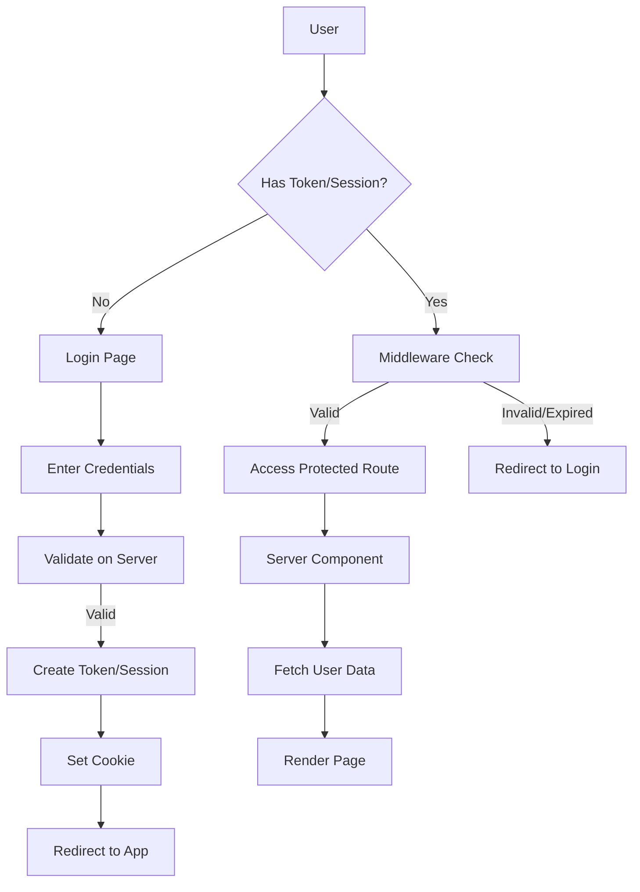
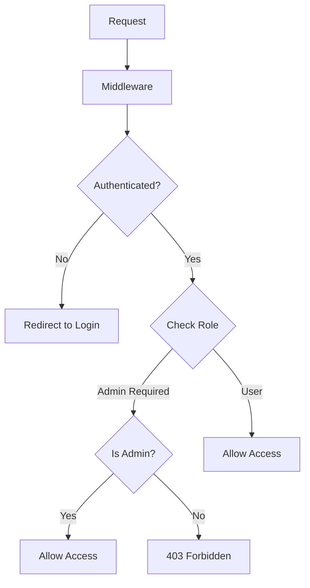

# How to Handle Authentication in Next.js

Author: [nawazdhandala](https://www.github.com/nawazdhandala)

Tags: Next.js, Authentication, Security, JWT, Sessions, NextAuth.js, Web Development

Description: Learn how to implement authentication in Next.js using various approaches including JWT, sessions, NextAuth.js, and custom solutions.

---

Authentication is a critical aspect of web applications. Next.js supports multiple authentication strategies including JWT tokens, session-based auth, and third-party providers. This guide covers practical implementations for both the App Router and Pages Router.

## Authentication Flow Overview



## JWT Authentication

### Setup JWT Utilities

```typescript
// lib/auth.ts
import { SignJWT, jwtVerify } from 'jose';
import { cookies } from 'next/headers';

const JWT_SECRET = new TextEncoder().encode(
  process.env.JWT_SECRET || 'your-secret-key-min-32-chars-long!'
);

const COOKIE_NAME = 'auth-token';

export interface UserPayload {
  id: string;
  email: string;
  name: string;
  role: 'user' | 'admin';
}

export interface TokenPayload extends UserPayload {
  iat: number;
  exp: number;
}

/**
 * Create a signed JWT token
 */
export async function createToken(user: UserPayload): Promise<string> {
  return new SignJWT({ ...user })
    .setProtectedHeader({ alg: 'HS256' })
    .setIssuedAt()
    .setExpirationTime('7d')
    .sign(JWT_SECRET);
}

/**
 * Verify and decode a JWT token
 */
export async function verifyToken(token: string): Promise<TokenPayload | null> {
  try {
    const { payload } = await jwtVerify(token, JWT_SECRET);
    return payload as unknown as TokenPayload;
  } catch (error) {
    return null;
  }
}

/**
 * Get current user from cookies (Server Component)
 */
export async function getCurrentUser(): Promise<UserPayload | null> {
  const cookieStore = await cookies();
  const token = cookieStore.get(COOKIE_NAME)?.value;

  if (!token) return null;

  const payload = await verifyToken(token);
  if (!payload) return null;

  return {
    id: payload.id,
    email: payload.email,
    name: payload.name,
    role: payload.role,
  };
}

/**
 * Set auth cookie
 */
export async function setAuthCookie(token: string): Promise<void> {
  const cookieStore = await cookies();
  cookieStore.set(COOKIE_NAME, token, {
    httpOnly: true,
    secure: process.env.NODE_ENV === 'production',
    sameSite: 'lax',
    maxAge: 60 * 60 * 24 * 7, // 7 days
    path: '/',
  });
}

/**
 * Remove auth cookie
 */
export async function removeAuthCookie(): Promise<void> {
  const cookieStore = await cookies();
  cookieStore.delete(COOKIE_NAME);
}
```

### Login API Route

```typescript
// app/api/auth/login/route.ts
import { NextRequest, NextResponse } from 'next/server';
import { createToken, setAuthCookie } from '@/lib/auth';
import bcrypt from 'bcryptjs';

// Mock user database - replace with your database
async function findUserByEmail(email: string) {
  // In production, query your database
  const users = [
    {
      id: '1',
      email: 'user@example.com',
      name: 'John Doe',
      role: 'user' as const,
      passwordHash: await bcrypt.hash('password123', 10),
    },
  ];
  return users.find((u) => u.email === email);
}

export async function POST(request: NextRequest) {
  try {
    const { email, password } = await request.json();

    // Validate input
    if (!email || !password) {
      return NextResponse.json(
        { error: 'Email and password are required' },
        { status: 400 }
      );
    }

    // Find user
    const user = await findUserByEmail(email);
    if (!user) {
      return NextResponse.json(
        { error: 'Invalid credentials' },
        { status: 401 }
      );
    }

    // Verify password
    const isValid = await bcrypt.compare(password, user.passwordHash);
    if (!isValid) {
      return NextResponse.json(
        { error: 'Invalid credentials' },
        { status: 401 }
      );
    }

    // Create token
    const token = await createToken({
      id: user.id,
      email: user.email,
      name: user.name,
      role: user.role,
    });

    // Set cookie
    await setAuthCookie(token);

    return NextResponse.json({
      user: {
        id: user.id,
        email: user.email,
        name: user.name,
        role: user.role,
      },
    });
  } catch (error) {
    console.error('Login error:', error);
    return NextResponse.json(
      { error: 'Internal server error' },
      { status: 500 }
    );
  }
}
```

### Logout API Route

```typescript
// app/api/auth/logout/route.ts
import { NextResponse } from 'next/server';
import { removeAuthCookie } from '@/lib/auth';

export async function POST() {
  await removeAuthCookie();
  return NextResponse.json({ success: true });
}
```

### Protected Server Component

```typescript
// app/dashboard/page.tsx
import { getCurrentUser } from '@/lib/auth';
import { redirect } from 'next/navigation';

export default async function DashboardPage() {
  const user = await getCurrentUser();

  if (!user) {
    redirect('/login');
  }

  return (
    <div>
      <h1>Dashboard</h1>
      <p>Welcome, {user.name}!</p>
      <p>Email: {user.email}</p>
      <p>Role: {user.role}</p>
    </div>
  );
}
```

### Auth Middleware

```typescript
// middleware.ts
import { NextResponse } from 'next/server';
import type { NextRequest } from 'next/server';
import { jwtVerify } from 'jose';

const JWT_SECRET = new TextEncoder().encode(
  process.env.JWT_SECRET || 'your-secret-key-min-32-chars-long!'
);

const protectedRoutes = ['/dashboard', '/settings', '/profile'];
const authRoutes = ['/login', '/register'];

export async function middleware(request: NextRequest) {
  const { pathname } = request.nextUrl;
  const token = request.cookies.get('auth-token')?.value;

  // Check if route is protected
  const isProtected = protectedRoutes.some(
    (route) => pathname === route || pathname.startsWith(`${route}/`)
  );

  // Check if route is an auth page
  const isAuthRoute = authRoutes.some((route) => pathname.startsWith(route));

  // Verify token
  let isValidToken = false;
  if (token) {
    try {
      await jwtVerify(token, JWT_SECRET);
      isValidToken = true;
    } catch {
      isValidToken = false;
    }
  }

  // Redirect logic
  if (isProtected && !isValidToken) {
    const loginUrl = new URL('/login', request.url);
    loginUrl.searchParams.set('returnTo', pathname);
    return NextResponse.redirect(loginUrl);
  }

  if (isAuthRoute && isValidToken) {
    return NextResponse.redirect(new URL('/dashboard', request.url));
  }

  return NextResponse.next();
}

export const config = {
  matcher: ['/dashboard/:path*', '/settings/:path*', '/profile/:path*', '/login', '/register'],
};
```

## NextAuth.js Integration

### Installation and Setup

```bash
npm install next-auth
```

```typescript
// app/api/auth/[...nextauth]/route.ts
import NextAuth from 'next-auth';
import CredentialsProvider from 'next-auth/providers/credentials';
import GoogleProvider from 'next-auth/providers/google';
import GitHubProvider from 'next-auth/providers/github';
import bcrypt from 'bcryptjs';

const handler = NextAuth({
  providers: [
    // Credentials provider
    CredentialsProvider({
      name: 'Credentials',
      credentials: {
        email: { label: 'Email', type: 'email' },
        password: { label: 'Password', type: 'password' },
      },
      async authorize(credentials) {
        if (!credentials?.email || !credentials?.password) {
          return null;
        }

        // Find user in database
        const user = await findUserByEmail(credentials.email);
        if (!user) return null;

        // Verify password
        const isValid = await bcrypt.compare(
          credentials.password,
          user.passwordHash
        );
        if (!isValid) return null;

        return {
          id: user.id,
          email: user.email,
          name: user.name,
          role: user.role,
        };
      },
    }),

    // Google OAuth
    GoogleProvider({
      clientId: process.env.GOOGLE_CLIENT_ID!,
      clientSecret: process.env.GOOGLE_CLIENT_SECRET!,
    }),

    // GitHub OAuth
    GitHubProvider({
      clientId: process.env.GITHUB_CLIENT_ID!,
      clientSecret: process.env.GITHUB_CLIENT_SECRET!,
    }),
  ],

  callbacks: {
    async jwt({ token, user }) {
      if (user) {
        token.role = user.role;
        token.id = user.id;
      }
      return token;
    },

    async session({ session, token }) {
      if (session.user) {
        session.user.role = token.role as string;
        session.user.id = token.id as string;
      }
      return session;
    },
  },

  pages: {
    signIn: '/login',
    error: '/auth/error',
  },

  session: {
    strategy: 'jwt',
    maxAge: 30 * 24 * 60 * 60, // 30 days
  },
});

export { handler as GET, handler as POST };
```

### NextAuth Type Extensions

```typescript
// types/next-auth.d.ts
import 'next-auth';

declare module 'next-auth' {
  interface User {
    id: string;
    role: string;
  }

  interface Session {
    user: {
      id: string;
      email: string;
      name: string;
      role: string;
    };
  }
}

declare module 'next-auth/jwt' {
  interface JWT {
    id: string;
    role: string;
  }
}
```

### Using NextAuth in Components

```typescript
// app/providers.tsx
'use client';

import { SessionProvider } from 'next-auth/react';

export function Providers({ children }: { children: React.ReactNode }) {
  return <SessionProvider>{children}</SessionProvider>;
}

// app/layout.tsx
import { Providers } from './providers';

export default function RootLayout({
  children,
}: {
  children: React.ReactNode;
}) {
  return (
    <html lang="en">
      <body>
        <Providers>{children}</Providers>
      </body>
    </html>
  );
}
```

### Client Component with NextAuth

```typescript
// components/UserMenu.tsx
'use client';

import { useSession, signIn, signOut } from 'next-auth/react';

export function UserMenu() {
  const { data: session, status } = useSession();

  if (status === 'loading') {
    return <div>Loading...</div>;
  }

  if (!session) {
    return (
      <div>
        <button onClick={() => signIn()}>Sign In</button>
      </div>
    );
  }

  return (
    <div>
      <p>Welcome, {session.user?.name}</p>
      <p>Role: {session.user?.role}</p>
      <button onClick={() => signOut()}>Sign Out</button>
    </div>
  );
}
```

### Server Component with NextAuth

```typescript
// app/dashboard/page.tsx
import { getServerSession } from 'next-auth';
import { redirect } from 'next/navigation';
import { authOptions } from '@/app/api/auth/[...nextauth]/route';

export default async function DashboardPage() {
  const session = await getServerSession(authOptions);

  if (!session) {
    redirect('/login');
  }

  return (
    <div>
      <h1>Dashboard</h1>
      <p>Welcome, {session.user?.name}!</p>
    </div>
  );
}
```

## Login Form Component

```typescript
// components/LoginForm.tsx
'use client';

import { useState } from 'react';
import { useRouter, useSearchParams } from 'next/navigation';

export function LoginForm() {
  const router = useRouter();
  const searchParams = useSearchParams();
  const returnTo = searchParams.get('returnTo') || '/dashboard';

  const [email, setEmail] = useState('');
  const [password, setPassword] = useState('');
  const [error, setError] = useState('');
  const [loading, setLoading] = useState(false);

  const handleSubmit = async (e: React.FormEvent) => {
    e.preventDefault();
    setError('');
    setLoading(true);

    try {
      const res = await fetch('/api/auth/login', {
        method: 'POST',
        headers: { 'Content-Type': 'application/json' },
        body: JSON.stringify({ email, password }),
      });

      const data = await res.json();

      if (!res.ok) {
        setError(data.error || 'Login failed');
        return;
      }

      // Redirect to return URL or dashboard
      router.push(returnTo);
      router.refresh();
    } catch (err) {
      setError('An error occurred. Please try again.');
    } finally {
      setLoading(false);
    }
  };

  return (
    <form onSubmit={handleSubmit}>
      {error && (
        <div style={{ color: 'red', marginBottom: '1rem' }}>{error}</div>
      )}

      <div>
        <label htmlFor="email">Email</label>
        <input
          id="email"
          type="email"
          value={email}
          onChange={(e) => setEmail(e.target.value)}
          required
          disabled={loading}
        />
      </div>

      <div>
        <label htmlFor="password">Password</label>
        <input
          id="password"
          type="password"
          value={password}
          onChange={(e) => setPassword(e.target.value)}
          required
          disabled={loading}
        />
      </div>

      <button type="submit" disabled={loading}>
        {loading ? 'Signing in...' : 'Sign In'}
      </button>
    </form>
  );
}
```

## Role-Based Access Control



### RBAC Middleware

```typescript
// middleware.ts
import { NextResponse } from 'next/server';
import type { NextRequest } from 'next/server';
import { jwtVerify } from 'jose';

const JWT_SECRET = new TextEncoder().encode(process.env.JWT_SECRET!);

// Route permissions
const routePermissions: Record<string, string[]> = {
  '/admin': ['admin'],
  '/dashboard': ['user', 'admin'],
  '/settings': ['user', 'admin'],
  '/reports': ['admin', 'manager'],
};

export async function middleware(request: NextRequest) {
  const { pathname } = request.nextUrl;
  const token = request.cookies.get('auth-token')?.value;

  // Find matching route permission
  const matchedRoute = Object.keys(routePermissions).find(
    (route) => pathname === route || pathname.startsWith(`${route}/`)
  );

  if (!matchedRoute) {
    return NextResponse.next();
  }

  // Verify token
  if (!token) {
    return NextResponse.redirect(new URL('/login', request.url));
  }

  try {
    const { payload } = await jwtVerify(token, JWT_SECRET);
    const userRole = payload.role as string;

    const allowedRoles = routePermissions[matchedRoute];

    if (!allowedRoles.includes(userRole)) {
      return NextResponse.redirect(new URL('/unauthorized', request.url));
    }

    return NextResponse.next();
  } catch {
    return NextResponse.redirect(new URL('/login', request.url));
  }
}
```

### RBAC Higher-Order Component

```typescript
// components/withAuth.tsx
'use client';

import { useEffect } from 'react';
import { useRouter } from 'next/navigation';
import { useSession } from 'next-auth/react';

interface WithAuthOptions {
  requiredRole?: string | string[];
  redirectTo?: string;
}

export function withAuth<P extends object>(
  Component: React.ComponentType<P>,
  options: WithAuthOptions = {}
) {
  const { requiredRole, redirectTo = '/login' } = options;

  return function AuthenticatedComponent(props: P) {
    const { data: session, status } = useSession();
    const router = useRouter();

    useEffect(() => {
      if (status === 'loading') return;

      if (!session) {
        router.push(redirectTo);
        return;
      }

      if (requiredRole) {
        const roles = Array.isArray(requiredRole) ? requiredRole : [requiredRole];
        if (!roles.includes(session.user?.role)) {
          router.push('/unauthorized');
        }
      }
    }, [session, status, router]);

    if (status === 'loading') {
      return <div>Loading...</div>;
    }

    if (!session) {
      return null;
    }

    return <Component {...props} />;
  };
}

// Usage
const AdminDashboard = withAuth(
  function Dashboard() {
    return <div>Admin Dashboard</div>;
  },
  { requiredRole: 'admin' }
);
```

## Session Management

### Refresh Token Pattern

```typescript
// lib/tokens.ts
import { SignJWT, jwtVerify } from 'jose';

const ACCESS_SECRET = new TextEncoder().encode(process.env.ACCESS_TOKEN_SECRET!);
const REFRESH_SECRET = new TextEncoder().encode(process.env.REFRESH_TOKEN_SECRET!);

export async function createTokenPair(user: UserPayload) {
  const accessToken = await new SignJWT({ ...user })
    .setProtectedHeader({ alg: 'HS256' })
    .setExpirationTime('15m')
    .sign(ACCESS_SECRET);

  const refreshToken = await new SignJWT({ id: user.id })
    .setProtectedHeader({ alg: 'HS256' })
    .setExpirationTime('7d')
    .sign(REFRESH_SECRET);

  return { accessToken, refreshToken };
}

export async function verifyAccessToken(token: string) {
  try {
    const { payload } = await jwtVerify(token, ACCESS_SECRET);
    return payload;
  } catch {
    return null;
  }
}

export async function verifyRefreshToken(token: string) {
  try {
    const { payload } = await jwtVerify(token, REFRESH_SECRET);
    return payload;
  } catch {
    return null;
  }
}
```

### Refresh Token API

```typescript
// app/api/auth/refresh/route.ts
import { NextRequest, NextResponse } from 'next/server';
import { verifyRefreshToken, createTokenPair } from '@/lib/tokens';

export async function POST(request: NextRequest) {
  const refreshToken = request.cookies.get('refresh-token')?.value;

  if (!refreshToken) {
    return NextResponse.json({ error: 'No refresh token' }, { status: 401 });
  }

  const payload = await verifyRefreshToken(refreshToken);
  if (!payload) {
    return NextResponse.json({ error: 'Invalid refresh token' }, { status: 401 });
  }

  // Get user from database
  const user = await getUserById(payload.id as string);
  if (!user) {
    return NextResponse.json({ error: 'User not found' }, { status: 401 });
  }

  // Create new token pair
  const tokens = await createTokenPair({
    id: user.id,
    email: user.email,
    name: user.name,
    role: user.role,
  });

  const response = NextResponse.json({ success: true });

  // Set new cookies
  response.cookies.set('access-token', tokens.accessToken, {
    httpOnly: true,
    secure: process.env.NODE_ENV === 'production',
    sameSite: 'lax',
    maxAge: 15 * 60, // 15 minutes
  });

  response.cookies.set('refresh-token', tokens.refreshToken, {
    httpOnly: true,
    secure: process.env.NODE_ENV === 'production',
    sameSite: 'lax',
    maxAge: 7 * 24 * 60 * 60, // 7 days
  });

  return response;
}
```

## Security Best Practices

1. **Use HTTP-only cookies** to prevent XSS attacks from accessing tokens
2. **Set secure flag** on cookies in production
3. **Use SameSite attribute** to prevent CSRF attacks
4. **Hash passwords** with bcrypt or argon2
5. **Validate input** on both client and server
6. **Use HTTPS** in production
7. **Implement rate limiting** on auth endpoints
8. **Store secrets securely** in environment variables
9. **Rotate refresh tokens** when used
10. **Log authentication events** for security auditing

## Complete Auth Hook

```typescript
// hooks/useAuth.ts
'use client';

import { useState, useEffect, useCallback } from 'react';
import { useRouter } from 'next/navigation';

interface User {
  id: string;
  email: string;
  name: string;
  role: string;
}

interface AuthState {
  user: User | null;
  loading: boolean;
  error: string | null;
}

export function useAuth() {
  const router = useRouter();
  const [state, setState] = useState<AuthState>({
    user: null,
    loading: true,
    error: null,
  });

  // Check authentication status
  const checkAuth = useCallback(async () => {
    try {
      const res = await fetch('/api/auth/me');
      if (res.ok) {
        const data = await res.json();
        setState({ user: data.user, loading: false, error: null });
      } else {
        setState({ user: null, loading: false, error: null });
      }
    } catch (error) {
      setState({ user: null, loading: false, error: 'Auth check failed' });
    }
  }, []);

  useEffect(() => {
    checkAuth();
  }, [checkAuth]);

  // Login
  const login = async (email: string, password: string) => {
    setState((prev) => ({ ...prev, loading: true, error: null }));

    try {
      const res = await fetch('/api/auth/login', {
        method: 'POST',
        headers: { 'Content-Type': 'application/json' },
        body: JSON.stringify({ email, password }),
      });

      const data = await res.json();

      if (!res.ok) {
        setState((prev) => ({ ...prev, loading: false, error: data.error }));
        return false;
      }

      setState({ user: data.user, loading: false, error: null });
      router.refresh();
      return true;
    } catch (error) {
      setState((prev) => ({ ...prev, loading: false, error: 'Login failed' }));
      return false;
    }
  };

  // Logout
  const logout = async () => {
    await fetch('/api/auth/logout', { method: 'POST' });
    setState({ user: null, loading: false, error: null });
    router.push('/login');
    router.refresh();
  };

  return {
    user: state.user,
    loading: state.loading,
    error: state.error,
    isAuthenticated: !!state.user,
    login,
    logout,
    checkAuth,
  };
}
```

## Conclusion

Authentication in Next.js can be implemented using various approaches depending on your needs. JWT-based authentication works well for stateless APIs, while session-based auth is suitable for traditional web applications. NextAuth.js simplifies OAuth integration and provides a comprehensive authentication solution. Choose the approach that best fits your security requirements and application architecture.
