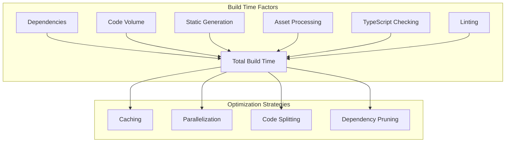
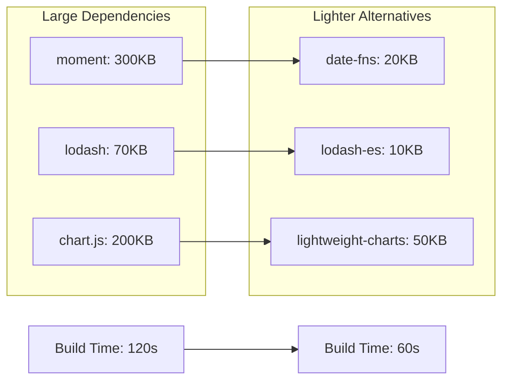
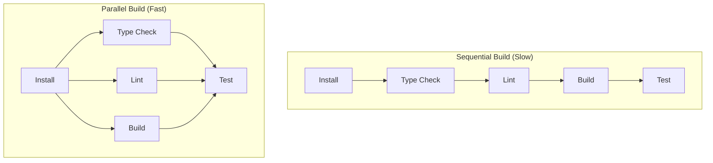

# How to Optimize Next.js Build Performance

Author: [nawazdhandala](https://www.github.com/nawazdhandala)

Tags: Next.js, Performance, Build Optimization, Webpack, Caching, CI/CD

Description: Learn strategies to optimize Next.js build times including caching, parallelization, dependency management, and CI/CD optimizations.

---

Slow Next.js builds impact developer productivity and CI/CD pipeline efficiency. This guide covers practical strategies to significantly reduce build times through caching, configuration optimization, and architectural improvements.

## Build Performance Factors

Understanding what affects build time helps target optimizations effectively.



## Measuring Build Performance

Start by measuring current build times to establish a baseline.

```bash
# Measure build time with detailed output
time npm run build

# Enable verbose build output
NEXT_VERBOSE=true npm run build

# Analyze bundle size
ANALYZE=true npm run build
```

Add build timing to package.json:

```json
{
  "scripts": {
    "build": "next build",
    "build:analyze": "ANALYZE=true next build",
    "build:profile": "NEXT_TELEMETRY_DEBUG=1 next build",
    "build:time": "time next build 2>&1 | tee build.log"
  }
}
```

## Enable Build Caching

Next.js has built-in caching that significantly improves rebuild times.

```javascript
// next.config.js
/** @type {import('next').NextConfig} */
const nextConfig = {
  // Enable persistent caching
  experimental: {
    // Cache build output
    incrementalCacheHandlerPath: undefined,
  },

  // Configure cache directory
  distDir: '.next',

  // Disable source maps in production for faster builds
  productionBrowserSourceMaps: false,
};

module.exports = nextConfig;
```

### Configure CI/CD Cache

Cache the .next/cache directory in your CI/CD pipeline.

GitHub Actions example:

```yaml
# .github/workflows/build.yml
name: Build

on:
  push:
    branches: [main]
  pull_request:
    branches: [main]

jobs:
  build:
    runs-on: ubuntu-latest

    steps:
      - uses: actions/checkout@v4

      - name: Setup Node.js
        uses: actions/setup-node@v4
        with:
          node-version: '20'
          cache: 'npm'

      # Cache Next.js build cache
      - name: Cache Next.js Build
        uses: actions/cache@v4
        with:
          path: |
            ${{ github.workspace }}/.next/cache
          key: ${{ runner.os }}-nextjs-${{ hashFiles('**/package-lock.json') }}-${{ hashFiles('**/*.js', '**/*.jsx', '**/*.ts', '**/*.tsx') }}
          restore-keys: |
            ${{ runner.os }}-nextjs-${{ hashFiles('**/package-lock.json') }}-
            ${{ runner.os }}-nextjs-

      - name: Install Dependencies
        run: npm ci

      - name: Build
        run: npm run build
```

## Optimize Dependencies

Large dependencies significantly impact build time.

### Analyze Dependencies

```bash
# Check bundle size impact of dependencies
npx depcheck

# Analyze bundle with webpack-bundle-analyzer
npm install --save-dev @next/bundle-analyzer
```

Configure bundle analyzer:

```javascript
// next.config.js
const withBundleAnalyzer = require('@next/bundle-analyzer')({
  enabled: process.env.ANALYZE === 'true',
});

/** @type {import('next').NextConfig} */
const nextConfig = {
  // your config
};

module.exports = withBundleAnalyzer(nextConfig);
```

### Replace Heavy Dependencies

```javascript
// Before: Heavy moment.js (300KB)
import moment from 'moment';
const date = moment().format('YYYY-MM-DD');

// After: Lightweight date-fns (tree-shakeable)
import { format } from 'date-fns';
const date = format(new Date(), 'yyyy-MM-dd');

// Or native Intl API (no dependency)
const date = new Intl.DateTimeFormat('en-CA').format(new Date());
```

### Use Dynamic Imports

```typescript
// src/components/HeavyChart.tsx
'use client';

import dynamic from 'next/dynamic';

// Lazy load heavy components
const Chart = dynamic(() => import('react-chartjs-2').then(mod => mod.Line), {
  loading: () => <div>Loading chart...</div>,
  ssr: false,
});

export default function HeavyChart({ data }: { data: any }) {
  return <Chart data={data} />;
}
```

## Dependency Impact Analysis

Visualize how dependencies affect build time.



## Configure TypeScript for Speed

Optimize TypeScript compilation.

```json
{
  "compilerOptions": {
    "target": "ES2020",
    "lib": ["dom", "dom.iterable", "esnext"],
    "allowJs": true,
    "skipLibCheck": true,
    "strict": true,
    "noEmit": true,
    "esModuleInterop": true,
    "module": "esnext",
    "moduleResolution": "bundler",
    "resolveJsonModule": true,
    "isolatedModules": true,
    "jsx": "preserve",
    "incremental": true,
    "plugins": [
      {
        "name": "next"
      }
    ],
    "paths": {
      "@/*": ["./src/*"]
    }
  },
  "include": ["next-env.d.ts", "**/*.ts", "**/*.tsx", ".next/types/**/*.ts"],
  "exclude": ["node_modules"]
}
```

Key settings for build speed:
- `skipLibCheck: true` - Skip type checking of declaration files
- `incremental: true` - Enable incremental compilation
- `isolatedModules: true` - Ensure each file can be transpiled independently

## Separate Type Checking

Run type checking separately from the build process.

```json
{
  "scripts": {
    "build": "next build",
    "type-check": "tsc --noEmit",
    "lint": "eslint . --ext .ts,.tsx",
    "build:fast": "next build",
    "build:full": "npm run type-check && npm run lint && next build"
  }
}
```

Configure Next.js to skip type checking during build:

```javascript
// next.config.js
/** @type {import('next').NextConfig} */
const nextConfig = {
  // Skip type checking during build (run separately)
  typescript: {
    ignoreBuildErrors: process.env.SKIP_TYPE_CHECK === 'true',
  },

  // Skip ESLint during build (run separately)
  eslint: {
    ignoreDuringBuilds: process.env.SKIP_LINT === 'true',
  },
};

module.exports = nextConfig;
```

CI/CD pipeline with parallel checks:

```yaml
# .github/workflows/build.yml
jobs:
  type-check:
    runs-on: ubuntu-latest
    steps:
      - uses: actions/checkout@v4
      - uses: actions/setup-node@v4
        with:
          node-version: '20'
          cache: 'npm'
      - run: npm ci
      - run: npm run type-check

  lint:
    runs-on: ubuntu-latest
    steps:
      - uses: actions/checkout@v4
      - uses: actions/setup-node@v4
        with:
          node-version: '20'
          cache: 'npm'
      - run: npm ci
      - run: npm run lint

  build:
    runs-on: ubuntu-latest
    steps:
      - uses: actions/checkout@v4
      - uses: actions/setup-node@v4
        with:
          node-version: '20'
          cache: 'npm'
      - run: npm ci
      - run: SKIP_TYPE_CHECK=true SKIP_LINT=true npm run build
```

## Optimize Static Generation

Control which pages are statically generated at build time.

```typescript
// src/app/blog/[slug]/page.tsx
interface BlogPost {
  slug: string;
  title: string;
  content: string;
}

// Only generate popular posts at build time
export async function generateStaticParams() {
  // Limit static generation to reduce build time
  const popularPosts = await getPopularPosts(50); // Only top 50

  return popularPosts.map((post) => ({
    slug: post.slug,
  }));
}

// Enable on-demand generation for other pages
export const dynamicParams = true;

// Revalidate every hour
export const revalidate = 3600;

export default async function BlogPost({
  params
}: {
  params: { slug: string }
}) {
  const post = await getPost(params.slug);

  return (
    <article>
      <h1>{post.title}</h1>
      <div>{post.content}</div>
    </article>
  );
}
```

### Limit Concurrent Page Generation

```javascript
// next.config.js
/** @type {import('next').NextConfig} */
const nextConfig = {
  experimental: {
    // Limit concurrent static page generation
    workerThreads: false,
    cpus: 2, // Limit CPU usage
  },
};

module.exports = nextConfig;
```

## Build Process Optimization

Optimize the overall build process flow.



## Image Optimization

Configure image optimization to reduce build time.

```javascript
// next.config.js
/** @type {import('next').NextConfig} */
const nextConfig = {
  images: {
    // Use external image optimization service
    loader: 'custom',
    loaderFile: './src/lib/imageLoader.ts',

    // Or disable optimization entirely for faster builds
    unoptimized: process.env.NODE_ENV === 'development',

    // Limit image sizes
    deviceSizes: [640, 750, 1080, 1920],
    imageSizes: [16, 32, 48, 64, 96],
  },
};

module.exports = nextConfig;
```

Custom image loader:

```typescript
// src/lib/imageLoader.ts
interface ImageLoaderProps {
  src: string;
  width: number;
  quality?: number;
}

export default function imageLoader({
  src,
  width,
  quality
}: ImageLoaderProps): string {
  // Use CDN for image optimization
  const cdnUrl = process.env.NEXT_PUBLIC_CDN_URL;
  return `${cdnUrl}/image?url=${encodeURIComponent(src)}&w=${width}&q=${quality || 75}`;
}
```

## Reduce Bundle Size

Smaller bundles mean faster builds and better performance.

### Tree Shaking Configuration

```javascript
// next.config.js
/** @type {import('next').NextConfig} */
const nextConfig = {
  // Ensure proper tree shaking
  modularizeImports: {
    // Tree shake lodash
    'lodash': {
      transform: 'lodash/{{member}}',
    },
    // Tree shake Material UI
    '@mui/material': {
      transform: '@mui/material/{{member}}',
    },
    '@mui/icons-material': {
      transform: '@mui/icons-material/{{member}}',
    },
  },
};

module.exports = nextConfig;
```

### Code Splitting Strategy

```typescript
// src/app/dashboard/page.tsx
import dynamic from 'next/dynamic';

// Split large components
const Analytics = dynamic(() => import('@/components/Analytics'), {
  loading: () => <AnalyticsSkeleton />,
});

const Reports = dynamic(() => import('@/components/Reports'), {
  loading: () => <ReportsSkeleton />,
});

const Charts = dynamic(() => import('@/components/Charts'), {
  loading: () => <ChartsSkeleton />,
  ssr: false, // Client-only component
});

export default function Dashboard() {
  return (
    <div>
      <h1>Dashboard</h1>
      <Analytics />
      <Reports />
      <Charts />
    </div>
  );
}
```

## Memory Optimization

Prevent out-of-memory errors during builds.

```bash
# Increase Node.js memory limit
NODE_OPTIONS="--max-old-space-size=4096" npm run build

# Or in package.json
{
  "scripts": {
    "build": "NODE_OPTIONS='--max-old-space-size=4096' next build"
  }
}
```

### Monitor Memory Usage

```javascript
// scripts/build-with-memory.js
const { execSync } = require('child_process');

// Log memory usage periodically during build
const memoryInterval = setInterval(() => {
  const used = process.memoryUsage();
  console.log('Memory:', {
    heapUsed: `${Math.round(used.heapUsed / 1024 / 1024)}MB`,
    heapTotal: `${Math.round(used.heapTotal / 1024 / 1024)}MB`,
    rss: `${Math.round(used.rss / 1024 / 1024)}MB`,
  });
}, 5000);

try {
  execSync('next build', { stdio: 'inherit' });
} finally {
  clearInterval(memoryInterval);
}
```

## Development Build Speed

Optimize development experience with Turbopack.

```json
{
  "scripts": {
    "dev": "next dev --turbo",
    "dev:webpack": "next dev"
  }
}
```

### Configure Fast Refresh

```javascript
// next.config.js
/** @type {import('next').NextConfig} */
const nextConfig = {
  // Optimize for development
  reactStrictMode: true,

  // Faster development builds
  swcMinify: true,
};

module.exports = nextConfig;
```

## Build Performance Monitoring

Track build performance over time.

```typescript
// scripts/track-build.ts
import { writeFileSync, readFileSync, existsSync } from 'fs';

interface BuildMetrics {
  timestamp: string;
  duration: number;
  pagesGenerated: number;
  bundleSize: number;
}

function trackBuild(metrics: BuildMetrics) {
  const metricsFile = './build-metrics.json';

  let history: BuildMetrics[] = [];
  if (existsSync(metricsFile)) {
    history = JSON.parse(readFileSync(metricsFile, 'utf8'));
  }

  history.push(metrics);

  // Keep last 100 builds
  if (history.length > 100) {
    history = history.slice(-100);
  }

  writeFileSync(metricsFile, JSON.stringify(history, null, 2));

  // Calculate trends
  const recent = history.slice(-10);
  const avgDuration = recent.reduce((sum, m) => sum + m.duration, 0) / recent.length;

  console.log(`Build completed in ${metrics.duration}s`);
  console.log(`10-build average: ${avgDuration.toFixed(1)}s`);

  if (metrics.duration > avgDuration * 1.2) {
    console.warn('Warning: Build time is 20% above average');
  }
}

export { trackBuild };
```

## Summary

Key strategies for optimizing Next.js build performance:

1. Enable and configure build caching in CI/CD
2. Analyze and optimize dependencies
3. Use dynamic imports for heavy components
4. Separate type checking and linting from builds
5. Limit static generation to essential pages
6. Configure proper image optimization
7. Use tree shaking and code splitting
8. Increase memory limits for large projects
9. Use Turbopack for development
10. Monitor build performance trends

Implementing these optimizations can reduce build times by 50% or more, improving both developer productivity and CI/CD efficiency.
