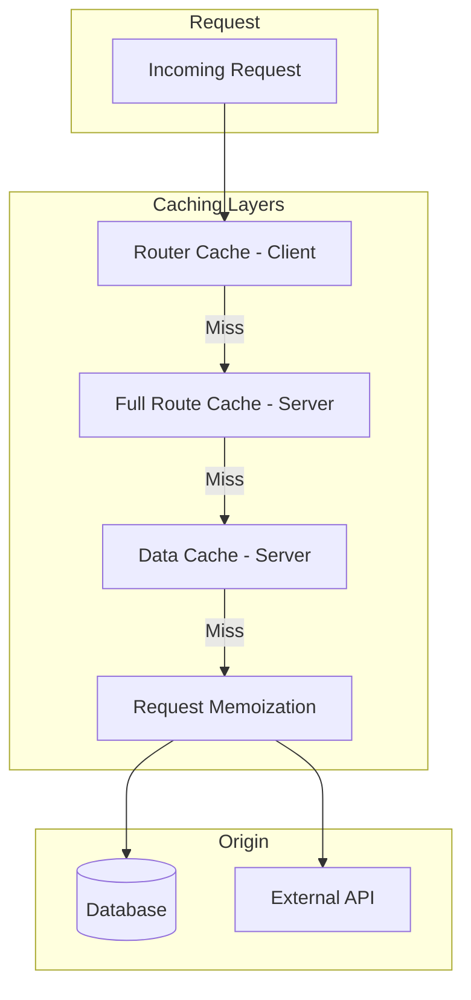
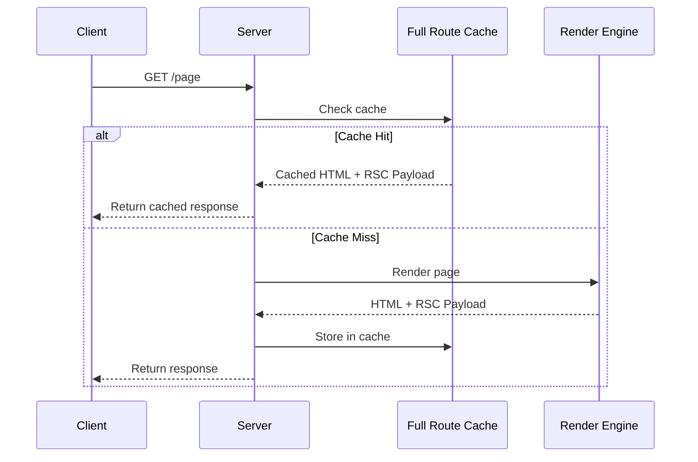
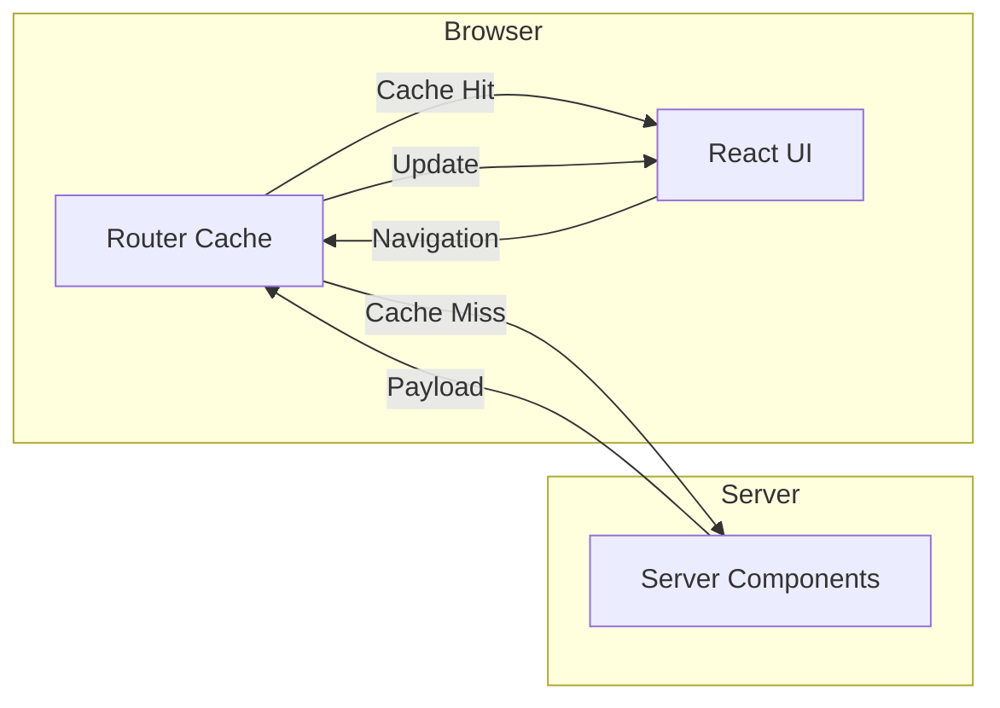

# How to Fix Caching Issues in Next.js

Author: [nawazdhandala](https://www.github.com/nawazdhandala)

Tags: Next.js, Caching, Performance, App Router, Data Fetching, Debugging

Description: A comprehensive guide to understanding and fixing common caching issues in Next.js, covering fetch caching, route caching, and revalidation strategies.

---

Caching in Next.js can be confusing because it happens at multiple layers. When your data seems stale or pages do not update as expected, understanding these caching mechanisms is essential for debugging and fixing the issues.

## Understanding Next.js Caching Layers

Next.js implements caching at several levels, each serving a different purpose.



## The Data Cache

The Data Cache stores the results of fetch requests on the server. By default, fetch requests in Next.js are cached indefinitely.

### Problem: Stale data after updates

```typescript
// app/posts/page.tsx
// This fetch is cached forever by default
async function PostsPage() {
  const response = await fetch('https://api.example.com/posts');
  const posts = await response.json();

  // Data might be stale if the API has been updated
  return <PostList posts={posts} />;
}
```

### Solution: Configure cache behavior

```typescript
// app/posts/page.tsx
async function PostsPage() {
  // Option 1: Disable caching entirely
  const response = await fetch('https://api.example.com/posts', {
    cache: 'no-store',  // Always fetch fresh data
  });

  // Option 2: Time-based revalidation
  const response2 = await fetch('https://api.example.com/posts', {
    next: {
      revalidate: 60,  // Revalidate every 60 seconds
    },
  });

  // Option 3: Tag-based revalidation
  const response3 = await fetch('https://api.example.com/posts', {
    next: {
      tags: ['posts'],  // Can be revalidated by tag
    },
  });

  const posts = await response.json();
  return <PostList posts={posts} />;
}
```

## Route Segment Configuration

You can configure caching behavior at the route segment level using special exports.

```typescript
// app/dashboard/page.tsx

// Force dynamic rendering - no caching
export const dynamic = 'force-dynamic';

// Or set revalidation time for the entire route
export const revalidate = 60;  // Revalidate every 60 seconds

// Or prevent caching
export const revalidate = 0;  // Equivalent to no caching

async function DashboardPage() {
  const data = await fetchDashboardData();
  return <Dashboard data={data} />;
}

export default DashboardPage;
```

## The Full Route Cache

The Full Route Cache stores the rendered HTML and React Server Component Payload on the server.



### Problem: Page not updating after deployment

Static pages are cached at build time. If you update content in your CMS or database, the cached pages will not reflect the changes.

```typescript
// app/blog/[slug]/page.tsx
// This page is statically generated at build time
async function BlogPost({ params }: { params: { slug: string } }) {
  const post = await getPostBySlug(params.slug);
  return <Article post={post} />;
}

// generateStaticParams pre-renders these pages
export async function generateStaticParams() {
  const posts = await getAllPosts();
  return posts.map((post) => ({ slug: post.slug }));
}

export default BlogPost;
```

### Solution: Implement revalidation

```typescript
// app/blog/[slug]/page.tsx

// Time-based revalidation
export const revalidate = 3600;  // Revalidate every hour

async function BlogPost({ params }: { params: { slug: string } }) {
  const post = await getPostBySlug(params.slug);
  return <Article post={post} />;
}

export default BlogPost;
```

## On-Demand Revalidation

For immediate updates, use on-demand revalidation through Server Actions or Route Handlers.

```typescript
// app/actions/revalidate.ts
'use server';

import { revalidatePath, revalidateTag } from 'next/cache';

// Revalidate a specific path
export async function revalidateBlogPost(slug: string) {
  revalidatePath(`/blog/${slug}`);
}

// Revalidate all pages using a tag
export async function revalidateAllPosts() {
  revalidateTag('posts');
}

// Revalidate an entire route tree
export async function revalidateBlogSection() {
  revalidatePath('/blog', 'layout');
}
```

```typescript
// app/admin/posts/[id]/edit/page.tsx
'use client';

import { revalidateBlogPost } from '@/app/actions/revalidate';

export function EditPostForm({ post }) {
  async function handleSubmit(formData: FormData) {
    // Update the post
    await updatePost(post.id, formData);

    // Revalidate the cached page
    await revalidateBlogPost(post.slug);
  }

  return (
    <form action={handleSubmit}>
      {/* form fields */}
    </form>
  );
}
```

## The Router Cache

The Router Cache is a client-side cache that stores the React Server Component Payload. This is often the source of confusing behavior.



### Problem: Navigation shows stale data

```typescript
// The user updates data, but navigating back shows old data
// This happens because the Router Cache holds the old payload
```

### Solution: Use router.refresh()

```typescript
// components/UpdateForm.tsx
'use client';

import { useRouter } from 'next/navigation';

export function UpdateForm({ itemId }: { itemId: string }) {
  const router = useRouter();

  async function handleUpdate(formData: FormData) {
    await fetch(`/api/items/${itemId}`, {
      method: 'PUT',
      body: formData,
    });

    // Refresh the current route to clear Router Cache
    router.refresh();

    // Or navigate and refresh
    // router.push('/items');
    // router.refresh();
  }

  return (
    <form action={handleUpdate}>
      {/* form fields */}
      <button type="submit">Update</button>
    </form>
  );
}
```

## Debugging Caching Issues

### Step 1: Identify which cache is causing the issue

```typescript
// Add logging to understand cache behavior
// app/debug/page.tsx
async function DebugPage() {
  console.log('Page rendered at:', new Date().toISOString());

  const response = await fetch('https://api.example.com/data', {
    cache: 'no-store',  // Temporarily disable cache
  });

  console.log('Data fetched at:', new Date().toISOString());

  const data = await response.json();

  return (
    <div>
      <p>Render time: {new Date().toISOString()}</p>
      <pre>{JSON.stringify(data, null, 2)}</pre>
    </div>
  );
}

export default DebugPage;
```

### Step 2: Check cache headers

```typescript
// app/api/check-cache/route.ts
import { NextResponse } from 'next/server';

export async function GET() {
  const response = await fetch('https://api.example.com/data');

  // Log cache-related headers
  console.log('Cache-Control:', response.headers.get('cache-control'));
  console.log('ETag:', response.headers.get('etag'));
  console.log('Last-Modified:', response.headers.get('last-modified'));

  const data = await response.json();
  return NextResponse.json(data);
}
```

### Step 3: Clear caches during development

```bash
# Clear the Next.js cache
rm -rf .next/cache

# Or use the dev server with cache disabled
next dev --turbo
```

## Common Caching Scenarios and Solutions

### Scenario 1: User-specific data

```typescript
// app/profile/page.tsx
import { cookies } from 'next/headers';

// Force dynamic rendering for user-specific content
export const dynamic = 'force-dynamic';

async function ProfilePage() {
  const cookieStore = cookies();
  const sessionToken = cookieStore.get('session');

  const user = await fetchUserBySession(sessionToken?.value);

  return <UserProfile user={user} />;
}

export default ProfilePage;
```

### Scenario 2: Real-time data

```typescript
// app/stocks/page.tsx
async function StocksPage() {
  // Fetch fresh data on every request
  const stocks = await fetch('https://api.example.com/stocks', {
    cache: 'no-store',
  });

  return <StockTicker stocks={await stocks.json()} />;
}

export default StocksPage;
```

### Scenario 3: Mixed static and dynamic content

```typescript
// app/product/[id]/page.tsx
import { Suspense } from 'react';

// Static product info - cached
async function ProductInfo({ id }: { id: string }) {
  const product = await fetch(`https://api.example.com/products/${id}`, {
    next: { revalidate: 3600 },  // Cache for 1 hour
  });
  return <ProductDetails product={await product.json()} />;
}

// Dynamic stock info - not cached
async function StockStatus({ id }: { id: string }) {
  const stock = await fetch(`https://api.example.com/stock/${id}`, {
    cache: 'no-store',  // Always fresh
  });
  return <StockBadge stock={await stock.json()} />;
}

async function ProductPage({ params }: { params: { id: string } }) {
  return (
    <div>
      <ProductInfo id={params.id} />
      <Suspense fallback={<p>Loading stock status...</p>}>
        <StockStatus id={params.id} />
      </Suspense>
    </div>
  );
}

export default ProductPage;
```

## Cache Configuration Reference

```typescript
// Fetch cache options
fetch(url, {
  cache: 'force-cache',     // Default: cache indefinitely
  cache: 'no-store',        // Never cache
  next: { revalidate: 60 }, // Cache for 60 seconds
  next: { tags: ['posts'] }, // Tag for on-demand revalidation
});

// Route segment config
export const dynamic = 'auto';          // Default behavior
export const dynamic = 'force-dynamic'; // No caching
export const dynamic = 'force-static';  // Force static generation
export const dynamic = 'error';         // Error if dynamic features used

export const revalidate = false;  // Cache forever (default)
export const revalidate = 0;      // Always revalidate
export const revalidate = 60;     // Revalidate every 60 seconds
```

## Summary

To fix caching issues in Next.js:

1. Understand that caching happens at multiple levels: Data Cache, Full Route Cache, and Router Cache
2. Use `cache: 'no-store'` for data that must always be fresh
3. Use `revalidate` for data that can be stale for a period
4. Use `revalidateTag` and `revalidatePath` for on-demand revalidation
5. Use `router.refresh()` to clear the client-side Router Cache
6. Set route segment configs like `dynamic = 'force-dynamic'` for user-specific pages
7. Debug by adding timestamps and checking cache headers

Understanding these caching layers and their configuration options will help you build performant applications while ensuring data freshness where needed.
