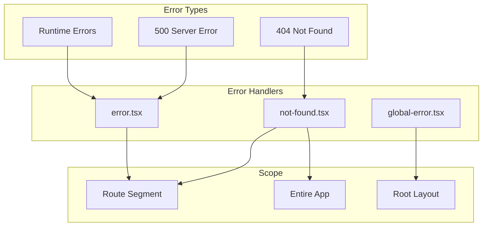
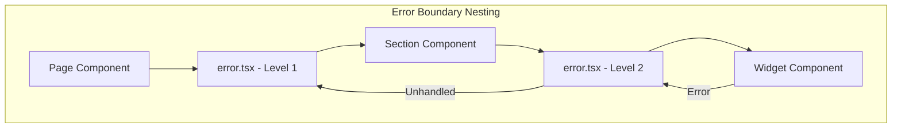

# How to Configure Custom 404/500 Pages in Next.js

Author: [nawazdhandala](https://www.github.com/nawazdhandala)

Tags: Next.js, Error Handling, 404, 500, App Router, User Experience

Description: A practical guide to creating custom error pages in Next.js, including 404 not found pages, 500 server error pages, and dynamic error boundaries.

---

Custom error pages improve user experience by providing helpful feedback when things go wrong. Next.js makes it easy to create branded error pages that match your application design while providing useful information to users.

## Error Page Architecture

Next.js handles different types of errors at different levels of your application.



## Creating a Custom 404 Page

In the App Router, create a `not-found.tsx` file in your app directory.

```typescript
// app/not-found.tsx
import Link from 'next/link';

export default function NotFound() {
  return (
    <div className="error-page">
      <div className="error-content">
        <h1 className="error-code">404</h1>
        <h2 className="error-title">Page Not Found</h2>
        <p className="error-description">
          The page you are looking for does not exist or has been moved.
        </p>

        <div className="error-actions">
          <Link href="/" className="btn btn-primary">
            Go Home
          </Link>
          <Link href="/search" className="btn btn-secondary">
            Search Site
          </Link>
        </div>

        <div className="error-suggestions">
          <h3>You might be looking for:</h3>
          <ul>
            <li><Link href="/docs">Documentation</Link></li>
            <li><Link href="/blog">Blog</Link></li>
            <li><Link href="/contact">Contact Us</Link></li>
          </ul>
        </div>
      </div>
    </div>
  );
}
```

### Styling the 404 Page

```css
/* app/not-found.css or in your global styles */
.error-page {
  min-height: 100vh;
  display: flex;
  align-items: center;
  justify-content: center;
  padding: 2rem;
  background: linear-gradient(135deg, #667eea 0%, #764ba2 100%);
}

.error-content {
  text-align: center;
  color: white;
  max-width: 500px;
}

.error-code {
  font-size: 8rem;
  font-weight: 700;
  margin: 0;
  line-height: 1;
  text-shadow: 2px 2px 4px rgba(0, 0, 0, 0.2);
}

.error-title {
  font-size: 2rem;
  margin: 1rem 0;
}

.error-description {
  font-size: 1.1rem;
  opacity: 0.9;
  margin-bottom: 2rem;
}

.error-actions {
  display: flex;
  gap: 1rem;
  justify-content: center;
  margin-bottom: 2rem;
}

.btn {
  padding: 0.75rem 1.5rem;
  border-radius: 0.5rem;
  text-decoration: none;
  font-weight: 500;
  transition: transform 0.2s;
}

.btn:hover {
  transform: translateY(-2px);
}

.btn-primary {
  background: white;
  color: #667eea;
}

.btn-secondary {
  background: transparent;
  color: white;
  border: 2px solid white;
}
```

## Triggering 404 Programmatically

Use the `notFound()` function to trigger the not-found page from your code.

```typescript
// app/posts/[slug]/page.tsx
import { notFound } from 'next/navigation';
import { getPostBySlug } from '@/lib/posts';

interface PostPageProps {
  params: { slug: string };
}

async function PostPage({ params }: PostPageProps) {
  const post = await getPostBySlug(params.slug);

  // If post does not exist, show 404 page
  if (!post) {
    notFound();
  }

  return (
    <article>
      <h1>{post.title}</h1>
      <div dangerouslySetInnerHTML={{ __html: post.content }} />
    </article>
  );
}

export default PostPage;
```

## Route-Specific 404 Pages

You can create different 404 pages for different sections of your app.

```mermaid
flowchart TD
    subgraph "App Structure"
        ROOT[app/not-found.tsx]
        BLOG[app/blog/not-found.tsx]
        DOCS[app/docs/not-found.tsx]
        SHOP[app/shop/not-found.tsx]
    end

    R1[/blog/invalid] --> BLOG
    R2[/docs/invalid] --> DOCS
    R3[/shop/invalid] --> SHOP
    R4[/other/invalid] --> ROOT
```

```typescript
// app/blog/not-found.tsx
import Link from 'next/link';

export default function BlogNotFound() {
  return (
    <div className="blog-not-found">
      <h1>Blog Post Not Found</h1>
      <p>The blog post you are looking for does not exist.</p>

      <div className="suggestions">
        <h2>Recent Posts</h2>
        {/* You could fetch and display recent posts here */}
        <Link href="/blog">Browse All Posts</Link>
      </div>
    </div>
  );
}
```

```typescript
// app/docs/not-found.tsx
import Link from 'next/link';

export default function DocsNotFound() {
  return (
    <div className="docs-not-found">
      <h1>Documentation Page Not Found</h1>
      <p>This documentation page may have been moved or deleted.</p>

      <div className="suggestions">
        <h2>Popular Documentation</h2>
        <ul>
          <li><Link href="/docs/getting-started">Getting Started</Link></li>
          <li><Link href="/docs/api-reference">API Reference</Link></li>
          <li><Link href="/docs/tutorials">Tutorials</Link></li>
        </ul>

        <Link href="/docs/search">Search Documentation</Link>
      </div>
    </div>
  );
}
```

## Creating Custom Error Pages (500 and Runtime Errors)

The `error.tsx` file handles runtime errors and server errors within a route segment.

```typescript
// app/error.tsx
'use client';  // Error components must be Client Components

import { useEffect } from 'react';

interface ErrorPageProps {
  error: Error & { digest?: string };
  reset: () => void;
}

export default function Error({ error, reset }: ErrorPageProps) {
  useEffect(() => {
    // Log the error to an error reporting service
    console.error('Application error:', error);

    // You could send to a monitoring service
    // reportError(error);
  }, [error]);

  return (
    <div className="error-page">
      <div className="error-content">
        <h1 className="error-code">Error</h1>
        <h2 className="error-title">Something went wrong</h2>
        <p className="error-description">
          An unexpected error occurred. Please try again.
        </p>

        {/* Show error digest for debugging in production */}
        {error.digest && (
          <p className="error-digest">
            Error ID: {error.digest}
          </p>
        )}

        <div className="error-actions">
          <button onClick={reset} className="btn btn-primary">
            Try Again
          </button>
          <a href="/" className="btn btn-secondary">
            Go Home
          </a>
        </div>
      </div>
    </div>
  );
}
```

## Global Error Handler

For errors that occur in the root layout, you need a `global-error.tsx` file.

```typescript
// app/global-error.tsx
'use client';

interface GlobalErrorProps {
  error: Error & { digest?: string };
  reset: () => void;
}

export default function GlobalError({ error, reset }: GlobalErrorProps) {
  return (
    // global-error must include html and body tags
    <html>
      <body>
        <div className="global-error">
          <h1>Critical Error</h1>
          <p>A critical error has occurred. Please refresh the page.</p>

          <button onClick={reset}>
            Refresh Page
          </button>
        </div>
      </body>
    </html>
  );
}
```

## Error Boundaries for Specific Components

You can nest error boundaries to catch errors at different levels.



```typescript
// app/dashboard/error.tsx
'use client';

export default function DashboardError({
  error,
  reset,
}: {
  error: Error;
  reset: () => void;
}) {
  return (
    <div className="dashboard-error">
      <h2>Dashboard Error</h2>
      <p>Failed to load dashboard data. Please try again.</p>
      <button onClick={reset}>Reload Dashboard</button>
    </div>
  );
}
```

```typescript
// app/dashboard/analytics/error.tsx
'use client';

export default function AnalyticsError({
  error,
  reset,
}: {
  error: Error;
  reset: () => void;
}) {
  return (
    <div className="analytics-error">
      <h2>Analytics Unavailable</h2>
      <p>Could not load analytics data.</p>
      <button onClick={reset}>Retry</button>
    </div>
  );
}
```

## Adding Metadata to Error Pages

You can add metadata to improve SEO and user experience.

```typescript
// app/not-found.tsx
import { Metadata } from 'next';
import Link from 'next/link';

export const metadata: Metadata = {
  title: 'Page Not Found - MyApp',
  description: 'The requested page could not be found.',
  robots: {
    index: false,  // Do not index error pages
    follow: true,
  },
};

export default function NotFound() {
  return (
    <div className="not-found">
      <h1>404 - Page Not Found</h1>
      <p>Sorry, we could not find the page you are looking for.</p>
      <Link href="/">Return Home</Link>
    </div>
  );
}
```

## Dynamic Error Pages with Data Fetching

You can fetch data in error pages to provide helpful suggestions.

```typescript
// app/not-found.tsx
import Link from 'next/link';
import { getPopularPages } from '@/lib/analytics';

export default async function NotFound() {
  // Fetch popular pages to suggest to the user
  const popularPages = await getPopularPages(5);

  return (
    <div className="not-found">
      <h1>Page Not Found</h1>
      <p>The page you requested does not exist.</p>

      <section className="popular-pages">
        <h2>Popular Pages</h2>
        <ul>
          {popularPages.map((page) => (
            <li key={page.path}>
              <Link href={page.path}>
                {page.title}
              </Link>
            </li>
          ))}
        </ul>
      </section>

      <Link href="/">Go to Homepage</Link>
    </div>
  );
}
```

## Handling API Route Errors

For API routes, return appropriate status codes and error messages.

```typescript
// app/api/users/[id]/route.ts
import { NextRequest, NextResponse } from 'next/server';
import { getUserById } from '@/lib/users';

export async function GET(
  request: NextRequest,
  { params }: { params: { id: string } }
) {
  try {
    const user = await getUserById(params.id);

    if (!user) {
      return NextResponse.json(
        { error: 'User not found' },
        { status: 404 }
      );
    }

    return NextResponse.json(user);
  } catch (error) {
    console.error('Error fetching user:', error);

    return NextResponse.json(
      { error: 'Internal server error' },
      { status: 500 }
    );
  }
}
```

## Testing Error Pages

Create test scenarios to verify your error pages work correctly.

```typescript
// app/test/trigger-404/page.tsx
import { notFound } from 'next/navigation';

// This page always triggers a 404
export default function TriggerNotFound() {
  notFound();
}
```

```typescript
// app/test/trigger-error/page.tsx
// This page always triggers an error
export default function TriggerError() {
  throw new Error('Test error for error page verification');
}
```

## Complete File Structure

```
app/
  not-found.tsx          # Global 404 page
  error.tsx              # Global error page
  global-error.tsx       # Root layout error handler

  blog/
    not-found.tsx        # Blog-specific 404
    error.tsx            # Blog-specific errors
    [slug]/
      page.tsx           # May call notFound()

  docs/
    not-found.tsx        # Docs-specific 404
    error.tsx            # Docs-specific errors

  api/
    users/
      [id]/
        route.ts         # Returns 404/500 status codes
```

## Summary

To configure custom error pages in Next.js:

1. Create `not-found.tsx` in the app directory for 404 pages
2. Create `error.tsx` for runtime error handling (must be a Client Component)
3. Create `global-error.tsx` for errors in the root layout
4. Use `notFound()` to programmatically trigger 404 pages
5. Create route-specific error pages by placing them in nested directories
6. Add metadata to error pages for better SEO
7. Return appropriate status codes from API routes

Custom error pages help maintain a professional user experience even when things go wrong, and proper error boundaries prevent your entire application from crashing due to isolated component failures.
