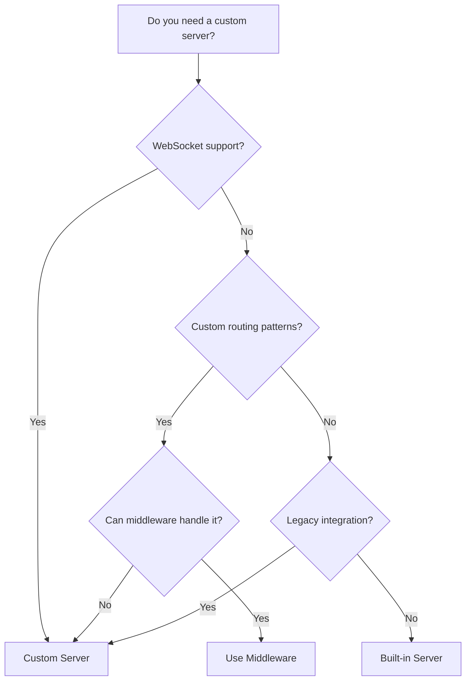
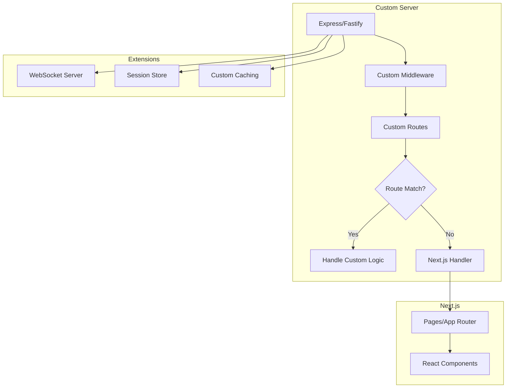

# How to Configure Custom Server in Next.js

Author: [nawazdhandala](https://github.com/nawazdhandala)

Tags: NextJS, Server, Express, Node.js, Configuration

Description: Learn how to set up and configure a custom server in Next.js for advanced use cases like custom routing, WebSockets, and middleware.

---

While Next.js provides a built-in server that handles most use cases, sometimes you need more control. A custom server allows you to add WebSocket support, custom routing logic, or integrate with existing Express/Fastify applications. This guide covers when and how to implement a custom server.

## When to Use a Custom Server



Use a custom server when you need:
- WebSocket connections (Socket.io, ws)
- Custom URL handling beyond middleware capabilities
- Integration with existing Express/Fastify apps
- Custom server-side caching
- Specific hosting requirements

Avoid custom servers when possible because you lose:
- Automatic static optimization
- Serverless deployment compatibility
- Some Vercel-specific optimizations

## Basic Custom Server Setup

### Project Structure

```
my-app/
  server/
    index.ts
  app/
    page.tsx
    layout.tsx
  package.json
  tsconfig.server.json
```

### Express Custom Server

```typescript
// server/index.ts
import express, { Request, Response } from 'express';
import next from 'next';

const dev = process.env.NODE_ENV !== 'production';
const hostname = process.env.HOSTNAME || 'localhost';
const port = parseInt(process.env.PORT || '3000', 10);

const app = next({ dev, hostname, port });
const handle = app.getRequestHandler();

app.prepare().then(() => {
  const server = express();

  // Custom middleware
  server.use(express.json());

  // Health check endpoint
  server.get('/health', (req: Request, res: Response) => {
    res.json({ status: 'healthy', timestamp: new Date().toISOString() });
  });

  // Custom API route
  server.get('/api/custom', (req: Request, res: Response) => {
    res.json({ message: 'Custom API endpoint' });
  });

  // Legacy URL redirects
  server.get('/old-page', (req: Request, res: Response) => {
    res.redirect(301, '/new-page');
  });

  // Let Next.js handle everything else
  server.all('*', (req: Request, res: Response) => {
    return handle(req, res);
  });

  server.listen(port, () => {
    console.log(`Server ready on http://${hostname}:${port}`);
  });
});
```

### TypeScript Configuration

```json
// tsconfig.server.json
{
  "extends": "./tsconfig.json",
  "compilerOptions": {
    "module": "commonjs",
    "outDir": "dist",
    "target": "es2017",
    "isolatedModules": false,
    "noEmit": false
  },
  "include": ["server/**/*.ts"]
}
```

### Package.json Scripts

```json
{
  "scripts": {
    "dev": "ts-node --project tsconfig.server.json server/index.ts",
    "build": "next build && tsc --project tsconfig.server.json",
    "start": "NODE_ENV=production node dist/server/index.js"
  },
  "devDependencies": {
    "@types/express": "^4.17.21",
    "@types/node": "^20.10.0",
    "ts-node": "^10.9.2",
    "typescript": "^5.3.0"
  },
  "dependencies": {
    "express": "^4.18.2",
    "next": "^14.0.0",
    "react": "^18.2.0",
    "react-dom": "^18.2.0"
  }
}
```

## WebSocket Integration

### Socket.io with Custom Server

```typescript
// server/index.ts
import express from 'express';
import { createServer } from 'http';
import { Server as SocketServer } from 'socket.io';
import next from 'next';

const dev = process.env.NODE_ENV !== 'production';
const hostname = 'localhost';
const port = parseInt(process.env.PORT || '3000', 10);

const app = next({ dev, hostname, port });
const handle = app.getRequestHandler();

interface ChatMessage {
  user: string;
  message: string;
  timestamp: number;
}

app.prepare().then(() => {
  const expressApp = express();
  const httpServer = createServer(expressApp);

  // Configure Socket.io
  const io = new SocketServer(httpServer, {
    cors: {
      origin: dev ? 'http://localhost:3000' : 'https://yourdomain.com',
      methods: ['GET', 'POST'],
    },
  });

  // Socket.io event handling
  io.on('connection', (socket) => {
    console.log('Client connected:', socket.id);

    socket.on('join-room', (room: string) => {
      socket.join(room);
      console.log(`${socket.id} joined room: ${room}`);
    });

    socket.on('chat-message', (data: ChatMessage) => {
      // Broadcast to all clients in the room
      io.emit('new-message', {
        ...data,
        timestamp: Date.now(),
      });
    });

    socket.on('disconnect', () => {
      console.log('Client disconnected:', socket.id);
    });
  });

  // Express routes
  expressApp.get('/health', (req, res) => {
    res.json({
      status: 'healthy',
      connections: io.engine.clientsCount,
    });
  });

  // Next.js handler
  expressApp.all('*', (req, res) => {
    return handle(req, res);
  });

  httpServer.listen(port, () => {
    console.log(`Server ready on http://${hostname}:${port}`);
  });
});
```

### Client-Side Socket.io Hook

```typescript
// hooks/useSocket.ts
'use client';

import { useEffect, useState, useCallback } from 'react';
import { io, Socket } from 'socket.io-client';

interface ChatMessage {
  user: string;
  message: string;
  timestamp: number;
}

export function useSocket() {
  const [socket, setSocket] = useState<Socket | null>(null);
  const [isConnected, setIsConnected] = useState(false);
  const [messages, setMessages] = useState<ChatMessage[]>([]);

  useEffect(() => {
    const socketInstance = io({
      path: '/socket.io',
    });

    socketInstance.on('connect', () => {
      setIsConnected(true);
      console.log('Connected to socket server');
    });

    socketInstance.on('disconnect', () => {
      setIsConnected(false);
      console.log('Disconnected from socket server');
    });

    socketInstance.on('new-message', (message: ChatMessage) => {
      setMessages((prev) => [...prev, message]);
    });

    setSocket(socketInstance);

    return () => {
      socketInstance.disconnect();
    };
  }, []);

  const sendMessage = useCallback((user: string, message: string) => {
    if (socket) {
      socket.emit('chat-message', { user, message });
    }
  }, [socket]);

  const joinRoom = useCallback((room: string) => {
    if (socket) {
      socket.emit('join-room', room);
    }
  }, [socket]);

  return { isConnected, messages, sendMessage, joinRoom };
}
```

## Fastify Custom Server

```typescript
// server/index.ts
import Fastify from 'fastify';
import next from 'next';

const dev = process.env.NODE_ENV !== 'production';
const hostname = 'localhost';
const port = parseInt(process.env.PORT || '3000', 10);

const app = next({ dev, hostname, port });
const handle = app.getRequestHandler();

app.prepare().then(() => {
  const fastify = Fastify({ logger: true });

  // Custom routes
  fastify.get('/health', async (request, reply) => {
    return { status: 'healthy' };
  });

  fastify.get('/api/custom', async (request, reply) => {
    return { message: 'Fastify custom endpoint' };
  });

  // Handle all other routes with Next.js
  fastify.all('*', async (request, reply) => {
    await handle(request.raw, reply.raw);
    reply.hijack();
  });

  fastify.listen({ port, host: '0.0.0.0' }, (err) => {
    if (err) {
      fastify.log.error(err);
      process.exit(1);
    }
    console.log(`Server ready on http://${hostname}:${port}`);
  });
});
```

## Custom Routing Patterns

### Pattern-Based Routing

```typescript
// server/index.ts
import express from 'express';
import next from 'next';

const dev = process.env.NODE_ENV !== 'production';
const app = next({ dev });
const handle = app.getRequestHandler();

app.prepare().then(() => {
  const server = express();

  // Rewrite /blog/2024/01/my-post to /blog/[...slug]
  server.get('/blog/:year/:month/:slug', (req, res) => {
    const { year, month, slug } = req.params;
    const actualPage = '/blog/[...slug]';
    const queryParams = {
      slug: [year, month, slug]
    };
    app.render(req, res, actualPage, queryParams);
  });

  // Localized routes
  server.get('/:locale(en|es|fr)/about', (req, res) => {
    const { locale } = req.params;
    app.render(req, res, '/about', { locale });
  });

  // Vanity URLs
  server.get('/@:username', (req, res) => {
    const { username } = req.params;
    app.render(req, res, '/profile/[username]', { username });
  });

  server.all('*', (req, res) => {
    return handle(req, res);
  });

  server.listen(3000);
});
```

## Custom Server with Authentication

```typescript
// server/index.ts
import express, { Request, Response, NextFunction } from 'express';
import session from 'express-session';
import next from 'next';

const dev = process.env.NODE_ENV !== 'production';
const app = next({ dev });
const handle = app.getRequestHandler();

// Extend Express Request type
declare module 'express-session' {
  interface SessionData {
    user?: {
      id: string;
      email: string;
    };
  }
}

app.prepare().then(() => {
  const server = express();

  // Session middleware
  server.use(session({
    secret: process.env.SESSION_SECRET || 'dev-secret',
    resave: false,
    saveUninitialized: false,
    cookie: {
      secure: !dev,
      httpOnly: true,
      maxAge: 24 * 60 * 60 * 1000, // 24 hours
    },
  }));

  // Auth middleware
  const requireAuth = (req: Request, res: Response, next: NextFunction) => {
    if (!req.session.user) {
      return res.redirect('/login');
    }
    next();
  };

  // Protected routes
  server.get('/dashboard*', requireAuth, (req, res) => {
    return handle(req, res);
  });

  server.get('/settings*', requireAuth, (req, res) => {
    return handle(req, res);
  });

  // Login endpoint
  server.post('/api/login', express.json(), async (req, res) => {
    const { email, password } = req.body;

    // Validate credentials (replace with real auth)
    if (email && password) {
      req.session.user = { id: '1', email };
      res.json({ success: true });
    } else {
      res.status(401).json({ error: 'Invalid credentials' });
    }
  });

  // Logout endpoint
  server.post('/api/logout', (req, res) => {
    req.session.destroy(() => {
      res.json({ success: true });
    });
  });

  server.all('*', (req, res) => {
    return handle(req, res);
  });

  server.listen(3000);
});
```

## Production Deployment

### Docker Configuration

```dockerfile
# Dockerfile
FROM node:20-alpine AS base

# Dependencies
FROM base AS deps
WORKDIR /app
COPY package*.json ./
RUN npm ci

# Builder
FROM base AS builder
WORKDIR /app
COPY --from=deps /app/node_modules ./node_modules
COPY . .
RUN npm run build

# Runner
FROM base AS runner
WORKDIR /app
ENV NODE_ENV=production

RUN addgroup --system --gid 1001 nodejs
RUN adduser --system --uid 1001 nextjs

COPY --from=builder /app/public ./public
COPY --from=builder /app/.next/standalone ./
COPY --from=builder /app/.next/static ./.next/static
COPY --from=builder /app/dist/server ./dist/server

USER nextjs

EXPOSE 3000
ENV PORT=3000
ENV HOSTNAME="0.0.0.0"

CMD ["node", "dist/server/index.js"]
```

### Process Manager (PM2)

```javascript
// ecosystem.config.js
module.exports = {
  apps: [{
    name: 'nextjs-custom',
    script: 'dist/server/index.js',
    instances: 'max',
    exec_mode: 'cluster',
    env: {
      NODE_ENV: 'development',
    },
    env_production: {
      NODE_ENV: 'production',
    },
  }],
};
```

## Custom Server Architecture



## Handling Static Files

```typescript
// server/index.ts
import express from 'express';
import path from 'path';
import next from 'next';

const dev = process.env.NODE_ENV !== 'production';
const app = next({ dev });
const handle = app.getRequestHandler();

app.prepare().then(() => {
  const server = express();

  // Serve static files with caching
  server.use('/static', express.static(path.join(__dirname, '../public/static'), {
    maxAge: '1y',
    immutable: true,
  }));

  // Serve uploads
  server.use('/uploads', express.static(path.join(__dirname, '../uploads'), {
    maxAge: '1d',
  }));

  server.all('*', (req, res) => {
    return handle(req, res);
  });

  server.listen(3000);
});
```

## Summary

| Feature | Built-in Server | Custom Server |
|---------|-----------------|---------------|
| Static optimization | Automatic | Must configure |
| Serverless deployment | Yes | Limited |
| WebSocket support | No | Yes |
| Custom middleware | Via middleware.ts | Full control |
| URL rewriting | middleware.ts | Any pattern |
| Session handling | Via packages | Full control |

Custom servers provide maximum flexibility but come with trade-offs. Use them only when Next.js middleware and API routes cannot meet your requirements. For WebSocket support or complex routing patterns, a custom server with Express or Fastify gives you the control you need while still leveraging Next.js for your frontend.
