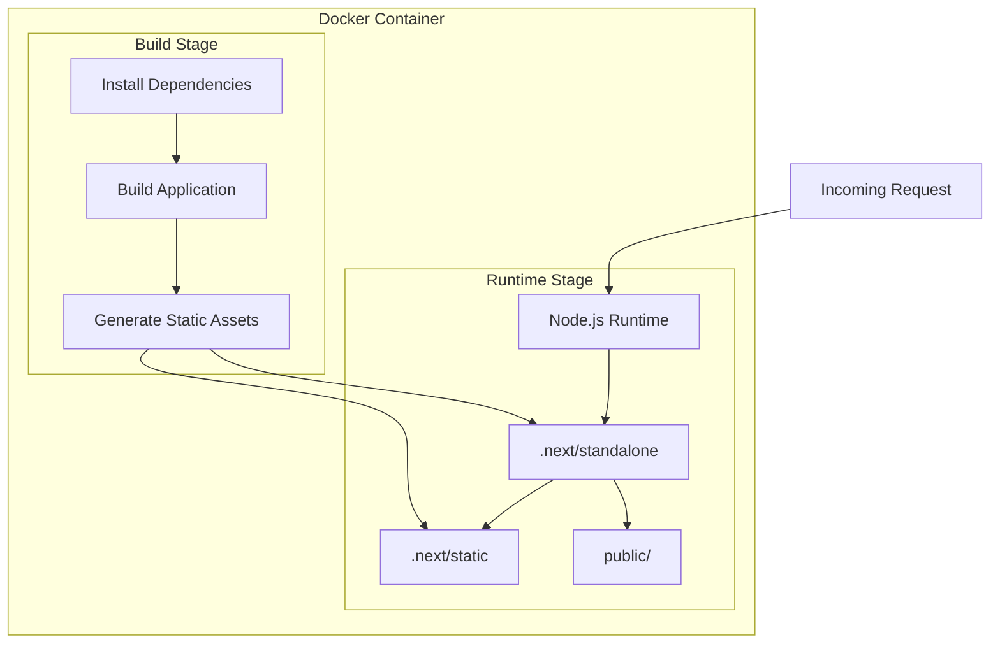
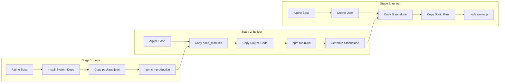
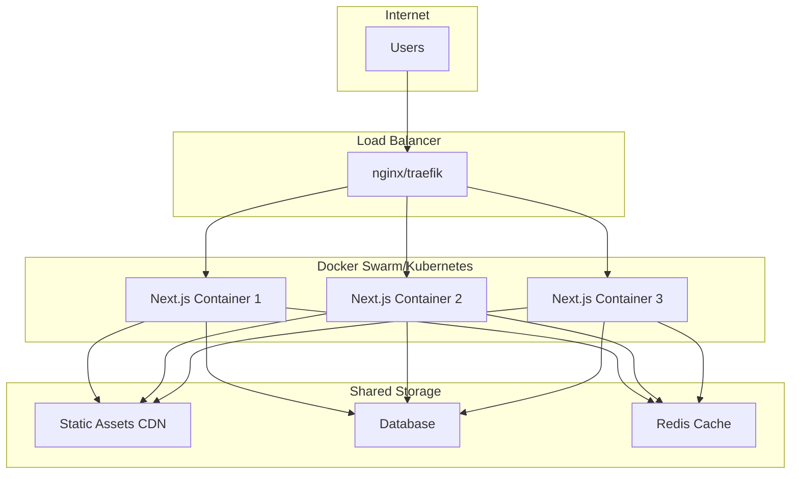

# How to Configure Next.js with Docker

Author: [nawazdhandala](https://www.github.com/nawazdhandala)

Tags: Next.js, Docker, DevOps, Containerization, Deployment

Description: Learn how to configure and optimize Next.js applications for Docker deployment with multi-stage builds and best practices.

---

Docker provides a consistent environment for deploying Next.js applications across development, staging, and production. This guide covers creating optimized Docker configurations for Next.js with multi-stage builds, caching strategies, and production-ready setups.

## Architecture Overview

Understanding how Next.js runs in a Docker container helps optimize the configuration.



## Basic Dockerfile

Start with a simple Dockerfile for development and testing.

```dockerfile
# Dockerfile
# Base image with Node.js
FROM node:20-alpine AS base

# Set working directory
WORKDIR /app

# Copy package files
COPY package.json package-lock.json* ./

# Install dependencies
RUN npm ci

# Copy source code
COPY . .

# Build the application
RUN npm run build

# Expose the port
EXPOSE 3000

# Start the application
CMD ["npm", "start"]
```

## Optimized Multi-Stage Dockerfile

For production, use multi-stage builds to minimize image size.

```dockerfile
# Dockerfile
# Stage 1: Dependencies
FROM node:20-alpine AS deps
RUN apk add --no-cache libc6-compat
WORKDIR /app

# Copy package files
COPY package.json package-lock.json* ./

# Install dependencies based on lock file
RUN \
  if [ -f package-lock.json ]; then npm ci --only=production; \
  elif [ -f yarn.lock ]; then yarn --frozen-lockfile --production; \
  elif [ -f pnpm-lock.yaml ]; then corepack enable pnpm && pnpm i --frozen-lockfile --prod; \
  else echo "Lockfile not found." && exit 1; \
  fi

# Stage 2: Builder
FROM node:20-alpine AS builder
WORKDIR /app

# Copy dependencies from deps stage
COPY --from=deps /app/node_modules ./node_modules
COPY . .

# Set environment variables for build
ENV NEXT_TELEMETRY_DISABLED=1
ENV NODE_ENV=production

# Build the application
RUN npm run build

# Stage 3: Runner
FROM node:20-alpine AS runner
WORKDIR /app

# Set environment for production
ENV NODE_ENV=production
ENV NEXT_TELEMETRY_DISABLED=1

# Create non-root user for security
RUN addgroup --system --gid 1001 nodejs
RUN adduser --system --uid 1001 nextjs

# Copy necessary files from builder
COPY --from=builder /app/public ./public

# Set correct permissions for prerender cache
RUN mkdir .next
RUN chown nextjs:nodejs .next

# Copy standalone output
COPY --from=builder --chown=nextjs:nodejs /app/.next/standalone ./
COPY --from=builder --chown=nextjs:nodejs /app/.next/static ./.next/static

# Switch to non-root user
USER nextjs

# Expose port
EXPOSE 3000

# Set hostname
ENV HOSTNAME="0.0.0.0"

# Start the server
CMD ["node", "server.js"]
```

## Next.js Configuration for Docker

Enable standalone output in your Next.js configuration.

```javascript
// next.config.js
/** @type {import('next').NextConfig} */
const nextConfig = {
  // Enable standalone output for Docker
  output: 'standalone',

  // Disable image optimization if using external CDN
  images: {
    unoptimized: process.env.DOCKER_BUILD === 'true',
  },

  // Environment variables available at build time
  env: {
    NEXT_PUBLIC_BUILD_TIME: new Date().toISOString(),
  },

  // Experimental features
  experimental: {
    // Instrument for monitoring
    instrumentationHook: true,
  },
};

module.exports = nextConfig;
```

## Docker Compose Configuration

Set up Docker Compose for local development and multi-container deployments.

```yaml
# docker-compose.yml
version: '3.8'

services:
  nextjs:
    build:
      context: .
      dockerfile: Dockerfile
      args:
        - NODE_ENV=production
    ports:
      - "3000:3000"
    environment:
      - DATABASE_URL=${DATABASE_URL}
      - NEXTAUTH_SECRET=${NEXTAUTH_SECRET}
      - NEXTAUTH_URL=${NEXTAUTH_URL}
    restart: unless-stopped
    healthcheck:
      test: ["CMD", "curl", "-f", "http://localhost:3000/api/health"]
      interval: 30s
      timeout: 10s
      retries: 3
      start_period: 40s

  # Development service with hot reload
  nextjs-dev:
    build:
      context: .
      dockerfile: Dockerfile.dev
    ports:
      - "3000:3000"
    volumes:
      - .:/app
      - /app/node_modules
      - /app/.next
    environment:
      - NODE_ENV=development
      - WATCHPACK_POLLING=true
```

## Development Dockerfile

Create a separate Dockerfile for development with hot reload support.

```dockerfile
# Dockerfile.dev
FROM node:20-alpine

WORKDIR /app

# Install dependencies
COPY package.json package-lock.json* ./
RUN npm ci

# Copy source
COPY . .

# Expose port
EXPOSE 3000

# Enable polling for file changes in Docker
ENV WATCHPACK_POLLING=true
ENV CHOKIDAR_USEPOLLING=true

# Start development server
CMD ["npm", "run", "dev"]
```

## Build Process Flow

The multi-stage build process optimizes the final image size.



## Environment Variables

Handle environment variables properly in Docker builds.

```dockerfile
# Dockerfile with build args
FROM node:20-alpine AS builder
WORKDIR /app

# Build arguments for compile-time variables
ARG NEXT_PUBLIC_API_URL
ARG NEXT_PUBLIC_ANALYTICS_ID

# Set as environment variables for build
ENV NEXT_PUBLIC_API_URL=$NEXT_PUBLIC_API_URL
ENV NEXT_PUBLIC_ANALYTICS_ID=$NEXT_PUBLIC_ANALYTICS_ID

COPY --from=deps /app/node_modules ./node_modules
COPY . .

RUN npm run build
```

Build with arguments:

```bash
# Build with environment variables
docker build \
  --build-arg NEXT_PUBLIC_API_URL=https://api.example.com \
  --build-arg NEXT_PUBLIC_ANALYTICS_ID=UA-XXXXX \
  -t my-nextjs-app .
```

## Dockerignore Configuration

Create a proper `.dockerignore` file to speed up builds.

```plaintext
# .dockerignore
# Dependencies
node_modules
npm-debug.log

# Next.js build output
.next
out

# Testing
coverage
.nyc_output

# IDE
.idea
.vscode
*.swp
*.swo

# OS
.DS_Store
Thumbs.db

# Git
.git
.gitignore

# Docker
Dockerfile*
docker-compose*
.docker

# Documentation
README.md
docs

# Environment files (use Docker secrets instead)
.env
.env.*
!.env.example
```

## Health Check Endpoint

Implement a health check endpoint for container orchestration.

```typescript
// src/app/api/health/route.ts
import { NextResponse } from 'next/server';

export async function GET() {
  // Basic health check
  const healthCheck = {
    status: 'healthy',
    timestamp: new Date().toISOString(),
    uptime: process.uptime(),
    environment: process.env.NODE_ENV,
  };

  try {
    // Add database connectivity check if needed
    // await prisma.$queryRaw`SELECT 1`;

    return NextResponse.json(healthCheck, { status: 200 });
  } catch (error) {
    return NextResponse.json(
      {
        status: 'unhealthy',
        error: 'Service unavailable'
      },
      { status: 503 }
    );
  }
}
```

## Caching Strategy

Optimize Docker builds with proper layer caching.

```dockerfile
# Dockerfile with optimized caching
FROM node:20-alpine AS deps
WORKDIR /app

# Copy only package files first for better caching
COPY package.json package-lock.json* ./

# Cache mount for npm
RUN --mount=type=cache,target=/root/.npm \
    npm ci --only=production

FROM node:20-alpine AS builder
WORKDIR /app

COPY --from=deps /app/node_modules ./node_modules

# Copy configuration files
COPY next.config.js ./
COPY tsconfig.json ./
COPY tailwind.config.js ./
COPY postcss.config.js ./

# Copy source files (changes frequently)
COPY src ./src
COPY public ./public

# Build with cache
RUN --mount=type=cache,target=/app/.next/cache \
    npm run build
```

## Container Deployment Architecture

Understanding the deployment topology helps plan infrastructure.



## Kubernetes Deployment

Deploy to Kubernetes with proper configurations.

```yaml
# k8s/deployment.yaml
apiVersion: apps/v1
kind: Deployment
metadata:
  name: nextjs-app
  labels:
    app: nextjs
spec:
  replicas: 3
  selector:
    matchLabels:
      app: nextjs
  template:
    metadata:
      labels:
        app: nextjs
    spec:
      containers:
      - name: nextjs
        image: your-registry/nextjs-app:latest
        ports:
        - containerPort: 3000
        env:
        - name: NODE_ENV
          value: "production"
        resources:
          requests:
            memory: "256Mi"
            cpu: "200m"
          limits:
            memory: "512Mi"
            cpu: "500m"
        readinessProbe:
          httpGet:
            path: /api/health
            port: 3000
          initialDelaySeconds: 10
          periodSeconds: 5
        livenessProbe:
          httpGet:
            path: /api/health
            port: 3000
          initialDelaySeconds: 30
          periodSeconds: 10
---
apiVersion: v1
kind: Service
metadata:
  name: nextjs-service
spec:
  selector:
    app: nextjs
  ports:
  - port: 80
    targetPort: 3000
  type: ClusterIP
```

## Troubleshooting Common Issues

### Issue: Large Image Size

```bash
# Check image size
docker images my-nextjs-app

# Analyze image layers
docker history my-nextjs-app

# Use dive for detailed analysis
dive my-nextjs-app
```

### Issue: Slow Builds

```bash
# Enable BuildKit for better caching
export DOCKER_BUILDKIT=1

# Build with cache
docker build --cache-from my-nextjs-app:latest -t my-nextjs-app:new .
```

### Issue: File Permission Errors

```dockerfile
# Fix permissions in Dockerfile
RUN chown -R nextjs:nodejs /app
USER nextjs
```

## Summary

Key points for configuring Next.js with Docker:

1. Use multi-stage builds to minimize image size
2. Enable standalone output in next.config.js
3. Create proper .dockerignore files
4. Implement health check endpoints
5. Use non-root users for security
6. Configure proper environment variable handling
7. Set up volume mounts for development
8. Use BuildKit for improved build performance

A well-configured Docker setup ensures consistent deployments and simplifies scaling Next.js applications across different environments.
