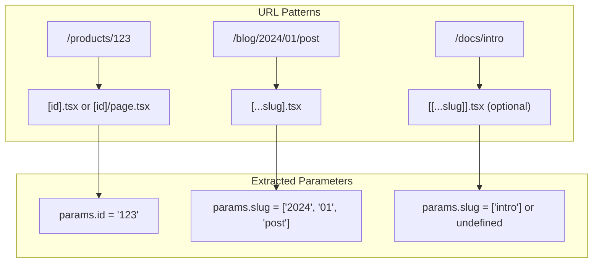
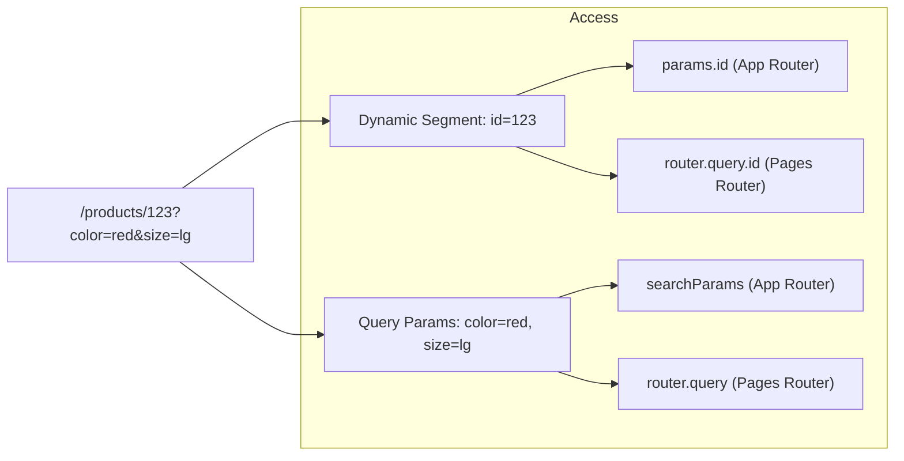

# How to Handle Dynamic Routing in Next.js

Author: [nawazdhandala](https://www.github.com/nawazdhandala)

Tags: Next.js, Dynamic Routing, React, Web Development, App Router, Pages Router

Description: Learn how to implement dynamic routing in Next.js using both the App Router and Pages Router with practical examples and best practices.

---

Dynamic routing allows you to create pages that match various URL patterns without defining each route explicitly. Next.js provides powerful dynamic routing capabilities through both the App Router (Next.js 13+) and the Pages Router. This guide covers both approaches with practical examples.

## Understanding Dynamic Routing

Dynamic routes in Next.js use bracket notation to capture URL segments as parameters. These parameters become available in your components for data fetching and rendering.



## App Router Dynamic Routes (Next.js 13+)

### Basic Dynamic Segment

Create a dynamic route by adding a folder with square brackets:

```
app/
  products/
    [id]/
      page.tsx       # Matches /products/1, /products/abc, etc.
```

```typescript
// app/products/[id]/page.tsx

// Define the params type
interface ProductPageProps {
  params: Promise<{ id: string }>;
}

// Server Component (default in App Router)
export default async function ProductPage({ params }: ProductPageProps) {
  const { id } = await params;

  // Fetch product data
  const product = await getProduct(id);

  if (!product) {
    return <div>Product not found</div>;
  }

  return (
    <div>
      <h1>{product.name}</h1>
      <p>{product.description}</p>
      <p>Price: ${product.price}</p>
    </div>
  );
}

// Generate static params for static generation
export async function generateStaticParams() {
  const products = await getProducts();

  return products.map((product) => ({
    id: product.id.toString(),
  }));
}

// Helper functions
async function getProduct(id: string) {
  const res = await fetch(`https://api.example.com/products/${id}`, {
    // Cache for 1 hour
    next: { revalidate: 3600 },
  });

  if (!res.ok) return null;
  return res.json();
}

async function getProducts() {
  const res = await fetch('https://api.example.com/products');
  return res.json();
}
```

### Multiple Dynamic Segments

You can have multiple dynamic segments in a single path:

```
app/
  shop/
    [category]/
      [productId]/
        page.tsx     # Matches /shop/electronics/123
```

```typescript
// app/shop/[category]/[productId]/page.tsx

interface ShopPageProps {
  params: Promise<{
    category: string;
    productId: string;
  }>;
}

export default async function ShopPage({ params }: ShopPageProps) {
  const { category, productId } = await params;

  const product = await getProductByCategory(category, productId);

  return (
    <div>
      <nav>
        <a href="/">Home</a> / <a href={`/shop/${category}`}>{category}</a> / {product.name}
      </nav>
      <h1>{product.name}</h1>
      <p>Category: {category}</p>
    </div>
  );
}

// Generate all combinations
export async function generateStaticParams() {
  const categories = await getCategories();
  const paths = [];

  for (const category of categories) {
    const products = await getProductsByCategory(category.slug);
    for (const product of products) {
      paths.push({
        category: category.slug,
        productId: product.id.toString(),
      });
    }
  }

  return paths;
}
```

### Catch-All Segments

Catch-all routes capture multiple path segments:

```
app/
  docs/
    [...slug]/
      page.tsx       # Matches /docs/a, /docs/a/b, /docs/a/b/c
```

```typescript
// app/docs/[...slug]/page.tsx

interface DocsPageProps {
  params: Promise<{
    slug: string[];
  }>;
}

export default async function DocsPage({ params }: DocsPageProps) {
  const { slug } = await params;

  // slug is an array: ['getting-started', 'installation']
  // for URL: /docs/getting-started/installation

  const path = slug.join('/');
  const doc = await getDoc(path);

  return (
    <article>
      <Breadcrumbs segments={slug} />
      <h1>{doc.title}</h1>
      <div dangerouslySetInnerHTML={{ __html: doc.content }} />
    </article>
  );
}

function Breadcrumbs({ segments }: { segments: string[] }) {
  return (
    <nav>
      <a href="/docs">Docs</a>
      {segments.map((segment, index) => {
        const href = '/docs/' + segments.slice(0, index + 1).join('/');
        return (
          <span key={href}>
            {' / '}
            <a href={href}>{segment}</a>
          </span>
        );
      })}
    </nav>
  );
}
```

### Optional Catch-All Segments

Double brackets make the catch-all optional:

```
app/
  docs/
    [[...slug]]/
      page.tsx       # Matches /docs, /docs/a, /docs/a/b
```

```typescript
// app/docs/[[...slug]]/page.tsx

interface DocsPageProps {
  params: Promise<{
    slug?: string[];
  }>;
}

export default async function DocsPage({ params }: DocsPageProps) {
  const { slug } = await params;

  // slug is undefined for /docs
  // slug is ['intro'] for /docs/intro

  if (!slug || slug.length === 0) {
    // Root docs page
    return <DocsIndex />;
  }

  const doc = await getDoc(slug.join('/'));
  return <DocContent doc={doc} />;
}
```

## Pages Router Dynamic Routes

### Basic Dynamic Route

```
pages/
  products/
    [id].tsx         # Matches /products/1, /products/abc
```

```typescript
// pages/products/[id].tsx
import { GetStaticProps, GetStaticPaths } from 'next';
import { useRouter } from 'next/router';

interface Product {
  id: string;
  name: string;
  description: string;
  price: number;
}

interface ProductPageProps {
  product: Product;
}

export default function ProductPage({ product }: ProductPageProps) {
  const router = useRouter();

  // Show loading state during fallback
  if (router.isFallback) {
    return <div>Loading...</div>;
  }

  return (
    <div>
      <h1>{product.name}</h1>
      <p>{product.description}</p>
      <p>Price: ${product.price}</p>
    </div>
  );
}

export const getStaticPaths: GetStaticPaths = async () => {
  // Fetch list of products
  const res = await fetch('https://api.example.com/products');
  const products: Product[] = await res.json();

  // Generate paths for pre-rendering
  const paths = products.map((product) => ({
    params: { id: product.id.toString() },
  }));

  return {
    paths,
    // fallback: false - 404 for unknown paths
    // fallback: true - generate on demand
    // fallback: 'blocking' - SSR on demand, then cache
    fallback: 'blocking',
  };
};

export const getStaticProps: GetStaticProps<ProductPageProps> = async ({ params }) => {
  const id = params?.id as string;

  try {
    const res = await fetch(`https://api.example.com/products/${id}`);

    if (!res.ok) {
      return { notFound: true };
    }

    const product: Product = await res.json();

    return {
      props: { product },
      // Revalidate every hour
      revalidate: 3600,
    };
  } catch (error) {
    return { notFound: true };
  }
};
```

### Catch-All Routes in Pages Router

```typescript
// pages/docs/[...slug].tsx
import { GetStaticProps, GetStaticPaths } from 'next';

interface DocsPageProps {
  doc: {
    title: string;
    content: string;
  };
  breadcrumbs: string[];
}

export default function DocsPage({ doc, breadcrumbs }: DocsPageProps) {
  return (
    <div>
      <nav>
        {breadcrumbs.map((crumb, i) => (
          <span key={i}>
            {i > 0 && ' / '}
            {crumb}
          </span>
        ))}
      </nav>
      <h1>{doc.title}</h1>
      <div dangerouslySetInnerHTML={{ __html: doc.content }} />
    </div>
  );
}

export const getStaticPaths: GetStaticPaths = async () => {
  // Get all doc paths
  const docs = await getAllDocPaths();

  const paths = docs.map((path) => ({
    params: {
      slug: path.split('/'),
    },
  }));

  return { paths, fallback: false };
};

export const getStaticProps: GetStaticProps<DocsPageProps> = async ({ params }) => {
  const slug = params?.slug as string[];
  const path = slug.join('/');

  const doc = await getDocByPath(path);

  return {
    props: {
      doc,
      breadcrumbs: slug,
    },
  };
};
```

## Dynamic Routes with Query Parameters

Query parameters work alongside dynamic routes:



### App Router with Search Params

```typescript
// app/products/[id]/page.tsx

interface ProductPageProps {
  params: Promise<{ id: string }>;
  searchParams: Promise<{ [key: string]: string | string[] | undefined }>;
}

export default async function ProductPage({
  params,
  searchParams,
}: ProductPageProps) {
  const { id } = await params;
  const { color, size } = await searchParams;

  const product = await getProduct(id);
  const variant = await getVariant(id, color as string, size as string);

  return (
    <div>
      <h1>{product.name}</h1>
      {color && <p>Color: {color}</p>}
      {size && <p>Size: {size}</p>}
      <p>Price: ${variant?.price || product.price}</p>
    </div>
  );
}
```

### Pages Router with Query Parameters

```typescript
// pages/products/[id].tsx
import { useRouter } from 'next/router';

export default function ProductPage() {
  const router = useRouter();

  // Both dynamic segment and query params in router.query
  const { id, color, size } = router.query;

  return (
    <div>
      <p>Product ID: {id}</p>
      <p>Color: {color || 'default'}</p>
      <p>Size: {size || 'medium'}</p>
    </div>
  );
}
```

## Programmatic Navigation

### App Router Navigation

```typescript
'use client';

import { useRouter } from 'next/navigation';

export default function ProductCard({ product }) {
  const router = useRouter();

  const handleClick = () => {
    // Navigate to dynamic route
    router.push(`/products/${product.id}`);
  };

  const handleFilterChange = (color: string) => {
    // Navigate with query params
    router.push(`/products/${product.id}?color=${color}`);
  };

  return (
    <div onClick={handleClick}>
      <h3>{product.name}</h3>
      <button onClick={() => handleFilterChange('red')}>Red</button>
    </div>
  );
}
```

### Pages Router Navigation

```typescript
// pages/index.tsx
import { useRouter } from 'next/router';
import Link from 'next/link';

export default function Home({ products }) {
  const router = useRouter();

  const goToProduct = (id: string) => {
    router.push({
      pathname: '/products/[id]',
      query: { id },
    });
  };

  return (
    <div>
      {products.map((product) => (
        <div key={product.id}>
          {/* Using Link */}
          <Link href={`/products/${product.id}`}>
            {product.name}
          </Link>

          {/* Using router.push */}
          <button onClick={() => goToProduct(product.id)}>
            View Details
          </button>
        </div>
      ))}
    </div>
  );
}
```

## Route Groups and Parallel Routes

### Route Groups (App Router)

Organize routes without affecting URL structure:

```
app/
  (marketing)/
    about/
      page.tsx       # /about
    contact/
      page.tsx       # /contact
  (shop)/
    products/
      page.tsx       # /products
    cart/
      page.tsx       # /cart
```

### Parallel Routes

Render multiple pages simultaneously:

```
app/
  @modal/
    (.)products/
      [id]/
        page.tsx     # Intercepted modal route
  products/
    [id]/
      page.tsx       # Full page route
  layout.tsx
```

```typescript
// app/layout.tsx
export default function Layout({
  children,
  modal,
}: {
  children: React.ReactNode;
  modal: React.ReactNode;
}) {
  return (
    <html>
      <body>
        {children}
        {modal}
      </body>
    </html>
  );
}
```

## Common Patterns

### Locale-Based Routing

```
app/
  [locale]/
    page.tsx              # /en, /fr, /de
    products/
      [id]/
        page.tsx          # /en/products/123
```

```typescript
// app/[locale]/products/[id]/page.tsx

interface ProductPageProps {
  params: Promise<{
    locale: string;
    id: string;
  }>;
}

export default async function ProductPage({ params }: ProductPageProps) {
  const { locale, id } = await params;

  const product = await getProduct(id, locale);

  return (
    <div>
      <h1>{product.localizedName}</h1>
    </div>
  );
}

export async function generateStaticParams() {
  const locales = ['en', 'fr', 'de'];
  const products = await getProducts();

  return locales.flatMap((locale) =>
    products.map((product) => ({
      locale,
      id: product.id.toString(),
    }))
  );
}
```

## Best Practices

1. **Use meaningful parameter names** that describe the data they represent
2. **Validate parameters** before using them for data fetching
3. **Handle missing data** gracefully with proper error pages
4. **Use generateStaticParams** for better performance on known routes
5. **Choose appropriate fallback behavior** based on your content update frequency
6. **Consider URL structure** for SEO and user experience

## Conclusion

Dynamic routing in Next.js provides flexible URL handling for various use cases. The App Router offers improved data fetching patterns with React Server Components, while the Pages Router provides a stable and well-documented approach. Choose the pattern that best fits your application requirements and migration timeline.
