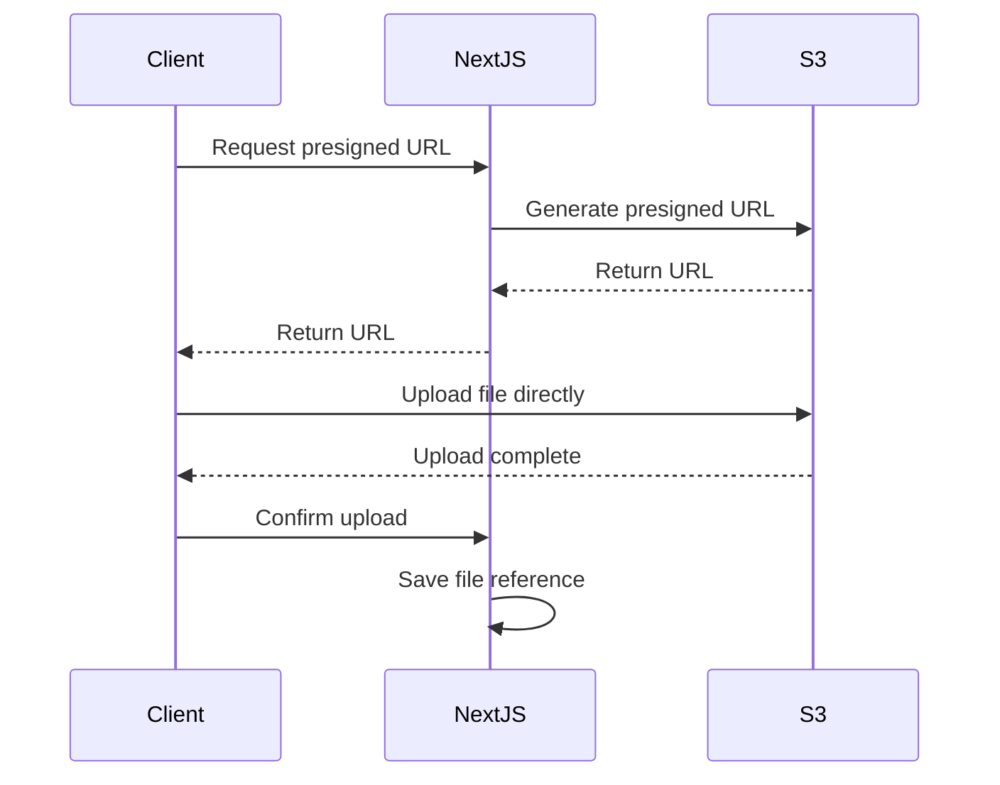

# How to Handle File Uploads in Next.js

Author: [nawazdhandala](https://github.com/nawazdhandala)

Tags: NextJS, File Upload, Forms, API Routes, Storage

Description: A comprehensive guide to implementing file uploads in Next.js with Server Actions, Route Handlers, progress tracking, and cloud storage integration.

---

File uploads in Next.js can be handled through Server Actions, Route Handlers, or external services. This guide covers all approaches with practical examples for different use cases, from simple single-file uploads to complex multi-file uploads with progress tracking.

## Upload Architecture Options


## Method 1: Server Actions (Recommended for App Router)

```tsx
// app/upload/actions.ts
'use server';

import { writeFile, mkdir } from 'fs/promises';
import path from 'path';

export async function uploadFile(formData: FormData) {
  const file = formData.get('file') as File;

  if (!file) {
    return { success: false, error: 'No file provided' };
  }

  // Validate file type
  const allowedTypes = ['image/jpeg', 'image/png', 'image/gif', 'image/webp'];
  if (!allowedTypes.includes(file.type)) {
    return { success: false, error: 'Invalid file type' };
  }

  // Validate file size (5MB limit)
  const maxSize = 5 * 1024 * 1024;
  if (file.size > maxSize) {
    return { success: false, error: 'File too large (max 5MB)' };
  }

  try {
    // Convert File to Buffer
    const bytes = await file.arrayBuffer();
    const buffer = Buffer.from(bytes);

    // Create unique filename
    const uniqueName = `${Date.now()}-${file.name.replace(/\s/g, '-')}`;

    // Ensure upload directory exists
    const uploadDir = path.join(process.cwd(), 'public', 'uploads');
    await mkdir(uploadDir, { recursive: true });

    // Write file to disk
    const filePath = path.join(uploadDir, uniqueName);
    await writeFile(filePath, buffer);

    return {
      success: true,
      url: `/uploads/${uniqueName}`,
      filename: uniqueName,
      size: file.size,
    };
  } catch (error) {
    console.error('Upload error:', error);
    return { success: false, error: 'Upload failed' };
  }
}
```

```tsx
// app/upload/page.tsx
'use client';

import { useState } from 'react';
import { uploadFile } from './actions';

export default function UploadPage() {
  const [status, setStatus] = useState<string>('');
  const [uploadedUrl, setUploadedUrl] = useState<string>('');

  async function handleSubmit(formData: FormData) {
    setStatus('Uploading...');

    const result = await uploadFile(formData);

    if (result.success) {
      setStatus('Upload complete!');
      setUploadedUrl(result.url);
    } else {
      setStatus(`Error: ${result.error}`);
    }
  }

  return (
    <div>
      <h1>File Upload</h1>

      <form action={handleSubmit}>
        <input
          type="file"
          name="file"
          accept="image/*"
          required
        />
        <button type="submit">Upload</button>
      </form>

      <p>{status}</p>

      {uploadedUrl && (
        <div>
          <p>Uploaded file:</p>
          
        </div>
      )}
    </div>
  );
}
```

## Method 2: Route Handler with Streaming

```typescript
// app/api/upload/route.ts
import { NextRequest, NextResponse } from 'next/server';
import { writeFile, mkdir } from 'fs/promises';
import path from 'path';

export const config = {
  api: {
    bodyParser: false, // Disable built-in parser for large files
  },
};

export async function POST(request: NextRequest) {
  try {
    const formData = await request.formData();
    const file = formData.get('file') as File;

    if (!file) {
      return NextResponse.json(
        { error: 'No file provided' },
        { status: 400 }
      );
    }

    // Validate file
    const maxSize = 10 * 1024 * 1024; // 10MB
    if (file.size > maxSize) {
      return NextResponse.json(
        { error: 'File too large' },
        { status: 413 }
      );
    }

    const bytes = await file.arrayBuffer();
    const buffer = Buffer.from(bytes);

    // Generate unique filename
    const ext = path.extname(file.name);
    const uniqueName = `${crypto.randomUUID()}${ext}`;

    // Save to disk
    const uploadDir = path.join(process.cwd(), 'public', 'uploads');
    await mkdir(uploadDir, { recursive: true });
    await writeFile(path.join(uploadDir, uniqueName), buffer);

    return NextResponse.json({
      success: true,
      url: `/uploads/${uniqueName}`,
      filename: file.name,
      size: file.size,
      type: file.type,
    });
  } catch (error) {
    console.error('Upload error:', error);
    return NextResponse.json(
      { error: 'Upload failed' },
      { status: 500 }
    );
  }
}
```

```tsx
// app/upload/ClientUpload.tsx
'use client';

import { useState, useRef } from 'react';

export default function ClientUpload() {
  const [progress, setProgress] = useState(0);
  const [uploading, setUploading] = useState(false);
  const [result, setResult] = useState<any>(null);
  const abortController = useRef<AbortController | null>(null);

  async function handleUpload(e: React.ChangeEvent<HTMLInputElement>) {
    const file = e.target.files?.[0];
    if (!file) return;

    setUploading(true);
    setProgress(0);
    abortController.current = new AbortController();

    const formData = new FormData();
    formData.append('file', file);

    try {
      // Use XMLHttpRequest for progress tracking
      const xhr = new XMLHttpRequest();

      xhr.upload.addEventListener('progress', (e) => {
        if (e.lengthComputable) {
          const percent = Math.round((e.loaded / e.total) * 100);
          setProgress(percent);
        }
      });

      const response = await new Promise((resolve, reject) => {
        xhr.open('POST', '/api/upload');

        xhr.onload = () => {
          if (xhr.status >= 200 && xhr.status < 300) {
            resolve(JSON.parse(xhr.responseText));
          } else {
            reject(new Error(xhr.statusText));
          }
        };

        xhr.onerror = () => reject(new Error('Upload failed'));
        xhr.send(formData);
      });

      setResult(response);
    } catch (error) {
      console.error('Upload error:', error);
      setResult({ error: error.message });
    } finally {
      setUploading(false);
    }
  }

  function cancelUpload() {
    abortController.current?.abort();
    setUploading(false);
    setProgress(0);
  }

  return (
    <div>
      <input
        type="file"
        onChange={handleUpload}
        disabled={uploading}
      />

      {uploading && (
        <div>
          <progress value={progress} max="100" />
          <span>{progress}%</span>
          <button onClick={cancelUpload}>Cancel</button>
        </div>
      )}

      {result && (
        <pre>{JSON.stringify(result, null, 2)}</pre>
      )}
    </div>
  );
}
```

## Method 3: Multiple File Uploads

```tsx
// app/upload/actions.ts
'use server';

import { writeFile, mkdir } from 'fs/promises';
import path from 'path';

interface UploadResult {
  filename: string;
  url: string;
  size: number;
  success: boolean;
  error?: string;
}

export async function uploadMultipleFiles(formData: FormData): Promise<UploadResult[]> {
  const files = formData.getAll('files') as File[];
  const results: UploadResult[] = [];

  const uploadDir = path.join(process.cwd(), 'public', 'uploads');
  await mkdir(uploadDir, { recursive: true });

  for (const file of files) {
    try {
      // Validate each file
      if (file.size > 5 * 1024 * 1024) {
        results.push({
          filename: file.name,
          url: '',
          size: file.size,
          success: false,
          error: 'File too large',
        });
        continue;
      }

      const bytes = await file.arrayBuffer();
      const buffer = Buffer.from(bytes);

      const uniqueName = `${Date.now()}-${Math.random().toString(36).slice(2)}-${file.name}`;
      const filePath = path.join(uploadDir, uniqueName);

      await writeFile(filePath, buffer);

      results.push({
        filename: file.name,
        url: `/uploads/${uniqueName}`,
        size: file.size,
        success: true,
      });
    } catch (error) {
      results.push({
        filename: file.name,
        url: '',
        size: file.size,
        success: false,
        error: 'Upload failed',
      });
    }
  }

  return results;
}
```

```tsx
// app/upload/MultiUpload.tsx
'use client';

import { useState } from 'react';
import { uploadMultipleFiles } from './actions';

export default function MultiUpload() {
  const [files, setFiles] = useState<File[]>([]);
  const [results, setResults] = useState<any[]>([]);
  const [uploading, setUploading] = useState(false);

  function handleFileChange(e: React.ChangeEvent<HTMLInputElement>) {
    if (e.target.files) {
      setFiles(Array.from(e.target.files));
    }
  }

  async function handleUpload() {
    if (files.length === 0) return;

    setUploading(true);

    const formData = new FormData();
    files.forEach((file) => {
      formData.append('files', file);
    });

    const uploadResults = await uploadMultipleFiles(formData);
    setResults(uploadResults);
    setUploading(false);
  }

  return (
    <div>
      <input
        type="file"
        multiple
        onChange={handleFileChange}
        accept="image/*,.pdf,.doc,.docx"
      />

      {files.length > 0 && (
        <div>
          <h3>Selected files:</h3>
          <ul>
            {files.map((file, i) => (
              <li key={i}>
                {file.name} ({(file.size / 1024).toFixed(1)} KB)
              </li>
            ))}
          </ul>
          <button onClick={handleUpload} disabled={uploading}>
            {uploading ? 'Uploading...' : `Upload ${files.length} files`}
          </button>
        </div>
      )}

      {results.length > 0 && (
        <div>
          <h3>Results:</h3>
          <ul>
            {results.map((result, i) => (
              <li key={i} style={{ color: result.success ? 'green' : 'red' }}>
                {result.filename}: {result.success ? 'Success' : result.error}
              </li>
            ))}
          </ul>
        </div>
      )}
    </div>
  );
}
```

## Method 4: Upload to AWS S3

```typescript
// lib/s3.ts
import { S3Client, PutObjectCommand, GetObjectCommand } from '@aws-sdk/client-s3';
import { getSignedUrl } from '@aws-sdk/s3-request-presigner';

const s3Client = new S3Client({
  region: process.env.AWS_REGION!,
  credentials: {
    accessKeyId: process.env.AWS_ACCESS_KEY_ID!,
    secretAccessKey: process.env.AWS_SECRET_ACCESS_KEY!,
  },
});

export async function uploadToS3(
  buffer: Buffer,
  filename: string,
  contentType: string
): Promise<string> {
  const key = `uploads/${Date.now()}-${filename}`;

  await s3Client.send(
    new PutObjectCommand({
      Bucket: process.env.AWS_S3_BUCKET!,
      Key: key,
      Body: buffer,
      ContentType: contentType,
    })
  );

  return `https://${process.env.AWS_S3_BUCKET}.s3.${process.env.AWS_REGION}.amazonaws.com/${key}`;
}

export async function getPresignedUploadUrl(
  filename: string,
  contentType: string
): Promise<{ url: string; key: string }> {
  const key = `uploads/${Date.now()}-${filename}`;

  const command = new PutObjectCommand({
    Bucket: process.env.AWS_S3_BUCKET!,
    Key: key,
    ContentType: contentType,
  });

  const url = await getSignedUrl(s3Client, command, { expiresIn: 3600 });

  return { url, key };
}
```

```tsx
// app/upload/actions.ts
'use server';

import { uploadToS3, getPresignedUploadUrl } from '@/lib/s3';

export async function uploadToCloud(formData: FormData) {
  const file = formData.get('file') as File;

  if (!file) {
    return { success: false, error: 'No file provided' };
  }

  try {
    const bytes = await file.arrayBuffer();
    const buffer = Buffer.from(bytes);

    const url = await uploadToS3(buffer, file.name, file.type);

    return { success: true, url };
  } catch (error) {
    console.error('S3 upload error:', error);
    return { success: false, error: 'Upload failed' };
  }
}

// For direct client-to-S3 uploads (larger files)
export async function getUploadUrl(filename: string, contentType: string) {
  try {
    const { url, key } = await getPresignedUploadUrl(filename, contentType);
    return { success: true, url, key };
  } catch (error) {
    return { success: false, error: 'Failed to generate upload URL' };
  }
}
```

## Direct Upload to S3 (Client-Side)



```tsx
// app/upload/DirectS3Upload.tsx
'use client';

import { useState } from 'react';
import { getUploadUrl } from './actions';

export default function DirectS3Upload() {
  const [progress, setProgress] = useState(0);
  const [uploading, setUploading] = useState(false);

  async function handleUpload(e: React.ChangeEvent<HTMLInputElement>) {
    const file = e.target.files?.[0];
    if (!file) return;

    setUploading(true);
    setProgress(0);

    try {
      // Get presigned URL from server
      const { url, key, success, error } = await getUploadUrl(
        file.name,
        file.type
      );

      if (!success) {
        throw new Error(error);
      }

      // Upload directly to S3
      const xhr = new XMLHttpRequest();

      xhr.upload.addEventListener('progress', (e) => {
        if (e.lengthComputable) {
          setProgress(Math.round((e.loaded / e.total) * 100));
        }
      });

      await new Promise((resolve, reject) => {
        xhr.open('PUT', url);
        xhr.setRequestHeader('Content-Type', file.type);

        xhr.onload = () => {
          if (xhr.status === 200) {
            resolve(xhr.response);
          } else {
            reject(new Error('Upload failed'));
          }
        };

        xhr.onerror = () => reject(new Error('Upload failed'));
        xhr.send(file);
      });

      console.log('Upload complete! Key:', key);
    } catch (error) {
      console.error('Upload error:', error);
    } finally {
      setUploading(false);
    }
  }

  return (
    <div>
      <input type="file" onChange={handleUpload} disabled={uploading} />

      {uploading && (
        <div>
          <progress value={progress} max="100" />
          <span>{progress}%</span>
        </div>
      )}
    </div>
  );
}
```

## Drag and Drop Upload

```tsx
// app/upload/DragDropUpload.tsx
'use client';

import { useState, useCallback } from 'react';
import { uploadFile } from './actions';

export default function DragDropUpload() {
  const [isDragging, setIsDragging] = useState(false);
  const [files, setFiles] = useState<File[]>([]);
  const [uploading, setUploading] = useState(false);

  const handleDrag = useCallback((e: React.DragEvent) => {
    e.preventDefault();
    e.stopPropagation();
  }, []);

  const handleDragIn = useCallback((e: React.DragEvent) => {
    e.preventDefault();
    e.stopPropagation();
    if (e.dataTransfer.items && e.dataTransfer.items.length > 0) {
      setIsDragging(true);
    }
  }, []);

  const handleDragOut = useCallback((e: React.DragEvent) => {
    e.preventDefault();
    e.stopPropagation();
    setIsDragging(false);
  }, []);

  const handleDrop = useCallback((e: React.DragEvent) => {
    e.preventDefault();
    e.stopPropagation();
    setIsDragging(false);

    if (e.dataTransfer.files && e.dataTransfer.files.length > 0) {
      setFiles(Array.from(e.dataTransfer.files));
    }
  }, []);

  async function handleUpload() {
    setUploading(true);

    for (const file of files) {
      const formData = new FormData();
      formData.append('file', file);
      await uploadFile(formData);
    }

    setFiles([]);
    setUploading(false);
  }

  return (
    <div>
      <div
        onDragEnter={handleDragIn}
        onDragLeave={handleDragOut}
        onDragOver={handleDrag}
        onDrop={handleDrop}
        style={{
          border: `2px dashed ${isDragging ? '#0070f3' : '#ccc'}`,
          borderRadius: 8,
          padding: 40,
          textAlign: 'center',
          backgroundColor: isDragging ? '#f0f7ff' : '#fafafa',
          transition: 'all 0.2s',
        }}
      >
        {isDragging ? (
          <p>Drop files here</p>
        ) : (
          <p>Drag and drop files here, or click to select</p>
        )}

        <input
          type="file"
          multiple
          onChange={(e) => setFiles(Array.from(e.target.files || []))}
          style={{ display: 'none' }}
          id="file-input"
        />
        <label htmlFor="file-input" style={{ cursor: 'pointer', color: '#0070f3' }}>
          Browse files
        </label>
      </div>

      {files.length > 0 && (
        <div style={{ marginTop: 20 }}>
          <h4>Selected files:</h4>
          <ul>
            {files.map((file, i) => (
              <li key={i}>{file.name}</li>
            ))}
          </ul>
          <button onClick={handleUpload} disabled={uploading}>
            {uploading ? 'Uploading...' : 'Upload'}
          </button>
        </div>
      )}
    </div>
  );
}
```

## Image Processing Before Upload

```tsx
// lib/image-utils.ts
export async function resizeImage(
  file: File,
  maxWidth: number,
  maxHeight: number,
  quality: number = 0.8
): Promise<Blob> {
  return new Promise((resolve, reject) => {
    const img = new Image();
    const canvas = document.createElement('canvas');
    const ctx = canvas.getContext('2d')!;

    img.onload = () => {
      let { width, height } = img;

      // Calculate new dimensions
      if (width > maxWidth) {
        height = (height * maxWidth) / width;
        width = maxWidth;
      }
      if (height > maxHeight) {
        width = (width * maxHeight) / height;
        height = maxHeight;
      }

      canvas.width = width;
      canvas.height = height;

      ctx.drawImage(img, 0, 0, width, height);

      canvas.toBlob(
        (blob) => {
          if (blob) {
            resolve(blob);
          } else {
            reject(new Error('Failed to create blob'));
          }
        },
        file.type,
        quality
      );
    };

    img.onerror = () => reject(new Error('Failed to load image'));
    img.src = URL.createObjectURL(file);
  });
}
```

```tsx
// Usage in component
import { resizeImage } from '@/lib/image-utils';

async function handleImageUpload(file: File) {
  // Resize image before uploading
  const resizedBlob = await resizeImage(file, 1200, 1200, 0.85);

  const formData = new FormData();
  formData.append('file', resizedBlob, file.name);

  await uploadFile(formData);
}
```

## Configuration for Large Files

```typescript
// next.config.js
/** @type {import('next').NextConfig} */
const nextConfig = {
  // Increase body size limit for API routes
  experimental: {
    serverActions: {
      bodySizeLimit: '10mb',
    },
  },
};

module.exports = nextConfig;
```

## Summary

| Method | Best For | Pros | Cons |
|--------|----------|------|------|
| Server Action | Simple uploads | Easy setup, type-safe | Limited to body size |
| Route Handler | Custom logic | Full control | More code |
| Presigned URL | Large files | Scales well | Complex setup |
| Direct to CDN | Production | Best performance | External dependency |

For most applications, Server Actions provide the simplest approach. Use presigned URLs for files over 5MB or when you need upload progress tracking. Always validate files on the server side regardless of client-side validation.
