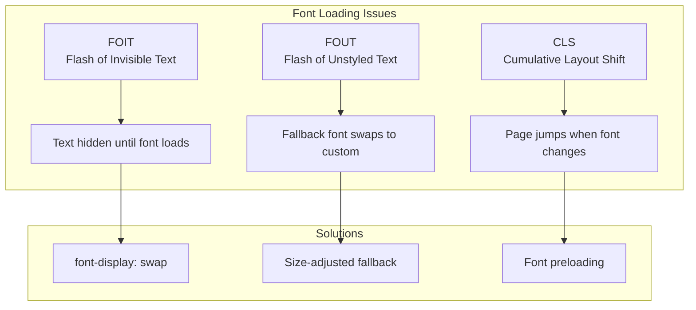
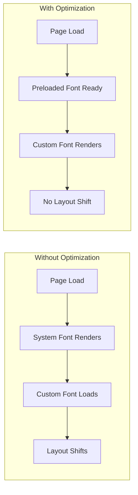
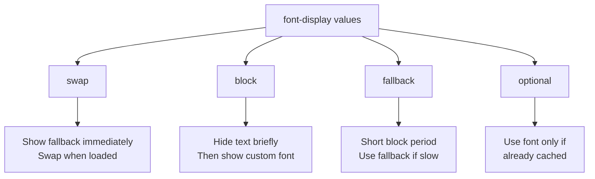

# How to Fix 'Font Loading' Issues in Next.js

Author: [nawazdhandala](https://github.com/nawazdhandala)

Tags: NextJS, Fonts, Performance, CSS, Web Vitals

Description: Learn how to diagnose and fix common font loading issues in Next.js applications, including FOUT, FOIT, and performance optimization.

---

Font loading issues in Next.js can cause layout shifts, invisible text, and poor Core Web Vitals scores. This guide covers the most common font problems and their solutions using the modern `next/font` system.

## Understanding Font Loading Problems



## Using next/font (Recommended)

Next.js provides built-in font optimization through `next/font`:

### Google Fonts

```typescript
// app/layout.tsx
import { Inter, Roboto_Mono } from 'next/font/google';

// Configure primary font
const inter = Inter({
  subsets: ['latin'],
  display: 'swap',
  variable: '--font-inter',
});

// Configure monospace font
const robotoMono = Roboto_Mono({
  subsets: ['latin'],
  display: 'swap',
  variable: '--font-roboto-mono',
});

export default function RootLayout({
  children,
}: {
  children: React.ReactNode;
}) {
  return (
    <html lang="en" className={`${inter.variable} ${robotoMono.variable}`}>
      <body className={inter.className}>
        {children}
      </body>
    </html>
  );
}
```

```css
/* app/globals.css */
:root {
  --font-sans: var(--font-inter), system-ui, sans-serif;
  --font-mono: var(--font-roboto-mono), monospace;
}

body {
  font-family: var(--font-sans);
}

code, pre {
  font-family: var(--font-mono);
}
```

### Local Fonts

```typescript
// app/layout.tsx
import localFont from 'next/font/local';

const myFont = localFont({
  src: [
    {
      path: '../public/fonts/MyFont-Regular.woff2',
      weight: '400',
      style: 'normal',
    },
    {
      path: '../public/fonts/MyFont-Medium.woff2',
      weight: '500',
      style: 'normal',
    },
    {
      path: '../public/fonts/MyFont-Bold.woff2',
      weight: '700',
      style: 'normal',
    },
    {
      path: '../public/fonts/MyFont-Italic.woff2',
      weight: '400',
      style: 'italic',
    },
  ],
  display: 'swap',
  variable: '--font-my-font',
});

export default function RootLayout({
  children,
}: {
  children: React.ReactNode;
}) {
  return (
    <html lang="en" className={myFont.variable}>
      <body className={myFont.className}>
        {children}
      </body>
    </html>
  );
}
```

## Common Issues and Fixes

### Issue 1: Font Not Loading

Symptoms: Default system font appears instead of custom font.

```typescript
// WRONG - Font file path incorrect
const myFont = localFont({
  src: './fonts/MyFont.woff2', // Relative path may not resolve
});

// CORRECT - Use path from project root
const myFont = localFont({
  src: '../public/fonts/MyFont.woff2',
});
```

Verify font file exists:

```bash
# Check if font file exists
ls -la public/fonts/
```

### Issue 2: FOUT (Flash of Unstyled Text)

The fallback font briefly shows before the custom font loads.

```typescript
// Configure size-adjusted fallback
import { Inter } from 'next/font/google';

const inter = Inter({
  subsets: ['latin'],
  display: 'swap',
  // Adjust fallback font metrics to match
  adjustFontFallback: true, // default for Google fonts
});
```

For local fonts, manually adjust fallback:

```typescript
import localFont from 'next/font/local';

const myFont = localFont({
  src: '../public/fonts/MyFont.woff2',
  display: 'swap',
  fallback: ['system-ui', 'arial'],
  adjustFontFallback: 'Arial', // Adjust based on this font
});
```

### Issue 3: Layout Shift (CLS)

Font swap causes visible page jump.



Solution with size-adjusted fallback:

```typescript
// app/layout.tsx
import { Playfair_Display } from 'next/font/google';

const playfair = Playfair_Display({
  subsets: ['latin'],
  display: 'swap',
  // Preload font to reduce CLS
  preload: true,
  // Adjust fallback metrics
  adjustFontFallback: true,
});
```

### Issue 4: Font Not Applied to Specific Components

```typescript
// WRONG - Font not passed to component
// app/layout.tsx
import { Inter } from 'next/font/google';

const inter = Inter({ subsets: ['latin'] });

export default function RootLayout({ children }: { children: React.ReactNode }) {
  return (
    <html lang="en">
      <body>{children}</body> {/* Missing className */}
    </html>
  );
}
```

```typescript
// CORRECT - Apply font className
import { Inter } from 'next/font/google';

const inter = Inter({
  subsets: ['latin'],
  variable: '--font-inter',
});

export default function RootLayout({ children }: { children: React.ReactNode }) {
  return (
    <html lang="en" className={inter.variable}>
      <body className={inter.className}>
        {children}
      </body>
    </html>
  );
}
```

### Issue 5: Multiple Fonts Conflict

```typescript
// app/layout.tsx
import { Inter, Playfair_Display } from 'next/font/google';

const inter = Inter({
  subsets: ['latin'],
  variable: '--font-inter',
});

const playfair = Playfair_Display({
  subsets: ['latin'],
  variable: '--font-playfair',
});

export default function RootLayout({ children }: { children: React.ReactNode }) {
  return (
    <html lang="en" className={`${inter.variable} ${playfair.variable}`}>
      <body className={inter.className}>
        {children}
      </body>
    </html>
  );
}
```

```css
/* app/globals.css */
:root {
  --font-sans: var(--font-inter);
  --font-display: var(--font-playfair);
}

body {
  font-family: var(--font-sans);
}

h1, h2, h3 {
  font-family: var(--font-display);
}
```

### Issue 6: Font Not Working in Production

Build-time vs runtime font loading issues:

```typescript
// Check for server/client mismatch
// WRONG - Dynamic import breaks preloading
const MyComponent = () => {
  const [fontLoaded, setFontLoaded] = useState(false);

  useEffect(() => {
    // This approach loses next/font optimization
    import('next/font/google').then(({ Inter }) => {
      // Font loading here breaks SSR
    });
  }, []);
};
```

```typescript
// CORRECT - Define fonts at module level
import { Inter } from 'next/font/google';

// Font configuration runs at build time
const inter = Inter({ subsets: ['latin'] });

export default function MyComponent() {
  return <div className={inter.className}>Content</div>;
}
```

### Issue 7: Subset Not Including Required Characters

```typescript
// WRONG - Missing characters for specific language
const inter = Inter({
  subsets: ['latin'], // Missing extended characters
});

// CORRECT - Include needed subsets
const inter = Inter({
  subsets: ['latin', 'latin-ext', 'cyrillic'],
});
```

Available subsets vary by font. Check Google Fonts for available subsets.

### Issue 8: Variable Font Weight Not Working

```typescript
// For variable fonts, specify weight range
import { Inter } from 'next/font/google';

const inter = Inter({
  subsets: ['latin'],
  // Variable font supports range
  weight: ['100', '200', '300', '400', '500', '600', '700', '800', '900'],
  // Or use 'variable' for automatic
  // weight: 'variable',
});
```

```css
/* Use any weight within the range */
.light-text {
  font-weight: 300;
}

.regular-text {
  font-weight: 400;
}

.bold-text {
  font-weight: 700;
}
```

## Font Loading with Tailwind CSS

```typescript
// app/layout.tsx
import { Inter, Fira_Code } from 'next/font/google';

const inter = Inter({
  subsets: ['latin'],
  variable: '--font-inter',
});

const firaCode = Fira_Code({
  subsets: ['latin'],
  variable: '--font-fira-code',
});

export default function RootLayout({ children }: { children: React.ReactNode }) {
  return (
    <html lang="en" className={`${inter.variable} ${firaCode.variable}`}>
      <body>
        {children}
      </body>
    </html>
  );
}
```

```javascript
// tailwind.config.js
module.exports = {
  theme: {
    extend: {
      fontFamily: {
        sans: ['var(--font-inter)', 'system-ui', 'sans-serif'],
        mono: ['var(--font-fira-code)', 'monospace'],
      },
    },
  },
};
```

```tsx
// Usage in components
export function MyComponent() {
  return (
    <div>
      <p className="font-sans">Regular text with Inter</p>
      <code className="font-mono">Code with Fira Code</code>
    </div>
  );
}
```

## Performance Optimization

### Preload Critical Fonts

```typescript
// app/layout.tsx
import { Inter } from 'next/font/google';

const inter = Inter({
  subsets: ['latin'],
  display: 'swap',
  preload: true, // Preload in document head
});
```

### Subset for Smaller Bundle

```typescript
// Only load characters you need
const inter = Inter({
  subsets: ['latin'],
  // Optionally specify exact characters
  // This reduces font file size
});
```

### Font Display Strategies



```typescript
// Choose based on use case
const headingFont = Playfair_Display({
  subsets: ['latin'],
  display: 'swap', // Best for most cases
});

const bodyFont = Inter({
  subsets: ['latin'],
  display: 'optional', // For non-critical fonts
});
```

## Debugging Font Issues

### Check Font Loading in DevTools

```typescript
// Add debug logging
'use client';

import { useEffect } from 'react';

export function FontDebugger() {
  useEffect(() => {
    if (typeof document !== 'undefined') {
      document.fonts.ready.then(() => {
        console.log('Fonts loaded:',
          Array.from(document.fonts).map(f => `${f.family} ${f.weight}`)
        );
      });
    }
  }, []);

  return null;
}
```

### Verify Font Files

```typescript
// pages/api/check-fonts.ts (for debugging)
import { NextApiRequest, NextApiResponse } from 'next';
import fs from 'fs';
import path from 'path';

export default function handler(req: NextApiRequest, res: NextApiResponse) {
  const fontsDir = path.join(process.cwd(), 'public', 'fonts');

  try {
    const files = fs.readdirSync(fontsDir);
    res.json({
      fontsDirectory: fontsDir,
      files,
      exists: true
    });
  } catch (error) {
    res.json({
      fontsDirectory: fontsDir,
      exists: false,
      error: 'Fonts directory not found'
    });
  }
}
```

## Summary

| Issue | Solution |
|-------|----------|
| Font not loading | Check file paths, verify files exist |
| FOUT (flash of unstyled text) | Use `adjustFontFallback` |
| Layout shift (CLS) | Enable `preload`, use size-adjusted fallback |
| Font not applied | Apply `className` to body/html |
| Missing characters | Add required subsets |
| Production issues | Define fonts at module level, not in effects |
| Variable weight not working | Specify weight array or 'variable' |

Using `next/font` provides automatic optimization including self-hosting, preloading, and CSS size-adjust for fallback fonts. Always define fonts at the module level, use CSS variables for flexibility, and include only the subsets you need for optimal performance.
