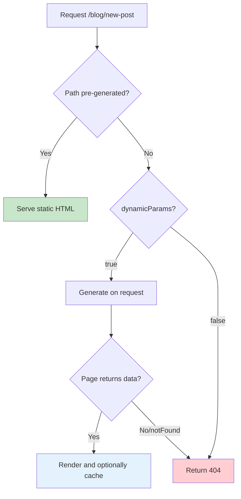

# How to Fix 'generateStaticParams' Errors in Next.js

Author: [nawazdhandala](https://github.com/nawazdhandala)

Tags: NextJS, Static Generation, SSG, Dynamic Routes, Troubleshooting

Description: Diagnose and resolve common generateStaticParams errors in Next.js including return type issues, missing params, and build-time data fetching problems.

---

The `generateStaticParams` function in Next.js enables static generation for dynamic routes. When it fails, builds break with cryptic errors, pages 404 unexpectedly, or static generation falls back to dynamic rendering. This guide covers every common error and how to fix it.

## How generateStaticParams Works

```mermaid
flowchart TD
    A[Build Start] --> B[generateStaticParams called]
    B --> C{Returns array of params}
    C -->|Valid array| D[Generate static pages]
    C -->|Error/Invalid| E[Build fails]

    D --> F[/blog/post-1]
    D --> G[/blog/post-2]
    D --> H[/blog/post-3]

    F --> I[Static HTML files]
    G --> I
    H --> I

    style B fill:#e3f2fd
    style D fill:#c8e6c9
    style E fill:#ffcdd2
```

## Error 1: Invalid Return Type

The most common error occurs when the return type does not match the expected format.

```tsx
// WRONG: Returning objects without proper param names
export async function generateStaticParams() {
  const posts = await getPosts();

  // This returns { id: '1' } but route expects { slug: '...' }
  return posts.map((post) => ({
    id: post.id, // Wrong key name
  }));
}

// Route: app/blog/[slug]/page.tsx
// Error: generateStaticParams returned invalid params
```

```tsx
// CORRECT: Match param names to route segment
// Route: app/blog/[slug]/page.tsx

export async function generateStaticParams() {
  const posts = await getPosts();

  return posts.map((post) => ({
    slug: post.slug, // Matches [slug] in route
  }));
}
```

## Error 2: Multiple Dynamic Segments

When your route has multiple dynamic segments, return all of them.

```tsx
// Route: app/blog/[category]/[slug]/page.tsx

// WRONG: Missing one of the params
export async function generateStaticParams() {
  const posts = await getPosts();

  return posts.map((post) => ({
    slug: post.slug,
    // Missing 'category' param!
  }));
}
```

```tsx
// CORRECT: Return all dynamic segments
// Route: app/blog/[category]/[slug]/page.tsx

export async function generateStaticParams() {
  const posts = await getPosts();

  return posts.map((post) => ({
    category: post.category,
    slug: post.slug,
  }));
}

// Each returned object becomes a static page:
// /blog/tech/hello-world
// /blog/news/breaking-news
```

## Error 3: Catch-All Route Params

Catch-all routes require array values for the dynamic segment.

```tsx
// Route: app/docs/[...slug]/page.tsx

// WRONG: String instead of array
export async function generateStaticParams() {
  return [
    { slug: 'getting-started' }, // Should be array
    { slug: 'api/reference' },   // Should be array
  ];
}
```

```tsx
// CORRECT: Return arrays for catch-all segments
// Route: app/docs/[...slug]/page.tsx

export async function generateStaticParams() {
  return [
    { slug: ['getting-started'] },           // /docs/getting-started
    { slug: ['api', 'reference'] },          // /docs/api/reference
    { slug: ['guides', 'advanced', 'auth'] }, // /docs/guides/advanced/auth
  ];
}
```

## Error 4: Optional Catch-All Routes

Optional catch-all routes can include an empty array for the root.

```tsx
// Route: app/shop/[[...categories]]/page.tsx

export async function generateStaticParams() {
  return [
    { categories: [] },                    // /shop (root)
    { categories: ['electronics'] },       // /shop/electronics
    { categories: ['electronics', 'phones'] }, // /shop/electronics/phones
  ];
}
```

## Error 5: Async Data Fetching Failures

When data fetching fails during build, generateStaticParams throws.

```tsx
// WRONG: No error handling
export async function generateStaticParams() {
  // If this fails, build crashes
  const response = await fetch('https://api.example.com/posts');
  const posts = await response.json();

  return posts.map((post) => ({ slug: post.slug }));
}
```

```tsx
// CORRECT: Handle errors gracefully
export async function generateStaticParams() {
  try {
    const response = await fetch('https://api.example.com/posts', {
      // Ensure fresh data at build time
      cache: 'no-store',
    });

    if (!response.ok) {
      console.error('Failed to fetch posts:', response.status);
      return []; // Return empty array - pages will 404 or use fallback
    }

    const posts = await response.json();

    return posts.map((post) => ({
      slug: post.slug,
    }));
  } catch (error) {
    console.error('Error in generateStaticParams:', error);
    return []; // Graceful fallback
  }
}
```

## Error 6: Environment Variables Not Available

Build-time functions may not have access to runtime environment variables.

```tsx
// WRONG: Using runtime-only env vars
export async function generateStaticParams() {
  // NEXT_PUBLIC_ vars work, but others may not
  const apiUrl = process.env.API_URL; // May be undefined at build time

  const response = await fetch(`${apiUrl}/posts`);
  // Fails if apiUrl is undefined
}
```

```tsx
// CORRECT: Use build-time available variables
export async function generateStaticParams() {
  // Use NEXT_PUBLIC_ prefix for client-accessible vars
  const apiUrl = process.env.NEXT_PUBLIC_API_URL;

  // Or hardcode for build time, override at runtime
  const buildTimeUrl = process.env.BUILD_API_URL || 'https://api.example.com';

  const response = await fetch(`${buildTimeUrl}/posts`);
  const posts = await response.json();

  return posts.map((post) => ({
    slug: post.slug,
  }));
}
```

## Error 7: Database Connections at Build Time

Direct database queries require proper connection handling.

```tsx
// WRONG: Connection may not be available at build
import { db } from '@/lib/db';

export async function generateStaticParams() {
  // May fail if DB is not accessible during build
  const posts = await db.post.findMany();

  return posts.map((post) => ({
    slug: post.slug,
  }));
}
```

```tsx
// CORRECT: Handle connection and provide fallback
import { db } from '@/lib/db';

export async function generateStaticParams() {
  try {
    const posts = await db.post.findMany({
      where: { published: true },
      select: { slug: true },
    });

    return posts.map((post) => ({
      slug: post.slug,
    }));
  } catch (error) {
    console.error('Database error in generateStaticParams:', error);

    // Option 1: Return empty array (pages use dynamic fallback)
    return [];

    // Option 2: Return known slugs as fallback
    // return [{ slug: 'about' }, { slug: 'contact' }];
  }
}
```

## Error 8: Params Not Matching Page Props

The params passed to the page must match what generateStaticParams returns.

```tsx
// generateStaticParams returns this:
export async function generateStaticParams() {
  return [
    { slug: 'hello-world' },
    { slug: 'next-js-guide' },
  ];
}

// WRONG: Page expects different param structure
export default function Page({ params }: { params: { id: string } }) {
  // Looking for 'id' but params has 'slug'
  return <div>Post: {params.id}</div>;
}
```

```tsx
// CORRECT: Page params match generateStaticParams
export default function Page({ params }: { params: { slug: string } }) {
  return <div>Post: {params.slug}</div>;
}

// With async params (Next.js 15+)
export default async function Page({
  params
}: {
  params: Promise<{ slug: string }>
}) {
  const { slug } = await params;
  return <div>Post: {slug}</div>;
}
```

## Error 9: Dynamic Rendering Fallback Issues

Configure what happens when a path is not pre-generated.

```tsx
// app/blog/[slug]/page.tsx

export async function generateStaticParams() {
  const posts = await getPublishedPosts();
  return posts.map((post) => ({ slug: post.slug }));
}

// Control fallback behavior
export const dynamicParams = true; // Allow paths not in generateStaticParams
// export const dynamicParams = false; // 404 for unknown paths

export default async function Page({ params }: { params: { slug: string } }) {
  const post = await getPost(params.slug);

  if (!post) {
    notFound(); // Return 404 page
  }

  return <article>{post.content}</article>;
}
```



## Error 10: Nested Dynamic Routes

Parent and child routes each need their own generateStaticParams.

```tsx
// app/shop/[category]/page.tsx
export async function generateStaticParams() {
  const categories = await getCategories();
  return categories.map((cat) => ({
    category: cat.slug,
  }));
}

// app/shop/[category]/[product]/page.tsx
export async function generateStaticParams() {
  const products = await getAllProducts();

  return products.map((product) => ({
    category: product.category.slug,
    product: product.slug,
  }));
}

// Or, generate child params for each parent
export async function generateStaticParams({
  params
}: {
  params: { category: string }
}) {
  // This receives parent params
  const products = await getProductsByCategory(params.category);

  return products.map((product) => ({
    product: product.slug,
  }));
}
```

## Error 11: TypeScript Type Errors

Ensure proper typing for generateStaticParams.

```tsx
// app/blog/[slug]/page.tsx

// Define the params type
type Params = {
  slug: string;
};

// Type the function return
export async function generateStaticParams(): Promise<Params[]> {
  const posts = await getPosts();

  return posts.map((post) => ({
    slug: post.slug,
  }));
}

// Type the page props
type Props = {
  params: Params;
  searchParams: { [key: string]: string | string[] | undefined };
};

export default function Page({ params }: Props) {
  return <div>Slug: {params.slug}</div>;
}
```

## Error 12: Build Performance Issues

Large numbers of pages can cause build timeouts.

```tsx
// WRONG: Generating thousands of pages
export async function generateStaticParams() {
  const allProducts = await getAllProducts(); // 50,000 products
  return allProducts.map((p) => ({ slug: p.slug }));
}
```

```tsx
// CORRECT: Limit static generation, use dynamic fallback
export async function generateStaticParams() {
  // Only pre-generate popular/important pages
  const topProducts = await getTopProducts(100);

  return topProducts.map((product) => ({
    slug: product.slug,
  }));
}

// Allow other products to be generated on-demand
export const dynamicParams = true;

// Optionally, set revalidation for on-demand pages
export const revalidate = 3600; // Revalidate every hour
```

## Debugging generateStaticParams

```tsx
// Add logging to debug issues
export async function generateStaticParams() {
  console.log('generateStaticParams started');

  try {
    const posts = await getPosts();
    console.log(`Found ${posts.length} posts`);

    const params = posts.map((post) => {
      console.log(`Generating params for: ${post.slug}`);
      return { slug: post.slug };
    });

    console.log('Generated params:', JSON.stringify(params, null, 2));
    return params;
  } catch (error) {
    console.error('generateStaticParams error:', error);
    throw error; // Re-throw to see in build output
  }
}
```

```bash
# Run build with verbose output
npm run build 2>&1 | tee build.log

# Search for generateStaticParams output
grep -A 20 "generateStaticParams" build.log
```

## Complete Working Example

```tsx
// app/blog/[slug]/page.tsx
import { notFound } from 'next/navigation';
import { getPostBySlug, getAllPostSlugs } from '@/lib/posts';

// Generate static params at build time
export async function generateStaticParams() {
  try {
    const slugs = await getAllPostSlugs();

    // Return array of param objects
    return slugs.map((slug) => ({
      slug,
    }));
  } catch (error) {
    console.error('Failed to generate static params:', error);
    return [];
  }
}

// Configure dynamic behavior
export const dynamicParams = true; // Allow non-pre-generated paths
export const revalidate = 3600; // Revalidate every hour

// Generate metadata for each page
export async function generateMetadata({
  params
}: {
  params: { slug: string }
}) {
  const post = await getPostBySlug(params.slug);

  if (!post) {
    return { title: 'Post Not Found' };
  }

  return {
    title: post.title,
    description: post.excerpt,
  };
}

// Page component
export default async function BlogPost({
  params
}: {
  params: { slug: string }
}) {
  const post = await getPostBySlug(params.slug);

  if (!post) {
    notFound();
  }

  return (
    <article>
      <h1>{post.title}</h1>
      <time>{post.date}</time>
      <div dangerouslySetInnerHTML={{ __html: post.content }} />
    </article>
  );
}
```

## Summary

| Error | Solution |
|-------|----------|
| Invalid return type | Match param keys to route segment names |
| Missing params | Return all dynamic segments |
| Catch-all errors | Use arrays for [...slug] routes |
| Fetch failures | Add try/catch with fallback |
| Env var issues | Use NEXT_PUBLIC_ or build-time vars |
| DB connection | Handle errors, provide fallbacks |
| Type mismatches | Ensure page params match function return |
| Unknown paths 404 | Set dynamicParams = true |
| Build timeouts | Limit pre-generated pages |

The key to successful static generation is ensuring generateStaticParams returns an array of objects where each key matches a dynamic segment in your route path. Always handle errors gracefully and consider using dynamic fallbacks for large numbers of pages.
