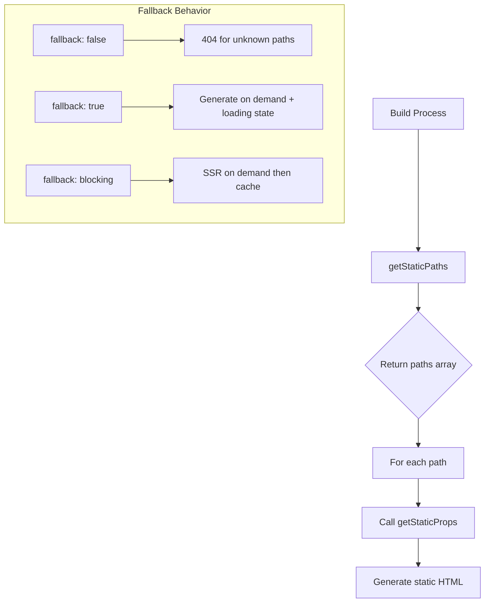

# How to Fix 'getStaticPaths' Build Errors in Next.js

Author: [nawazdhandala](https://www.github.com/nawazdhandala)

Tags: Next.js, getStaticPaths, Static Generation, Build Errors, SSG, Pages Router

Description: Learn how to diagnose and fix common getStaticPaths build errors in Next.js including fallback issues, parameter mismatches, and data fetching problems.

---

The `getStaticPaths` function is essential for static generation of dynamic routes in Next.js. Build errors in this function can prevent deployment and break your application. This guide covers common errors and their solutions.

## Understanding getStaticPaths



## Error 1: Missing getStaticPaths

### The Error

```
Error: getStaticPaths is required for dynamic SSG pages and is missing
for '/posts/[slug]'.
```

### The Cause

Dynamic routes using `getStaticProps` require `getStaticPaths` to define which paths to pre-render.

### The Solution

Add `getStaticPaths` to your dynamic page:

```typescript
// pages/posts/[slug].tsx
import { GetStaticPaths, GetStaticProps } from 'next';

interface Post {
  slug: string;
  title: string;
  content: string;
}

interface PostPageProps {
  post: Post;
}

export default function PostPage({ post }: PostPageProps) {
  return (
    <article>
      <h1>{post.title}</h1>
      <div dangerouslySetInnerHTML={{ __html: post.content }} />
    </article>
  );
}

// Required for dynamic routes with getStaticProps
export const getStaticPaths: GetStaticPaths = async () => {
  // Fetch all possible slugs
  const posts = await getAllPosts();

  const paths = posts.map((post) => ({
    params: { slug: post.slug },
  }));

  return {
    paths,
    fallback: false, // or 'blocking' or true
  };
};

export const getStaticProps: GetStaticProps<PostPageProps> = async ({ params }) => {
  const slug = params?.slug as string;
  const post = await getPostBySlug(slug);

  if (!post) {
    return { notFound: true };
  }

  return {
    props: { post },
  };
};
```

## Error 2: Invalid paths Format

### The Error

```
Error: Additional keys were returned from `getStaticPaths` in page "/posts/[slug]".
URL Parameters intended for this dynamic route must be nested under `params`.
```

### The Cause

The paths array must have a specific structure with params nested correctly.

### The Solution

Ensure proper paths structure:

```typescript
// WRONG: params not nested
export const getStaticPaths: GetStaticPaths = async () => {
  return {
    paths: [
      { slug: 'first-post' },  // Wrong
      { slug: 'second-post' }, // Wrong
    ],
    fallback: false,
  };
};

// CORRECT: params properly nested
export const getStaticPaths: GetStaticPaths = async () => {
  return {
    paths: [
      { params: { slug: 'first-post' } },  // Correct
      { params: { slug: 'second-post' } }, // Correct
    ],
    fallback: false,
  };
};
```

## Error 3: Parameter Type Mismatch

### The Error

```
Error: A required parameter (id) was not provided as a string in getStaticPaths
for /products/[id]
```

### The Cause

All path parameters must be strings, even numeric IDs.

### The Solution

Convert all parameters to strings:

```typescript
// WRONG: numeric values
export const getStaticPaths: GetStaticPaths = async () => {
  const products = await getProducts();

  return {
    paths: products.map((product) => ({
      params: { id: product.id }, // If id is number, this fails
    })),
    fallback: false,
  };
};

// CORRECT: convert to strings
export const getStaticPaths: GetStaticPaths = async () => {
  const products = await getProducts();

  return {
    paths: products.map((product) => ({
      params: { id: String(product.id) }, // Explicit string conversion
    })),
    fallback: false,
  };
};

// Alternative: use toString()
export const getStaticPaths: GetStaticPaths = async () => {
  const products = await getProducts();

  return {
    paths: products.map((product) => ({
      params: { id: product.id.toString() },
    })),
    fallback: false,
  };
};
```

## Error 4: Missing Parameter in Paths

### The Error

```
Error: A required parameter (category) was not provided as a string in
getStaticPaths for /shop/[category]/[productId]
```

### The Cause

Multi-segment dynamic routes require all parameters in the paths.

### The Solution

Include all required parameters:

```typescript
// pages/shop/[category]/[productId].tsx

// WRONG: missing category parameter
export const getStaticPaths: GetStaticPaths = async () => {
  const products = await getProducts();

  return {
    paths: products.map((product) => ({
      params: { productId: product.id.toString() }, // Missing category
    })),
    fallback: false,
  };
};

// CORRECT: all parameters included
export const getStaticPaths: GetStaticPaths = async () => {
  const products = await getProducts();

  return {
    paths: products.map((product) => ({
      params: {
        category: product.category, // Include category
        productId: product.id.toString(), // Include productId
      },
    })),
    fallback: false,
  };
};
```

## Error 5: Catch-All Route Parameter Issues

### The Error

```
Error: A required parameter (slug) was not provided as an array in
getStaticPaths for /docs/[...slug]
```

### The Cause

Catch-all routes (`[...slug]`) require parameters as arrays.

### The Solution

Return parameters as arrays:

```typescript
// pages/docs/[...slug].tsx

// WRONG: slug as string
export const getStaticPaths: GetStaticPaths = async () => {
  return {
    paths: [
      { params: { slug: 'getting-started' } }, // Wrong: string
    ],
    fallback: false,
  };
};

// CORRECT: slug as array
export const getStaticPaths: GetStaticPaths = async () => {
  return {
    paths: [
      { params: { slug: ['getting-started'] } }, // Single segment
      { params: { slug: ['guides', 'installation'] } }, // Multiple segments
      { params: { slug: ['api', 'reference', 'hooks'] } }, // Deep path
    ],
    fallback: false,
  };
};

// Dynamic generation from data
export const getStaticPaths: GetStaticPaths = async () => {
  const docs = await getAllDocPaths();
  // docs might be: ['getting-started', 'guides/installation', 'api/reference/hooks']

  const paths = docs.map((docPath) => ({
    params: {
      slug: docPath.split('/'), // Convert string path to array
    },
  }));

  return { paths, fallback: false };
};
```

## Error 6: Optional Catch-All with Empty Array

### The Error

When using optional catch-all routes (`[[...slug]]`), handling the root path incorrectly.

### The Solution

Handle both root and nested paths:

```typescript
// pages/docs/[[...slug]].tsx
export const getStaticPaths: GetStaticPaths = async () => {
  const docs = await getAllDocPaths();

  const paths = [
    // Root path (/docs) - slug should be undefined or empty array
    { params: { slug: [] } }, // or { params: {} }

    // Nested paths
    ...docs.map((docPath) => ({
      params: {
        slug: docPath.split('/'),
      },
    })),
  ];

  return { paths, fallback: false };
};

export const getStaticProps: GetStaticProps = async ({ params }) => {
  const slug = params?.slug as string[] | undefined;

  if (!slug || slug.length === 0) {
    // Handle root /docs page
    const indexDoc = await getDocsIndex();
    return { props: { doc: indexDoc } };
  }

  // Handle nested pages
  const doc = await getDocByPath(slug.join('/'));
  return { props: { doc } };
};
```

## Error 7: Empty Paths Array with fallback: false

### The Error

```
Error: getStaticPaths for /posts/[slug] returned an empty paths array.
```

### The Cause

When `fallback: false`, you need at least one path or handle the empty case.

### The Solution

Handle empty data gracefully:

```typescript
export const getStaticPaths: GetStaticPaths = async () => {
  try {
    const posts = await getAllPosts();

    // If no posts exist yet
    if (!posts || posts.length === 0) {
      return {
        paths: [],
        fallback: 'blocking', // Use blocking to generate on demand
      };
    }

    const paths = posts.map((post) => ({
      params: { slug: post.slug },
    }));

    return { paths, fallback: false };
  } catch (error) {
    console.error('Error fetching posts:', error);

    // Return empty with fallback for resilience
    return {
      paths: [],
      fallback: 'blocking',
    };
  }
};
```

## Error 8: Fallback Page Without Loading State

### The Error

When using `fallback: true`, pages crash during client-side navigation.

### The Solution

Handle the fallback loading state:

```typescript
// pages/posts/[slug].tsx
import { useRouter } from 'next/router';
import { GetStaticPaths, GetStaticProps } from 'next';

export default function PostPage({ post }) {
  const router = useRouter();

  // Handle fallback loading state
  if (router.isFallback) {
    return (
      <div>
        <h1>Loading...</h1>
        <p>Please wait while we load this content.</p>
      </div>
    );
  }

  // Handle case where post is null (optional safety check)
  if (!post) {
    return <div>Post not found</div>;
  }

  return (
    <article>
      <h1>{post.title}</h1>
      <div dangerouslySetInnerHTML={{ __html: post.content }} />
    </article>
  );
}

export const getStaticPaths: GetStaticPaths = async () => {
  // Only pre-render most popular posts
  const popularPosts = await getPopularPosts(10);

  const paths = popularPosts.map((post) => ({
    params: { slug: post.slug },
  }));

  return {
    paths,
    fallback: true, // Generate other pages on-demand
  };
};

export const getStaticProps: GetStaticProps = async ({ params }) => {
  const slug = params?.slug as string;

  try {
    const post = await getPostBySlug(slug);

    if (!post) {
      return { notFound: true };
    }

    return {
      props: { post },
      revalidate: 3600, // Revalidate every hour
    };
  } catch (error) {
    return { notFound: true };
  }
};
```

## Error 9: API Fetch Failures During Build

### The Error

```
Error: fetch failed
    at getStaticPaths (/pages/posts/[slug].tsx:25:20)
```

### The Cause

External API unavailable during build time or incorrect URL.

### The Solution

Handle API errors and provide fallbacks:

```typescript
export const getStaticPaths: GetStaticPaths = async () => {
  try {
    // Use absolute URL for server-side fetch
    const baseUrl = process.env.NEXT_PUBLIC_API_URL || 'http://localhost:3000';
    const res = await fetch(`${baseUrl}/api/posts`, {
      // Add timeout
      signal: AbortSignal.timeout(10000),
    });

    if (!res.ok) {
      throw new Error(`API returned ${res.status}`);
    }

    const posts = await res.json();

    return {
      paths: posts.map((post: { slug: string }) => ({
        params: { slug: post.slug },
      })),
      fallback: 'blocking',
    };
  } catch (error) {
    console.error('getStaticPaths error:', error);

    // Return empty paths with fallback for resilience
    return {
      paths: [],
      fallback: 'blocking',
    };
  }
};
```

## Error 10: Locale Handling Issues

### The Error

```
Error: getStaticPaths locales mismatch
```

### The Cause

When using internationalization, paths must include locale information.

### The Solution

Handle locales in getStaticPaths:

```typescript
// next.config.js
module.exports = {
  i18n: {
    locales: ['en', 'fr', 'de'],
    defaultLocale: 'en',
  },
};

// pages/posts/[slug].tsx
export const getStaticPaths: GetStaticPaths = async ({ locales }) => {
  const posts = await getAllPosts();

  // Generate paths for all locales
  const paths = [];

  for (const locale of locales || ['en']) {
    for (const post of posts) {
      paths.push({
        params: { slug: post.slug },
        locale, // Include locale
      });
    }
  }

  return { paths, fallback: false };
};

// Alternative: Generate paths per locale
export const getStaticPaths: GetStaticPaths = async ({ locales }) => {
  const paths = [];

  for (const locale of locales || ['en']) {
    // Fetch locale-specific posts
    const posts = await getPostsByLocale(locale);

    paths.push(
      ...posts.map((post) => ({
        params: { slug: post.slug },
        locale,
      }))
    );
  }

  return { paths, fallback: 'blocking' };
};
```

## Debugging getStaticPaths

```typescript
export const getStaticPaths: GetStaticPaths = async () => {
  console.log('=== getStaticPaths started ===');
  console.log('Environment:', process.env.NODE_ENV);
  console.log('API URL:', process.env.NEXT_PUBLIC_API_URL);

  try {
    const data = await fetchData();
    console.log('Data fetched:', data?.length, 'items');

    const paths = data.map((item) => {
      const path = { params: { slug: item.slug } };
      console.log('Generated path:', JSON.stringify(path));
      return path;
    });

    console.log('Total paths:', paths.length);
    console.log('=== getStaticPaths completed ===');

    return { paths, fallback: 'blocking' };
  } catch (error) {
    console.error('=== getStaticPaths error ===');
    console.error('Error:', error);
    throw error;
  }
};
```

## Comparison of Fallback Options


## Best Practices

1. **Use appropriate fallback** based on your content update frequency
2. **Handle loading states** when using `fallback: true`
3. **Convert all params to strings** before returning
4. **Handle API failures gracefully** with try-catch blocks
5. **Log during development** to debug path generation
6. **Consider ISR** for frequently updated content
7. **Pre-render popular pages** and use fallback for the rest

## Conclusion

getStaticPaths errors typically stem from incorrect parameter formats, missing required values, or data fetching issues. By ensuring proper path structure, handling all required parameters, and implementing robust error handling, you can avoid most build errors. Choose the appropriate fallback strategy based on your content needs and user experience requirements.
