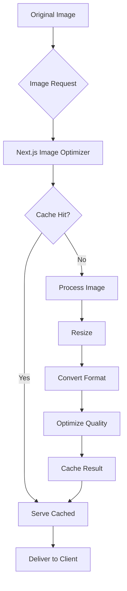
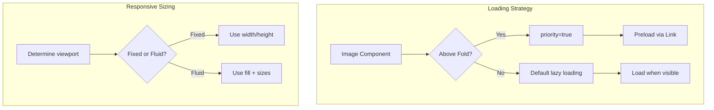

# How to Fix 'Image Optimization' Errors in Next.js

Author: [nawazdhandala](https://www.github.com/nawazdhandala)

Tags: Next.js, Image Optimization, Performance, Web Development, Troubleshooting, next/image

Description: Learn how to diagnose and fix common Image Optimization errors in Next.js including configuration issues, domain whitelisting, and loader problems.

---

Next.js provides built-in image optimization through the `next/image` component, but misconfigurations can lead to various errors. This guide covers common Image Optimization errors and their solutions.

## Understanding Next.js Image Optimization

The `next/image` component optimizes images on-demand, serving them in modern formats like WebP when supported, and resizing them to fit the device.



## Error 1: Invalid src Prop

### The Error

```
Error: Invalid src prop (https://example.com/image.jpg) on `next/image`,
hostname "example.com" is not configured under images in your `next.config.js`
```

### The Cause

External images require explicit domain configuration for security reasons.

### The Solution

Configure allowed domains in `next.config.js`:

```javascript
// next.config.js

/** @type {import('next').NextConfig} */
const nextConfig = {
  images: {
    // Modern approach (Next.js 12.3+)
    remotePatterns: [
      {
        protocol: 'https',
        hostname: 'example.com',
        port: '',
        pathname: '/images/**',
      },
      {
        protocol: 'https',
        hostname: '**.example.com', // Wildcard for subdomains
      },
      {
        protocol: 'https',
        hostname: 'cdn.example.com',
        pathname: '/uploads/**',
      },
    ],

    // Legacy approach (still supported)
    domains: ['example.com', 'cdn.example.com'],
  },
};

module.exports = nextConfig;
```

### Multiple Domains Pattern

```javascript
// next.config.js
const nextConfig = {
  images: {
    remotePatterns: [
      // AWS S3
      {
        protocol: 'https',
        hostname: '**.amazonaws.com',
      },
      // Cloudinary
      {
        protocol: 'https',
        hostname: 'res.cloudinary.com',
        pathname: '/your-cloud-name/**',
      },
      // Unsplash
      {
        protocol: 'https',
        hostname: 'images.unsplash.com',
      },
      // Your CDN
      {
        protocol: 'https',
        hostname: 'cdn.yoursite.com',
      },
    ],
  },
};

module.exports = nextConfig;
```

## Error 2: Image Missing Required Props

### The Error

```
Error: Image with src "/hero.jpg" must use "width" and "height" properties
or "fill" property.
```

### The Cause

Next.js requires image dimensions to prevent layout shift.

### The Solution

Provide dimensions or use the fill property:

```tsx
import Image from 'next/image';

// Option 1: Explicit width and height
export function ExplicitDimensions() {
  return (
    <Image
      src="/hero.jpg"
      alt="Hero image"
      width={1200}
      height={600}
      priority // Load immediately for above-the-fold images
    />
  );
}

// Option 2: Fill the parent container
export function FillContainer() {
  return (
    <div style={{ position: 'relative', width: '100%', height: '400px' }}>
      <Image
        src="/hero.jpg"
        alt="Hero image"
        fill
        style={{ objectFit: 'cover' }}
        sizes="100vw"
      />
    </div>
  );
}

// Option 3: Static import (dimensions inferred automatically)
import heroImage from '../public/hero.jpg';

export function StaticImport() {
  return (
    <Image
      src={heroImage}
      alt="Hero image"
      placeholder="blur" // Automatic blur placeholder
    />
  );
}
```

## Error 3: Image Optimization Disabled

### The Error

```
Error: Image Optimization using Next.js' default loader is not compatible
with `next export`.
```

### The Cause

Static exports cannot use the built-in image optimizer.

### The Solution

Use a custom loader or disable optimization:

```javascript
// next.config.js

// Option 1: Disable optimization for static export
const nextConfig = {
  output: 'export',
  images: {
    unoptimized: true,
  },
};

// Option 2: Use a custom loader
const nextConfig = {
  output: 'export',
  images: {
    loader: 'custom',
    loaderFile: './my-loader.js',
  },
};

module.exports = nextConfig;
```

Create a custom loader:

```javascript
// my-loader.js

// Cloudinary loader example
export default function cloudinaryLoader({ src, width, quality }) {
  const params = ['f_auto', 'c_limit', `w_${width}`, `q_${quality || 'auto'}`];
  return `https://res.cloudinary.com/your-cloud/image/upload/${params.join(',')}${src}`;
}

// Imgix loader example
export function imgixLoader({ src, width, quality }) {
  const url = new URL(`https://your-domain.imgix.net${src}`);
  url.searchParams.set('auto', 'format');
  url.searchParams.set('fit', 'max');
  url.searchParams.set('w', width.toString());
  if (quality) {
    url.searchParams.set('q', quality.toString());
  }
  return url.href;
}
```

## Error 4: Invalid Quality Value

### The Error

```
Error: Image with src "/photo.jpg" has invalid "quality" property.
Expected a number from 1 to 100 but received 150.
```

### The Solution

Use valid quality values:

```tsx
import Image from 'next/image';

export function QualityExample() {
  return (
    <>
      {/* Valid quality: 1-100 */}
      <Image
        src="/photo.jpg"
        alt="High quality"
        width={800}
        height={600}
        quality={90} // High quality
      />

      <Image
        src="/thumbnail.jpg"
        alt="Thumbnail"
        width={200}
        height={150}
        quality={75} // Default quality
      />

      <Image
        src="/background.jpg"
        alt="Background"
        width={1920}
        height={1080}
        quality={50} // Lower quality for large backgrounds
      />
    </>
  );
}
```

## Error 5: Sizes Property Missing with Fill

### The Warning

```
Warning: Image with src "/banner.jpg" has "fill" but is missing "sizes" prop.
```

### The Cause

Without `sizes`, the browser cannot make optimal choices about which image to load.

### The Solution

Add appropriate sizes:

```tsx
import Image from 'next/image';

export function ResponsiveImage() {
  return (
    <div style={{ position: 'relative', width: '100%', height: '50vh' }}>
      <Image
        src="/banner.jpg"
        alt="Banner"
        fill
        sizes="100vw" // Full viewport width
        style={{ objectFit: 'cover' }}
      />
    </div>
  );
}

export function GridImage() {
  return (
    <div style={{ position: 'relative', width: '100%', aspectRatio: '1/1' }}>
      <Image
        src="/product.jpg"
        alt="Product"
        fill
        // Responsive sizes based on breakpoints
        sizes="(max-width: 640px) 100vw, (max-width: 1024px) 50vw, 33vw"
        style={{ objectFit: 'contain' }}
      />
    </div>
  );
}

export function SidebarImage() {
  return (
    <aside style={{ width: '300px', position: 'relative', height: '200px' }}>
      <Image
        src="/sidebar-ad.jpg"
        alt="Advertisement"
        fill
        sizes="300px" // Fixed width sidebar
        style={{ objectFit: 'cover' }}
      />
    </aside>
  );
}
```

## Error 6: Sharp Module Missing

### The Error

```
Error: 'sharp' is required to be installed in standalone mode for the
image optimization to function correctly.
```

### The Solution

Install sharp for production optimization:

```bash
# Install sharp
npm install sharp

# For specific platforms
npm install --platform=linux --arch=x64 sharp
```

Configure for standalone builds:

```javascript
// next.config.js
const nextConfig = {
  output: 'standalone',
  // Sharp will be included automatically
};

module.exports = nextConfig;
```

Dockerfile configuration:

```dockerfile
# Dockerfile
FROM node:20-alpine AS builder

WORKDIR /app
COPY package*.json ./

# Install dependencies including sharp
RUN npm ci

COPY . .
RUN npm run build

FROM node:20-alpine AS runner

WORKDIR /app

# Copy standalone output
COPY --from=builder /app/.next/standalone ./
COPY --from=builder /app/.next/static ./.next/static
COPY --from=builder /app/public ./public

EXPOSE 3000
CMD ["node", "server.js"]
```

## Error 7: Image Too Large

### The Error

```
Error: The requested resource exceeds the maximum size limit (10MB)
```

### The Solution

Configure device sizes and image sizes:

```javascript
// next.config.js
const nextConfig = {
  images: {
    // Configure device widths for srcset
    deviceSizes: [640, 750, 828, 1080, 1200, 1920, 2048, 3840],

    // Configure image widths for srcset
    imageSizes: [16, 32, 48, 64, 96, 128, 256, 384],

    // Limit response size
    minimumCacheTTL: 60,

    // Format priority
    formats: ['image/avif', 'image/webp'],
  },
};

module.exports = nextConfig;
```

Optimize images before uploading:

```typescript
// utils/imageOptimization.ts
import sharp from 'sharp';

export async function optimizeForUpload(
  buffer: Buffer,
  maxWidth: number = 2048
): Promise<Buffer> {
  const image = sharp(buffer);
  const metadata = await image.metadata();

  // Only resize if larger than max
  if (metadata.width && metadata.width > maxWidth) {
    return image
      .resize(maxWidth, null, { withoutEnlargement: true })
      .webp({ quality: 80 })
      .toBuffer();
  }

  return image.webp({ quality: 80 }).toBuffer();
}
```

## Error 8: Blur Placeholder Issues

### The Error

```
Error: Image with src "/dynamic.jpg" has "placeholder='blur'" property
but is missing the "blurDataURL" property.
```

### The Solution

Provide blur data URL for remote images:

```tsx
import Image from 'next/image';

// For static imports, blur is automatic
import localImage from '../public/photo.jpg';

export function LocalImageWithBlur() {
  return (
    <Image
      src={localImage}
      alt="Local photo"
      placeholder="blur" // Works automatically
    />
  );
}

// For remote images, generate blur data URL
export function RemoteImageWithBlur() {
  const blurDataURL =
    'data:image/jpeg;base64,/9j/4AAQSkZJRgABAQAAAQABAAD/2wBDAAMCAgMCAgMDAwMEAwMEBQgFBQQEBQoHBwYIDAoMCwsKCwsNDhIQDQ4RDgsLEBYQERMUFRUVDA8XGBYUGBIUFRT/2wBDAQMEBAUEBQkFBQkUDQsNFBQUFBQUFBQUFBQUFBQUFBQUFBQUFBQUFBQUFBQUFBQUFBQUFBQUFBQUFBQUFBQUFBT/wAARCAAIAAoDASIAAhEBAxEB/8QAFgABAQEAAAAAAAAAAAAAAAAAAAYH/8QAIhAAAgEDBAMBAAAAAAAAAAAAAQIDAAQRBQYSIRMxQWH/xAAVAQEBAAAAAAAAAAAAAAAAAAADBP/EABsRAAICAwEAAAAAAAAAAAAAAAABAgMREjFR/9oADAMBAAIRAxEAPwC5bT7i/wBNsYL6Jba4MgLiKNuS+GPXYA/ahpUrw2ItLuMW+JfLKwZ35mC4Y9D4x1SlKXaWqy3pv//Z';

  return (
    <Image
      src="https://example.com/photo.jpg"
      alt="Remote photo"
      width={800}
      height={600}
      placeholder="blur"
      blurDataURL={blurDataURL}
    />
  );
}

// Generate blur placeholder at build time
export async function getStaticProps() {
  const imageUrl = 'https://example.com/photo.jpg';
  const blurDataURL = await generateBlurDataURL(imageUrl);

  return {
    props: {
      imageUrl,
      blurDataURL,
    },
  };
}

// Helper to generate blur data URL
async function generateBlurDataURL(url: string): Promise<string> {
  const response = await fetch(url);
  const buffer = await response.arrayBuffer();

  const { default: sharp } = await import('sharp');
  const resizedBuffer = await sharp(Buffer.from(buffer))
    .resize(10, 10, { fit: 'inside' })
    .toBuffer();

  return `data:image/jpeg;base64,${resizedBuffer.toString('base64')}`;
}
```

## Error 9: Content Security Policy Blocks Images

### The Error

Images fail to load with CSP errors in the browser console.

### The Solution

Configure Content Security Policy headers:

```javascript
// next.config.js
const nextConfig = {
  async headers() {
    return [
      {
        source: '/:path*',
        headers: [
          {
            key: 'Content-Security-Policy',
            value: [
              "default-src 'self'",
              // Allow images from your domains
              "img-src 'self' https://cdn.example.com https://*.amazonaws.com data: blob:",
              // Allow inline styles for Image component
              "style-src 'self' 'unsafe-inline'",
            ].join('; '),
          },
        ],
      },
    ];
  },
  images: {
    remotePatterns: [
      { hostname: 'cdn.example.com' },
      { hostname: '**.amazonaws.com' },
    ],
  },
};

module.exports = nextConfig;
```

## Performance Optimization



### Optimized Image Component

```tsx
import Image from 'next/image';

interface OptimizedImageProps {
  src: string;
  alt: string;
  priority?: boolean;
  aspectRatio?: '16/9' | '4/3' | '1/1' | 'auto';
  objectFit?: 'cover' | 'contain' | 'fill';
}

export function OptimizedImage({
  src,
  alt,
  priority = false,
  aspectRatio = '16/9',
  objectFit = 'cover',
}: OptimizedImageProps) {
  const aspectRatioMap = {
    '16/9': 'aspect-video',
    '4/3': 'aspect-[4/3]',
    '1/1': 'aspect-square',
    'auto': 'aspect-auto',
  };

  return (
    <div
      className={`relative w-full ${aspectRatioMap[aspectRatio]}`}
      style={{ position: 'relative' }}
    >
      <Image
        src={src}
        alt={alt}
        fill
        priority={priority}
        sizes="(max-width: 640px) 100vw, (max-width: 1024px) 75vw, 50vw"
        style={{ objectFit }}
        // Generate blur placeholder for known images
        placeholder={src.startsWith('/') ? 'empty' : 'empty'}
      />
    </div>
  );
}
```

## Debugging Image Issues

```typescript
// components/ImageDebug.tsx
'use client';

import Image from 'next/image';
import { useState } from 'react';

export function ImageDebug({ src, alt }: { src: string; alt: string }) {
  const [status, setStatus] = useState<'loading' | 'loaded' | 'error'>('loading');
  const [error, setError] = useState<string | null>(null);

  return (
    <div>
      <div style={{ position: 'relative', width: '300px', height: '200px' }}>
        <Image
          src={src}
          alt={alt}
          fill
          sizes="300px"
          onLoad={() => setStatus('loaded')}
          onError={(e) => {
            setStatus('error');
            setError(e.currentTarget.src);
          }}
        />
      </div>
      <p>Status: {status}</p>
      {error && <p>Failed to load: {error}</p>}
    </div>
  );
}
```

## Complete Configuration Example

```javascript
// next.config.js

/** @type {import('next').NextConfig} */
const nextConfig = {
  images: {
    // Remote image patterns
    remotePatterns: [
      {
        protocol: 'https',
        hostname: 'cdn.yoursite.com',
        pathname: '/images/**',
      },
      {
        protocol: 'https',
        hostname: '**.cloudinary.com',
      },
      {
        protocol: 'https',
        hostname: 'images.unsplash.com',
      },
    ],

    // Device sizes for responsive images
    deviceSizes: [640, 750, 828, 1080, 1200, 1920, 2048],

    // Image sizes for width-based srcset
    imageSizes: [16, 32, 48, 64, 96, 128, 256, 384],

    // Preferred formats (in order of preference)
    formats: ['image/avif', 'image/webp'],

    // Minimum cache TTL in seconds
    minimumCacheTTL: 86400, // 24 hours

    // Disable static image imports (not recommended)
    // disableStaticImages: false,

    // Enable dangerous SVG support
    // dangerouslyAllowSVG: true,
    // contentSecurityPolicy: "default-src 'self'; script-src 'none'; sandbox;",
  },
};

module.exports = nextConfig;
```

## Conclusion

Next.js Image Optimization errors usually stem from missing configuration, incorrect props, or environment-specific issues. By properly configuring remote patterns, providing required dimensions, and using appropriate loaders for your deployment target, you can resolve most issues. Always test image loading in both development and production environments to catch configuration problems early.
