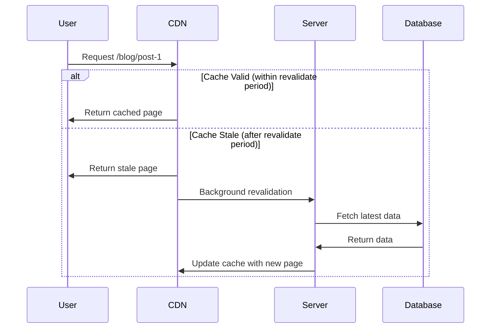
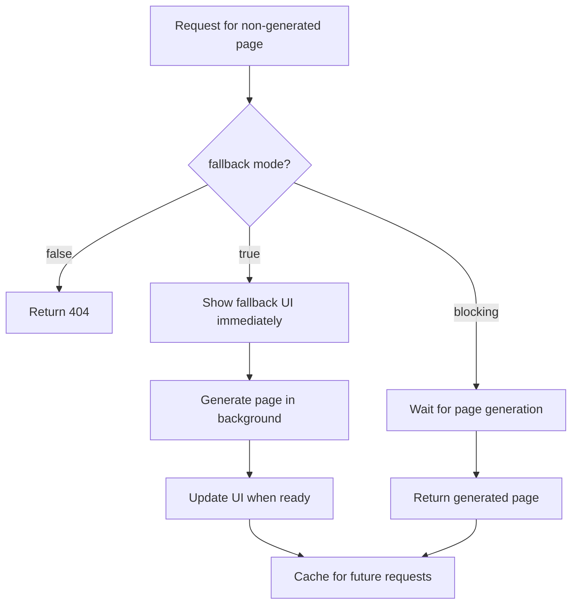
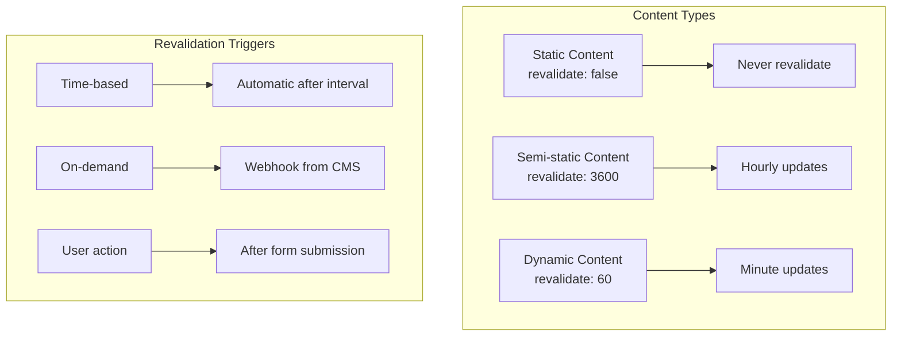

# How to Handle Incremental Static Regeneration (ISR)

Author: [nawazdhandala](https://github.com/nawazdhandala)

Tags: NextJS, ISR, Static Generation, Performance, Caching

Description: Learn how to implement and optimize Incremental Static Regeneration in Next.js for dynamic content with static performance.

---

Incremental Static Regeneration (ISR) combines the performance benefits of static generation with the freshness of dynamic content. It allows you to update static pages after deployment without rebuilding the entire site. This guide covers implementation patterns for both the App Router and Pages Router.

## How ISR Works



## ISR in App Router (Next.js 13+)

### Basic Revalidation

```typescript
// app/blog/[slug]/page.tsx
interface PageProps {
  params: Promise<{ slug: string }>;
}

// Revalidate every 60 seconds
export const revalidate = 60;

export default async function BlogPost({ params }: PageProps) {
  const { slug } = await params;
  const post = await getPost(slug);

  return (
    <article>
      <h1>{post.title}</h1>
      <div dangerouslySetInnerHTML={{ __html: post.content }} />
      <p>Last updated: {new Date().toISOString()}</p>
    </article>
  );
}

async function getPost(slug: string) {
  const res = await fetch(`https://api.example.com/posts/${slug}`, {
    // Per-fetch revalidation (alternative to page-level)
    next: { revalidate: 60 }
  });
  return res.json();
}
```

### Generate Static Params

Pre-generate pages at build time:

```typescript
// app/blog/[slug]/page.tsx
interface PageProps {
  params: Promise<{ slug: string }>;
}

export const revalidate = 60;

// Generate static pages at build time
export async function generateStaticParams() {
  const posts = await getAllPosts();

  return posts.map((post) => ({
    slug: post.slug,
  }));
}

export default async function BlogPost({ params }: PageProps) {
  const { slug } = await params;
  const post = await getPost(slug);

  if (!post) {
    notFound();
  }

  return (
    <article>
      <h1>{post.title}</h1>
      <div dangerouslySetInnerHTML={{ __html: post.content }} />
    </article>
  );
}

async function getAllPosts() {
  const res = await fetch('https://api.example.com/posts');
  return res.json();
}

async function getPost(slug: string) {
  const res = await fetch(`https://api.example.com/posts/${slug}`);
  if (!res.ok) return null;
  return res.json();
}

function notFound(): never {
  throw new Error('Not found');
}
```

### Dynamic Params Behavior

Control what happens for paths not generated at build time:

```typescript
// app/blog/[slug]/page.tsx

// Allow dynamic params - generate on first request
export const dynamicParams = true; // default

// Or block dynamic params - return 404 for non-generated paths
// export const dynamicParams = false;

export async function generateStaticParams() {
  // Only these slugs will be pre-generated
  const posts = await getPopularPosts();
  return posts.map((post) => ({ slug: post.slug }));
}

async function getPopularPosts() {
  // Return popular posts for pre-generation
  const res = await fetch('https://api.example.com/posts?popular=true');
  return res.json();
}
```

## ISR in Pages Router

### Basic Implementation

```typescript
// pages/blog/[slug].tsx
import { GetStaticProps, GetStaticPaths } from 'next';

interface Post {
  slug: string;
  title: string;
  content: string;
}

interface PageProps {
  post: Post;
  generatedAt: string;
}

export const getStaticPaths: GetStaticPaths = async () => {
  const posts = await getAllPosts();

  return {
    paths: posts.map((post) => ({
      params: { slug: post.slug },
    })),
    // Enable ISR for new paths
    fallback: 'blocking',
  };
};

export const getStaticProps: GetStaticProps<PageProps> = async ({ params }) => {
  const slug = params?.slug as string;
  const post = await getPost(slug);

  if (!post) {
    return { notFound: true };
  }

  return {
    props: {
      post,
      generatedAt: new Date().toISOString(),
    },
    // Revalidate every 60 seconds
    revalidate: 60,
  };
};

export default function BlogPost({ post, generatedAt }: PageProps) {
  return (
    <article>
      <h1>{post.title}</h1>
      <div dangerouslySetInnerHTML={{ __html: post.content }} />
      <p>Generated at: {generatedAt}</p>
    </article>
  );
}

async function getAllPosts(): Promise<Post[]> {
  const res = await fetch('https://api.example.com/posts');
  return res.json();
}

async function getPost(slug: string): Promise<Post | null> {
  const res = await fetch(`https://api.example.com/posts/${slug}`);
  if (!res.ok) return null;
  return res.json();
}
```

### Fallback Modes



```typescript
// pages/blog/[slug].tsx
import { useRouter } from 'next/router';
import { GetStaticPaths, GetStaticProps } from 'next';

interface Post {
  slug: string;
  title: string;
  content: string;
}

interface PageProps {
  post: Post;
}

export const getStaticPaths: GetStaticPaths = async () => {
  const posts = await getPopularPosts();

  return {
    paths: posts.map((post) => ({
      params: { slug: post.slug },
    })),
    // fallback options:
    // 'blocking' - Wait for generation, no loading state
    // true - Show loading state while generating
    // false - Return 404 for non-generated paths
    fallback: true,
  };
};

export const getStaticProps: GetStaticProps<PageProps> = async ({ params }) => {
  const slug = params?.slug as string;
  const post = await getPost(slug);

  if (!post) {
    return { notFound: true };
  }

  return {
    props: { post },
    revalidate: 60,
  };
};

export default function BlogPost({ post }: PageProps) {
  const router = useRouter();

  // Handle fallback state when fallback: true
  if (router.isFallback) {
    return (
      <div>
        <h1>Loading...</h1>
        <p>Please wait while we generate this page.</p>
      </div>
    );
  }

  return (
    <article>
      <h1>{post.title}</h1>
      <div dangerouslySetInnerHTML={{ __html: post.content }} />
    </article>
  );
}

async function getPopularPosts(): Promise<Post[]> {
  const res = await fetch('https://api.example.com/posts?popular=true');
  return res.json();
}

async function getPost(slug: string): Promise<Post | null> {
  const res = await fetch(`https://api.example.com/posts/${slug}`);
  if (!res.ok) return null;
  return res.json();
}
```

## On-Demand Revalidation

Trigger revalidation programmatically when content changes:

### App Router On-Demand Revalidation

```typescript
// app/api/revalidate/route.ts
import { revalidatePath, revalidateTag } from 'next/cache';
import { NextRequest, NextResponse } from 'next/server';

export async function POST(request: NextRequest) {
  const body = await request.json();
  const { secret, path, tag } = body;

  // Validate secret token
  if (secret !== process.env.REVALIDATION_SECRET) {
    return NextResponse.json({ error: 'Invalid secret' }, { status: 401 });
  }

  try {
    if (path) {
      // Revalidate specific path
      revalidatePath(path);
      return NextResponse.json({ revalidated: true, path });
    }

    if (tag) {
      // Revalidate by cache tag
      revalidateTag(tag);
      return NextResponse.json({ revalidated: true, tag });
    }

    return NextResponse.json({ error: 'Path or tag required' }, { status: 400 });
  } catch (error) {
    return NextResponse.json({ error: 'Revalidation failed' }, { status: 500 });
  }
}
```

Using cache tags for granular revalidation:

```typescript
// app/blog/[slug]/page.tsx
interface PageProps {
  params: Promise<{ slug: string }>;
}

export default async function BlogPost({ params }: PageProps) {
  const { slug } = await params;

  // Tag this fetch for targeted revalidation
  const post = await fetch(`https://api.example.com/posts/${slug}`, {
    next: {
      tags: ['posts', `post-${slug}`],
    },
  }).then(res => res.json());

  return (
    <article>
      <h1>{post.title}</h1>
      <div dangerouslySetInnerHTML={{ __html: post.content }} />
    </article>
  );
}
```

```typescript
// Trigger revalidation from CMS webhook
// POST /api/revalidate
// Body: { "secret": "your-secret", "tag": "post-my-post-slug" }
```

### Pages Router On-Demand Revalidation

```typescript
// pages/api/revalidate.ts
import type { NextApiRequest, NextApiResponse } from 'next';

export default async function handler(
  req: NextApiRequest,
  res: NextApiResponse
) {
  // Validate secret
  if (req.query.secret !== process.env.REVALIDATION_SECRET) {
    return res.status(401).json({ message: 'Invalid secret' });
  }

  const path = req.query.path as string;

  if (!path) {
    return res.status(400).json({ message: 'Path is required' });
  }

  try {
    // Revalidate the specified path
    await res.revalidate(path);
    return res.json({ revalidated: true, path });
  } catch (err) {
    return res.status(500).json({ message: 'Error revalidating' });
  }
}
```

## ISR with Database Queries

```typescript
// app/products/[id]/page.tsx
import { db } from '@/lib/database';

interface PageProps {
  params: Promise<{ id: string }>;
}

export const revalidate = 300; // 5 minutes

export async function generateStaticParams() {
  // Pre-generate top 100 products
  const products = await db.product.findMany({
    take: 100,
    orderBy: { views: 'desc' },
    select: { id: true },
  });

  return products.map((product) => ({
    id: product.id.toString(),
  }));
}

export default async function ProductPage({ params }: PageProps) {
  const { id } = await params;

  const product = await db.product.findUnique({
    where: { id: parseInt(id) },
    include: {
      category: true,
      reviews: {
        take: 10,
        orderBy: { createdAt: 'desc' },
      },
    },
  });

  if (!product) {
    notFound();
  }

  return (
    <div>
      <h1>{product.name}</h1>
      <p>{product.description}</p>
      <p>Price: ${product.price}</p>
      <p>Category: {product.category.name}</p>

      <h2>Reviews</h2>
      {product.reviews.map((review) => (
        <div key={review.id}>
          <p>{review.content}</p>
          <p>Rating: {review.rating}/5</p>
        </div>
      ))}
    </div>
  );
}

function notFound(): never {
  throw new Error('Not found');
}
```

## ISR Caching Strategy



Choosing revalidation intervals:

| Content Type | Recommended Interval | Example |
|--------------|---------------------|---------|
| Marketing pages | 3600 (1 hour) | Landing pages |
| Blog posts | 300 (5 min) | Article content |
| Product listings | 60 (1 min) | E-commerce catalog |
| User-generated | 30 seconds | Comments, reviews |
| Real-time data | 0 (no ISR) | Stock prices, live scores |

## Error Handling in ISR

```typescript
// app/blog/[slug]/page.tsx
import { unstable_cache } from 'next/cache';

interface PageProps {
  params: Promise<{ slug: string }>;
}

export const revalidate = 60;

// Cache the fetch with error handling
const getPostCached = unstable_cache(
  async (slug: string) => {
    try {
      const res = await fetch(`https://api.example.com/posts/${slug}`);

      if (!res.ok) {
        // Return null for not found, throw for other errors
        if (res.status === 404) return null;
        throw new Error(`API error: ${res.status}`);
      }

      return res.json();
    } catch (error) {
      console.error('Failed to fetch post:', error);
      // Re-throw to prevent caching the error
      throw error;
    }
  },
  ['posts'],
  { revalidate: 60, tags: ['posts'] }
);

export default async function BlogPost({ params }: PageProps) {
  const { slug } = await params;

  try {
    const post = await getPostCached(slug);

    if (!post) {
      notFound();
    }

    return (
      <article>
        <h1>{post.title}</h1>
        <div dangerouslySetInnerHTML={{ __html: post.content }} />
      </article>
    );
  } catch (error) {
    // Show error UI instead of breaking the page
    return (
      <div>
        <h1>Unable to load post</h1>
        <p>Please try again later.</p>
      </div>
    );
  }
}

function notFound(): never {
  throw new Error('Not found');
}
```

## Monitoring ISR

Track ISR behavior in production:

```typescript
// lib/monitoring.ts
export async function trackISRRegeneration(path: string, duration: number) {
  // Send to monitoring service
  await fetch('https://monitoring.example.com/metrics', {
    method: 'POST',
    headers: { 'Content-Type': 'application/json' },
    body: JSON.stringify({
      metric: 'isr_regeneration',
      path,
      duration,
      timestamp: Date.now(),
    }),
  });
}
```

```typescript
// app/blog/[slug]/page.tsx
import { trackISRRegeneration } from '@/lib/monitoring';

interface PageProps {
  params: Promise<{ slug: string }>;
}

export const revalidate = 60;

export default async function BlogPost({ params }: PageProps) {
  const { slug } = await params;
  const startTime = Date.now();

  const post = await getPost(slug);

  // Track regeneration time (runs during ISR)
  const duration = Date.now() - startTime;
  trackISRRegeneration(`/blog/${slug}`, duration);

  return (
    <article>
      <h1>{post.title}</h1>
      <div dangerouslySetInnerHTML={{ __html: post.content }} />
    </article>
  );
}

async function getPost(slug: string) {
  const res = await fetch(`https://api.example.com/posts/${slug}`);
  return res.json();
}
```

## Summary

| Feature | App Router | Pages Router |
|---------|-----------|--------------|
| Time-based revalidation | `export const revalidate = 60` | `revalidate: 60` in getStaticProps |
| Static params | `generateStaticParams()` | `getStaticPaths()` |
| On-demand revalidation | `revalidatePath()`, `revalidateTag()` | `res.revalidate()` |
| Cache tags | `next: { tags: [] }` | Not available |
| Fallback UI | `loading.tsx` | `router.isFallback` |

ISR provides an excellent balance between static performance and content freshness. Use time-based revalidation for predictable updates and on-demand revalidation when you need immediate content changes. Monitor your regeneration patterns to optimize the revalidation intervals for your specific use case.
