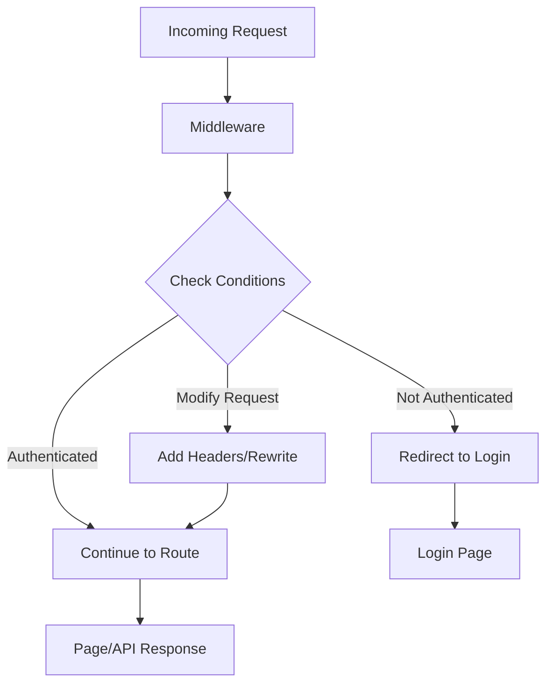
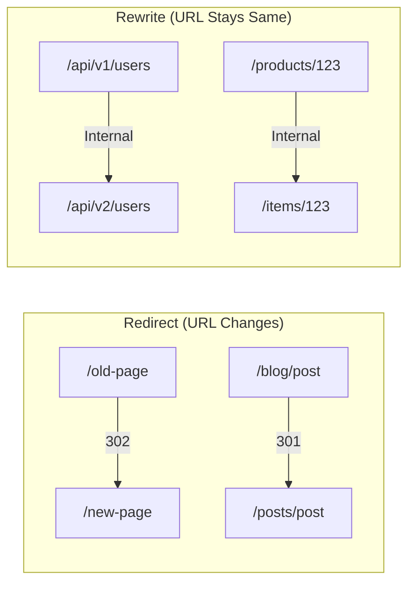

# How to Configure Middleware in Next.js 13+

Author: [nawazdhandala](https://www.github.com/nawazdhandala)

Tags: Next.js, Middleware, Authentication, Edge Runtime, Web Development, Security

Description: Learn how to configure and use middleware in Next.js 13+ for authentication, redirects, headers, and request modification at the edge.

---

Next.js Middleware runs before a request is completed, allowing you to modify the response by rewriting, redirecting, modifying headers, or responding directly. Middleware runs at the edge, making it fast and efficient for tasks like authentication, A/B testing, and internationalization.

## Understanding Middleware Flow



## Basic Middleware Setup

Create a `middleware.ts` file in your project root or `src` directory:

```typescript
// middleware.ts
import { NextResponse } from 'next/server';
import type { NextRequest } from 'next/server';

export function middleware(request: NextRequest) {
  // Log all requests
  console.log(`[${request.method}] ${request.nextUrl.pathname}`);

  // Continue to the route
  return NextResponse.next();
}

// Configure which paths run middleware
export const config = {
  matcher: [
    // Match all paths except static files and api routes
    '/((?!_next/static|_next/image|favicon.ico).*)',
  ],
};
```

## Matcher Configuration

The matcher determines which routes trigger the middleware:

```typescript
// middleware.ts

// Option 1: Simple path matching
export const config = {
  matcher: '/dashboard/:path*',
};

// Option 2: Multiple paths
export const config = {
  matcher: ['/dashboard/:path*', '/admin/:path*', '/api/:path*'],
};

// Option 3: Regex patterns
export const config = {
  matcher: [
    // Match all paths except static files
    '/((?!_next/static|_next/image|favicon.ico|public).*)',
  ],
};

// Option 4: Complex matching
export const config = {
  matcher: [
    // Match /dashboard and all subpaths
    '/dashboard/:path*',
    // Match /api but not /api/public
    '/api/((?!public).*)',
    // Match all /admin routes
    '/admin/:path*',
  ],
};
```

## Authentication Middleware

### Basic Authentication Check

```typescript
// middleware.ts
import { NextResponse } from 'next/server';
import type { NextRequest } from 'next/server';

// Define protected routes
const protectedRoutes = ['/dashboard', '/profile', '/settings', '/admin'];
const authRoutes = ['/login', '/register', '/forgot-password'];

export function middleware(request: NextRequest) {
  const { pathname } = request.nextUrl;

  // Get token from cookies
  const token = request.cookies.get('auth-token')?.value;

  // Check if accessing protected route without auth
  const isProtectedRoute = protectedRoutes.some(
    (route) => pathname === route || pathname.startsWith(`${route}/`)
  );

  if (isProtectedRoute && !token) {
    // Redirect to login with return URL
    const loginUrl = new URL('/login', request.url);
    loginUrl.searchParams.set('returnTo', pathname);
    return NextResponse.redirect(loginUrl);
  }

  // Redirect authenticated users away from auth pages
  const isAuthRoute = authRoutes.some((route) => pathname.startsWith(route));

  if (isAuthRoute && token) {
    return NextResponse.redirect(new URL('/dashboard', request.url));
  }

  return NextResponse.next();
}

export const config = {
  matcher: [
    '/dashboard/:path*',
    '/profile/:path*',
    '/settings/:path*',
    '/admin/:path*',
    '/login',
    '/register',
    '/forgot-password',
  ],
};
```

### JWT Token Verification

```typescript
// middleware.ts
import { NextResponse } from 'next/server';
import type { NextRequest } from 'next/server';
import { jwtVerify } from 'jose';

// Secret key for JWT verification (use env variable)
const JWT_SECRET = new TextEncoder().encode(
  process.env.JWT_SECRET || 'your-secret-key'
);

interface JWTPayload {
  userId: string;
  email: string;
  role: string;
  exp: number;
}

async function verifyToken(token: string): Promise<JWTPayload | null> {
  try {
    const { payload } = await jwtVerify(token, JWT_SECRET);
    return payload as unknown as JWTPayload;
  } catch (error) {
    return null;
  }
}

export async function middleware(request: NextRequest) {
  const { pathname } = request.nextUrl;

  // Get token from cookie or Authorization header
  const token =
    request.cookies.get('auth-token')?.value ||
    request.headers.get('Authorization')?.replace('Bearer ', '');

  // Public routes that do not require auth
  if (pathname.startsWith('/public') || pathname === '/') {
    return NextResponse.next();
  }

  // Verify token for protected routes
  if (!token) {
    return NextResponse.redirect(new URL('/login', request.url));
  }

  const payload = await verifyToken(token);

  if (!payload) {
    // Invalid or expired token
    const response = NextResponse.redirect(new URL('/login', request.url));
    response.cookies.delete('auth-token');
    return response;
  }

  // Role-based access control
  if (pathname.startsWith('/admin') && payload.role !== 'admin') {
    return NextResponse.redirect(new URL('/unauthorized', request.url));
  }

  // Add user info to headers for downstream use
  const requestHeaders = new Headers(request.headers);
  requestHeaders.set('x-user-id', payload.userId);
  requestHeaders.set('x-user-role', payload.role);

  return NextResponse.next({
    request: {
      headers: requestHeaders,
    },
  });
}

export const config = {
  matcher: ['/dashboard/:path*', '/admin/:path*', '/api/protected/:path*'],
};
```

## Redirect and Rewrite Patterns



### Redirects

```typescript
// middleware.ts
import { NextResponse } from 'next/server';
import type { NextRequest } from 'next/server';

// Redirect mapping
const redirects: Record<string, { destination: string; permanent: boolean }> = {
  '/old-blog': { destination: '/blog', permanent: true },
  '/legacy-api': { destination: '/api/v2', permanent: false },
  '/about-us': { destination: '/about', permanent: true },
};

export function middleware(request: NextRequest) {
  const { pathname } = request.nextUrl;

  // Check for redirects
  const redirect = redirects[pathname];
  if (redirect) {
    return NextResponse.redirect(
      new URL(redirect.destination, request.url),
      redirect.permanent ? 308 : 307
    );
  }

  // Redirect www to non-www
  const host = request.headers.get('host');
  if (host?.startsWith('www.')) {
    const newHost = host.replace('www.', '');
    return NextResponse.redirect(
      new URL(`https://${newHost}${pathname}`, request.url),
      308
    );
  }

  // Redirect HTTP to HTTPS (in production)
  const proto = request.headers.get('x-forwarded-proto');
  if (proto === 'http' && process.env.NODE_ENV === 'production') {
    return NextResponse.redirect(
      new URL(`https://${host}${pathname}`, request.url),
      308
    );
  }

  return NextResponse.next();
}
```

### Rewrites

```typescript
// middleware.ts
import { NextResponse } from 'next/server';
import type { NextRequest } from 'next/server';

export function middleware(request: NextRequest) {
  const { pathname } = request.nextUrl;

  // Rewrite API versioning (URL stays /api/users, serves /api/v2/users)
  if (pathname.startsWith('/api/') && !pathname.includes('/v')) {
    const newPath = pathname.replace('/api/', '/api/v2/');
    return NextResponse.rewrite(new URL(newPath, request.url));
  }

  // Rewrite for multi-tenant routing
  const host = request.headers.get('host');
  const subdomain = host?.split('.')[0];

  if (subdomain && subdomain !== 'www' && subdomain !== 'app') {
    // Rewrite tenant.example.com/page to /tenants/[tenant]/page
    return NextResponse.rewrite(
      new URL(`/tenants/${subdomain}${pathname}`, request.url)
    );
  }

  // A/B testing rewrite
  const variant = request.cookies.get('ab-variant')?.value;
  if (pathname === '/pricing' && variant === 'b') {
    return NextResponse.rewrite(new URL('/pricing-v2', request.url));
  }

  return NextResponse.next();
}
```

## Header Modification

```typescript
// middleware.ts
import { NextResponse } from 'next/server';
import type { NextRequest } from 'next/server';

export function middleware(request: NextRequest) {
  // Create response
  const response = NextResponse.next();

  // Security headers
  response.headers.set('X-Frame-Options', 'DENY');
  response.headers.set('X-Content-Type-Options', 'nosniff');
  response.headers.set('Referrer-Policy', 'strict-origin-when-cross-origin');
  response.headers.set(
    'Permissions-Policy',
    'camera=(), microphone=(), geolocation=()'
  );

  // CORS headers for API routes
  if (request.nextUrl.pathname.startsWith('/api/')) {
    response.headers.set('Access-Control-Allow-Origin', '*');
    response.headers.set(
      'Access-Control-Allow-Methods',
      'GET, POST, PUT, DELETE, OPTIONS'
    );
    response.headers.set(
      'Access-Control-Allow-Headers',
      'Content-Type, Authorization'
    );

    // Handle preflight requests
    if (request.method === 'OPTIONS') {
      return new NextResponse(null, { status: 200, headers: response.headers });
    }
  }

  // Custom headers for debugging
  response.headers.set('X-Request-Id', crypto.randomUUID());
  response.headers.set('X-Response-Time', Date.now().toString());

  return response;
}
```

## Internationalization (i18n)

```typescript
// middleware.ts
import { NextResponse } from 'next/server';
import type { NextRequest } from 'next/server';

const locales = ['en', 'fr', 'de', 'es', 'ja'];
const defaultLocale = 'en';

function getLocale(request: NextRequest): string {
  // Check cookie first
  const cookieLocale = request.cookies.get('NEXT_LOCALE')?.value;
  if (cookieLocale && locales.includes(cookieLocale)) {
    return cookieLocale;
  }

  // Parse Accept-Language header
  const acceptLanguage = request.headers.get('Accept-Language');
  if (acceptLanguage) {
    const languages = acceptLanguage
      .split(',')
      .map((lang) => {
        const [code, priority = '1'] = lang.trim().split(';q=');
        return {
          code: code.split('-')[0],
          priority: parseFloat(priority),
        };
      })
      .sort((a, b) => b.priority - a.priority);

    for (const lang of languages) {
      if (locales.includes(lang.code)) {
        return lang.code;
      }
    }
  }

  return defaultLocale;
}

export function middleware(request: NextRequest) {
  const { pathname } = request.nextUrl;

  // Skip locale detection for static files and API
  if (
    pathname.startsWith('/_next') ||
    pathname.startsWith('/api') ||
    pathname.includes('.')
  ) {
    return NextResponse.next();
  }

  // Check if pathname already has a locale
  const pathnameHasLocale = locales.some(
    (locale) => pathname.startsWith(`/${locale}/`) || pathname === `/${locale}`
  );

  if (pathnameHasLocale) {
    return NextResponse.next();
  }

  // Redirect to locale-prefixed path
  const locale = getLocale(request);
  const newUrl = new URL(`/${locale}${pathname}`, request.url);

  // Preserve query parameters
  newUrl.search = request.nextUrl.search;

  const response = NextResponse.redirect(newUrl);

  // Set cookie for future requests
  response.cookies.set('NEXT_LOCALE', locale, {
    maxAge: 60 * 60 * 24 * 365, // 1 year
  });

  return response;
}

export const config = {
  matcher: ['/((?!_next|api|favicon.ico|public).*)'],
};
```

## Rate Limiting

```typescript
// middleware.ts
import { NextResponse } from 'next/server';
import type { NextRequest } from 'next/server';

// In-memory rate limit store (use Redis in production)
const rateLimitStore = new Map<string, { count: number; resetTime: number }>();

const RATE_LIMIT = 100; // requests
const WINDOW_SIZE = 60 * 1000; // 1 minute in ms

function getRateLimitKey(request: NextRequest): string {
  // Use IP address as key
  const ip =
    request.headers.get('x-forwarded-for')?.split(',')[0] ||
    request.headers.get('x-real-ip') ||
    'unknown';
  return `rate-limit:${ip}`;
}

function checkRateLimit(key: string): { allowed: boolean; remaining: number } {
  const now = Date.now();
  const record = rateLimitStore.get(key);

  if (!record || now > record.resetTime) {
    // Create new window
    rateLimitStore.set(key, {
      count: 1,
      resetTime: now + WINDOW_SIZE,
    });
    return { allowed: true, remaining: RATE_LIMIT - 1 };
  }

  if (record.count >= RATE_LIMIT) {
    return { allowed: false, remaining: 0 };
  }

  record.count++;
  return { allowed: true, remaining: RATE_LIMIT - record.count };
}

export function middleware(request: NextRequest) {
  // Only rate limit API routes
  if (!request.nextUrl.pathname.startsWith('/api/')) {
    return NextResponse.next();
  }

  const key = getRateLimitKey(request);
  const { allowed, remaining } = checkRateLimit(key);

  if (!allowed) {
    return new NextResponse(
      JSON.stringify({ error: 'Too many requests' }),
      {
        status: 429,
        headers: {
          'Content-Type': 'application/json',
          'X-RateLimit-Limit': RATE_LIMIT.toString(),
          'X-RateLimit-Remaining': '0',
          'Retry-After': '60',
        },
      }
    );
  }

  const response = NextResponse.next();
  response.headers.set('X-RateLimit-Limit', RATE_LIMIT.toString());
  response.headers.set('X-RateLimit-Remaining', remaining.toString());

  return response;
}

export const config = {
  matcher: '/api/:path*',
};
```

## Geolocation-Based Routing

```typescript
// middleware.ts
import { NextResponse } from 'next/server';
import type { NextRequest } from 'next/server';

// Country code to region mapping
const regionMapping: Record<string, string> = {
  US: 'na',
  CA: 'na',
  MX: 'na',
  GB: 'eu',
  DE: 'eu',
  FR: 'eu',
  JP: 'asia',
  CN: 'asia',
  AU: 'oceania',
};

export function middleware(request: NextRequest) {
  // Get geo information (available on Vercel Edge)
  const country = request.geo?.country || 'US';
  const city = request.geo?.city || 'Unknown';
  const region = regionMapping[country] || 'na';

  // Clone URL for modifications
  const url = request.nextUrl.clone();

  // Route to regional API endpoints
  if (url.pathname.startsWith('/api/')) {
    // Add region header for backend routing
    const response = NextResponse.next();
    response.headers.set('X-User-Region', region);
    response.headers.set('X-User-Country', country);
    return response;
  }

  // Redirect to regional content
  if (url.pathname === '/' && !request.cookies.has('region-set')) {
    const response = NextResponse.redirect(
      new URL(`/${region}`, request.url)
    );
    response.cookies.set('region-set', 'true');
    response.cookies.set('user-country', country);
    return response;
  }

  return NextResponse.next();
}
```

## Complete Middleware Example

```typescript
// middleware.ts
import { NextResponse } from 'next/server';
import type { NextRequest } from 'next/server';

// Configuration
const config_values = {
  protectedPaths: ['/dashboard', '/settings', '/admin'],
  publicPaths: ['/', '/login', '/register', '/public'],
  apiRateLimit: 100,
  enableI18n: true,
  locales: ['en', 'fr', 'de'],
  defaultLocale: 'en',
};

export async function middleware(request: NextRequest) {
  const { pathname } = request.nextUrl;
  const response = NextResponse.next();

  // 1. Security Headers
  response.headers.set('X-Frame-Options', 'DENY');
  response.headers.set('X-Content-Type-Options', 'nosniff');
  response.headers.set('X-Request-Id', crypto.randomUUID());

  // 2. Skip middleware for static files
  if (
    pathname.startsWith('/_next') ||
    pathname.includes('.') ||
    pathname.startsWith('/public')
  ) {
    return response;
  }

  // 3. Authentication check
  const token = request.cookies.get('auth-token')?.value;
  const isProtectedPath = config_values.protectedPaths.some(
    (p) => pathname.startsWith(p)
  );

  if (isProtectedPath && !token) {
    const loginUrl = new URL('/login', request.url);
    loginUrl.searchParams.set('returnTo', pathname);
    return NextResponse.redirect(loginUrl);
  }

  // 4. Admin role check
  if (pathname.startsWith('/admin')) {
    const role = request.cookies.get('user-role')?.value;
    if (role !== 'admin') {
      return NextResponse.redirect(new URL('/unauthorized', request.url));
    }
  }

  // 5. API rate limiting
  if (pathname.startsWith('/api/')) {
    // Add rate limiting logic here
    response.headers.set('X-RateLimit-Limit', config_values.apiRateLimit.toString());
  }

  // 6. Logging
  console.log(
    JSON.stringify({
      timestamp: new Date().toISOString(),
      method: request.method,
      path: pathname,
      userAgent: request.headers.get('user-agent'),
    })
  );

  return response;
}

export const config = {
  matcher: [
    // Match all paths except static files
    '/((?!_next/static|_next/image|favicon.ico).*)',
  ],
};
```

## Best Practices

1. **Keep middleware lightweight** since it runs on every matched request
2. **Use proper matchers** to avoid running middleware unnecessarily
3. **Handle errors gracefully** to prevent breaking the user experience
4. **Use Edge-compatible libraries** since middleware runs on the Edge Runtime
5. **Cache expensive operations** like token verification when possible
6. **Test thoroughly** with different scenarios and edge cases

## Conclusion

Next.js middleware provides a powerful way to intercept and modify requests at the edge. Use it for authentication, redirects, header modification, and other request-level logic. Keep middleware fast and focused to maintain good performance across your application.
