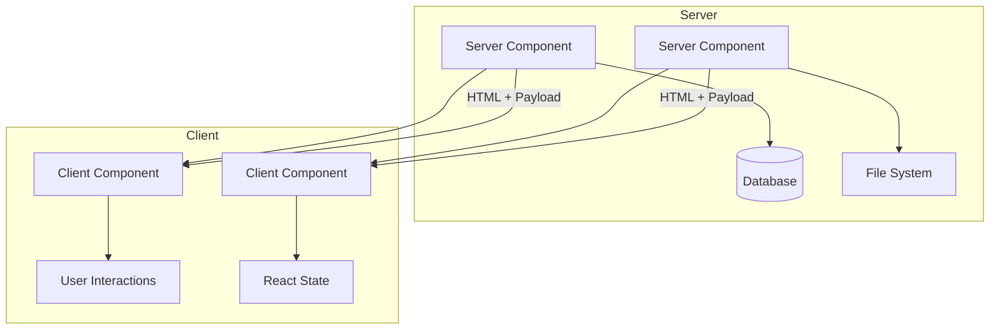
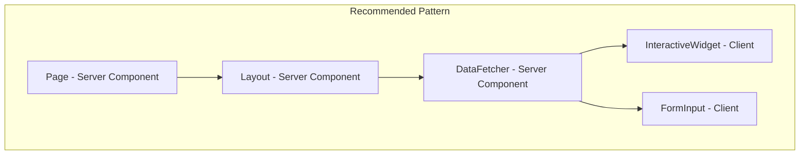
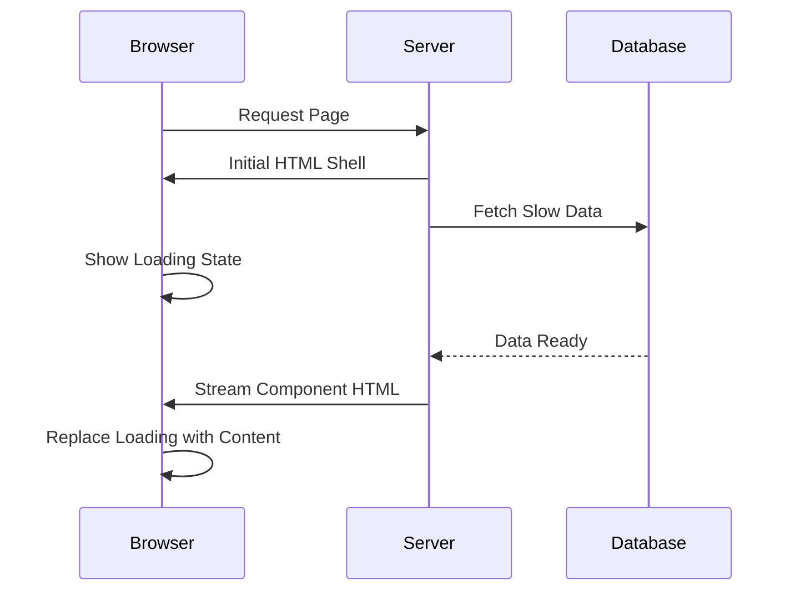

# How to Handle React Server Components in Next.js

Author: [nawazdhandala](https://www.github.com/nawazdhandala)

Tags: Next.js, React, Server Components, App Router, Performance, SSR

Description: A practical guide to understanding and implementing React Server Components in Next.js, covering best practices, common pitfalls, and optimization techniques.

---

React Server Components (RSC) represent a fundamental shift in how we build React applications. In Next.js 13+ with the App Router, Server Components are the default, allowing you to render components on the server while reducing the JavaScript bundle sent to the client.

## Understanding Server vs Client Components

The key distinction lies in where components execute and what capabilities they have.



## Server Component Basics

By default, all components in the Next.js App Router are Server Components. They run only on the server and have direct access to backend resources.

```typescript
// app/posts/page.tsx
// This is a Server Component by default
// No "use client" directive needed

import { db } from '@/lib/database';

// You can use async/await directly at the component level
async function PostsPage() {
  // Direct database access - only runs on server
  const posts = await db.query('SELECT * FROM posts ORDER BY created_at DESC');

  return (
    <div className="posts-container">
      <h1>Recent Posts</h1>
      <ul>
        {posts.map((post) => (
          <li key={post.id}>
            <h2>{post.title}</h2>
            <p>{post.excerpt}</p>
          </li>
        ))}
      </ul>
    </div>
  );
}

export default PostsPage;
```

## When to Use Client Components

Client Components are necessary when you need interactivity, browser APIs, or React hooks that depend on client-side state.

```typescript
// components/SearchFilter.tsx
'use client';  // This directive marks it as a Client Component

import { useState, useEffect } from 'react';

interface SearchFilterProps {
  onSearch: (query: string) => void;
  placeholder?: string;
}

export function SearchFilter({ onSearch, placeholder = 'Search...' }: SearchFilterProps) {
  const [query, setQuery] = useState('');

  // useEffect only runs on the client
  useEffect(() => {
    // Debounce search to avoid excessive calls
    const timeoutId = setTimeout(() => {
      onSearch(query);
    }, 300);

    return () => clearTimeout(timeoutId);
  }, [query, onSearch]);

  return (
    <input
      type="text"
      value={query}
      onChange={(e) => setQuery(e.target.value)}
      placeholder={placeholder}
      className="search-input"
    />
  );
}
```

## Component Composition Pattern

The recommended pattern is to keep Server Components at the top and push Client Components down the tree as leaf nodes.



Here is how to implement this pattern.

```typescript
// app/dashboard/page.tsx
// Server Component - fetches data
import { getDashboardData } from '@/lib/api';
import { DashboardCharts } from '@/components/DashboardCharts';
import { MetricsDisplay } from '@/components/MetricsDisplay';

async function DashboardPage() {
  // Fetch data on the server
  const data = await getDashboardData();

  return (
    <div className="dashboard">
      <h1>Dashboard</h1>

      {/* Pass serializable data to Client Components */}
      <MetricsDisplay metrics={data.metrics} />

      {/* Interactive charts that need client-side rendering */}
      <DashboardCharts
        initialData={data.chartData}
        refreshInterval={30000}
      />
    </div>
  );
}

export default DashboardPage;
```

```typescript
// components/DashboardCharts.tsx
'use client';

import { useState, useEffect } from 'react';
import { LineChart } from '@/components/charts';

interface ChartData {
  labels: string[];
  values: number[];
}

interface DashboardChartsProps {
  initialData: ChartData;
  refreshInterval: number;
}

export function DashboardCharts({ initialData, refreshInterval }: DashboardChartsProps) {
  const [chartData, setChartData] = useState(initialData);
  const [isRefreshing, setIsRefreshing] = useState(false);

  useEffect(() => {
    // Set up auto-refresh for real-time updates
    const interval = setInterval(async () => {
      setIsRefreshing(true);
      try {
        const response = await fetch('/api/dashboard/charts');
        const newData = await response.json();
        setChartData(newData);
      } catch (error) {
        console.error('Failed to refresh chart data:', error);
      } finally {
        setIsRefreshing(false);
      }
    }, refreshInterval);

    return () => clearInterval(interval);
  }, [refreshInterval]);

  return (
    <div className="charts-container">
      {isRefreshing && <span className="refresh-indicator">Updating...</span>}
      <LineChart data={chartData} />
    </div>
  );
}
```

## Passing Server Components as Children

A powerful pattern is passing Server Components as children to Client Components. This allows the server-rendered content to be included without converting the parent to a Server Component.

```typescript
// components/Modal.tsx
'use client';

import { useState } from 'react';
import { ReactNode } from 'react';

interface ModalProps {
  trigger: ReactNode;
  children: ReactNode;  // Can be Server Components
}

export function Modal({ trigger, children }: ModalProps) {
  const [isOpen, setIsOpen] = useState(false);

  return (
    <>
      <button onClick={() => setIsOpen(true)}>
        {trigger}
      </button>

      {isOpen && (
        <div className="modal-overlay" onClick={() => setIsOpen(false)}>
          <div className="modal-content" onClick={(e) => e.stopPropagation()}>
            {/* Server Component children render here */}
            {children}
            <button onClick={() => setIsOpen(false)}>Close</button>
          </div>
        </div>
      )}
    </>
  );
}
```

```typescript
// app/products/page.tsx
// Server Component
import { Modal } from '@/components/Modal';
import { ProductDetails } from '@/components/ProductDetails';

async function ProductsPage() {
  const products = await fetchProducts();

  return (
    <div>
      {products.map((product) => (
        <Modal key={product.id} trigger={`View ${product.name}`}>
          {/* ProductDetails is a Server Component */}
          {/* It will be pre-rendered on the server */}
          <ProductDetails productId={product.id} />
        </Modal>
      ))}
    </div>
  );
}

export default ProductsPage;
```

## Data Fetching in Server Components

Server Components enable direct data fetching without the need for API routes or client-side state management.

```typescript
// app/users/[id]/page.tsx
import { notFound } from 'next/navigation';

interface UserPageProps {
  params: { id: string };
}

// Server Component with direct database access
async function UserPage({ params }: UserPageProps) {
  // Fetch user data directly from the database
  const user = await prisma.user.findUnique({
    where: { id: params.id },
    include: {
      posts: {
        orderBy: { createdAt: 'desc' },
        take: 10,
      },
      profile: true,
    },
  });

  // Handle not found case
  if (!user) {
    notFound();
  }

  return (
    <div className="user-profile">
      <header>
        <h1>{user.name}</h1>
        <p>{user.profile?.bio}</p>
      </header>

      <section>
        <h2>Recent Posts</h2>
        <ul>
          {user.posts.map((post) => (
            <li key={post.id}>
              <a href={`/posts/${post.id}`}>{post.title}</a>
            </li>
          ))}
        </ul>
      </section>
    </div>
  );
}

export default UserPage;
```

## Handling Streaming with Suspense

Server Components support streaming, allowing you to progressively render UI as data becomes available.



```typescript
// app/analytics/page.tsx
import { Suspense } from 'react';
import { AnalyticsSkeleton } from '@/components/skeletons';
import { SlowAnalyticsData } from '@/components/SlowAnalyticsData';
import { QuickStats } from '@/components/QuickStats';

async function AnalyticsPage() {
  return (
    <div className="analytics">
      <h1>Analytics Dashboard</h1>

      {/* This renders immediately */}
      <QuickStats />

      {/* This streams in when ready */}
      <Suspense fallback={<AnalyticsSkeleton />}>
        <SlowAnalyticsData />
      </Suspense>
    </div>
  );
}

export default AnalyticsPage;
```

```typescript
// components/SlowAnalyticsData.tsx
// Server Component that fetches slow data
async function SlowAnalyticsData() {
  // This might take several seconds
  const analytics = await fetchDetailedAnalytics();

  return (
    <div className="detailed-analytics">
      <h2>Detailed Metrics</h2>
      <table>
        <thead>
          <tr>
            <th>Metric</th>
            <th>Value</th>
            <th>Change</th>
          </tr>
        </thead>
        <tbody>
          {analytics.map((metric) => (
            <tr key={metric.name}>
              <td>{metric.name}</td>
              <td>{metric.value}</td>
              <td className={metric.change > 0 ? 'positive' : 'negative'}>
                {metric.change}%
              </td>
            </tr>
          ))}
        </tbody>
      </table>
    </div>
  );
}

export { SlowAnalyticsData };
```

## Common Mistakes and Solutions

### Mistake 1: Using hooks in Server Components

```typescript
// WRONG - This will cause an error
// app/page.tsx
import { useState } from 'react';  // Error: useState is a client hook

function Page() {
  const [count, setCount] = useState(0);  // Cannot use in Server Component
  return <div>{count}</div>;
}
```

```typescript
// CORRECT - Move state to a Client Component
// app/page.tsx
import { Counter } from '@/components/Counter';

function Page() {
  return (
    <div>
      <h1>My Page</h1>
      <Counter />  {/* Client Component handles the state */}
    </div>
  );
}

export default Page;
```

### Mistake 2: Passing non-serializable props to Client Components

```typescript
// WRONG - Functions cannot be passed from Server to Client
// app/page.tsx
async function Page() {
  const handleClick = () => {
    console.log('clicked');
  };

  return <ClientButton onClick={handleClick} />;  // Error!
}
```

```typescript
// CORRECT - Define the function in the Client Component
// components/ClientButton.tsx
'use client';

export function ClientButton() {
  const handleClick = () => {
    console.log('clicked');
  };

  return <button onClick={handleClick}>Click me</button>;
}
```

### Mistake 3: Importing server-only code in Client Components

```typescript
// lib/server-utils.ts
import 'server-only';  // This prevents accidental client imports

import { db } from './database';

export async function getSecretData() {
  // This should never run on the client
  return db.query('SELECT * FROM secrets');
}
```

```typescript
// WRONG - Importing server-only module in Client Component
// components/ClientComponent.tsx
'use client';

import { getSecretData } from '@/lib/server-utils';  // Build error!
```

## Performance Optimization Tips

### 1. Minimize Client Component boundaries

```typescript
// Instead of making the entire page a Client Component
// Only wrap the interactive parts

// app/page.tsx
import { InteractiveSection } from '@/components/InteractiveSection';

async function Page() {
  const staticContent = await fetchContent();

  return (
    <article>
      {/* Static content rendered on server - zero JS */}
      <header>
        <h1>{staticContent.title}</h1>
        <p>{staticContent.description}</p>
      </header>

      {/* Only this section adds to JS bundle */}
      <InteractiveSection />

      {/* More static content */}
      <footer>
        <p>{staticContent.footer}</p>
      </footer>
    </article>
  );
}

export default Page;
```

### 2. Use dynamic imports for heavy Client Components

```typescript
// app/editor/page.tsx
import dynamic from 'next/dynamic';

// Code split the heavy editor component
const RichTextEditor = dynamic(
  () => import('@/components/RichTextEditor'),
  {
    loading: () => <p>Loading editor...</p>,
    ssr: false,  // Only load on client
  }
);

async function EditorPage() {
  const draft = await fetchDraft();

  return (
    <div>
      <h1>Edit Document</h1>
      <RichTextEditor initialContent={draft.content} />
    </div>
  );
}

export default EditorPage;
```

## Summary

React Server Components in Next.js offer significant benefits when used correctly:

1. Server Components are the default in the App Router
2. Use `'use client'` only when you need interactivity or browser APIs
3. Keep Client Components as leaf nodes in the component tree
4. Pass Server Components as children to Client Components when needed
5. Use Suspense for streaming and progressive rendering
6. Only pass serializable data from Server to Client Components

By following these patterns, you can build applications that are fast, efficient, and maintainable while taking full advantage of server-side rendering.
