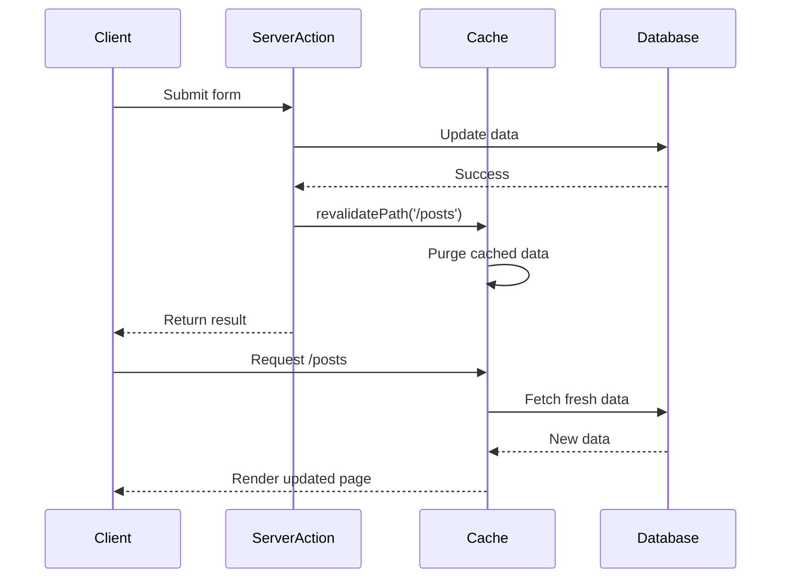

# How to Fix 'revalidatePath' Not Working in Next.js

Author: [nawazdhandala](https://github.com/nawazdhandala)

Tags: NextJS, Caching, Revalidation, Server Actions, Troubleshooting

Description: Diagnose and fix common issues with revalidatePath in Next.js including caching conflicts, incorrect path formats, and server action context problems.

---

The `revalidatePath` function in Next.js allows you to purge cached data for specific paths on-demand. When it does not work as expected, pages show stale data, updates seem to disappear, or the cache refuses to clear. This guide covers the most common causes and solutions.

## How revalidatePath Works



## Issue 1: Using revalidatePath in Client Components

`revalidatePath` only works in Server Components, Server Actions, or Route Handlers.

```tsx
// WRONG: revalidatePath in client component does nothing
'use client';

import { revalidatePath } from 'next/cache';

export function UpdateButton() {
  const handleClick = () => {
    // This will throw an error or silently fail
    revalidatePath('/posts');
  };

  return <button onClick={handleClick}>Update</button>;
}
```

```tsx
// CORRECT: Use a Server Action
// app/actions.ts
'use server';

import { revalidatePath } from 'next/cache';

export async function updateAndRevalidate() {
  // Perform update
  await updateData();

  // Revalidate the path
  revalidatePath('/posts');
}
```

```tsx
// app/components/UpdateButton.tsx
'use client';

import { updateAndRevalidate } from '@/app/actions';

export function UpdateButton() {
  return (
    <button onClick={() => updateAndRevalidate()}>
      Update
    </button>
  );
}
```

## Issue 2: Incorrect Path Format

The path must match exactly how Next.js defines routes.

```tsx
// WRONG: Various incorrect path formats
revalidatePath('posts');           // Missing leading slash
revalidatePath('/posts/');         // Trailing slash (usually wrong)
revalidatePath('/posts?page=1');   // Query params not supported
revalidatePath('/posts#section');  // Hash fragments not supported
```

```tsx
// CORRECT: Proper path formats
revalidatePath('/posts');                    // Revalidate /posts page
revalidatePath('/posts/[id]', 'page');       // Revalidate dynamic route
revalidatePath('/posts/123');                // Revalidate specific post
revalidatePath('/', 'layout');               // Revalidate root layout
revalidatePath('/posts', 'layout');          // Revalidate posts layout and children
```

## Issue 3: Not Understanding Path Types

The second argument determines what gets revalidated.

```mermaid
flowchart TD
    A["revalidatePath('/posts')"] --> B{Type?}
    B -->|"'page' (default)"| C[Only /posts page cache]
    B -->|"'layout'"| D[/posts layout + all children]

    E["revalidatePath('/posts/[id]', 'page')"] --> F[All /posts/[id] pages]
    G["revalidatePath('/posts/123')"] --> H[Only /posts/123 page]

    style C fill:#e3f2fd
    style D fill:#fff3e0
    style F fill:#e8f5e9
    style H fill:#fce4ec
```

```tsx
// Revalidate only the page component at /posts
revalidatePath('/posts', 'page');

// Revalidate the layout at /posts and all nested pages
revalidatePath('/posts', 'layout');

// Revalidate all dynamic segments matching this pattern
revalidatePath('/posts/[id]', 'page');

// Revalidate a specific page
revalidatePath('/posts/123', 'page');
```

## Issue 4: Data Fetching Not Opted Into Caching

If your data fetching does not use caching, revalidatePath has nothing to clear.

```tsx
// WRONG: fetch with no-store bypasses cache entirely
async function getData() {
  const res = await fetch('https://api.example.com/posts', {
    cache: 'no-store', // This data is never cached
  });
  return res.json();
}

// revalidatePath does nothing because there is no cache
export async function updatePost() {
  'use server';
  await savePost();
  revalidatePath('/posts'); // No effect - data was never cached
}
```

```tsx
// CORRECT: Use default caching or force-cache
async function getData() {
  const res = await fetch('https://api.example.com/posts', {
    // Default behavior caches the response
    // Or explicitly: cache: 'force-cache'
    next: { tags: ['posts'] }, // Optional: add tags for revalidateTag
  });
  return res.json();
}

// Now revalidatePath will clear the cached fetch response
export async function updatePost() {
  'use server';
  await savePost();
  revalidatePath('/posts'); // Works - clears cached data
}
```

## Issue 5: Using unstable_noStore or dynamic

Components marked as dynamic bypass the cache entirely.

```tsx
// WRONG: Dynamic rendering bypasses cache
import { unstable_noStore as noStore } from 'next/cache';

async function PostList() {
  noStore(); // Forces dynamic rendering
  const posts = await getPosts();
  return <ul>{posts.map(p => <li key={p.id}>{p.title}</li>)}</ul>;
}

// revalidatePath has no effect on dynamic components
```

```tsx
// CORRECT: Remove noStore to enable caching
async function PostList() {
  // No noStore() call - component can be cached
  const posts = await getPosts();
  return <ul>{posts.map(p => <li key={p.id}>{p.title}</li>)}</ul>;
}
```

## Issue 6: Route Segment Config Conflicts

Route segment configuration can disable caching.

```tsx
// app/posts/page.tsx
// WRONG: This disables caching for the entire route
export const dynamic = 'force-dynamic';
export const revalidate = 0;

export default async function PostsPage() {
  const posts = await getPosts();
  return <PostList posts={posts} />;
}

// revalidatePath('/posts') has no effect
```

```tsx
// CORRECT: Use time-based revalidation or default caching
export const revalidate = 60; // Cache for 60 seconds

export default async function PostsPage() {
  const posts = await getPosts();
  return <PostList posts={posts} />;
}

// Now revalidatePath('/posts') will work
```

## Issue 7: Server Action Not Actually Running

Verify the Server Action is executing properly.

```tsx
// app/actions.ts
'use server';

import { revalidatePath } from 'next/cache';

export async function updatePost(id: string, data: FormData) {
  console.log('Server Action executing...'); // Add logging

  try {
    await db.post.update({
      where: { id },
      data: { title: data.get('title') as string },
    });

    console.log('Update successful, revalidating...');
    revalidatePath('/posts');
    revalidatePath(`/posts/${id}`);
    console.log('Revalidation complete');

    return { success: true };
  } catch (error) {
    console.error('Update failed:', error);
    return { success: false, error: error.message };
  }
}
```

```tsx
// app/posts/[id]/edit/page.tsx
'use client';

import { updatePost } from '@/app/actions';
import { useTransition } from 'react';

export function EditForm({ post }) {
  const [isPending, startTransition] = useTransition();

  async function handleSubmit(formData: FormData) {
    startTransition(async () => {
      const result = await updatePost(post.id, formData);

      if (result.success) {
        console.log('Update succeeded');
        // The revalidation should have happened
      } else {
        console.error('Update failed:', result.error);
      }
    });
  }

  return (
    <form action={handleSubmit}>
      <input name="title" defaultValue={post.title} />
      <button type="submit" disabled={isPending}>
        {isPending ? 'Saving...' : 'Save'}
      </button>
    </form>
  );
}
```

## Issue 8: Edge Runtime Limitations

Some caching features behave differently on Edge Runtime.

```tsx
// app/api/revalidate/route.ts
// This might not work as expected on Edge Runtime

export const runtime = 'edge'; // Potential issue

import { revalidatePath } from 'next/cache';
import { NextRequest, NextResponse } from 'next/server';

export async function POST(request: NextRequest) {
  revalidatePath('/posts');
  return NextResponse.json({ revalidated: true });
}
```

```tsx
// CORRECT: Use Node.js runtime for revalidation
export const runtime = 'nodejs';

import { revalidatePath } from 'next/cache';
import { NextRequest, NextResponse } from 'next/server';

export async function POST(request: NextRequest) {
  const { path } = await request.json();

  revalidatePath(path);

  return NextResponse.json({
    revalidated: true,
    path,
    now: Date.now(),
  });
}
```

## Issue 9: Multiple Data Sources

When using multiple data fetching methods, all need to be revalidated.

```tsx
// app/posts/page.tsx
async function PostsPage() {
  // Multiple data sources
  const posts = await fetch('https://api.example.com/posts', {
    next: { tags: ['posts'] },
  });

  const stats = await db.stats.findFirst(); // Direct DB call

  const featured = await fetch('https://api.example.com/featured', {
    next: { tags: ['featured'] },
  });

  return <div>...</div>;
}
```

```tsx
// To fully revalidate, use multiple approaches
'use server';

import { revalidatePath, revalidateTag } from 'next/cache';

export async function fullRevalidate() {
  // Revalidate by path
  revalidatePath('/posts');

  // Revalidate by tag (for fetch requests)
  revalidateTag('posts');
  revalidateTag('featured');
}
```

## Issue 10: Development vs Production Behavior

Caching behaves differently in development mode.

```tsx
// In development, Next.js may not cache as aggressively
// Always test revalidation behavior in production builds

// package.json scripts for testing
{
  "scripts": {
    "build": "next build",
    "start": "next start",
    "test:cache": "npm run build && npm run start"
  }
}
```

```bash
# Test production caching behavior locally
npm run build
npm run start

# Then test your revalidation logic
```

## Debugging Revalidation

```tsx
// app/api/debug-cache/route.ts
import { NextResponse } from 'next/server';

export const dynamic = 'force-dynamic';

export async function GET() {
  // This endpoint helps debug cache state
  const timestamp = Date.now();

  // Fetch the same data your page uses
  const response = await fetch('https://api.example.com/posts', {
    cache: 'force-cache',
    next: { tags: ['posts'] },
  });

  const headers = Object.fromEntries(response.headers);

  return NextResponse.json({
    timestamp,
    cacheHeaders: headers,
    // x-vercel-cache or similar headers indicate cache status
  });
}
```

```tsx
// Add cache debugging to pages
async function PostsPage() {
  const startTime = Date.now();

  const posts = await getPosts();

  const fetchTime = Date.now() - startTime;

  return (
    <div>
      {/* Debug info in development */}
      {process.env.NODE_ENV === 'development' && (
        <pre>
          Fetch time: {fetchTime}ms
          Rendered at: {new Date().toISOString()}
        </pre>
      )}
      <PostList posts={posts} />
    </div>
  );
}
```

## Complete Working Example

```tsx
// app/posts/page.tsx
import { Suspense } from 'react';
import { getPosts } from '@/lib/posts';
import { CreatePostForm } from './CreatePostForm';

// Enable caching with time-based revalidation as fallback
export const revalidate = 3600; // 1 hour

export default async function PostsPage() {
  return (
    <div>
      <h1>Posts</h1>
      <CreatePostForm />
      <Suspense fallback={<div>Loading posts...</div>}>
        <PostList />
      </Suspense>
    </div>
  );
}

async function PostList() {
  const posts = await getPosts();

  return (
    <ul>
      {posts.map((post) => (
        <li key={post.id}>{post.title}</li>
      ))}
    </ul>
  );
}
```

```tsx
// app/posts/actions.ts
'use server';

import { revalidatePath } from 'next/cache';
import { createPost as dbCreatePost } from '@/lib/posts';

export async function createPost(formData: FormData) {
  const title = formData.get('title') as string;
  const content = formData.get('content') as string;

  // Create the post in database
  const post = await dbCreatePost({ title, content });

  // Revalidate the posts page to show the new post
  revalidatePath('/posts');

  return { success: true, post };
}
```

```tsx
// app/posts/CreatePostForm.tsx
'use client';

import { useFormStatus } from 'react-dom';
import { createPost } from './actions';

function SubmitButton() {
  const { pending } = useFormStatus();

  return (
    <button type="submit" disabled={pending}>
      {pending ? 'Creating...' : 'Create Post'}
    </button>
  );
}

export function CreatePostForm() {
  return (
    <form action={createPost}>
      <input name="title" placeholder="Title" required />
      <textarea name="content" placeholder="Content" />
      <SubmitButton />
    </form>
  );
}
```

## Summary

| Issue | Solution |
|-------|----------|
| Client component usage | Move to Server Action |
| Wrong path format | Use exact route path, no query strings |
| fetch with no-store | Remove no-store or use tags |
| dynamic/noStore | Remove dynamic rendering |
| Route config conflicts | Remove force-dynamic |
| Server Action not running | Add logging, check errors |
| Edge Runtime | Use Node.js runtime |
| Multiple data sources | Combine revalidatePath and revalidateTag |
| Dev mode differences | Test in production build |

When `revalidatePath` is not working, the issue is almost always one of these: the code is running in the wrong context, the data was never cached in the first place, or the path format does not match the actual route structure.
