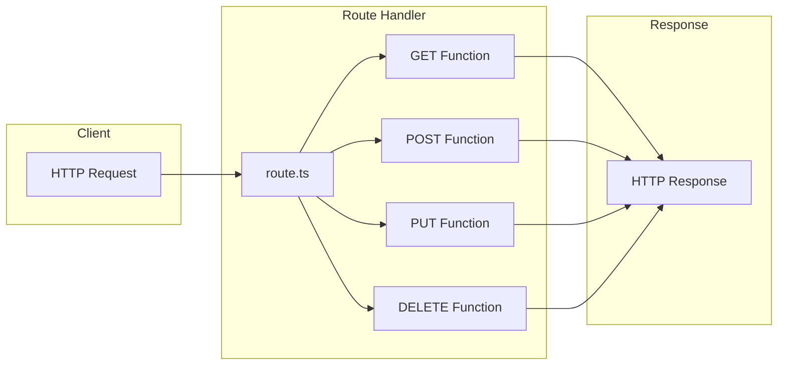
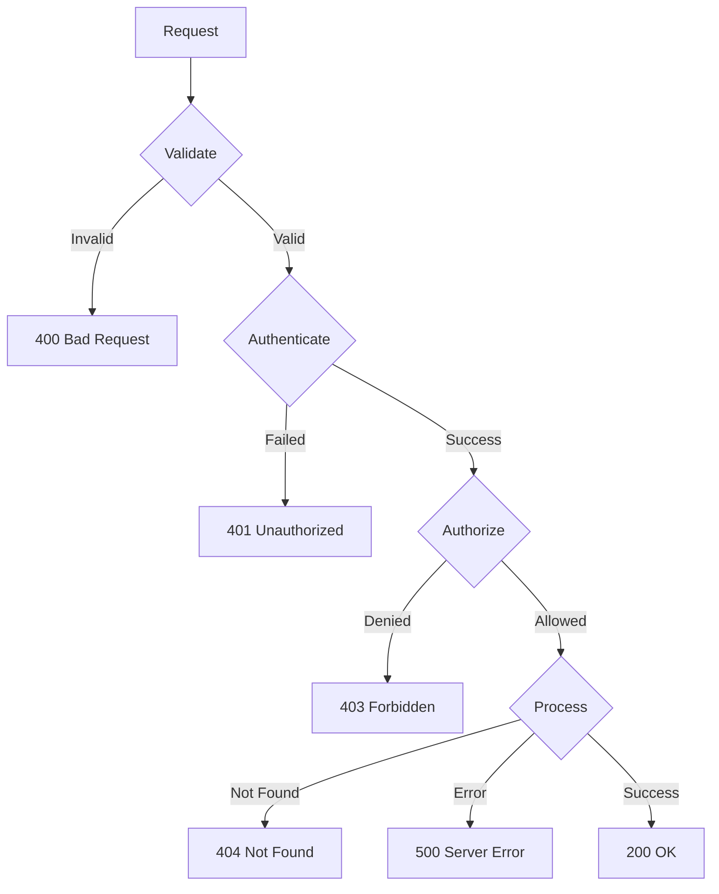
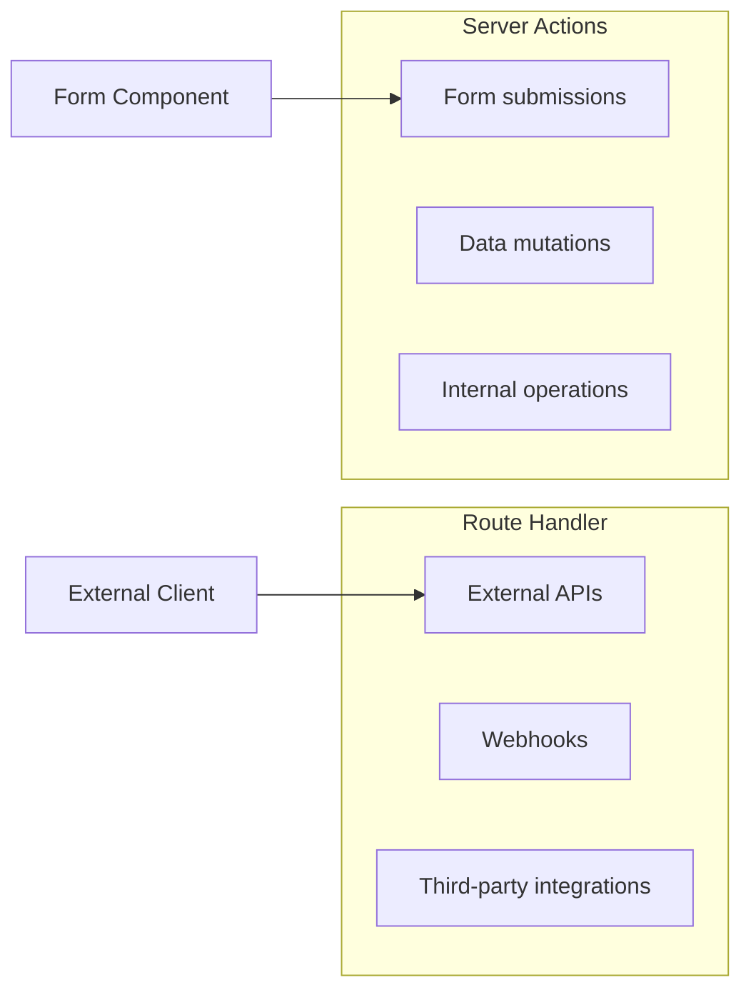

# Next.js Route Handlers: Complete API Guide (2026)

Author: [nawazdhandala](https://www.github.com/nawazdhandala)

Tags: Next.js, Route Handlers, API Routes, App Router, Backend, REST API

Description: Build production REST APIs with Next.js 14+ Route Handlers. Master GET, POST, authentication, middleware, and error handling with real examples.

---

Route Handlers in Next.js App Router replace the traditional API routes from the Pages Router. They provide a clean way to create backend endpoints using Web API standards like Request and Response objects.

## Understanding Route Handlers

Route Handlers are defined in `route.ts` files and support standard HTTP methods.



## Basic Route Handler

```typescript
// app/api/hello/route.ts
import { NextResponse } from 'next/server';

export async function GET() {
  return NextResponse.json({ message: 'Hello, World!' });
}
```

## HTTP Methods

Route Handlers support all standard HTTP methods.

```typescript
// app/api/items/route.ts
import { NextRequest, NextResponse } from 'next/server';

// GET - Retrieve items
export async function GET(request: NextRequest) {
  const items = await fetchAllItems();
  return NextResponse.json(items);
}

// POST - Create new item
export async function POST(request: NextRequest) {
  const body = await request.json();
  const newItem = await createItem(body);
  return NextResponse.json(newItem, { status: 201 });
}

// PUT - Update item (when ID is in body)
export async function PUT(request: NextRequest) {
  const body = await request.json();
  const updatedItem = await updateItem(body.id, body);
  return NextResponse.json(updatedItem);
}

// DELETE - Delete items (batch delete)
export async function DELETE(request: NextRequest) {
  const body = await request.json();
  await deleteItems(body.ids);
  return NextResponse.json({ success: true });
}

// PATCH - Partial update
export async function PATCH(request: NextRequest) {
  const body = await request.json();
  const patchedItem = await patchItem(body.id, body.changes);
  return NextResponse.json(patchedItem);
}

// HEAD - Check resource existence
export async function HEAD(request: NextRequest) {
  const exists = await checkItemExists();
  return new Response(null, {
    status: exists ? 200 : 404,
  });
}

// OPTIONS - CORS preflight
export async function OPTIONS(request: NextRequest) {
  return new Response(null, {
    status: 204,
    headers: {
      'Allow': 'GET, POST, PUT, DELETE, PATCH',
    },
  });
}
```

## Dynamic Route Handlers

Handle dynamic segments in your API routes.

```typescript
// app/api/items/[id]/route.ts
import { NextRequest, NextResponse } from 'next/server';

interface RouteParams {
  params: { id: string };
}

// GET single item
export async function GET(
  request: NextRequest,
  { params }: RouteParams
) {
  const item = await getItemById(params.id);

  if (!item) {
    return NextResponse.json(
      { error: 'Item not found' },
      { status: 404 }
    );
  }

  return NextResponse.json(item);
}

// PUT update single item
export async function PUT(
  request: NextRequest,
  { params }: RouteParams
) {
  const body = await request.json();
  const updatedItem = await updateItem(params.id, body);

  if (!updatedItem) {
    return NextResponse.json(
      { error: 'Item not found' },
      { status: 404 }
    );
  }

  return NextResponse.json(updatedItem);
}

// DELETE single item
export async function DELETE(
  request: NextRequest,
  { params }: RouteParams
) {
  const deleted = await deleteItem(params.id);

  if (!deleted) {
    return NextResponse.json(
      { error: 'Item not found' },
      { status: 404 }
    );
  }

  return NextResponse.json({ success: true });
}
```

## Reading Request Data

### Query Parameters

```typescript
// app/api/search/route.ts
import { NextRequest, NextResponse } from 'next/server';

export async function GET(request: NextRequest) {
  // Get search params from URL
  const searchParams = request.nextUrl.searchParams;

  const query = searchParams.get('q') || '';
  const page = parseInt(searchParams.get('page') || '1', 10);
  const limit = parseInt(searchParams.get('limit') || '10', 10);
  const sortBy = searchParams.get('sortBy') || 'createdAt';
  const order = searchParams.get('order') || 'desc';

  const results = await searchItems({
    query,
    page,
    limit,
    sortBy,
    order,
  });

  return NextResponse.json({
    results: results.items,
    pagination: {
      page,
      limit,
      total: results.total,
      totalPages: Math.ceil(results.total / limit),
    },
  });
}
```

### Request Body

```typescript
// app/api/users/route.ts
import { NextRequest, NextResponse } from 'next/server';

export async function POST(request: NextRequest) {
  // Parse JSON body
  const body = await request.json();

  // Validate required fields
  if (!body.email || !body.name) {
    return NextResponse.json(
      { error: 'Email and name are required' },
      { status: 400 }
    );
  }

  // Validate email format
  const emailRegex = /^[^\s@]+@[^\s@]+\.[^\s@]+$/;
  if (!emailRegex.test(body.email)) {
    return NextResponse.json(
      { error: 'Invalid email format' },
      { status: 400 }
    );
  }

  const user = await createUser(body);
  return NextResponse.json(user, { status: 201 });
}
```

### Form Data

```typescript
// app/api/upload/route.ts
import { NextRequest, NextResponse } from 'next/server';
import { writeFile } from 'fs/promises';
import path from 'path';

export async function POST(request: NextRequest) {
  const formData = await request.formData();

  const file = formData.get('file') as File | null;
  const description = formData.get('description') as string | null;

  if (!file) {
    return NextResponse.json(
      { error: 'No file provided' },
      { status: 400 }
    );
  }

  // Convert file to buffer
  const bytes = await file.arrayBuffer();
  const buffer = Buffer.from(bytes);

  // Save file
  const filename = `${Date.now()}-${file.name}`;
  const filepath = path.join(process.cwd(), 'public', 'uploads', filename);
  await writeFile(filepath, buffer);

  return NextResponse.json({
    filename,
    description,
    url: `/uploads/${filename}`,
  });
}
```

### Headers

```typescript
// app/api/protected/route.ts
import { NextRequest, NextResponse } from 'next/server';

export async function GET(request: NextRequest) {
  // Read headers
  const authHeader = request.headers.get('authorization');
  const contentType = request.headers.get('content-type');
  const userAgent = request.headers.get('user-agent');

  if (!authHeader || !authHeader.startsWith('Bearer ')) {
    return NextResponse.json(
      { error: 'Missing or invalid authorization header' },
      { status: 401 }
    );
  }

  const token = authHeader.substring(7);
  const user = await validateToken(token);

  if (!user) {
    return NextResponse.json(
      { error: 'Invalid token' },
      { status: 401 }
    );
  }

  return NextResponse.json({ user });
}
```

## Setting Response Headers and Status

```typescript
// app/api/data/route.ts
import { NextRequest, NextResponse } from 'next/server';

export async function GET(request: NextRequest) {
  const data = await fetchData();

  // Create response with custom headers
  const response = NextResponse.json(data);

  // Set cache headers
  response.headers.set('Cache-Control', 'public, max-age=3600');

  // Set CORS headers
  response.headers.set('Access-Control-Allow-Origin', '*');
  response.headers.set('Access-Control-Allow-Methods', 'GET, POST, PUT, DELETE');

  // Set custom headers
  response.headers.set('X-Custom-Header', 'custom-value');

  return response;
}

// Alternative: Use Response constructor
export async function POST(request: NextRequest) {
  const body = await request.json();
  const result = await processData(body);

  return new Response(JSON.stringify(result), {
    status: 201,
    headers: {
      'Content-Type': 'application/json',
      'X-Request-Id': crypto.randomUUID(),
    },
  });
}
```

## Error Handling



```typescript
// app/api/items/[id]/route.ts
import { NextRequest, NextResponse } from 'next/server';

class ApiError extends Error {
  constructor(
    public statusCode: number,
    message: string
  ) {
    super(message);
    this.name = 'ApiError';
  }
}

export async function GET(
  request: NextRequest,
  { params }: { params: { id: string } }
) {
  try {
    // Validate ID format
    if (!isValidId(params.id)) {
      throw new ApiError(400, 'Invalid ID format');
    }

    // Check authentication
    const user = await getAuthenticatedUser(request);
    if (!user) {
      throw new ApiError(401, 'Authentication required');
    }

    // Fetch item
    const item = await getItemById(params.id);
    if (!item) {
      throw new ApiError(404, 'Item not found');
    }

    // Check authorization
    if (item.userId !== user.id && !user.isAdmin) {
      throw new ApiError(403, 'Access denied');
    }

    return NextResponse.json(item);

  } catch (error) {
    if (error instanceof ApiError) {
      return NextResponse.json(
        { error: error.message },
        { status: error.statusCode }
      );
    }

    // Log unexpected errors
    console.error('Unexpected error:', error);

    return NextResponse.json(
      { error: 'Internal server error' },
      { status: 500 }
    );
  }
}
```

## Authentication Middleware Pattern

```typescript
// lib/auth.ts
import { NextRequest, NextResponse } from 'next/server';
import { verifyJWT } from './jwt';

type RouteHandler = (
  request: NextRequest,
  context: { params: Record<string, string> },
  user: User
) => Promise<Response>;

export function withAuth(handler: RouteHandler) {
  return async (
    request: NextRequest,
    context: { params: Record<string, string> }
  ) => {
    const authHeader = request.headers.get('authorization');

    if (!authHeader || !authHeader.startsWith('Bearer ')) {
      return NextResponse.json(
        { error: 'Missing authorization header' },
        { status: 401 }
      );
    }

    const token = authHeader.substring(7);

    try {
      const user = await verifyJWT(token);
      return handler(request, context, user);
    } catch (error) {
      return NextResponse.json(
        { error: 'Invalid or expired token' },
        { status: 401 }
      );
    }
  };
}
```

```typescript
// app/api/profile/route.ts
import { NextRequest, NextResponse } from 'next/server';
import { withAuth } from '@/lib/auth';

export const GET = withAuth(async (request, context, user) => {
  // User is guaranteed to be authenticated here
  const profile = await getUserProfile(user.id);
  return NextResponse.json(profile);
});

export const PUT = withAuth(async (request, context, user) => {
  const body = await request.json();
  const updatedProfile = await updateUserProfile(user.id, body);
  return NextResponse.json(updatedProfile);
});
```

## Streaming Responses

```typescript
// app/api/stream/route.ts
import { NextRequest } from 'next/server';

export async function GET(request: NextRequest) {
  const encoder = new TextEncoder();

  const stream = new ReadableStream({
    async start(controller) {
      // Send data in chunks
      for (let i = 0; i < 10; i++) {
        const chunk = encoder.encode(`data: ${JSON.stringify({ count: i })}\n\n`);
        controller.enqueue(chunk);

        // Wait before sending next chunk
        await new Promise((resolve) => setTimeout(resolve, 1000));
      }

      controller.close();
    },
  });

  return new Response(stream, {
    headers: {
      'Content-Type': 'text/event-stream',
      'Cache-Control': 'no-cache',
      'Connection': 'keep-alive',
    },
  });
}
```

## CORS Configuration

```typescript
// app/api/cors/route.ts
import { NextRequest, NextResponse } from 'next/server';

const allowedOrigins = [
  'https://example.com',
  'https://app.example.com',
];

function getCorsHeaders(origin: string | null) {
  const headers: Record<string, string> = {
    'Access-Control-Allow-Methods': 'GET, POST, PUT, DELETE, OPTIONS',
    'Access-Control-Allow-Headers': 'Content-Type, Authorization',
    'Access-Control-Max-Age': '86400',
  };

  if (origin && allowedOrigins.includes(origin)) {
    headers['Access-Control-Allow-Origin'] = origin;
  }

  return headers;
}

export async function OPTIONS(request: NextRequest) {
  const origin = request.headers.get('origin');

  return new Response(null, {
    status: 204,
    headers: getCorsHeaders(origin),
  });
}

export async function GET(request: NextRequest) {
  const origin = request.headers.get('origin');
  const data = await fetchData();

  const response = NextResponse.json(data);

  Object.entries(getCorsHeaders(origin)).forEach(([key, value]) => {
    response.headers.set(key, value);
  });

  return response;
}
```

## Caching Route Handlers

```typescript
// app/api/static-data/route.ts
import { NextResponse } from 'next/server';

// This route handler is cached by default (when using GET with no dynamic features)
export async function GET() {
  const data = await fetchStaticData();
  return NextResponse.json(data);
}

// Force dynamic behavior
export const dynamic = 'force-dynamic';

// Or set revalidation time
export const revalidate = 3600;  // Revalidate every hour
```

```typescript
// app/api/dynamic-data/route.ts
import { NextRequest, NextResponse } from 'next/server';

// Using NextRequest makes the route dynamic
export async function GET(request: NextRequest) {
  // Access to request makes this route dynamic
  const searchParams = request.nextUrl.searchParams;
  const id = searchParams.get('id');

  const data = await fetchDataById(id);
  return NextResponse.json(data);
}
```

## Route Handler vs Server Actions



Use Route Handlers when:
- Building APIs for external clients
- Handling webhooks
- Integrating with third-party services
- Need fine-grained control over HTTP responses

Use Server Actions when:
- Handling form submissions
- Mutating data from React components
- Building internal application features

## Summary

Route Handlers in Next.js App Router provide a powerful way to create API endpoints:

1. Define handlers in `route.ts` files with exported HTTP method functions
2. Use `NextRequest` and `NextResponse` for type-safe request/response handling
3. Access query params via `request.nextUrl.searchParams`
4. Parse body with `request.json()` or `request.formData()`
5. Set custom headers and status codes on responses
6. Implement proper error handling with appropriate status codes
7. Use middleware patterns for authentication and validation
8. Configure caching with `dynamic` and `revalidate` exports

Route Handlers follow Web API standards, making them familiar and portable while integrating seamlessly with the Next.js ecosystem.
