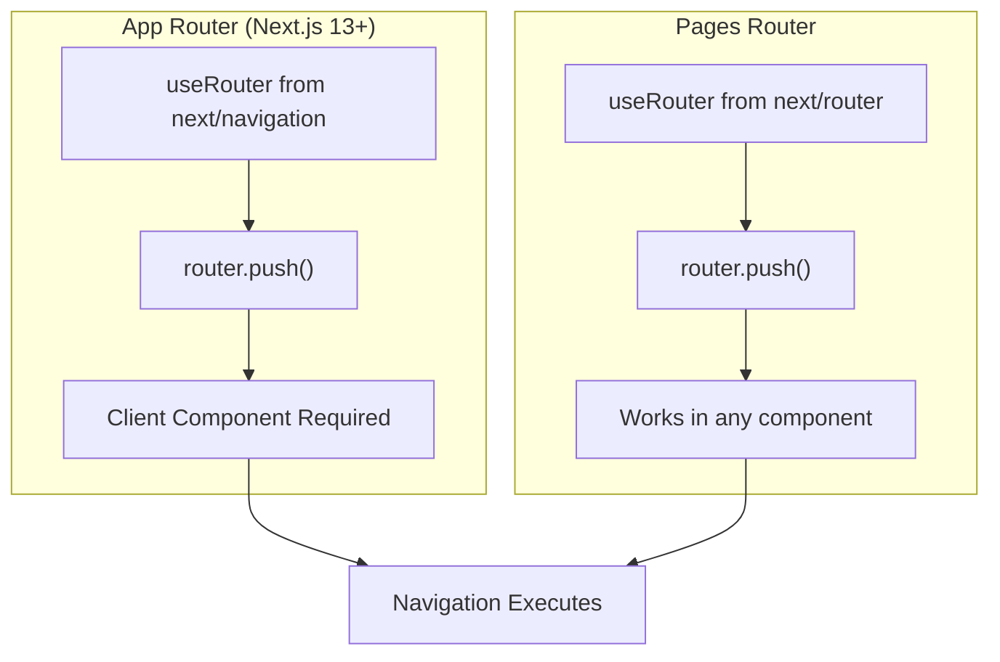
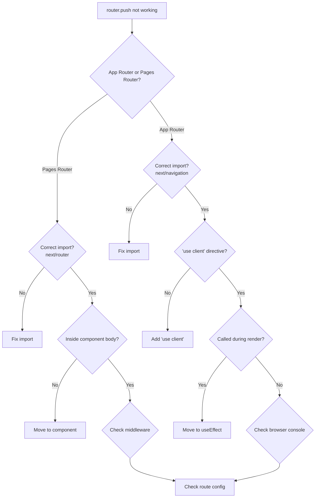

# How to Fix 'Router.push' Not Working in Next.js

Author: [nawazdhandala](https://github.com/nawazdhandala)

Tags: NextJS, Router, Navigation, Debugging, React

Description: Troubleshoot and fix common issues with Router.push not working in Next.js applications, including App Router and Pages Router solutions.

---

The `Router.push` function is fundamental for programmatic navigation in Next.js. When it stops working, it can be frustrating to debug. This guide covers the most common causes and their solutions for both the App Router and Pages Router.

## Understanding Next.js Routing



## Issue 1: Wrong Import Source

The most common issue is importing `useRouter` from the wrong package.

### App Router (Next.js 13+)

```typescript
// WRONG - This import is for Pages Router
import { useRouter } from 'next/router';

// CORRECT - Use next/navigation for App Router
import { useRouter } from 'next/navigation';
```

```typescript
// app/components/NavigationButton.tsx
'use client';

import { useRouter } from 'next/navigation';

export function NavigationButton() {
  const router = useRouter();

  const handleClick = () => {
    router.push('/dashboard');
  };

  return (
    <button onClick={handleClick}>
      Go to Dashboard
    </button>
  );
}
```

### Pages Router

```typescript
// CORRECT for Pages Router
import { useRouter } from 'next/router';

export function NavigationButton() {
  const router = useRouter();

  const handleClick = () => {
    router.push('/dashboard');
  };

  return (
    <button onClick={handleClick}>
      Go to Dashboard
    </button>
  );
}
```

## Issue 2: Using Router in Server Components

`useRouter` only works in Client Components. Server Components cannot use hooks.

```typescript
// WRONG - Server Component cannot use hooks
// app/page.tsx
import { useRouter } from 'next/navigation';

export default function Page() {
  const router = useRouter(); // Error: hooks cannot be used in Server Components

  return <div>Page</div>;
}
```

```typescript
// CORRECT - Use 'use client' directive
// app/components/RedirectButton.tsx
'use client';

import { useRouter } from 'next/navigation';

export function RedirectButton() {
  const router = useRouter();

  return (
    <button onClick={() => router.push('/new-page')}>
      Navigate
    </button>
  );
}

// app/page.tsx (Server Component)
import { RedirectButton } from './components/RedirectButton';

export default function Page() {
  return (
    <div>
      <h1>Welcome</h1>
      <RedirectButton />
    </div>
  );
}
```

## Issue 3: Router.push in useEffect Without Dependencies

```typescript
// WRONG - May cause issues or not trigger
'use client';

import { useRouter } from 'next/navigation';
import { useEffect } from 'react';

export function ConditionalRedirect({ shouldRedirect }: { shouldRedirect: boolean }) {
  const router = useRouter();

  useEffect(() => {
    if (shouldRedirect) {
      router.push('/login');
    }
  }); // Missing dependency array

  return <div>Loading...</div>;
}
```

```typescript
// CORRECT - Include router in dependencies
'use client';

import { useRouter } from 'next/navigation';
import { useEffect } from 'react';

export function ConditionalRedirect({ shouldRedirect }: { shouldRedirect: boolean }) {
  const router = useRouter();

  useEffect(() => {
    if (shouldRedirect) {
      router.push('/login');
    }
  }, [shouldRedirect, router]);

  return <div>Loading...</div>;
}
```

## Issue 4: Navigation During Render

Calling `router.push` during render causes issues:

```typescript
// WRONG - Calling push during render
'use client';

import { useRouter } from 'next/navigation';

export function BadRedirect({ isLoggedIn }: { isLoggedIn: boolean }) {
  const router = useRouter();

  if (!isLoggedIn) {
    router.push('/login'); // This causes problems
  }

  return <div>Dashboard</div>;
}
```

```typescript
// CORRECT - Use useEffect for redirects
'use client';

import { useRouter } from 'next/navigation';
import { useEffect } from 'react';

export function GoodRedirect({ isLoggedIn }: { isLoggedIn: boolean }) {
  const router = useRouter();

  useEffect(() => {
    if (!isLoggedIn) {
      router.push('/login');
    }
  }, [isLoggedIn, router]);

  if (!isLoggedIn) {
    return <div>Redirecting...</div>;
  }

  return <div>Dashboard</div>;
}
```

## Issue 5: Middleware Blocking Navigation

Check if middleware is intercepting your routes:

```typescript
// middleware.ts
import { NextResponse } from 'next/server';
import type { NextRequest } from 'next/server';

export function middleware(request: NextRequest) {
  const isAuthenticated = request.cookies.get('auth-token');

  // This might block navigation unintentionally
  if (!isAuthenticated && request.nextUrl.pathname.startsWith('/dashboard')) {
    return NextResponse.redirect(new URL('/login', request.url));
  }

  return NextResponse.next();
}

export const config = {
  matcher: ['/dashboard/:path*', '/admin/:path*'],
};
```

Debug middleware issues:

```typescript
// middleware.ts
import { NextResponse } from 'next/server';
import type { NextRequest } from 'next/server';

export function middleware(request: NextRequest) {
  // Add logging to debug
  console.log('Middleware triggered for:', request.nextUrl.pathname);

  const isAuthenticated = request.cookies.get('auth-token');
  console.log('Auth token present:', !!isAuthenticated);

  if (!isAuthenticated && request.nextUrl.pathname.startsWith('/dashboard')) {
    console.log('Redirecting to login');
    return NextResponse.redirect(new URL('/login', request.url));
  }

  console.log('Allowing request through');
  return NextResponse.next();
}
```

## Issue 6: Dynamic Routes Not Working

```typescript
// WRONG - Incorrect dynamic route format
'use client';

import { useRouter } from 'next/navigation';

export function UserLink({ userId }: { userId: string }) {
  const router = useRouter();

  const handleClick = () => {
    // This might not work as expected
    router.push(`/users/[id]?id=${userId}`);
  };

  return <button onClick={handleClick}>View User</button>;
}
```

```typescript
// CORRECT - Use actual path values
'use client';

import { useRouter } from 'next/navigation';

export function UserLink({ userId }: { userId: string }) {
  const router = useRouter();

  const handleClick = () => {
    // Use the actual value in the path
    router.push(`/users/${userId}`);
  };

  return <button onClick={handleClick}>View User</button>;
}
```

## Issue 7: Shallow Routing Differences

App Router handles shallow routing differently:

```typescript
// Pages Router - Shallow routing
import { useRouter } from 'next/router';

function PagesRouterComponent() {
  const router = useRouter();

  const updateQuery = () => {
    router.push('/?tab=settings', undefined, { shallow: true });
  };

  return <button onClick={updateQuery}>Change Tab</button>;
}
```

```typescript
// App Router - Use useSearchParams and usePathname
'use client';

import { useRouter, useSearchParams, usePathname } from 'next/navigation';
import { useCallback } from 'react';

export function AppRouterComponent() {
  const router = useRouter();
  const pathname = usePathname();
  const searchParams = useSearchParams();

  const updateQuery = useCallback(() => {
    const params = new URLSearchParams(searchParams.toString());
    params.set('tab', 'settings');

    router.push(`${pathname}?${params.toString()}`);
  }, [router, pathname, searchParams]);

  return <button onClick={updateQuery}>Change Tab</button>;
}
```

## Issue 8: Router.push With Query Parameters

```typescript
// App Router - Building URLs with query params
'use client';

import { useRouter } from 'next/navigation';

export function SearchForm() {
  const router = useRouter();

  const handleSearch = (query: string) => {
    // Build URL with search params
    const params = new URLSearchParams();
    params.set('q', query);
    params.set('page', '1');

    router.push(`/search?${params.toString()}`);
  };

  return (
    <input
      type="text"
      onKeyDown={(e) => {
        if (e.key === 'Enter') {
          handleSearch(e.currentTarget.value);
        }
      }}
      placeholder="Search..."
    />
  );
}
```

## Issue 9: Navigation Not Updating UI

Sometimes navigation happens but the UI does not update:

```typescript
// Force a refresh after navigation
'use client';

import { useRouter } from 'next/navigation';

export function RefreshAfterNav() {
  const router = useRouter();

  const handleAction = async () => {
    // Perform some action
    await saveData();

    // Navigate and refresh
    router.push('/dashboard');
    router.refresh(); // Force refresh of server components
  };

  return <button onClick={handleAction}>Save and Continue</button>;
}

async function saveData() {
  // Save operation
}
```

## Issue 10: Async Event Handlers

```typescript
// WRONG - Lost context in async handler
'use client';

import { useRouter } from 'next/navigation';

export function AsyncNavigation() {
  const router = useRouter();

  const handleClick = async () => {
    await someAsyncOperation();
    router.push('/success'); // May not work if component unmounted
  };

  return <button onClick={handleClick}>Submit</button>;
}

async function someAsyncOperation() {
  await new Promise(resolve => setTimeout(resolve, 1000));
}
```

```typescript
// CORRECT - Check if mounted before navigation
'use client';

import { useRouter } from 'next/navigation';
import { useRef, useEffect } from 'react';

export function AsyncNavigation() {
  const router = useRouter();
  const isMounted = useRef(true);

  useEffect(() => {
    return () => {
      isMounted.current = false;
    };
  }, []);

  const handleClick = async () => {
    await someAsyncOperation();

    if (isMounted.current) {
      router.push('/success');
    }
  };

  return <button onClick={handleClick}>Submit</button>;
}

async function someAsyncOperation() {
  await new Promise(resolve => setTimeout(resolve, 1000));
}
```

## Debugging Checklist



## Alternative Navigation Methods

If `router.push` continues to fail, consider alternatives:

```typescript
// Using Link component for static navigation
import Link from 'next/link';

export function NavLinks() {
  return (
    <nav>
      <Link href="/dashboard">Dashboard</Link>
      <Link href="/settings">Settings</Link>
      <Link href={{ pathname: '/users', query: { sort: 'name' } }}>
        Users
      </Link>
    </nav>
  );
}
```

```typescript
// Using redirect for server-side redirects (App Router)
import { redirect } from 'next/navigation';

export default async function ProtectedPage() {
  const session = await getSession();

  if (!session) {
    redirect('/login');
  }

  return <div>Protected Content</div>;
}

async function getSession() {
  // Get session logic
  return null;
}
```

```typescript
// Using window.location as fallback (not recommended for SPA behavior)
'use client';

export function FallbackNavigation() {
  const handleClick = () => {
    // Full page reload - loses SPA benefits
    window.location.href = '/dashboard';
  };

  return <button onClick={handleClick}>Navigate</button>;
}
```

## Summary

| Issue | Solution |
|-------|----------|
| Wrong import | Use `next/navigation` for App Router, `next/router` for Pages Router |
| Server Component | Add `'use client'` directive |
| Called during render | Move to `useEffect` |
| Missing dependencies | Add router to useEffect dependency array |
| Middleware blocking | Check middleware matcher and conditions |
| Dynamic routes | Use actual values, not bracket syntax |
| UI not updating | Use `router.refresh()` after navigation |

Most `Router.push` issues stem from incorrect imports or using hooks outside Client Components. Always verify your import source matches your router type, and ensure navigation calls happen in event handlers or useEffect, not during render.
