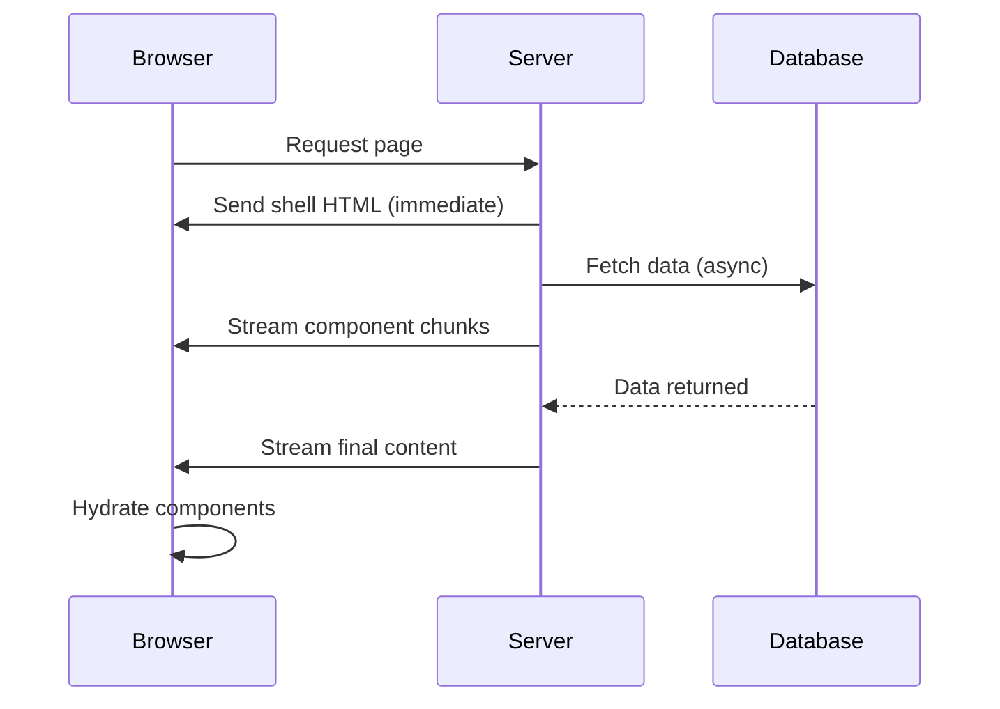
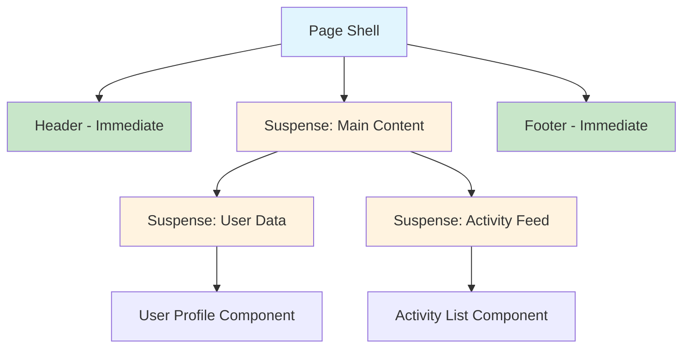

# How to Fix 'Streaming' SSR Issues in Next.js

Author: [nawazdhandala](https://github.com/nawazdhandala)

Tags: NextJS, SSR, Streaming, React, Troubleshooting

Description: Learn how to diagnose and fix streaming SSR issues in Next.js including Suspense boundaries, loading states, and server component data fetching problems.

---

Streaming SSR in Next.js allows you to progressively render and send HTML to the client, improving perceived performance. However, when streaming does not work as expected, users may see blank screens, layout shifts, or completely broken pages. This guide covers common streaming SSR issues and how to fix them.

## How Streaming SSR Works in Next.js



## Common Streaming SSR Issues

| Issue | Symptom | Root Cause |
|-------|---------|------------|
| No streaming | Entire page waits | Missing Suspense boundary |
| Blank fallback | White screen flash | Incorrect loading component |
| Hydration mismatch | Console errors | Server/client content differs |
| Timeout errors | 504 Gateway Timeout | Slow data fetching |
| Layout shift | Content jumps | Unsized fallback components |

## Issue 1: Missing Suspense Boundaries

Streaming only works when you wrap async components in Suspense boundaries.

```tsx
// app/page.tsx - WRONG: No streaming happens
// This waits for all data before sending anything
export default async function Page() {
  const data = await fetchSlowData(); // Blocks entire page

  return (
    <div>
      <Header />
      <SlowComponent data={data} />
      <Footer />
    </div>
  );
}
```

```tsx
// app/page.tsx - CORRECT: Streaming enabled
import { Suspense } from 'react';

export default function Page() {
  return (
    <div>
      <Header />
      {/* Suspense boundary enables streaming for this component */}
      <Suspense fallback={<SlowComponentSkeleton />}>
        <SlowComponent />
      </Suspense>
      <Footer />
    </div>
  );
}

// Move data fetching into the component
async function SlowComponent() {
  const data = await fetchSlowData();
  return <div>{data.content}</div>;
}
```

## Issue 2: Loading State Not Showing

If your loading state never appears, verify your file structure and component setup.

```plaintext
app/
  dashboard/
    page.tsx          # Main page component
    loading.tsx       # Loading UI for this route
    layout.tsx        # Layout wrapper
```

```tsx
// app/dashboard/loading.tsx
// This file automatically creates a Suspense boundary
export default function Loading() {
  return (
    <div className="animate-pulse">
      <div className="h-8 w-64 bg-gray-200 rounded mb-4" />
      <div className="h-4 w-full bg-gray-200 rounded mb-2" />
      <div className="h-4 w-3/4 bg-gray-200 rounded" />
    </div>
  );
}
```

```tsx
// app/dashboard/page.tsx
// The loading.tsx wraps this component automatically
export default async function DashboardPage() {
  const data = await fetchDashboardData();

  return (
    <div>
      <h1>{data.title}</h1>
      <DashboardContent data={data} />
    </div>
  );
}
```

## Issue 3: Hydration Mismatch Errors

Hydration mismatches occur when server-rendered HTML differs from client-rendered output.

```tsx
// WRONG: Date changes between server and client
export default function Page() {
  return (
    <div>
      <p>Current time: {new Date().toLocaleTimeString()}</p>
    </div>
  );
}
```

```tsx
// CORRECT: Use client component for dynamic content
'use client';

import { useState, useEffect } from 'react';

export default function CurrentTime() {
  const [time, setTime] = useState<string | null>(null);

  useEffect(() => {
    // Only runs on client after hydration
    setTime(new Date().toLocaleTimeString());

    const interval = setInterval(() => {
      setTime(new Date().toLocaleTimeString());
    }, 1000);

    return () => clearInterval(interval);
  }, []);

  // Render nothing on server, time on client
  if (time === null) {
    return <p>Loading time...</p>;
  }

  return <p>Current time: {time}</p>;
}
```

## Issue 4: Streaming Not Working with fetch()

Data fetching must happen inside async Server Components for streaming to work.

```tsx
// WRONG: Fetching at module level blocks streaming
const data = await fetch('https://api.example.com/data');

export default function Page() {
  return <div>{data}</div>;
}
```

```tsx
// CORRECT: Fetch inside the component
async function getData() {
  const res = await fetch('https://api.example.com/data', {
    // Opt out of caching for dynamic data
    cache: 'no-store',
  });

  if (!res.ok) {
    throw new Error('Failed to fetch data');
  }

  return res.json();
}

export default async function Page() {
  const data = await getData();

  return <div>{data.content}</div>;
}
```

## Issue 5: Error Boundaries Not Catching Streaming Errors

Wrap Suspense boundaries with error boundaries to handle failures gracefully.

```tsx
// app/dashboard/error.tsx
'use client';

import { useEffect } from 'react';

export default function Error({
  error,
  reset,
}: {
  error: Error & { digest?: string };
  reset: () => void;
}) {
  useEffect(() => {
    // Log the error to an error reporting service
    console.error('Dashboard error:', error);
  }, [error]);

  return (
    <div className="error-container">
      <h2>Something went wrong loading the dashboard</h2>
      <p>{error.message}</p>
      <button onClick={() => reset()}>Try again</button>
    </div>
  );
}
```

```tsx
// app/dashboard/page.tsx
import { Suspense } from 'react';
import { ErrorBoundary } from 'react-error-boundary';

function ErrorFallback({ error, resetErrorBoundary }) {
  return (
    <div role="alert">
      <p>Error loading component:</p>
      <pre>{error.message}</pre>
      <button onClick={resetErrorBoundary}>Retry</button>
    </div>
  );
}

export default function DashboardPage() {
  return (
    <div>
      <h1>Dashboard</h1>

      <ErrorBoundary FallbackComponent={ErrorFallback}>
        <Suspense fallback={<ChartSkeleton />}>
          <AsyncChartComponent />
        </Suspense>
      </ErrorBoundary>

      <ErrorBoundary FallbackComponent={ErrorFallback}>
        <Suspense fallback={<TableSkeleton />}>
          <AsyncTableComponent />
        </Suspense>
      </ErrorBoundary>
    </div>
  );
}
```

## Issue 6: Nested Suspense Boundaries

Understanding how nested Suspense boundaries affect streaming order.



```tsx
// Properly nested Suspense boundaries for parallel streaming
import { Suspense } from 'react';

export default function DashboardPage() {
  return (
    <div className="dashboard">
      {/* Immediate render - no Suspense needed */}
      <Header />

      <main className="dashboard-content">
        {/* Outer Suspense for layout structure */}
        <Suspense fallback={<DashboardSkeleton />}>
          <div className="dashboard-grid">
            {/* Inner Suspense boundaries stream independently */}
            <Suspense fallback={<UserCardSkeleton />}>
              <UserCard />
            </Suspense>

            <Suspense fallback={<StatsSkeleton />}>
              <StatsPanel />
            </Suspense>

            <Suspense fallback={<ActivitySkeleton />}>
              <ActivityFeed />
            </Suspense>
          </div>
        </Suspense>
      </main>

      <Footer />
    </div>
  );
}
```

## Issue 7: Streaming with Route Handlers

Route handlers do not support streaming by default. Use the Web Streams API.

```tsx
// app/api/stream/route.ts
import { NextRequest } from 'next/server';

export async function GET(request: NextRequest) {
  const encoder = new TextEncoder();

  const stream = new ReadableStream({
    async start(controller) {
      // Send data in chunks
      for (let i = 0; i < 10; i++) {
        const chunk = JSON.stringify({ count: i }) + '\n';
        controller.enqueue(encoder.encode(chunk));

        // Simulate delay between chunks
        await new Promise(resolve => setTimeout(resolve, 500));
      }

      controller.close();
    },
  });

  return new Response(stream, {
    headers: {
      'Content-Type': 'text/plain; charset=utf-8',
      'Transfer-Encoding': 'chunked',
    },
  });
}
```

## Issue 8: PPR (Partial Prerendering) Configuration

Next.js 14+ supports Partial Prerendering for combining static and dynamic content.

```tsx
// next.config.js
/** @type {import('next').NextConfig} */
const nextConfig = {
  experimental: {
    ppr: true, // Enable Partial Prerendering
  },
};

module.exports = nextConfig;
```

```tsx
// app/product/[id]/page.tsx
import { Suspense } from 'react';

// Static shell is prerendered at build time
export default function ProductPage({ params }) {
  return (
    <div>
      {/* Static content - prerendered */}
      <ProductHeader id={params.id} />

      {/* Dynamic content - streamed at request time */}
      <Suspense fallback={<PriceSkeleton />}>
        <DynamicPrice id={params.id} />
      </Suspense>

      <Suspense fallback={<InventorySkeleton />}>
        <LiveInventory id={params.id} />
      </Suspense>
    </div>
  );
}

// This component fetches dynamic data
async function DynamicPrice({ id }: { id: string }) {
  // Force dynamic rendering
  const price = await fetch(`https://api.example.com/prices/${id}`, {
    cache: 'no-store',
  });

  return <div className="price">${price.amount}</div>;
}
```

## Debugging Streaming Issues

```tsx
// Add this component to visualize streaming behavior
'use client';

import { useEffect, useState } from 'react';

export function StreamingDebugger({ label }: { label: string }) {
  const [renderTime, setRenderTime] = useState<number | null>(null);

  useEffect(() => {
    setRenderTime(performance.now());
  }, []);

  if (process.env.NODE_ENV !== 'development') {
    return null;
  }

  return (
    <div className="streaming-debug" style={{
      position: 'fixed',
      bottom: 10,
      right: 10,
      background: '#333',
      color: '#fff',
      padding: '8px 12px',
      borderRadius: 4,
      fontSize: 12,
    }}>
      <strong>{label}</strong>
      {renderTime && <span> rendered at {renderTime.toFixed(0)}ms</span>}
    </div>
  );
}
```

```tsx
// Usage in components to debug streaming order
import { StreamingDebugger } from './streaming-debugger';

async function SlowComponent() {
  await new Promise(resolve => setTimeout(resolve, 2000));

  return (
    <div>
      <StreamingDebugger label="SlowComponent" />
      <p>This content streamed after 2 seconds</p>
    </div>
  );
}
```

## Performance Monitoring

Track streaming performance with custom metrics.

```tsx
// lib/streaming-metrics.ts
export function measureStreamingPerformance() {
  if (typeof window === 'undefined') return;

  const observer = new PerformanceObserver((list) => {
    for (const entry of list.getEntries()) {
      if (entry.entryType === 'largest-contentful-paint') {
        console.log('LCP:', entry.startTime);
      }
      if (entry.entryType === 'first-contentful-paint') {
        console.log('FCP:', entry.startTime);
      }
    }
  });

  observer.observe({ entryTypes: ['largest-contentful-paint', 'paint'] });
}
```

## Summary

| Fix | When to Apply |
|-----|---------------|
| Add Suspense boundaries | Components not streaming |
| Create loading.tsx | Route-level loading states |
| Use client components | Dynamic browser-only content |
| Fetch inside components | Data blocking entire page |
| Add error boundaries | Streaming errors crash page |
| Nest Suspense properly | Control streaming order |
| Enable PPR | Mix static and dynamic content |

Streaming SSR in Next.js significantly improves user experience by showing content progressively. The key is placing Suspense boundaries strategically and ensuring async operations happen inside the suspended components rather than at the page level.
