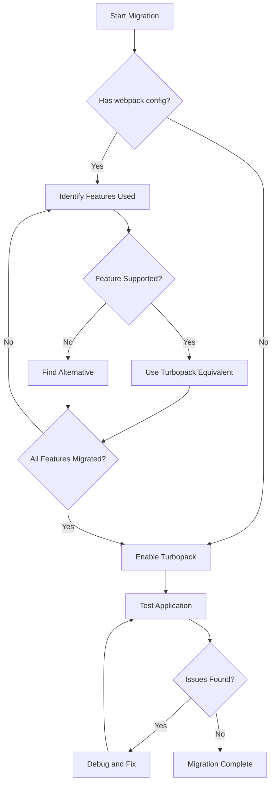
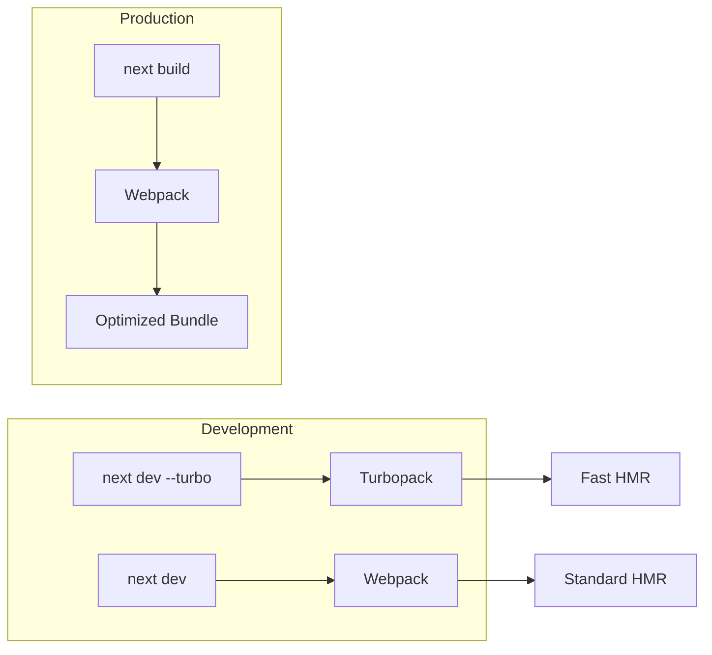

# How to Fix "turbopack" Compatibility Issues

Author: [nawazdhandala](https://www.github.com/nawazdhandala)

Tags: Next.js, Turbopack, Webpack, Bundler, Performance, Troubleshooting

Description: Learn how to diagnose and resolve Turbopack compatibility issues in Next.js including unsupported features and migration strategies.

---

Turbopack is Next.js's new bundler written in Rust, designed to be faster than Webpack. However, not all features and configurations are fully supported yet. This guide covers common compatibility issues and how to resolve them.

## Understanding Turbopack Support

Turbopack support in Next.js has evolved over time with varying levels of feature compatibility.

```mermaid
flowchart TB
    subgraph Supported["Fully Supported"]
        A[TypeScript/JavaScript]
        B[CSS Modules]
        C[Tailwind CSS]
        D[Image Optimization]
        E[App Router]
        F[Server Components]
    end

    subgraph Partial["Partial Support"]
        G[Custom Webpack Config]
        H[Some Plugins]
        I[Legacy Features]
    end

    subgraph Unsupported["Not Yet Supported"]
        J[webpack() config function]
        K[Some Loaders]
        L[Certain Plugins]
    end
```

## Enabling Turbopack

Enable Turbopack in development mode.

```json
{
  "scripts": {
    "dev": "next dev --turbo",
    "dev:webpack": "next dev",
    "build": "next build",
    "start": "next start"
  }
}
```

Or in next.config.js for programmatic control:

```javascript
// next.config.js
/** @type {import('next').NextConfig} */
const nextConfig = {
  // Turbopack configuration (experimental)
  experimental: {
    turbo: {
      // Turbopack-specific options
      rules: {
        '*.svg': {
          loaders: ['@svgr/webpack'],
          as: '*.js',
        },
      },
    },
  },
};

module.exports = nextConfig;
```

## Common Error: webpack() Function Not Supported

The most common error occurs when using custom Webpack configuration.

Error message:
```
Error: Turbopack does not support custom webpack configuration.
Please remove the webpack() function from next.config.js to use Turbopack.
```

### Solution 1: Conditional Configuration

Create a configuration that works with both bundlers.

```javascript
// next.config.js
const useTurbopack = process.argv.includes('--turbo');

/** @type {import('next').NextConfig} */
const nextConfig = {
  // Common configuration for both bundlers
  reactStrictMode: true,
  images: {
    domains: ['example.com'],
  },
};

// Only add webpack config when not using Turbopack
if (!useTurbopack) {
  nextConfig.webpack = (config, { isServer }) => {
    // Custom webpack configuration
    config.module.rules.push({
      test: /\.svg$/,
      use: ['@svgr/webpack'],
    });

    return config;
  };
}

module.exports = nextConfig;
```

### Solution 2: Environment-Based Configuration

Use environment variables to switch bundlers.

```javascript
// next.config.js
const isTurbopack = process.env.TURBOPACK === 'true';

/** @type {import('next').NextConfig} */
let nextConfig = {
  reactStrictMode: true,
};

if (isTurbopack) {
  // Turbopack configuration
  nextConfig.experimental = {
    turbo: {
      rules: {
        '*.svg': {
          loaders: ['@svgr/webpack'],
          as: '*.js',
        },
      },
    },
  };
} else {
  // Webpack configuration
  nextConfig.webpack = (config) => {
    config.module.rules.push({
      test: /\.svg$/,
      use: ['@svgr/webpack'],
    });
    return config;
  };
}

module.exports = nextConfig;
```

Package.json scripts:

```json
{
  "scripts": {
    "dev": "TURBOPACK=true next dev --turbo",
    "dev:webpack": "next dev",
    "build": "next build"
  }
}
```

## Fixing SVG Import Issues

SVG handling differs between Turbopack and Webpack.

### Using @svgr/webpack with Turbopack

```javascript
// next.config.js
/** @type {import('next').NextConfig} */
const nextConfig = {
  experimental: {
    turbo: {
      rules: {
        '*.svg': {
          loaders: ['@svgr/webpack'],
          as: '*.js',
        },
      },
    },
  },
};

module.exports = nextConfig;
```

### Alternative: Use next/image for SVGs

```tsx
// src/components/Icon.tsx
import Image from 'next/image';

interface IconProps {
  name: string;
  size?: number;
  className?: string;
}

export default function Icon({ name, size = 24, className }: IconProps) {
  return (
    <Image
      src={`/icons/${name}.svg`}
      alt={name}
      width={size}
      height={size}
      className={className}
    />
  );
}
```

### Alternative: Inline SVG Component

```tsx
// src/components/icons/ArrowIcon.tsx
export default function ArrowIcon({
  className = '',
  size = 24
}: {
  className?: string;
  size?: number;
}) {
  return (
    <svg
      width={size}
      height={size}
      viewBox="0 0 24 24"
      fill="none"
      stroke="currentColor"
      className={className}
    >
      <path
        strokeLinecap="round"
        strokeLinejoin="round"
        strokeWidth={2}
        d="M9 5l7 7-7 7"
      />
    </svg>
  );
}
```

## Configuration Migration Flow

Follow this process to migrate from Webpack to Turbopack.



## Fixing CSS Import Issues

Turbopack handles CSS differently in some cases.

### Global CSS Import Error

Error:
```
Error: Global CSS cannot be imported from files other than your Custom App.
```

Solution: Import global CSS only in layout.tsx or _app.tsx.

```tsx
// src/app/layout.tsx
import './globals.css';
import type { Metadata } from 'next';

export const metadata: Metadata = {
  title: 'My App',
};

export default function RootLayout({
  children,
}: {
  children: React.ReactNode;
}) {
  return (
    <html lang="en">
      <body>{children}</body>
    </html>
  );
}
```

### CSS Modules Work Correctly

```tsx
// src/components/Button.tsx
import styles from './Button.module.css';

export default function Button({ children }: { children: React.ReactNode }) {
  return (
    <button className={styles.button}>
      {children}
    </button>
  );
}
```

## Fixing Module Resolution Issues

Turbopack may handle path aliases differently.

### Ensure Proper tsconfig.json Setup

```json
{
  "compilerOptions": {
    "baseUrl": ".",
    "paths": {
      "@/*": ["./src/*"],
      "@/components/*": ["./src/components/*"],
      "@/lib/*": ["./src/lib/*"],
      "@/hooks/*": ["./src/hooks/*"]
    }
  }
}
```

### Verify next.config.js Doesn't Override

```javascript
// next.config.js
/** @type {import('next').NextConfig} */
const nextConfig = {
  // Don't use webpack resolve.alias with Turbopack
  // Use tsconfig.json paths instead
};

module.exports = nextConfig;
```

## Plugin Compatibility

Many Webpack plugins are not compatible with Turbopack.

### Incompatible Plugins

```javascript
// These won't work with Turbopack
const withBundleAnalyzer = require('@next/bundle-analyzer');
const withPWA = require('next-pwa');

// Remove or conditionally apply
const nextConfig = {
  // base config
};

// Only use plugins with webpack
if (!process.argv.includes('--turbo')) {
  module.exports = withBundleAnalyzer({
    enabled: process.env.ANALYZE === 'true',
  })(nextConfig);
} else {
  module.exports = nextConfig;
}
```

### Alternative for Bundle Analysis

Use built-in Next.js analysis:

```bash
# Analyze bundle without plugin
ANALYZE=true next build

# Or use the built-in analysis
npx @next/bundle-analyzer
```

## Environment Variable Handling

Turbopack handles environment variables similarly to Webpack.

```javascript
// next.config.js
/** @type {import('next').NextConfig} */
const nextConfig = {
  env: {
    // These work with both bundlers
    CUSTOM_VAR: process.env.CUSTOM_VAR,
  },
  // Public runtime config works with both
  publicRuntimeConfig: {
    apiUrl: process.env.NEXT_PUBLIC_API_URL,
  },
};

module.exports = nextConfig;
```

## Fixing Third-Party Package Issues

Some packages may not work correctly with Turbopack.

### Transpile Packages Configuration

```javascript
// next.config.js
/** @type {import('next').NextConfig} */
const nextConfig = {
  // Works with both bundlers
  transpilePackages: ['some-package', '@org/another-package'],
};

module.exports = nextConfig;
```

### External Packages for Server

```javascript
// next.config.js
/** @type {import('next').NextConfig} */
const nextConfig = {
  // Specify packages that should stay external
  serverExternalPackages: ['sharp', 'canvas'],
};

module.exports = nextConfig;
```

## Development vs Production

Turbopack is primarily for development. Production builds use Webpack.



## Troubleshooting Strategy

Follow this approach when encountering issues.

```javascript
// scripts/check-turbopack.js
const { execSync } = require('child_process');

function checkTurbopackCompatibility() {
  console.log('Checking Turbopack compatibility...\n');

  // Check for webpack config
  const fs = require('fs');
  const configPath = './next.config.js';

  if (fs.existsSync(configPath)) {
    const config = fs.readFileSync(configPath, 'utf8');

    if (config.includes('webpack:') || config.includes('webpack(')) {
      console.warn('Warning: Custom webpack configuration detected.');
      console.warn('This may not be compatible with Turbopack.\n');
    }
  }

  // Check for known incompatible packages
  const packageJson = require('./package.json');
  const deps = {
    ...packageJson.dependencies,
    ...packageJson.devDependencies
  };

  const incompatible = [
    '@next/bundle-analyzer',
    'next-pwa',
    'next-compose-plugins',
  ];

  incompatible.forEach((pkg) => {
    if (deps[pkg]) {
      console.warn(`Warning: ${pkg} may not be compatible with Turbopack.`);
    }
  });

  console.log('\nTry running: npm run dev -- --turbo');
}

checkTurbopackCompatibility();
```

## Feature Detection

Create utilities to detect the current bundler.

```typescript
// src/lib/bundler.ts
export function isTurbopack(): boolean {
  // Check if running with Turbopack
  return process.env.TURBOPACK === 'true' ||
         process.argv?.includes('--turbo');
}

export function getBundlerName(): 'turbopack' | 'webpack' {
  return isTurbopack() ? 'turbopack' : 'webpack';
}
```

## Migration Checklist

Use this checklist when migrating to Turbopack.

```typescript
// scripts/turbopack-checklist.ts
interface ChecklistItem {
  name: string;
  check: () => boolean;
  fix?: string;
}

const checklist: ChecklistItem[] = [
  {
    name: 'No custom webpack function',
    check: () => {
      // Check next.config.js
      return true;
    },
    fix: 'Remove or conditionally apply webpack configuration',
  },
  {
    name: 'Using supported CSS imports',
    check: () => true,
    fix: 'Import global CSS only in layout.tsx or _app.tsx',
  },
  {
    name: 'Path aliases in tsconfig.json',
    check: () => true,
    fix: 'Move path aliases from webpack config to tsconfig.json',
  },
  {
    name: 'No incompatible plugins',
    check: () => true,
    fix: 'Remove or conditionally apply plugins',
  },
  {
    name: 'SVG handling configured',
    check: () => true,
    fix: 'Use turbo.rules for SVG or alternative approach',
  },
];

function runChecklist() {
  console.log('Turbopack Migration Checklist\n');

  checklist.forEach((item, index) => {
    const passed = item.check();
    const status = passed ? 'PASS' : 'FAIL';
    console.log(`${index + 1}. [${status}] ${item.name}`);

    if (!passed && item.fix) {
      console.log(`   Fix: ${item.fix}`);
    }
  });
}

runChecklist();
```

## Summary

Key points for fixing Turbopack compatibility issues:

1. Use conditional configuration to support both bundlers
2. Move path aliases from webpack to tsconfig.json
3. Handle SVGs using turbo.rules or alternative methods
4. Import global CSS only in layout.tsx or _app.tsx
5. Remove or conditionally apply incompatible plugins
6. Use transpilePackages for third-party package issues
7. Remember Turbopack is primarily for development

As Turbopack matures, more features will become available. Check the Next.js documentation for the latest compatibility information.
