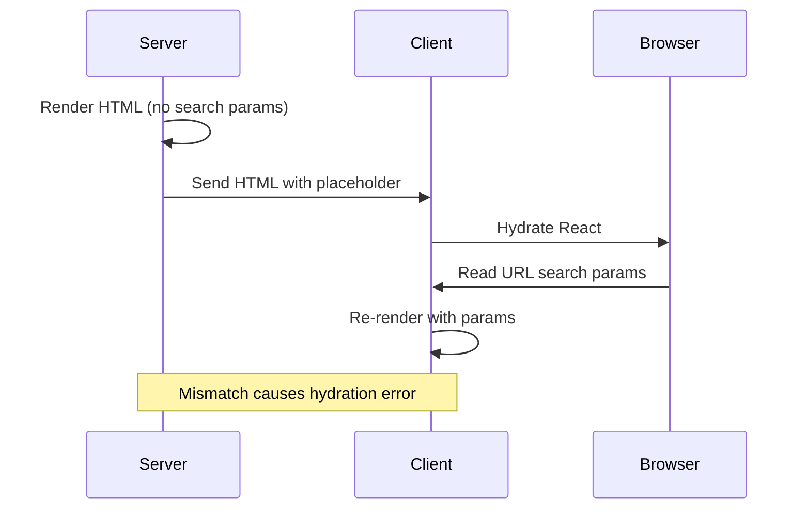
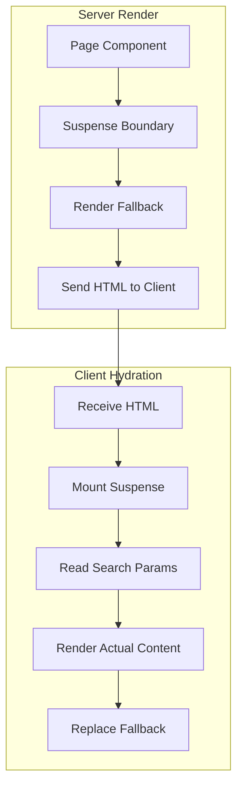

# How to Fix 'useSearchParams' SSR Issues

Author: [nawazdhandala](https://www.github.com/nawazdhandala)

Tags: Next.js, React, SSR, useSearchParams, Hydration, Server Components

Description: Learn how to diagnose and fix useSearchParams SSR issues in Next.js including hydration mismatches and Suspense boundary requirements.

---

The `useSearchParams` hook in Next.js reads URL search parameters on the client side, but using it incorrectly can cause SSR issues, hydration mismatches, and runtime errors. This guide covers common problems and their solutions.

## Understanding the Problem

The `useSearchParams` hook requires special handling because search parameters are only available on the client during static rendering.



## Common Error Messages

You might encounter these errors when using `useSearchParams` incorrectly:

```
Error: useSearchParams() should be wrapped in a suspense boundary at page "/search".
Read more: https://nextjs.org/docs/messages/missing-suspense-with-csr-bailout

Warning: Text content did not match. Server: "" Client: "search-value"

Error: Hydration failed because the initial UI does not match what was rendered on the server.
```

## Solution 1: Wrap in Suspense Boundary

The primary solution is to wrap components using `useSearchParams` in a Suspense boundary.

```tsx
// src/app/search/page.tsx
import { Suspense } from 'react';
import SearchResults from './SearchResults';

// Page component with Suspense boundary
export default function SearchPage() {
  return (
    <div className="container">
      <h1>Search Results</h1>
      <Suspense fallback={<SearchLoading />}>
        <SearchResults />
      </Suspense>
    </div>
  );
}

// Loading component shown during SSR
function SearchLoading() {
  return (
    <div className="animate-pulse">
      <div className="h-4 bg-gray-200 rounded w-3/4 mb-4"></div>
      <div className="h-4 bg-gray-200 rounded w-1/2"></div>
    </div>
  );
}
```

```tsx
// src/app/search/SearchResults.tsx
'use client';

import { useSearchParams } from 'next/navigation';

export default function SearchResults() {
  const searchParams = useSearchParams();
  const query = searchParams.get('q');
  const page = searchParams.get('page') || '1';

  return (
    <div>
      <p>Searching for: {query}</p>
      <p>Page: {page}</p>
      {/* Render search results */}
    </div>
  );
}
```

## Component Rendering Flow

Understanding how components render with Suspense helps debug issues.



## Solution 2: Dynamic Import with SSR Disabled

For components that heavily depend on search parameters, disable SSR entirely.

```tsx
// src/app/dashboard/page.tsx
import dynamic from 'next/dynamic';

// Disable SSR for the entire component
const DashboardFilters = dynamic(
  () => import('./DashboardFilters'),
  {
    ssr: false,
    loading: () => <FilterSkeleton />
  }
);

export default function DashboardPage() {
  return (
    <div>
      <h1>Dashboard</h1>
      <DashboardFilters />
    </div>
  );
}

function FilterSkeleton() {
  return (
    <div className="flex gap-2">
      <div className="h-10 w-32 bg-gray-200 rounded animate-pulse"></div>
      <div className="h-10 w-32 bg-gray-200 rounded animate-pulse"></div>
    </div>
  );
}
```

```tsx
// src/app/dashboard/DashboardFilters.tsx
'use client';

import { useSearchParams, useRouter, usePathname } from 'next/navigation';

export default function DashboardFilters() {
  const searchParams = useSearchParams();
  const router = useRouter();
  const pathname = usePathname();

  const currentFilter = searchParams.get('filter') || 'all';
  const currentSort = searchParams.get('sort') || 'date';

  const updateFilter = (filter: string) => {
    const params = new URLSearchParams(searchParams.toString());
    params.set('filter', filter);
    router.push(`${pathname}?${params.toString()}`);
  };

  return (
    <div className="flex gap-4">
      <select
        value={currentFilter}
        onChange={(e) => updateFilter(e.target.value)}
      >
        <option value="all">All</option>
        <option value="active">Active</option>
        <option value="completed">Completed</option>
      </select>
    </div>
  );
}
```

## Solution 3: Custom Hook with Fallback

Create a custom hook that provides a default value during SSR.

```tsx
// src/hooks/useSearchParamsSafe.ts
'use client';

import { useSearchParams } from 'next/navigation';
import { useEffect, useState } from 'react';

interface SearchParamsState {
  isReady: boolean;
  params: URLSearchParams | null;
}

export function useSearchParamsSafe() {
  const searchParams = useSearchParams();
  const [state, setState] = useState<SearchParamsState>({
    isReady: false,
    params: null,
  });

  useEffect(() => {
    setState({
      isReady: true,
      params: searchParams,
    });
  }, [searchParams]);

  return {
    isReady: state.isReady,
    get: (key: string, defaultValue: string = '') => {
      if (!state.isReady || !state.params) {
        return defaultValue;
      }
      return state.params.get(key) || defaultValue;
    },
    getAll: (key: string) => {
      if (!state.isReady || !state.params) {
        return [];
      }
      return state.params.getAll(key);
    },
    toString: () => {
      if (!state.isReady || !state.params) {
        return '';
      }
      return state.params.toString();
    },
  };
}
```

Usage:

```tsx
// src/components/FilterBar.tsx
'use client';

import { useSearchParamsSafe } from '@/hooks/useSearchParamsSafe';

export default function FilterBar() {
  const { isReady, get } = useSearchParamsSafe();

  const category = get('category', 'all');
  const status = get('status', 'active');

  if (!isReady) {
    return <FilterBarSkeleton />;
  }

  return (
    <div className="filter-bar">
      <span>Category: {category}</span>
      <span>Status: {status}</span>
    </div>
  );
}
```

## Solution 4: Server-Side Search Params

For pages that need search params on the server, use the page props.

```tsx
// src/app/products/page.tsx
interface ProductsPageProps {
  searchParams: { [key: string]: string | string[] | undefined };
}

// Server component - no Suspense needed
export default async function ProductsPage({
  searchParams
}: ProductsPageProps) {
  // Access search params directly on server
  const category = searchParams.category as string || 'all';
  const page = parseInt(searchParams.page as string || '1', 10);
  const sort = searchParams.sort as string || 'newest';

  // Fetch data on server with search params
  const products = await fetchProducts({ category, page, sort });

  return (
    <div>
      <h1>Products</h1>
      <p>Category: {category}, Page: {page}</p>
      <ProductList products={products} />

      {/* Client component for interactive filtering */}
      <Suspense fallback={<FilterSkeleton />}>
        <ProductFilters />
      </Suspense>
    </div>
  );
}
```

## Data Flow Architecture

Choose the right approach based on your data flow needs.


## Solution 5: URL State Management Hook

Create a comprehensive hook for managing URL state.

```tsx
// src/hooks/useURLState.ts
'use client';

import { useSearchParams, useRouter, usePathname } from 'next/navigation';
import { useCallback, useTransition } from 'react';

export function useURLState<T extends Record<string, string>>(
  defaultValues: T
) {
  const searchParams = useSearchParams();
  const router = useRouter();
  const pathname = usePathname();
  const [isPending, startTransition] = useTransition();

  // Get current values with defaults
  const values = Object.keys(defaultValues).reduce((acc, key) => {
    acc[key as keyof T] = (searchParams.get(key) || defaultValues[key]) as T[keyof T];
    return acc;
  }, {} as T);

  // Update a single value
  const setValue = useCallback((key: keyof T, value: string) => {
    const params = new URLSearchParams(searchParams.toString());

    if (value === defaultValues[key] || value === '') {
      params.delete(key as string);
    } else {
      params.set(key as string, value);
    }

    startTransition(() => {
      router.push(`${pathname}?${params.toString()}`, { scroll: false });
    });
  }, [searchParams, router, pathname, defaultValues]);

  // Update multiple values at once
  const setValues = useCallback((newValues: Partial<T>) => {
    const params = new URLSearchParams(searchParams.toString());

    Object.entries(newValues).forEach(([key, value]) => {
      if (value === defaultValues[key] || value === '') {
        params.delete(key);
      } else {
        params.set(key, value as string);
      }
    });

    startTransition(() => {
      router.push(`${pathname}?${params.toString()}`, { scroll: false });
    });
  }, [searchParams, router, pathname, defaultValues]);

  // Reset all values
  const reset = useCallback(() => {
    startTransition(() => {
      router.push(pathname, { scroll: false });
    });
  }, [router, pathname]);

  return {
    values,
    setValue,
    setValues,
    reset,
    isPending,
  };
}
```

Usage with Suspense:

```tsx
// src/app/catalog/page.tsx
import { Suspense } from 'react';
import CatalogFilters from './CatalogFilters';
import ProductGrid from './ProductGrid';

export default function CatalogPage() {
  return (
    <div>
      <h1>Product Catalog</h1>
      <Suspense fallback={<FiltersSkeleton />}>
        <CatalogFilters />
      </Suspense>
      <Suspense fallback={<GridSkeleton />}>
        <ProductGrid />
      </Suspense>
    </div>
  );
}
```

```tsx
// src/app/catalog/CatalogFilters.tsx
'use client';

import { useURLState } from '@/hooks/useURLState';

const defaultFilters = {
  category: 'all',
  priceRange: 'any',
  sort: 'featured',
  inStock: 'false',
};

export default function CatalogFilters() {
  const { values, setValue, reset, isPending } = useURLState(defaultFilters);

  return (
    <div className={isPending ? 'opacity-50' : ''}>
      <select
        value={values.category}
        onChange={(e) => setValue('category', e.target.value)}
      >
        <option value="all">All Categories</option>
        <option value="electronics">Electronics</option>
        <option value="clothing">Clothing</option>
      </select>

      <select
        value={values.sort}
        onChange={(e) => setValue('sort', e.target.value)}
      >
        <option value="featured">Featured</option>
        <option value="price-low">Price: Low to High</option>
        <option value="price-high">Price: High to Low</option>
      </select>

      <button onClick={reset}>Clear Filters</button>
    </div>
  );
}
```

## Handling Pagination

Implement pagination with proper SSR support.

```tsx
// src/components/Pagination.tsx
'use client';

import { useSearchParams, usePathname } from 'next/navigation';
import Link from 'next/link';

interface PaginationProps {
  totalPages: number;
}

export default function Pagination({ totalPages }: PaginationProps) {
  const searchParams = useSearchParams();
  const pathname = usePathname();

  const currentPage = Number(searchParams.get('page')) || 1;

  const createPageURL = (pageNumber: number) => {
    const params = new URLSearchParams(searchParams.toString());
    params.set('page', pageNumber.toString());
    return `${pathname}?${params.toString()}`;
  };

  return (
    <nav className="flex gap-2">
      <Link
        href={createPageURL(currentPage - 1)}
        className={currentPage <= 1 ? 'pointer-events-none opacity-50' : ''}
      >
        Previous
      </Link>

      {Array.from({ length: totalPages }, (_, i) => i + 1).map((page) => (
        <Link
          key={page}
          href={createPageURL(page)}
          className={page === currentPage ? 'font-bold' : ''}
        >
          {page}
        </Link>
      ))}

      <Link
        href={createPageURL(currentPage + 1)}
        className={currentPage >= totalPages ? 'pointer-events-none opacity-50' : ''}
      >
        Next
      </Link>
    </nav>
  );
}
```

Wrap in Suspense at the page level:

```tsx
// src/app/blog/page.tsx
import { Suspense } from 'react';
import Pagination from '@/components/Pagination';

export default async function BlogPage({
  searchParams,
}: {
  searchParams: { page?: string };
}) {
  const page = Number(searchParams.page) || 1;
  const { posts, totalPages } = await fetchPosts(page);

  return (
    <div>
      <PostList posts={posts} />
      <Suspense fallback={<PaginationSkeleton />}>
        <Pagination totalPages={totalPages} />
      </Suspense>
    </div>
  );
}
```

## Testing Search Params Components

Write tests that account for Suspense boundaries.

```tsx
// __tests__/SearchResults.test.tsx
import { render, screen, waitFor } from '@testing-library/react';
import { Suspense } from 'react';
import SearchResults from '@/app/search/SearchResults';

// Mock useSearchParams
jest.mock('next/navigation', () => ({
  useSearchParams: () => new URLSearchParams('q=test&page=2'),
  useRouter: () => ({
    push: jest.fn(),
  }),
  usePathname: () => '/search',
}));

describe('SearchResults', () => {
  it('renders with search params', async () => {
    render(
      <Suspense fallback={<div>Loading...</div>}>
        <SearchResults />
      </Suspense>
    );

    await waitFor(() => {
      expect(screen.getByText(/Searching for: test/)).toBeInTheDocument();
      expect(screen.getByText(/Page: 2/)).toBeInTheDocument();
    });
  });
});
```

## Summary

Key solutions for useSearchParams SSR issues:

1. Always wrap useSearchParams components in Suspense boundaries
2. Use dynamic imports with ssr: false for heavy client-only components
3. Leverage page props for server-side search param access
4. Create custom hooks with safe fallback values
5. Use useTransition for smooth URL updates
6. Provide meaningful loading states in Suspense fallbacks

Understanding the client-server boundary and hydration process helps prevent and debug these common Next.js issues.
