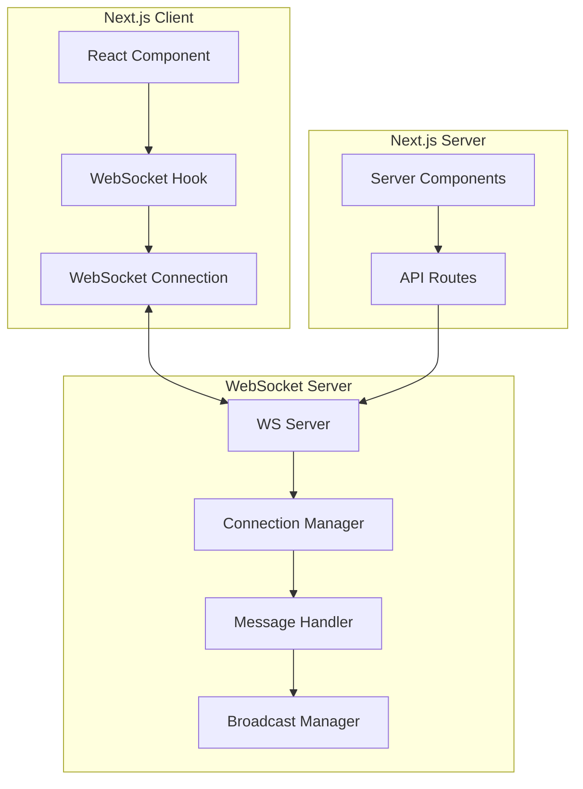
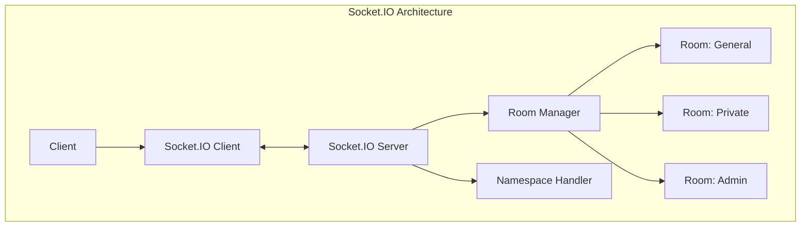
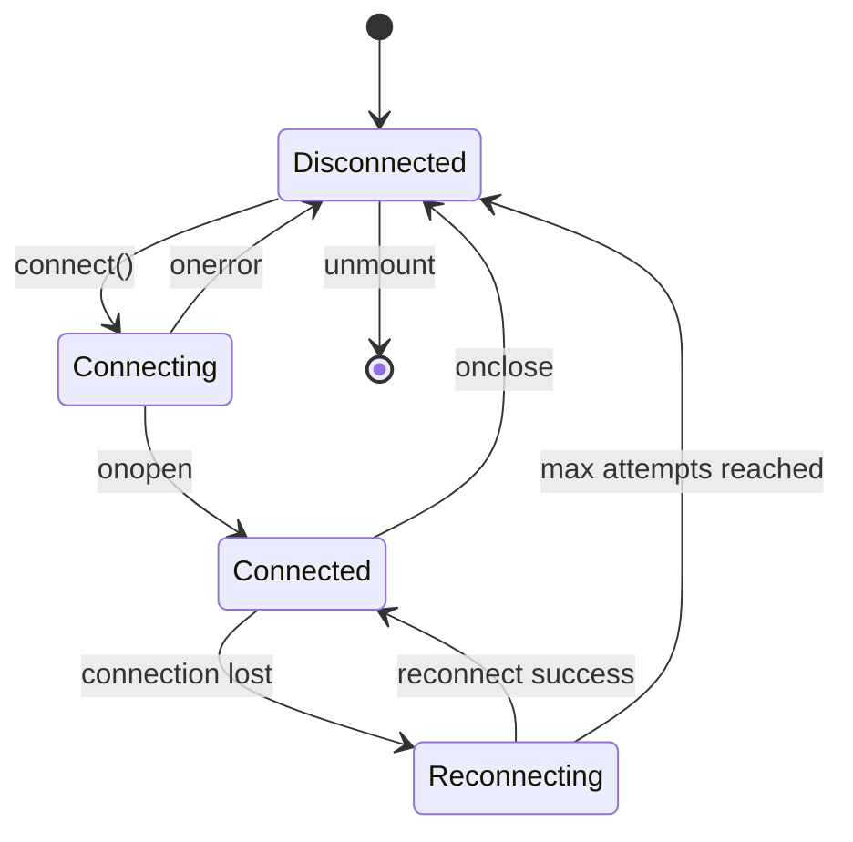

# How to Handle WebSocket in Next.js

Author: [nawazdhandala](https://www.github.com/nawazdhandala)

Tags: Next.js, WebSocket, Real-time, Socket.IO, Server-Sent Events

Description: Learn how to implement WebSocket connections in Next.js for real-time features including chat, notifications, and live updates.

---

WebSocket enables real-time bidirectional communication between clients and servers. Next.js requires specific patterns to handle WebSocket connections due to its hybrid rendering model. This guide covers implementation strategies using native WebSocket, Socket.IO, and alternative approaches.

## Architecture Overview

Understanding WebSocket integration with Next.js helps design effective real-time systems.



## Custom WebSocket Server Setup

Create a separate WebSocket server that runs alongside Next.js.

```typescript
// server/websocket.ts
import { WebSocketServer, WebSocket } from 'ws';
import { createServer } from 'http';
import { parse } from 'url';
import next from 'next';

const dev = process.env.NODE_ENV !== 'production';
const app = next({ dev });
const handle = app.getRequestHandler();

// Store connected clients
const clients = new Map<string, WebSocket>();

app.prepare().then(() => {
  const server = createServer((req, res) => {
    const parsedUrl = parse(req.url!, true);
    handle(req, res, parsedUrl);
  });

  // Create WebSocket server
  const wss = new WebSocketServer({ server });

  wss.on('connection', (ws, req) => {
    const clientId = generateClientId();
    clients.set(clientId, ws);

    console.log(`Client connected: ${clientId}`);

    // Send welcome message
    ws.send(JSON.stringify({
      type: 'connected',
      clientId,
      timestamp: Date.now(),
    }));

    ws.on('message', (data) => {
      try {
        const message = JSON.parse(data.toString());
        handleMessage(clientId, message, wss);
      } catch (error) {
        console.error('Invalid message format:', error);
      }
    });

    ws.on('close', () => {
      clients.delete(clientId);
      console.log(`Client disconnected: ${clientId}`);
    });

    ws.on('error', (error) => {
      console.error(`WebSocket error for ${clientId}:`, error);
      clients.delete(clientId);
    });
  });

  const PORT = process.env.PORT || 3000;
  server.listen(PORT, () => {
    console.log(`Server running on http://localhost:${PORT}`);
  });
});

function generateClientId(): string {
  return `client_${Date.now()}_${Math.random().toString(36).substr(2, 9)}`;
}

function handleMessage(
  clientId: string,
  message: any,
  wss: WebSocketServer
) {
  switch (message.type) {
    case 'broadcast':
      // Send to all clients
      wss.clients.forEach((client) => {
        if (client.readyState === WebSocket.OPEN) {
          client.send(JSON.stringify({
            type: 'broadcast',
            from: clientId,
            data: message.data,
            timestamp: Date.now(),
          }));
        }
      });
      break;

    case 'private':
      // Send to specific client
      const targetClient = clients.get(message.targetId);
      if (targetClient && targetClient.readyState === WebSocket.OPEN) {
        targetClient.send(JSON.stringify({
          type: 'private',
          from: clientId,
          data: message.data,
          timestamp: Date.now(),
        }));
      }
      break;

    default:
      console.log(`Unknown message type: ${message.type}`);
  }
}
```

## Client-Side WebSocket Hook

Create a reusable hook for WebSocket connections.

```typescript
// src/hooks/useWebSocket.ts
'use client';

import { useEffect, useRef, useState, useCallback } from 'react';

interface WebSocketMessage {
  type: string;
  data?: any;
  timestamp?: number;
  [key: string]: any;
}

interface UseWebSocketOptions {
  url: string;
  onMessage?: (message: WebSocketMessage) => void;
  onConnect?: () => void;
  onDisconnect?: () => void;
  onError?: (error: Event) => void;
  reconnect?: boolean;
  reconnectInterval?: number;
  maxReconnectAttempts?: number;
}

interface UseWebSocketReturn {
  isConnected: boolean;
  lastMessage: WebSocketMessage | null;
  sendMessage: (message: WebSocketMessage) => void;
  connect: () => void;
  disconnect: () => void;
}

export function useWebSocket({
  url,
  onMessage,
  onConnect,
  onDisconnect,
  onError,
  reconnect = true,
  reconnectInterval = 3000,
  maxReconnectAttempts = 5,
}: UseWebSocketOptions): UseWebSocketReturn {
  const wsRef = useRef<WebSocket | null>(null);
  const reconnectAttemptsRef = useRef(0);
  const reconnectTimeoutRef = useRef<NodeJS.Timeout>();

  const [isConnected, setIsConnected] = useState(false);
  const [lastMessage, setLastMessage] = useState<WebSocketMessage | null>(null);

  const connect = useCallback(() => {
    // Cleanup existing connection
    if (wsRef.current) {
      wsRef.current.close();
    }

    try {
      wsRef.current = new WebSocket(url);

      wsRef.current.onopen = () => {
        setIsConnected(true);
        reconnectAttemptsRef.current = 0;
        onConnect?.();
      };

      wsRef.current.onmessage = (event) => {
        try {
          const message = JSON.parse(event.data);
          setLastMessage(message);
          onMessage?.(message);
        } catch (error) {
          console.error('Failed to parse WebSocket message:', error);
        }
      };

      wsRef.current.onclose = () => {
        setIsConnected(false);
        onDisconnect?.();

        // Attempt reconnection
        if (reconnect && reconnectAttemptsRef.current < maxReconnectAttempts) {
          reconnectTimeoutRef.current = setTimeout(() => {
            reconnectAttemptsRef.current++;
            connect();
          }, reconnectInterval);
        }
      };

      wsRef.current.onerror = (error) => {
        onError?.(error);
      };
    } catch (error) {
      console.error('WebSocket connection error:', error);
    }
  }, [url, onMessage, onConnect, onDisconnect, onError, reconnect, reconnectInterval, maxReconnectAttempts]);

  const disconnect = useCallback(() => {
    if (reconnectTimeoutRef.current) {
      clearTimeout(reconnectTimeoutRef.current);
    }
    reconnectAttemptsRef.current = maxReconnectAttempts; // Prevent reconnection
    wsRef.current?.close();
  }, [maxReconnectAttempts]);

  const sendMessage = useCallback((message: WebSocketMessage) => {
    if (wsRef.current?.readyState === WebSocket.OPEN) {
      wsRef.current.send(JSON.stringify(message));
    } else {
      console.warn('WebSocket is not connected');
    }
  }, []);

  useEffect(() => {
    connect();

    return () => {
      if (reconnectTimeoutRef.current) {
        clearTimeout(reconnectTimeoutRef.current);
      }
      wsRef.current?.close();
    };
  }, [connect]);

  return {
    isConnected,
    lastMessage,
    sendMessage,
    connect,
    disconnect,
  };
}
```

## Chat Component Example

Build a real-time chat using the WebSocket hook.

```tsx
// src/components/Chat.tsx
'use client';

import { useState, useEffect, useRef } from 'react';
import { useWebSocket } from '@/hooks/useWebSocket';

interface ChatMessage {
  id: string;
  from: string;
  text: string;
  timestamp: number;
}

export default function Chat() {
  const [messages, setMessages] = useState<ChatMessage[]>([]);
  const [inputText, setInputText] = useState('');
  const [username, setUsername] = useState('');
  const messagesEndRef = useRef<HTMLDivElement>(null);

  const wsUrl = process.env.NEXT_PUBLIC_WS_URL || 'ws://localhost:3000';

  const { isConnected, sendMessage, lastMessage } = useWebSocket({
    url: wsUrl,
    onConnect: () => {
      console.log('Connected to chat server');
    },
    onDisconnect: () => {
      console.log('Disconnected from chat server');
    },
  });

  // Handle incoming messages
  useEffect(() => {
    if (lastMessage && lastMessage.type === 'broadcast') {
      const newMessage: ChatMessage = {
        id: `${lastMessage.timestamp}_${lastMessage.from}`,
        from: lastMessage.from,
        text: lastMessage.data.text,
        timestamp: lastMessage.timestamp,
      };
      setMessages((prev) => [...prev, newMessage]);
    }
  }, [lastMessage]);

  // Auto-scroll to bottom
  useEffect(() => {
    messagesEndRef.current?.scrollIntoView({ behavior: 'smooth' });
  }, [messages]);

  const handleSend = () => {
    if (!inputText.trim() || !username.trim()) return;

    sendMessage({
      type: 'broadcast',
      data: {
        text: inputText,
        username,
      },
    });

    setInputText('');
  };

  const handleKeyPress = (e: React.KeyboardEvent) => {
    if (e.key === 'Enter' && !e.shiftKey) {
      e.preventDefault();
      handleSend();
    }
  };

  return (
    <div className="flex flex-col h-96 border rounded-lg">
      {/* Connection Status */}
      <div className="p-2 bg-gray-100 border-b flex items-center gap-2">
        <span
          className={`w-2 h-2 rounded-full ${
            isConnected ? 'bg-green-500' : 'bg-red-500'
          }`}
        />
        <span className="text-sm">
          {isConnected ? 'Connected' : 'Disconnected'}
        </span>
      </div>

      {/* Username Input */}
      {!username && (
        <div className="p-4 border-b">
          <input
            type="text"
            placeholder="Enter your username"
            className="w-full p-2 border rounded"
            onKeyPress={(e) => {
              if (e.key === 'Enter') {
                setUsername((e.target as HTMLInputElement).value);
              }
            }}
          />
        </div>
      )}

      {/* Messages */}
      <div className="flex-1 overflow-y-auto p-4 space-y-2">
        {messages.map((msg) => (
          <div
            key={msg.id}
            className={`p-2 rounded ${
              msg.from === username
                ? 'bg-blue-100 ml-auto'
                : 'bg-gray-100'
            } max-w-[80%]`}
          >
            <div className="text-xs text-gray-500">{msg.from}</div>
            <div>{msg.text}</div>
          </div>
        ))}
        <div ref={messagesEndRef} />
      </div>

      {/* Input */}
      <div className="p-2 border-t flex gap-2">
        <input
          type="text"
          value={inputText}
          onChange={(e) => setInputText(e.target.value)}
          onKeyPress={handleKeyPress}
          placeholder="Type a message..."
          className="flex-1 p-2 border rounded"
          disabled={!isConnected || !username}
        />
        <button
          onClick={handleSend}
          disabled={!isConnected || !username}
          className="px-4 py-2 bg-blue-500 text-white rounded disabled:opacity-50"
        >
          Send
        </button>
      </div>
    </div>
  );
}
```

## Socket.IO Integration

For more robust real-time features, use Socket.IO.



Server setup with Socket.IO:

```typescript
// server/socket-io.ts
import { Server as HTTPServer } from 'http';
import { Server as SocketIOServer, Socket } from 'socket.io';
import { parse } from 'cookie';

interface ServerToClientEvents {
  message: (data: { from: string; text: string; timestamp: number }) => void;
  userJoined: (data: { userId: string; username: string }) => void;
  userLeft: (data: { userId: string }) => void;
  roomUsers: (users: string[]) => void;
}

interface ClientToServerEvents {
  joinRoom: (room: string) => void;
  leaveRoom: (room: string) => void;
  sendMessage: (data: { room: string; text: string }) => void;
}

interface InterServerEvents {
  ping: () => void;
}

interface SocketData {
  userId: string;
  username: string;
}

export function initializeSocketIO(httpServer: HTTPServer) {
  const io = new SocketIOServer<
    ClientToServerEvents,
    ServerToClientEvents,
    InterServerEvents,
    SocketData
  >(httpServer, {
    cors: {
      origin: process.env.NEXT_PUBLIC_APP_URL || 'http://localhost:3000',
      methods: ['GET', 'POST'],
      credentials: true,
    },
    transports: ['websocket', 'polling'],
  });

  // Authentication middleware
  io.use((socket, next) => {
    const cookies = socket.handshake.headers.cookie;
    if (cookies) {
      const parsed = parse(cookies);
      const sessionToken = parsed['session-token'];

      if (sessionToken) {
        // Validate token and attach user data
        // This is a simplified example
        socket.data.userId = `user_${Date.now()}`;
        socket.data.username = `User${Math.floor(Math.random() * 1000)}`;
        return next();
      }
    }

    // Allow anonymous connections with generated ID
    socket.data.userId = `anon_${Date.now()}`;
    socket.data.username = `Anonymous`;
    next();
  });

  io.on('connection', (socket) => {
    console.log(`User connected: ${socket.data.userId}`);

    // Join room
    socket.on('joinRoom', (room) => {
      socket.join(room);

      // Notify room
      socket.to(room).emit('userJoined', {
        userId: socket.data.userId,
        username: socket.data.username,
      });

      // Send current users in room
      const roomSockets = io.sockets.adapter.rooms.get(room);
      const users = roomSockets
        ? Array.from(roomSockets)
        : [];
      socket.emit('roomUsers', users);
    });

    // Leave room
    socket.on('leaveRoom', (room) => {
      socket.leave(room);
      socket.to(room).emit('userLeft', {
        userId: socket.data.userId,
      });
    });

    // Send message
    socket.on('sendMessage', ({ room, text }) => {
      io.to(room).emit('message', {
        from: socket.data.username,
        text,
        timestamp: Date.now(),
      });
    });

    socket.on('disconnect', () => {
      console.log(`User disconnected: ${socket.data.userId}`);
    });
  });

  return io;
}
```

Socket.IO client hook:

```typescript
// src/hooks/useSocketIO.ts
'use client';

import { useEffect, useState, useCallback, useRef } from 'react';
import { io, Socket } from 'socket.io-client';

interface UseSocketIOOptions {
  url?: string;
  autoConnect?: boolean;
}

export function useSocketIO({
  url = '',
  autoConnect = true
}: UseSocketIOOptions = {}) {
  const [isConnected, setIsConnected] = useState(false);
  const socketRef = useRef<Socket | null>(null);

  useEffect(() => {
    const socketUrl = url || process.env.NEXT_PUBLIC_SOCKET_URL || '';

    socketRef.current = io(socketUrl, {
      autoConnect,
      withCredentials: true,
      transports: ['websocket', 'polling'],
    });

    socketRef.current.on('connect', () => {
      setIsConnected(true);
    });

    socketRef.current.on('disconnect', () => {
      setIsConnected(false);
    });

    return () => {
      socketRef.current?.disconnect();
    };
  }, [url, autoConnect]);

  const emit = useCallback(<T extends any[]>(
    event: string,
    ...args: T
  ) => {
    socketRef.current?.emit(event, ...args);
  }, []);

  const on = useCallback(<T>(
    event: string,
    callback: (data: T) => void
  ) => {
    socketRef.current?.on(event, callback);

    return () => {
      socketRef.current?.off(event, callback);
    };
  }, []);

  const joinRoom = useCallback((room: string) => {
    socketRef.current?.emit('joinRoom', room);
  }, []);

  const leaveRoom = useCallback((room: string) => {
    socketRef.current?.emit('leaveRoom', room);
  }, []);

  return {
    socket: socketRef.current,
    isConnected,
    emit,
    on,
    joinRoom,
    leaveRoom,
  };
}
```

## Server-Sent Events Alternative

For one-way real-time updates, use Server-Sent Events (SSE).

```typescript
// src/app/api/events/route.ts
import { NextRequest } from 'next/server';

export const dynamic = 'force-dynamic';

export async function GET(request: NextRequest) {
  const encoder = new TextEncoder();

  const stream = new ReadableStream({
    async start(controller) {
      // Send initial connection message
      controller.enqueue(
        encoder.encode(`data: ${JSON.stringify({ type: 'connected' })}\n\n`)
      );

      // Set up event sending
      let counter = 0;
      const interval = setInterval(() => {
        counter++;
        const data = {
          type: 'update',
          count: counter,
          timestamp: Date.now(),
        };

        controller.enqueue(
          encoder.encode(`data: ${JSON.stringify(data)}\n\n`)
        );

        // Close after 100 messages (example limit)
        if (counter >= 100) {
          clearInterval(interval);
          controller.close();
        }
      }, 1000);

      // Handle client disconnect
      request.signal.addEventListener('abort', () => {
        clearInterval(interval);
        controller.close();
      });
    },
  });

  return new Response(stream, {
    headers: {
      'Content-Type': 'text/event-stream',
      'Cache-Control': 'no-cache',
      'Connection': 'keep-alive',
    },
  });
}
```

SSE client hook:

```typescript
// src/hooks/useSSE.ts
'use client';

import { useEffect, useState, useCallback, useRef } from 'react';

interface UseSSEOptions {
  url: string;
  onMessage?: (data: any) => void;
  onError?: (error: Event) => void;
}

export function useSSE({ url, onMessage, onError }: UseSSEOptions) {
  const [isConnected, setIsConnected] = useState(false);
  const [lastEvent, setLastEvent] = useState<any>(null);
  const eventSourceRef = useRef<EventSource | null>(null);

  const connect = useCallback(() => {
    eventSourceRef.current = new EventSource(url);

    eventSourceRef.current.onopen = () => {
      setIsConnected(true);
    };

    eventSourceRef.current.onmessage = (event) => {
      try {
        const data = JSON.parse(event.data);
        setLastEvent(data);
        onMessage?.(data);
      } catch (error) {
        console.error('Failed to parse SSE data:', error);
      }
    };

    eventSourceRef.current.onerror = (error) => {
      setIsConnected(false);
      onError?.(error);
    };
  }, [url, onMessage, onError]);

  const disconnect = useCallback(() => {
    eventSourceRef.current?.close();
    setIsConnected(false);
  }, []);

  useEffect(() => {
    connect();
    return () => disconnect();
  }, [connect, disconnect]);

  return {
    isConnected,
    lastEvent,
    connect,
    disconnect,
  };
}
```

## Real-Time Notifications Component

Build a notification system using WebSocket.

```tsx
// src/components/NotificationCenter.tsx
'use client';

import { useState, useEffect } from 'react';
import { useWebSocket } from '@/hooks/useWebSocket';

interface Notification {
  id: string;
  type: 'info' | 'success' | 'warning' | 'error';
  title: string;
  message: string;
  timestamp: number;
  read: boolean;
}

export default function NotificationCenter() {
  const [notifications, setNotifications] = useState<Notification[]>([]);
  const [isOpen, setIsOpen] = useState(false);

  const wsUrl = `${process.env.NEXT_PUBLIC_WS_URL}/notifications`;

  const { isConnected, lastMessage } = useWebSocket({
    url: wsUrl,
    onMessage: (message) => {
      if (message.type === 'notification') {
        const notification: Notification = {
          id: message.id,
          type: message.notificationType,
          title: message.title,
          message: message.message,
          timestamp: message.timestamp,
          read: false,
        };
        setNotifications((prev) => [notification, ...prev]);
      }
    },
  });

  const unreadCount = notifications.filter((n) => !n.read).length;

  const markAsRead = (id: string) => {
    setNotifications((prev) =>
      prev.map((n) => (n.id === id ? { ...n, read: true } : n))
    );
  };

  const markAllAsRead = () => {
    setNotifications((prev) => prev.map((n) => ({ ...n, read: true })));
  };

  const clearAll = () => {
    setNotifications([]);
  };

  return (
    <div className="relative">
      {/* Bell Icon */}
      <button
        onClick={() => setIsOpen(!isOpen)}
        className="relative p-2 rounded-full hover:bg-gray-100"
      >
        <svg
          className="w-6 h-6"
          fill="none"
          stroke="currentColor"
          viewBox="0 0 24 24"
        >
          <path
            strokeLinecap="round"
            strokeLinejoin="round"
            strokeWidth={2}
            d="M15 17h5l-1.405-1.405A2.032 2.032 0 0118 14.158V11a6.002 6.002 0 00-4-5.659V5a2 2 0 10-4 0v.341C7.67 6.165 6 8.388 6 11v3.159c0 .538-.214 1.055-.595 1.436L4 17h5m6 0v1a3 3 0 11-6 0v-1m6 0H9"
          />
        </svg>

        {/* Unread Badge */}
        {unreadCount > 0 && (
          <span className="absolute top-0 right-0 w-5 h-5 bg-red-500 text-white text-xs rounded-full flex items-center justify-center">
            {unreadCount > 9 ? '9+' : unreadCount}
          </span>
        )}
      </button>

      {/* Dropdown */}
      {isOpen && (
        <div className="absolute right-0 mt-2 w-80 bg-white rounded-lg shadow-lg border z-50">
          <div className="p-3 border-b flex justify-between items-center">
            <h3 className="font-semibold">Notifications</h3>
            <div className="flex gap-2">
              <button
                onClick={markAllAsRead}
                className="text-sm text-blue-500 hover:underline"
              >
                Mark all read
              </button>
              <button
                onClick={clearAll}
                className="text-sm text-gray-500 hover:underline"
              >
                Clear
              </button>
            </div>
          </div>

          <div className="max-h-96 overflow-y-auto">
            {notifications.length === 0 ? (
              <div className="p-4 text-center text-gray-500">
                No notifications
              </div>
            ) : (
              notifications.map((notification) => (
                <div
                  key={notification.id}
                  onClick={() => markAsRead(notification.id)}
                  className={`p-3 border-b cursor-pointer hover:bg-gray-50 ${
                    !notification.read ? 'bg-blue-50' : ''
                  }`}
                >
                  <div className="flex justify-between">
                    <span className="font-medium">{notification.title}</span>
                    <span className="text-xs text-gray-400">
                      {new Date(notification.timestamp).toLocaleTimeString()}
                    </span>
                  </div>
                  <p className="text-sm text-gray-600">{notification.message}</p>
                </div>
              ))
            )}
          </div>
        </div>
      )}
    </div>
  );
}
```

## Connection State Management

Manage WebSocket state across the application.



Context provider for global WebSocket state:

```tsx
// src/contexts/WebSocketContext.tsx
'use client';

import { createContext, useContext, useEffect, useState, ReactNode } from 'react';
import { useWebSocket } from '@/hooks/useWebSocket';

interface WebSocketContextType {
  isConnected: boolean;
  sendMessage: (message: any) => void;
  subscribe: (type: string, callback: (data: any) => void) => () => void;
}

const WebSocketContext = createContext<WebSocketContextType | null>(null);

export function WebSocketProvider({ children }: { children: ReactNode }) {
  const [subscribers, setSubscribers] = useState<Map<string, Set<(data: any) => void>>>(
    new Map()
  );

  const { isConnected, sendMessage, lastMessage } = useWebSocket({
    url: process.env.NEXT_PUBLIC_WS_URL || 'ws://localhost:3000',
  });

  // Distribute messages to subscribers
  useEffect(() => {
    if (lastMessage && lastMessage.type) {
      const callbacks = subscribers.get(lastMessage.type);
      callbacks?.forEach((callback) => callback(lastMessage));
    }
  }, [lastMessage, subscribers]);

  const subscribe = (type: string, callback: (data: any) => void) => {
    setSubscribers((prev) => {
      const newMap = new Map(prev);
      const callbacks = newMap.get(type) || new Set();
      callbacks.add(callback);
      newMap.set(type, callbacks);
      return newMap;
    });

    // Return unsubscribe function
    return () => {
      setSubscribers((prev) => {
        const newMap = new Map(prev);
        const callbacks = newMap.get(type);
        if (callbacks) {
          callbacks.delete(callback);
          if (callbacks.size === 0) {
            newMap.delete(type);
          }
        }
        return newMap;
      });
    };
  };

  return (
    <WebSocketContext.Provider value={{ isConnected, sendMessage, subscribe }}>
      {children}
    </WebSocketContext.Provider>
  );
}

export function useWebSocketContext() {
  const context = useContext(WebSocketContext);
  if (!context) {
    throw new Error('useWebSocketContext must be used within WebSocketProvider');
  }
  return context;
}
```

## Summary

Key points for handling WebSocket in Next.js:

1. Create a separate WebSocket server or use Socket.IO alongside Next.js
2. Build reusable hooks for WebSocket connections with reconnection logic
3. Use Server-Sent Events for one-way real-time updates
4. Implement proper connection state management
5. Consider using Context for global WebSocket state
6. Handle authentication through cookies or tokens
7. Implement proper error handling and reconnection strategies

WebSocket integration enables powerful real-time features in Next.js applications while maintaining the benefits of server-side rendering for initial page loads.
