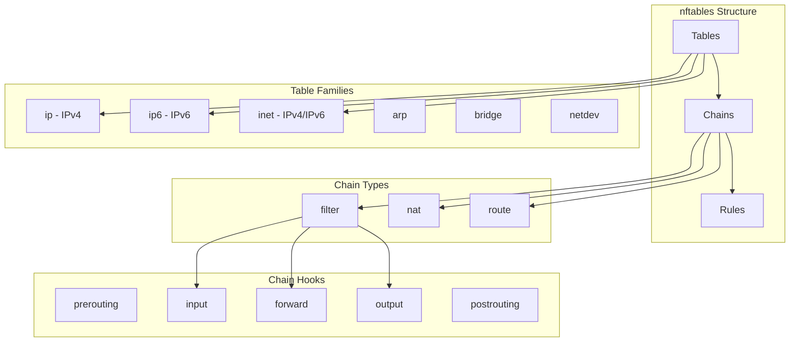
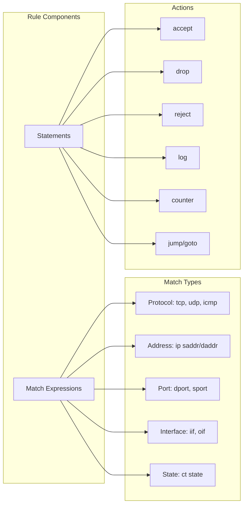
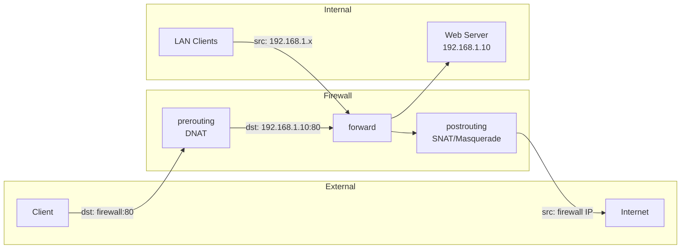
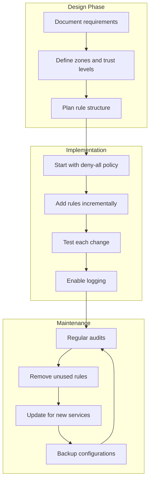

# nftables Guide: Configure Linux Firewall Rules (With Examples)

Author: [nawazdhandala](https://www.github.com/nawazdhandala)

Tags: nftables, Firewall, Linux Security, Network Security, iptables, Packet Filtering, System Administration

Description: Learn nftables from scratch. Create, list, and manage firewall rules on modern Linux systems with practical examples for filtering, NAT, and port forwarding.

---

> nftables is the modern replacement for iptables, ip6tables, arptables, and ebtables. It provides a unified framework for packet filtering with cleaner syntax, better performance, and more powerful features.

Your servers need protection. Let's build a proper firewall with nftables.

---

## Understanding nftables Architecture

nftables uses a different structure than iptables:



---

## Installing and Enabling nftables

```bash
# Debian/Ubuntu
sudo apt update
sudo apt install nftables

# RHEL/CentOS/Fedora
sudo dnf install nftables
# or
sudo yum install nftables

# Arch Linux
sudo pacman -S nftables

# Enable and start the service
sudo systemctl enable nftables
sudo systemctl start nftables

# Verify installation
nft --version
```

---

## Basic nftables Commands

Learn the essential commands:

```bash
# List all rules
sudo nft list ruleset

# List specific table
sudo nft list table inet filter

# List specific chain
sudo nft list chain inet filter input

# Flush all rules (clear everything)
sudo nft flush ruleset

# Flush specific table
sudo nft flush table inet filter

# Load rules from file
sudo nft -f /etc/nftables.conf

# Validate configuration without applying
sudo nft -c -f /etc/nftables.conf
```

---

## Creating Your First Ruleset

Start with a basic firewall configuration:

```bash
# Create the configuration file
sudo nano /etc/nftables.conf
```

Basic firewall template:

```bash
#!/usr/sbin/nft -f

# Clear existing rules
flush ruleset

# Create a table for IPv4 and IPv6
table inet filter {
    # Chain for incoming traffic
    chain input {
        # Set this chain as the filter for input hook
        type filter hook input priority 0; policy drop;

        # Accept established and related connections
        ct state established,related accept

        # Accept loopback traffic
        iif "lo" accept

        # Drop invalid connections
        ct state invalid drop

        # Accept ICMP (ping)
        ip protocol icmp accept
        ip6 nexthdr icmpv6 accept

        # Accept SSH
        tcp dport 22 accept

        # Log dropped packets (optional)
        log prefix "nftables drop: " flags all counter drop
    }

    # Chain for forwarded traffic
    chain forward {
        type filter hook forward priority 0; policy drop;
    }

    # Chain for outgoing traffic
    chain output {
        type filter hook output priority 0; policy accept;
    }
}
```

Apply the configuration:

```bash
# Load the rules
sudo nft -f /etc/nftables.conf

# Verify rules are active
sudo nft list ruleset

# Save current rules to file
sudo nft list ruleset > /etc/nftables.conf
```

---

## Rule Syntax Deep Dive

Understanding nftables rule syntax:



### Common Match Expressions

```bash
# Match by protocol
tcp dport 80 accept
udp dport 53 accept

# Match by IP address
ip saddr 192.168.1.0/24 accept
ip daddr 10.0.0.1 drop

# Match by interface
iif "eth0" accept
oif "eth1" accept

# Match by connection state
ct state new accept
ct state established,related accept

# Match multiple ports
tcp dport { 80, 443, 8080 } accept

# Match port range
tcp dport 1024-65535 accept

# Combine matches
ip saddr 192.168.1.0/24 tcp dport 22 accept
```

---

## Web Server Firewall Configuration

A comprehensive firewall for a web server:

```bash
#!/usr/sbin/nft -f

flush ruleset

# Define variables for easy management
define LAN_NET = 192.168.1.0/24
define ADMIN_IP = 192.168.1.100
define WEB_PORTS = { 80, 443 }
define SSH_PORT = 22

table inet filter {
    # Rate limiting set for SSH
    set ssh_limit {
        type ipv4_addr
        flags dynamic,timeout
        timeout 1m
    }

    chain input {
        type filter hook input priority 0; policy drop;

        # Accept established connections
        ct state established,related accept

        # Accept loopback
        iif "lo" accept

        # Drop invalid packets
        ct state invalid drop

        # ICMP rate limited
        ip protocol icmp limit rate 10/second accept
        ip6 nexthdr icmpv6 limit rate 10/second accept

        # SSH with rate limiting (prevent brute force)
        tcp dport $SSH_PORT ct state new \
            add @ssh_limit { ip saddr limit rate 3/minute burst 5 packets } \
            accept

        # Web traffic (HTTP/HTTPS)
        tcp dport $WEB_PORTS accept

        # Allow monitoring from LAN
        ip saddr $LAN_NET tcp dport 9100 accept

        # Admin access from specific IP
        ip saddr $ADMIN_IP accept

        # Log and drop everything else
        log prefix "Dropped: " counter drop
    }

    chain forward {
        type filter hook forward priority 0; policy drop;
    }

    chain output {
        type filter hook output priority 0; policy accept;
    }
}
```

---

## Database Server Firewall Configuration

Secure configuration for a database server:

```bash
#!/usr/sbin/nft -f

flush ruleset

define APP_SERVERS = { 192.168.1.10, 192.168.1.11, 192.168.1.12 }
define BACKUP_SERVER = 192.168.1.50
define ADMIN_NET = 192.168.1.0/24

table inet filter {
    chain input {
        type filter hook input priority 0; policy drop;

        # Established connections
        ct state established,related accept

        # Loopback
        iif "lo" accept

        # Drop invalid
        ct state invalid drop

        # ICMP from admin network only
        ip saddr $ADMIN_NET ip protocol icmp accept

        # SSH from admin network only
        ip saddr $ADMIN_NET tcp dport 22 accept

        # MySQL from application servers only
        ip saddr $APP_SERVERS tcp dport 3306 accept

        # PostgreSQL from application servers only
        ip saddr $APP_SERVERS tcp dport 5432 accept

        # Backup connections from backup server
        ip saddr $BACKUP_SERVER tcp dport { 22, 3306, 5432 } accept

        # Monitoring from admin network
        ip saddr $ADMIN_NET tcp dport 9100 accept

        # Log dropped connections
        counter log prefix "DB-FW-DROP: " drop
    }

    chain forward {
        type filter hook forward priority 0; policy drop;
    }

    chain output {
        type filter hook output priority 0; policy accept;
    }
}
```

---

## NAT Configuration

Configure Network Address Translation:

```bash
#!/usr/sbin/nft -f

flush ruleset

define WAN_IF = "eth0"
define LAN_IF = "eth1"
define LAN_NET = 192.168.1.0/24
define WEB_SERVER = 192.168.1.10

table inet filter {
    chain input {
        type filter hook input priority 0; policy drop;

        ct state established,related accept
        iif "lo" accept
        ct state invalid drop

        # Allow from LAN
        iif $LAN_IF accept

        # SSH from WAN
        iif $WAN_IF tcp dport 22 accept
    }

    chain forward {
        type filter hook forward priority 0; policy drop;

        # Allow established
        ct state established,related accept

        # Allow LAN to WAN
        iif $LAN_IF oif $WAN_IF accept

        # Allow port forwarding to web server
        iif $WAN_IF oif $LAN_IF ip daddr $WEB_SERVER tcp dport { 80, 443 } accept
    }

    chain output {
        type filter hook output priority 0; policy accept;
    }
}

# NAT table
table ip nat {
    chain prerouting {
        type nat hook prerouting priority -100;

        # Port forward HTTP/HTTPS to internal web server
        iif $WAN_IF tcp dport { 80, 443 } dnat to $WEB_SERVER
    }

    chain postrouting {
        type nat hook postrouting priority 100;

        # Masquerade outgoing traffic
        oif $WAN_IF masquerade
    }
}
```

NAT traffic flow:



---

## Rate Limiting and DDoS Protection

Protect against abuse with rate limiting:

```bash
#!/usr/sbin/nft -f

flush ruleset

table inet filter {
    # Set for tracking connection rates
    set flood_watch {
        type ipv4_addr
        flags dynamic,timeout
        timeout 1m
    }

    # Set for banned IPs
    set banned {
        type ipv4_addr
        flags timeout
        timeout 1h
    }

    chain input {
        type filter hook input priority 0; policy drop;

        # Drop banned IPs immediately
        ip saddr @banned drop

        # Established connections
        ct state established,related accept
        iif "lo" accept
        ct state invalid drop

        # Rate limit new connections
        ct state new limit rate over 100/second burst 150 packets \
            add @banned { ip saddr } drop

        # Rate limit ICMP
        ip protocol icmp limit rate 5/second burst 10 packets accept

        # SYN flood protection
        tcp flags syn limit rate 50/second burst 100 packets accept
        tcp flags syn drop

        # HTTP rate limiting
        tcp dport 80 ct state new \
            add @flood_watch { ip saddr limit rate 50/second } accept
        tcp dport 80 drop

        # HTTPS rate limiting
        tcp dport 443 ct state new \
            add @flood_watch { ip saddr limit rate 50/second } accept
        tcp dport 443 drop

        # SSH strict rate limiting
        tcp dport 22 ct state new \
            add @flood_watch { ip saddr limit rate 3/minute burst 5 packets } accept
        tcp dport 22 drop

        counter drop
    }

    chain forward {
        type filter hook forward priority 0; policy drop;
    }

    chain output {
        type filter hook output priority 0; policy accept;
    }
}
```

---

## Port Knocking Implementation

Implement port knocking for extra SSH security:

```bash
#!/usr/sbin/nft -f

flush ruleset

table inet filter {
    # Track clients through knock sequence
    set knock_stage1 {
        type ipv4_addr
        flags timeout
        timeout 10s
    }

    set knock_stage2 {
        type ipv4_addr
        flags timeout
        timeout 10s
    }

    set knock_stage3 {
        type ipv4_addr
        flags timeout
        timeout 10s
    }

    set allowed_ssh {
        type ipv4_addr
        flags timeout
        timeout 30s
    }

    chain input {
        type filter hook input priority 0; policy drop;

        ct state established,related accept
        iif "lo" accept
        ct state invalid drop

        # Port knock sequence: 7000, 8000, 9000
        # Stage 1: Knock on port 7000
        tcp dport 7000 add @knock_stage1 { ip saddr } drop

        # Stage 2: Knock on port 8000 (only if stage 1 completed)
        ip saddr @knock_stage1 tcp dport 8000 add @knock_stage2 { ip saddr } drop

        # Stage 3: Knock on port 9000 (only if stage 2 completed)
        ip saddr @knock_stage2 tcp dport 9000 add @knock_stage3 { ip saddr } drop

        # Grant SSH access after completing sequence
        ip saddr @knock_stage3 tcp dport 9999 add @allowed_ssh { ip saddr } drop

        # Allow SSH only from allowed set
        ip saddr @allowed_ssh tcp dport 22 accept

        # Allow HTTP/HTTPS normally
        tcp dport { 80, 443 } accept

        counter drop
    }

    chain output {
        type filter hook output priority 0; policy accept;
    }
}
```

To use port knocking:

```bash
# Knock sequence
nmap -Pn --host-timeout 100 --max-retries 0 -p 7000 server_ip
nmap -Pn --host-timeout 100 --max-retries 0 -p 8000 server_ip
nmap -Pn --host-timeout 100 --max-retries 0 -p 9000 server_ip
nmap -Pn --host-timeout 100 --max-retries 0 -p 9999 server_ip

# Now SSH works for 30 seconds
ssh user@server_ip
```

---

## Logging Configuration

Configure detailed logging:

```bash
#!/usr/sbin/nft -f

flush ruleset

table inet filter {
    chain input {
        type filter hook input priority 0; policy drop;

        ct state established,related accept
        iif "lo" accept

        # Log new SSH connections
        tcp dport 22 ct state new log prefix "SSH-NEW: " accept

        # Log and accept web traffic
        tcp dport { 80, 443 } ct state new \
            log prefix "WEB-NEW: " flags all accept

        # Log dropped packets with different prefixes
        tcp flags syn log prefix "DROP-SYN: " counter drop
        log prefix "DROP-OTHER: " counter drop
    }

    chain output {
        type filter hook output priority 0; policy accept;
    }
}
```

View logs:

```bash
# View firewall logs
sudo journalctl -k | grep -E "SSH-NEW|WEB-NEW|DROP"

# Real-time monitoring
sudo journalctl -kf | grep nftables

# Using dmesg
dmesg | grep -E "SSH-NEW|DROP"
```

---

## Managing Rules Dynamically

Add and remove rules without editing the config file:

```bash
# Add a new table
sudo nft add table inet mytable

# Add a chain
sudo nft add chain inet filter mychain

# Add a rule to existing chain
sudo nft add rule inet filter input tcp dport 8080 accept

# Insert rule at specific position (0 = first)
sudo nft insert rule inet filter input position 0 tcp dport 8081 accept

# Delete a rule (need handle number)
sudo nft -a list chain inet filter input  # shows handles
sudo nft delete rule inet filter input handle 15

# Add IP to a set
sudo nft add element inet filter banned { 10.0.0.5 }

# Remove IP from a set
sudo nft delete element inet filter banned { 10.0.0.5 }

# List sets
sudo nft list set inet filter banned
```

---

## Migration from iptables

Convert existing iptables rules to nftables:

```bash
# Save current iptables rules
sudo iptables-save > iptables-rules.txt

# Use translation tool
sudo iptables-restore-translate -f iptables-rules.txt > nftables-rules.nft

# Review and clean up the translated rules
cat nftables-rules.nft

# Load translated rules
sudo nft -f nftables-rules.nft
```

Comparison of syntax:

| iptables | nftables |
|----------|----------|
| `iptables -A INPUT` | `nft add rule inet filter input` |
| `-p tcp --dport 80` | `tcp dport 80` |
| `-j ACCEPT` | `accept` |
| `-j DROP` | `drop` |
| `-s 192.168.1.0/24` | `ip saddr 192.168.1.0/24` |
| `-m state --state NEW` | `ct state new` |
| `-m limit --limit 5/min` | `limit rate 5/minute` |

---

## Debugging nftables

Troubleshoot firewall issues:

```bash
# Check if nftables is active
sudo systemctl status nftables

# List all rules with counters
sudo nft list ruleset -a

# Check specific chain with counters
sudo nft list chain inet filter input

# Monitor rule matches in real-time
watch -n 1 'sudo nft list chain inet filter input'

# Trace packet path through rules
sudo nft add rule inet filter input meta nftrace set 1
sudo nft monitor trace

# Test connectivity
nc -zv server 22
curl -v http://server

# Check if packets are reaching the host
sudo tcpdump -i eth0 port 22
```

---

## Backup and Restore

Manage firewall configurations:

```bash
# Backup current rules
sudo nft list ruleset > /root/nftables-backup-$(date +%Y%m%d).conf

# Restore from backup
sudo nft -f /root/nftables-backup-20260124.conf

# Create atomic backup (stops traffic briefly)
sudo nft list ruleset > /tmp/rules.bak && \
    sudo nft flush ruleset && \
    sudo nft -f /tmp/rules.bak

# Scheduled backup via cron
echo "0 2 * * * root nft list ruleset > /root/nftables-backup-\$(date +\%Y\%m\%d).conf" | \
    sudo tee /etc/cron.d/nftables-backup
```

---

## Best Practices

Follow these guidelines for effective firewall management:



### Security Best Practices

1. **Default deny policy**: Always start with `policy drop`
2. **Allowlist approach**: Only permit necessary traffic
3. **Rate limiting**: Protect against brute force and DDoS
4. **Logging**: Log dropped packets for security monitoring
5. **Regular audits**: Review rules periodically
6. **Least privilege**: Allow minimum required access
7. **Document rules**: Comment complex configurations
8. **Test changes**: Verify rules before production deployment

---

## Systemd Integration

Ensure firewall starts at boot:

```bash
# Enable nftables service
sudo systemctl enable nftables

# The service loads /etc/nftables.conf at boot
# Verify configuration path
cat /lib/systemd/system/nftables.service

# Test configuration before reboot
sudo nft -c -f /etc/nftables.conf

# Reload rules without restart
sudo systemctl reload nftables
```

---

## Summary

nftables provides a modern, powerful firewall solution:

1. **Unified framework**: Single tool for all packet filtering needs
2. **Cleaner syntax**: More readable than iptables
3. **Better performance**: Atomic rule updates and optimized matching
4. **Rich features**: Sets, maps, concatenations, and more
5. **Easy migration**: Tools available to convert from iptables

Key commands to remember:
- `nft list ruleset` - View all rules
- `nft -f /etc/nftables.conf` - Load configuration
- `nft add rule...` - Add rules dynamically
- `nft flush ruleset` - Clear all rules

Start with a basic deny-all policy and add rules as needed. Test thoroughly before deploying to production, and always maintain backups of working configurations.
