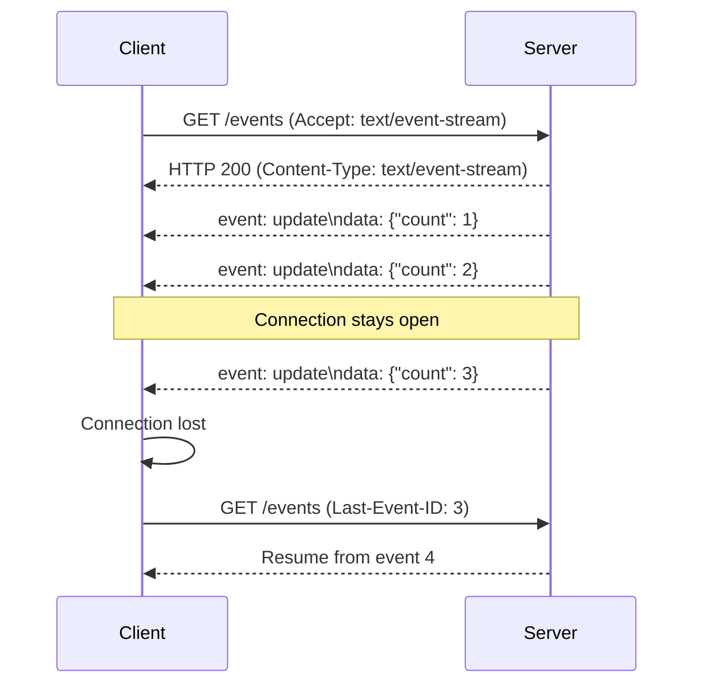

# How to Stream Updates with Server-Sent Events in Node.js

Author: [nawazdhandala](https://www.github.com/nawazdhandala)

Tags: Node.js, Server-Sent Events, SSE, Real-time, Streaming, Express, TypeScript

Description: Learn how to implement Server-Sent Events (SSE) in Node.js for real-time streaming updates. This guide covers basic implementation, connection management, reconnection handling, and scaling with Redis for multi-instance deployments.

---

Server-Sent Events (SSE) provide a simple way to push real-time updates from server to client over HTTP. Unlike WebSockets, SSE is a one-way communication channel that works over standard HTTP, making it easier to deploy behind load balancers and proxies. It is perfect for live feeds, notifications, progress updates, and any scenario where the server needs to push data to clients.

## How SSE Works

SSE uses a persistent HTTP connection where the server sends events to the client in a specific text format. The client uses the `EventSource` API to receive these events.



## Basic SSE Implementation

### Express Setup

```typescript
// sse-server.ts
import express, { Request, Response } from 'express';

const app = express();

// Store active connections
const clients = new Map<string, Response>();

// SSE endpoint
app.get('/events', (req: Request, res: Response) => {
  // Set headers for SSE
  res.setHeader('Content-Type', 'text/event-stream');
  res.setHeader('Cache-Control', 'no-cache');
  res.setHeader('Connection', 'keep-alive');

  // Disable response buffering (important for nginx)
  res.setHeader('X-Accel-Buffering', 'no');

  // Generate client ID
  const clientId = crypto.randomUUID();

  // Store the connection
  clients.set(clientId, res);
  console.log(`Client connected: ${clientId}. Total clients: ${clients.size}`);

  // Send initial connection event
  res.write(`event: connected\ndata: ${JSON.stringify({ clientId })}\n\n`);

  // Handle client disconnect
  req.on('close', () => {
    clients.delete(clientId);
    console.log(`Client disconnected: ${clientId}. Total clients: ${clients.size}`);
  });
});

// Broadcast to all clients
function broadcast(event: string, data: any) {
  const message = `event: ${event}\ndata: ${JSON.stringify(data)}\n\n`;

  clients.forEach((client, clientId) => {
    try {
      client.write(message);
    } catch (error) {
      console.error(`Failed to send to client ${clientId}:`, error);
      clients.delete(clientId);
    }
  });
}

// Example: Send periodic updates
setInterval(() => {
  broadcast('heartbeat', { timestamp: new Date().toISOString() });
}, 30000);

app.listen(3000, () => {
  console.log('SSE server running on port 3000');
});
```

### Client-Side Implementation

```javascript
// client.js
const eventSource = new EventSource('/events');

eventSource.onopen = () => {
  console.log('Connected to SSE');
};

// Handle named events
eventSource.addEventListener('connected', (event) => {
  const data = JSON.parse(event.data);
  console.log('Connected with client ID:', data.clientId);
});

eventSource.addEventListener('update', (event) => {
  const data = JSON.parse(event.data);
  console.log('Received update:', data);
});

// Handle connection errors
eventSource.onerror = (error) => {
  console.error('SSE error:', error);

  if (eventSource.readyState === EventSource.CLOSED) {
    console.log('Connection closed, will auto-reconnect');
  }
};
```

## Connection Management

### SSE Manager Class

Create a reusable SSE manager for better connection handling:

```typescript
// sse-manager.ts
import { Response } from 'express';

interface Client {
  id: string;
  response: Response;
  channels: Set<string>;
  lastEventId: number;
}

export class SSEManager {
  private clients = new Map<string, Client>();
  private eventCounter = 0;

  // Add new client connection
  addClient(clientId: string, res: Response, channels: string[] = []): void {
    // Set SSE headers
    res.setHeader('Content-Type', 'text/event-stream');
    res.setHeader('Cache-Control', 'no-cache');
    res.setHeader('Connection', 'keep-alive');
    res.setHeader('X-Accel-Buffering', 'no');

    // Flush headers immediately
    res.flushHeaders();

    const client: Client = {
      id: clientId,
      response: res,
      channels: new Set(channels),
      lastEventId: 0,
    };

    this.clients.set(clientId, client);

    // Send connection confirmation
    this.sendToClient(clientId, 'connected', { clientId, channels });
  }

  // Remove client connection
  removeClient(clientId: string): void {
    this.clients.delete(clientId);
  }

  // Subscribe client to a channel
  subscribe(clientId: string, channel: string): void {
    const client = this.clients.get(clientId);
    if (client) {
      client.channels.add(channel);
      this.sendToClient(clientId, 'subscribed', { channel });
    }
  }

  // Unsubscribe client from a channel
  unsubscribe(clientId: string, channel: string): void {
    const client = this.clients.get(clientId);
    if (client) {
      client.channels.delete(channel);
      this.sendToClient(clientId, 'unsubscribed', { channel });
    }
  }

  // Send event to specific client
  sendToClient(clientId: string, event: string, data: any): boolean {
    const client = this.clients.get(clientId);
    if (!client) return false;

    const eventId = ++this.eventCounter;
    const message = this.formatMessage(eventId, event, data);

    try {
      client.response.write(message);
      client.lastEventId = eventId;
      return true;
    } catch (error) {
      this.clients.delete(clientId);
      return false;
    }
  }

  // Broadcast to all clients
  broadcast(event: string, data: any): void {
    this.clients.forEach((_, clientId) => {
      this.sendToClient(clientId, event, data);
    });
  }

  // Send to clients subscribed to a channel
  sendToChannel(channel: string, event: string, data: any): void {
    this.clients.forEach((client, clientId) => {
      if (client.channels.has(channel)) {
        this.sendToClient(clientId, event, data);
      }
    });
  }

  // Format SSE message
  private formatMessage(id: number, event: string, data: any): string {
    const lines = [
      `id: ${id}`,
      `event: ${event}`,
      `data: ${JSON.stringify(data)}`,
      '', // Empty line to end the event
      '',
    ];
    return lines.join('\n');
  }

  // Get connection count
  getClientCount(): number {
    return this.clients.size;
  }

  // Get clients in a channel
  getChannelClients(channel: string): string[] {
    const clientIds: string[] = [];
    this.clients.forEach((client, clientId) => {
      if (client.channels.has(channel)) {
        clientIds.push(clientId);
      }
    });
    return clientIds;
  }
}
```

### Using the SSE Manager

```typescript
// app.ts
import express from 'express';
import { SSEManager } from './sse-manager';

const app = express();
const sseManager = new SSEManager();

app.use(express.json());

// SSE connection endpoint
app.get('/events', (req, res) => {
  const clientId = req.query.clientId as string || crypto.randomUUID();
  const channels = (req.query.channels as string || '').split(',').filter(Boolean);

  sseManager.addClient(clientId, res, channels);

  req.on('close', () => {
    sseManager.removeClient(clientId);
  });
});

// Subscribe to a channel
app.post('/subscribe', (req, res) => {
  const { clientId, channel } = req.body;
  sseManager.subscribe(clientId, channel);
  res.json({ success: true });
});

// Send event to a channel
app.post('/notify', (req, res) => {
  const { channel, event, data } = req.body;
  sseManager.sendToChannel(channel, event, data);
  res.json({ success: true, recipients: sseManager.getChannelClients(channel).length });
});

// Broadcast to all clients
app.post('/broadcast', (req, res) => {
  const { event, data } = req.body;
  sseManager.broadcast(event, data);
  res.json({ success: true, recipients: sseManager.getClientCount() });
});

app.listen(3000);
```

## Reconnection Handling

SSE clients automatically reconnect when the connection drops. Use event IDs to resume from where the client left off:

```typescript
// sse-with-history.ts
interface StoredEvent {
  id: number;
  event: string;
  data: any;
  timestamp: number;
}

class SSEManagerWithHistory {
  private clients = new Map<string, Response>();
  private eventHistory: StoredEvent[] = [];
  private maxHistorySize = 1000;
  private eventCounter = 0;

  addClient(clientId: string, res: Response, lastEventId?: string): void {
    res.setHeader('Content-Type', 'text/event-stream');
    res.setHeader('Cache-Control', 'no-cache');
    res.setHeader('Connection', 'keep-alive');
    res.flushHeaders();

    this.clients.set(clientId, res);

    // Replay missed events if client is reconnecting
    if (lastEventId) {
      const missedEvents = this.getMissedEvents(parseInt(lastEventId, 10));
      console.log(`Replaying ${missedEvents.length} missed events for client ${clientId}`);

      missedEvents.forEach((event) => {
        this.sendEventToClient(res, event.id, event.event, event.data);
      });
    }

    this.sendEventToClient(res, ++this.eventCounter, 'connected', { clientId });
  }

  private getMissedEvents(lastEventId: number): StoredEvent[] {
    return this.eventHistory.filter((event) => event.id > lastEventId);
  }

  broadcast(event: string, data: any): void {
    const eventId = ++this.eventCounter;

    // Store event in history
    this.eventHistory.push({
      id: eventId,
      event,
      data,
      timestamp: Date.now(),
    });

    // Trim history if too large
    if (this.eventHistory.length > this.maxHistorySize) {
      this.eventHistory = this.eventHistory.slice(-this.maxHistorySize);
    }

    // Send to all clients
    this.clients.forEach((res, clientId) => {
      try {
        this.sendEventToClient(res, eventId, event, data);
      } catch (error) {
        this.clients.delete(clientId);
      }
    });
  }

  private sendEventToClient(res: Response, id: number, event: string, data: any): void {
    res.write(`id: ${id}\nevent: ${event}\ndata: ${JSON.stringify(data)}\n\n`);
  }
}

// Express endpoint with reconnection support
app.get('/events', (req, res) => {
  const clientId = req.query.clientId as string || crypto.randomUUID();
  const lastEventId = req.headers['last-event-id'] as string;

  sseManager.addClient(clientId, res, lastEventId);

  req.on('close', () => {
    sseManager.removeClient(clientId);
  });
});
```

## Scaling with Redis Pub/Sub

For multi-instance deployments, use Redis to broadcast events across all server instances:

```typescript
// sse-redis.ts
import Redis from 'ioredis';
import { Response } from 'express';

const publisher = new Redis(process.env.REDIS_URL);
const subscriber = new Redis(process.env.REDIS_URL);

class DistributedSSEManager {
  private localClients = new Map<string, Response>();
  private channelSubscriptions = new Map<string, Set<string>>();

  constructor() {
    this.setupRedisSubscriber();
  }

  private setupRedisSubscriber(): void {
    subscriber.on('message', (channel, message) => {
      const { event, data } = JSON.parse(message);
      this.sendToLocalChannelClients(channel, event, data);
    });
  }

  async addClient(clientId: string, res: Response): Promise<void> {
    res.setHeader('Content-Type', 'text/event-stream');
    res.setHeader('Cache-Control', 'no-cache');
    res.setHeader('Connection', 'keep-alive');
    res.flushHeaders();

    this.localClients.set(clientId, res);
    res.write(`event: connected\ndata: ${JSON.stringify({ clientId })}\n\n`);
  }

  async subscribe(clientId: string, channel: string): Promise<void> {
    // Track local subscription
    if (!this.channelSubscriptions.has(channel)) {
      this.channelSubscriptions.set(channel, new Set());
      // Subscribe to Redis channel
      await subscriber.subscribe(channel);
    }
    this.channelSubscriptions.get(channel)!.add(clientId);
  }

  async unsubscribe(clientId: string, channel: string): Promise<void> {
    const clients = this.channelSubscriptions.get(channel);
    if (clients) {
      clients.delete(clientId);
      if (clients.size === 0) {
        this.channelSubscriptions.delete(channel);
        await subscriber.unsubscribe(channel);
      }
    }
  }

  // Publish event to Redis (all instances will receive it)
  async publishToChannel(channel: string, event: string, data: any): Promise<void> {
    await publisher.publish(channel, JSON.stringify({ event, data }));
  }

  // Send to local clients subscribed to a channel
  private sendToLocalChannelClients(channel: string, event: string, data: any): void {
    const clients = this.channelSubscriptions.get(channel);
    if (!clients) return;

    const message = `event: ${event}\ndata: ${JSON.stringify(data)}\n\n`;

    clients.forEach((clientId) => {
      const res = this.localClients.get(clientId);
      if (res) {
        try {
          res.write(message);
        } catch (error) {
          this.removeClient(clientId);
        }
      }
    });
  }

  removeClient(clientId: string): void {
    this.localClients.delete(clientId);
    // Remove from all channel subscriptions
    this.channelSubscriptions.forEach((clients, channel) => {
      clients.delete(clientId);
    });
  }
}
```

## Practical Example: Live Notifications

```typescript
// notification-service.ts
import { SSEManager } from './sse-manager';

const sseManager = new SSEManager();

// Endpoint for SSE connections
app.get('/notifications/stream', (req, res) => {
  const userId = req.user.id; // From auth middleware

  sseManager.addClient(userId, res, [`user:${userId}`]);

  req.on('close', () => {
    sseManager.removeClient(userId);
  });
});

// Send notification to a user
async function notifyUser(userId: string, notification: any) {
  // Save to database
  const saved = await db.notifications.create({
    userId,
    ...notification,
  });

  // Send real-time update via SSE
  sseManager.sendToChannel(`user:${userId}`, 'notification', {
    id: saved.id,
    type: notification.type,
    title: notification.title,
    message: notification.message,
    createdAt: saved.createdAt,
  });
}

// Example: Notify user when order ships
app.post('/orders/:id/ship', async (req, res) => {
  const order = await db.orders.findById(req.params.id);

  await notifyUser(order.userId, {
    type: 'order_shipped',
    title: 'Order Shipped',
    message: `Your order #${order.id} has shipped!`,
  });

  res.json({ success: true });
});
```

## Summary

| Aspect | Implementation |
|--------|---------------|
| **Basic Setup** | Set headers, keep connection open, format events |
| **Connection Management** | Track clients, handle disconnects, channel subscriptions |
| **Reconnection** | Use event IDs, replay missed events |
| **Scaling** | Redis Pub/Sub for multi-instance deployments |
| **Use Cases** | Notifications, live feeds, progress updates |

Server-Sent Events offer a simpler alternative to WebSockets when you only need server-to-client communication. They work over standard HTTP, automatically reconnect, and are well-supported by browsers. For scenarios requiring bidirectional communication, consider WebSockets instead, but for notifications, live feeds, and real-time updates, SSE is often the better choice.
