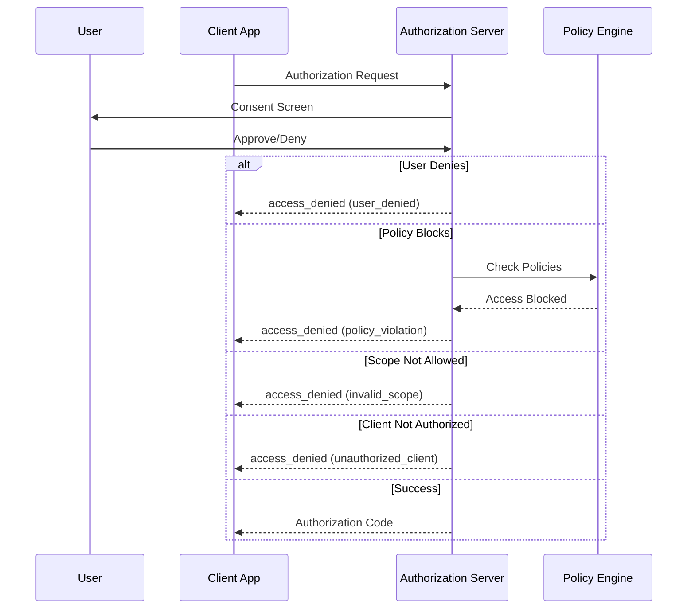
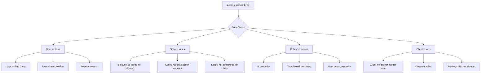
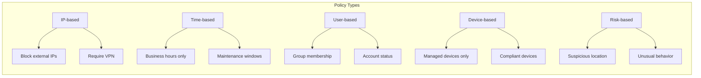

# How to Fix "Access Denied" OAuth2 Errors

Author: [nawazdhandala](https://www.github.com/nawazdhandala)

Tags: OAuth2, Authentication, Security, API, Troubleshooting

Description: Learn how to diagnose and fix OAuth2 access_denied errors including user rejection, scope issues, consent problems, and authorization policy violations.

---

The "access_denied" error occurs when the OAuth2 authorization server refuses to grant access to the requested resources. Unlike authentication errors, access_denied typically means the user or authorization policies explicitly blocked the request. This guide covers the common causes and solutions.

## Understanding Access Denied Errors



## Common Causes of Access Denied Errors



## Cause 1: User Denied Consent

The most common cause is the user clicking "Deny" or "Cancel" on the consent screen.

### Diagnosis

```python
# URL callback with user denial
# https://yourapp.com/callback?error=access_denied&error_description=The+user+denied+the+request

# Error response
{
    "error": "access_denied",
    "error_description": "The user denied the request"
}
```

### Solution

Handle user denial gracefully:

```python
from flask import Flask, request, redirect, render_template
from enum import Enum

app = Flask(__name__)


class DenialReason(Enum):
    USER_DENIED = "user_denied"
    SESSION_EXPIRED = "session_expired"
    CANCELLED = "cancelled"
    UNKNOWN = "unknown"


def classify_denial(error_description: str) -> DenialReason:
    """Classify the reason for denial based on error description."""
    description_lower = error_description.lower()

    if "denied" in description_lower or "rejected" in description_lower:
        return DenialReason.USER_DENIED
    elif "expired" in description_lower or "timeout" in description_lower:
        return DenialReason.SESSION_EXPIRED
    elif "cancel" in description_lower or "closed" in description_lower:
        return DenialReason.CANCELLED
    else:
        return DenialReason.UNKNOWN


@app.route("/callback")
def oauth_callback():
    """Handle OAuth2 callback including access denied errors."""

    # Check for error
    error = request.args.get("error")

    if error == "access_denied":
        error_description = request.args.get("error_description", "")
        reason = classify_denial(error_description)

        return handle_access_denied(reason, error_description)

    elif error:
        # Other OAuth2 errors
        return render_template(
            "error.html",
            error=error,
            description=request.args.get("error_description", "")
        )

    # Success - process authorization code
    code = request.args.get("code")
    # ... continue with token exchange


def handle_access_denied(reason: DenialReason, description: str):
    """Handle access denied based on the reason."""

    messages = {
        DenialReason.USER_DENIED: {
            "title": "Access Not Granted",
            "message": "You chose not to grant access to the application.",
            "action": "If this was a mistake, you can try logging in again.",
            "show_retry": True
        },
        DenialReason.SESSION_EXPIRED: {
            "title": "Session Expired",
            "message": "Your login session expired before completing authorization.",
            "action": "Please try logging in again.",
            "show_retry": True
        },
        DenialReason.CANCELLED: {
            "title": "Login Cancelled",
            "message": "The login process was cancelled.",
            "action": "Click the button below to try again.",
            "show_retry": True
        },
        DenialReason.UNKNOWN: {
            "title": "Access Denied",
            "message": f"Access was denied: {description}",
            "action": "Please contact support if you believe this is an error.",
            "show_retry": True
        }
    }

    context = messages.get(reason, messages[DenialReason.UNKNOWN])

    return render_template("access_denied.html", **context)


# Template: access_denied.html
"""
<!DOCTYPE html>
<html>
<head>
    <title>{{ title }}</title>
</head>
<body>
    <h1>{{ title }}</h1>
    <p>{{ message }}</p>
    <p>{{ action }}</p>
    
    <a href="/login">Try Again</a>
    
    <a href="/">Return Home</a>
</body>
</html>
"""
```

## Cause 2: Invalid or Unauthorized Scopes

Requesting scopes that the client is not authorized for or that do not exist.

### Diagnosis

```python
# Error when requesting unauthorized scope
{
    "error": "access_denied",
    "error_description": "The requested scope is not authorized for this client"
}
```

### Solution

Validate and manage scopes properly:

```python
from typing import List, Set, Optional
from dataclasses import dataclass

@dataclass
class ScopeConfig:
    """Configuration for OAuth2 scopes."""
    required_scopes: List[str]        # Scopes always requested
    optional_scopes: List[str]        # Scopes that can be requested
    admin_scopes: List[str]           # Scopes requiring admin consent
    default_scopes: List[str]         # Scopes used when none specified


class OAuth2ScopeManager:
    """
    Manage OAuth2 scopes with validation and fallback.
    """

    def __init__(self, config: ScopeConfig, client_allowed_scopes: Set[str]):
        self.config = config
        self.client_allowed_scopes = client_allowed_scopes

    def validate_scopes(self, requested_scopes: List[str]) -> dict:
        """
        Validate requested scopes against client configuration.
        Returns dict with valid scopes and any issues.
        """
        result = {
            "valid_scopes": [],
            "invalid_scopes": [],
            "requires_admin": [],
            "warnings": []
        }

        for scope in requested_scopes:
            if scope not in self.client_allowed_scopes:
                result["invalid_scopes"].append(scope)
            elif scope in self.config.admin_scopes:
                result["requires_admin"].append(scope)
                result["valid_scopes"].append(scope)
            else:
                result["valid_scopes"].append(scope)

        if result["invalid_scopes"]:
            result["warnings"].append(
                f"Scopes not allowed for this client: {result['invalid_scopes']}"
            )

        if result["requires_admin"]:
            result["warnings"].append(
                f"Scopes requiring admin consent: {result['requires_admin']}"
            )

        return result

    def get_safe_scopes(self, requested_scopes: Optional[List[str]] = None) -> List[str]:
        """
        Get a list of valid scopes, falling back to defaults if needed.
        """
        if not requested_scopes:
            requested_scopes = self.config.default_scopes

        # Filter to only allowed scopes
        safe_scopes = [
            scope for scope in requested_scopes
            if scope in self.client_allowed_scopes
        ]

        # Ensure required scopes are included
        for required in self.config.required_scopes:
            if required not in safe_scopes and required in self.client_allowed_scopes:
                safe_scopes.append(required)

        return safe_scopes

    def request_minimal_scopes_first(self, scopes: List[str]) -> List[List[str]]:
        """
        Split scopes into minimal required and progressive requests.
        Useful when some scopes might be denied.
        """
        # Start with just required scopes
        scope_sets = [self.config.required_scopes.copy()]

        # Add optional scopes progressively
        optional = [s for s in scopes if s in self.config.optional_scopes]
        if optional:
            scope_sets.append(self.config.required_scopes + optional)

        return scope_sets


# Usage
scope_config = ScopeConfig(
    required_scopes=["openid", "profile"],
    optional_scopes=["email", "offline_access"],
    admin_scopes=["admin.read", "admin.write"],
    default_scopes=["openid", "profile", "email"]
)

# These would come from your OAuth2 provider's client configuration
client_allowed_scopes = {"openid", "profile", "email", "offline_access"}

manager = OAuth2ScopeManager(scope_config, client_allowed_scopes)

# Validate before making authorization request
validation = manager.validate_scopes(["openid", "profile", "admin.read"])
print(f"Validation result: {validation}")

# Get safe scopes
safe_scopes = manager.get_safe_scopes(["openid", "profile", "admin.read"])
print(f"Safe scopes: {safe_scopes}")
```

### Progressive Scope Request

```python
class ProgressiveScopeAuth:
    """
    Request scopes progressively, starting with minimum required.
    """

    def __init__(self, oauth_client, scope_manager: OAuth2ScopeManager):
        self.oauth_client = oauth_client
        self.scope_manager = scope_manager
        self._granted_scopes: Set[str] = set()

    def request_authorization(self, desired_scopes: List[str]) -> str:
        """
        Request authorization starting with minimal scopes.
        """
        # Start with minimal scopes
        initial_scopes = self.scope_manager.config.required_scopes

        return self.oauth_client.get_authorization_url(scopes=initial_scopes)

    def request_additional_scopes(self, additional_scopes: List[str]) -> str:
        """
        Request additional scopes after initial authorization.
        Uses incremental authorization if supported.
        """
        # Validate the additional scopes
        validation = self.scope_manager.validate_scopes(additional_scopes)

        if validation["invalid_scopes"]:
            raise ValueError(f"Cannot request scopes: {validation['invalid_scopes']}")

        # Request with include_granted_scopes for incremental auth
        all_scopes = list(self._granted_scopes) + validation["valid_scopes"]

        return self.oauth_client.get_authorization_url(
            scopes=all_scopes,
            extra_params={"include_granted_scopes": "true"}
        )

    def update_granted_scopes(self, token_response: dict):
        """Update the set of granted scopes from token response."""
        scope_string = token_response.get("scope", "")
        self._granted_scopes = set(scope_string.split())

    def has_scope(self, scope: str) -> bool:
        """Check if a scope has been granted."""
        return scope in self._granted_scopes
```

## Cause 3: Authorization Policy Violations

Enterprise policies may block access based on various conditions.

### Common Policy Restrictions



### Solution

Implement policy-aware error handling:

```python
from dataclasses import dataclass
from typing import Optional, List
from enum import Enum


class PolicyType(Enum):
    IP_RESTRICTION = "ip_restriction"
    TIME_RESTRICTION = "time_restriction"
    GROUP_RESTRICTION = "group_restriction"
    DEVICE_RESTRICTION = "device_restriction"
    MFA_REQUIRED = "mfa_required"
    ADMIN_CONSENT_REQUIRED = "admin_consent"
    UNKNOWN = "unknown"


@dataclass
class PolicyViolation:
    """Details about a policy violation."""
    policy_type: PolicyType
    message: str
    remediation: Optional[str] = None


def parse_policy_error(error_description: str) -> PolicyViolation:
    """
    Parse error description to identify policy violation type.
    """
    description_lower = error_description.lower()

    # IP/Network restrictions
    if any(term in description_lower for term in ["ip", "network", "location", "vpn"]):
        return PolicyViolation(
            policy_type=PolicyType.IP_RESTRICTION,
            message="Access is restricted based on your network location.",
            remediation="Connect to your corporate VPN or access from an approved network."
        )

    # Time restrictions
    if any(term in description_lower for term in ["time", "hours", "schedule"]):
        return PolicyViolation(
            policy_type=PolicyType.TIME_RESTRICTION,
            message="Access is not allowed at this time.",
            remediation="Try again during business hours or contact your administrator."
        )

    # Group/Role restrictions
    if any(term in description_lower for term in ["group", "role", "permission", "member"]):
        return PolicyViolation(
            policy_type=PolicyType.GROUP_RESTRICTION,
            message="You do not have the required group membership or role.",
            remediation="Contact your administrator to request access."
        )

    # Device restrictions
    if any(term in description_lower for term in ["device", "compliant", "managed", "enrolled"]):
        return PolicyViolation(
            policy_type=PolicyType.DEVICE_RESTRICTION,
            message="Access is restricted to managed or compliant devices.",
            remediation="Use a company-managed device or ensure your device meets compliance requirements."
        )

    # MFA required
    if any(term in description_lower for term in ["mfa", "multi-factor", "two-factor", "2fa"]):
        return PolicyViolation(
            policy_type=PolicyType.MFA_REQUIRED,
            message="Multi-factor authentication is required.",
            remediation="Complete MFA setup and try again."
        )

    # Admin consent required
    if any(term in description_lower for term in ["admin consent", "administrator", "tenant"]):
        return PolicyViolation(
            policy_type=PolicyType.ADMIN_CONSENT_REQUIRED,
            message="This application requires administrator approval.",
            remediation="Contact your IT administrator to approve this application."
        )

    return PolicyViolation(
        policy_type=PolicyType.UNKNOWN,
        message=error_description,
        remediation="Contact your administrator for assistance."
    )


class PolicyAwareOAuth2Handler:
    """
    Handle OAuth2 authorization with policy-aware error handling.
    """

    def handle_callback_error(self, error: str, error_description: str) -> dict:
        """
        Handle callback errors with policy-specific responses.
        """
        if error != "access_denied":
            return {
                "error": error,
                "message": error_description,
                "recoverable": False
            }

        # Parse the policy violation
        violation = parse_policy_error(error_description)

        # Build response based on policy type
        response = {
            "error": "access_denied",
            "policy_type": violation.policy_type.value,
            "message": violation.message,
            "remediation": violation.remediation,
            "recoverable": self._is_recoverable(violation.policy_type)
        }

        # Add specific actions for recoverable errors
        if response["recoverable"]:
            response["actions"] = self._get_actions(violation.policy_type)

        return response

    def _is_recoverable(self, policy_type: PolicyType) -> bool:
        """Check if the policy violation can be recovered from."""
        recoverable_types = {
            PolicyType.IP_RESTRICTION,      # Can connect to VPN
            PolicyType.TIME_RESTRICTION,    # Can try later
            PolicyType.MFA_REQUIRED,        # Can complete MFA
        }
        return policy_type in recoverable_types

    def _get_actions(self, policy_type: PolicyType) -> List[dict]:
        """Get available actions for the user."""
        actions = {
            PolicyType.IP_RESTRICTION: [
                {"label": "Connect to VPN", "action": "vpn_connect"},
                {"label": "Try Again", "action": "retry"}
            ],
            PolicyType.TIME_RESTRICTION: [
                {"label": "Set Reminder", "action": "set_reminder"},
                {"label": "Contact Admin", "action": "contact_admin"}
            ],
            PolicyType.MFA_REQUIRED: [
                {"label": "Set Up MFA", "action": "mfa_setup"},
                {"label": "Try Again", "action": "retry"}
            ],
            PolicyType.GROUP_RESTRICTION: [
                {"label": "Request Access", "action": "request_access"},
                {"label": "Contact Admin", "action": "contact_admin"}
            ],
            PolicyType.ADMIN_CONSENT_REQUIRED: [
                {"label": "Request Admin Approval", "action": "request_admin_consent"},
                {"label": "Contact Admin", "action": "contact_admin"}
            ]
        }
        return actions.get(policy_type, [{"label": "Contact Support", "action": "contact_support"}])


# Flask implementation
@app.route("/callback")
def oauth_callback():
    error = request.args.get("error")

    if error:
        handler = PolicyAwareOAuth2Handler()
        error_response = handler.handle_callback_error(
            error=error,
            error_description=request.args.get("error_description", "")
        )

        return render_template("policy_error.html", **error_response)

    # Continue with normal flow...
```

## Cause 4: Admin Consent Required

Some scopes or applications require tenant administrator approval.

### Solution

Implement admin consent flow:

```python
import urllib.parse

class AdminConsentHandler:
    """
    Handle admin consent requirements for enterprise applications.
    """

    def __init__(
        self,
        client_id: str,
        tenant_id: str,
        redirect_uri: str,
        admin_consent_url: str
    ):
        self.client_id = client_id
        self.tenant_id = tenant_id
        self.redirect_uri = redirect_uri
        self.admin_consent_url = admin_consent_url

    def get_admin_consent_url(self, scopes: List[str], state: str) -> str:
        """
        Generate URL for admin consent flow.
        Admin must visit this URL to grant consent for the tenant.
        """
        params = {
            "client_id": self.client_id,
            "redirect_uri": self.redirect_uri,
            "scope": " ".join(scopes),
            "state": state
        }

        return f"{self.admin_consent_url}?{urllib.parse.urlencode(params)}"

    def check_consent_status(self, access_token: str) -> dict:
        """
        Check if admin consent has been granted.
        """
        # This would typically call an API endpoint
        # For Microsoft: GET /v1.0/oauth2PermissionGrants
        # Implementation varies by provider

        import requests

        response = requests.get(
            "https://graph.microsoft.com/v1.0/oauth2PermissionGrants",
            headers={"Authorization": f"Bearer {access_token}"},
            params={"$filter": f"clientId eq '{self.client_id}'"}
        )

        if response.status_code == 200:
            grants = response.json().get("value", [])
            return {
                "consented": len(grants) > 0,
                "grants": grants
            }

        return {"consented": False, "error": response.text}

    def generate_consent_request_email(self, admin_email: str) -> dict:
        """
        Generate an email template for requesting admin consent.
        """
        consent_url = self.get_admin_consent_url(
            scopes=["openid", "profile", "email"],
            state="admin_consent_request"
        )

        return {
            "to": admin_email,
            "subject": "Admin Consent Required for Application Access",
            "body": f"""
Hello,

A user is requesting access to an application that requires administrator approval.

Application: Your App Name
Client ID: {self.client_id}

To approve this application for your organization, please visit:
{consent_url}

If you have questions about this request, please contact the user who initiated it.

Thank you.
            """.strip()
        }


# Microsoft Entra ID (Azure AD) specific implementation
class MicrosoftAdminConsent(AdminConsentHandler):
    """
    Admin consent handler for Microsoft Entra ID.
    """

    def __init__(self, client_id: str, tenant_id: str, redirect_uri: str):
        super().__init__(
            client_id=client_id,
            tenant_id=tenant_id,
            redirect_uri=redirect_uri,
            admin_consent_url=f"https://login.microsoftonline.com/{tenant_id}/adminconsent"
        )

    def get_admin_consent_url(self, scopes: List[str], state: str) -> str:
        """Microsoft-specific admin consent URL."""
        params = {
            "client_id": self.client_id,
            "redirect_uri": self.redirect_uri,
            "state": state,
            "scope": " ".join(scopes)
        }

        base_url = f"https://login.microsoftonline.com/{self.tenant_id}/v2.0/adminconsent"
        return f"{base_url}?{urllib.parse.urlencode(params)}"

    def handle_admin_consent_callback(self, admin_consent: str, error: str = None) -> dict:
        """Handle the callback from admin consent flow."""
        if error:
            return {
                "success": False,
                "error": error,
                "message": "Admin consent was not granted"
            }

        if admin_consent == "True":
            return {
                "success": True,
                "message": "Admin consent was granted successfully"
            }

        return {
            "success": False,
            "message": "Admin consent status unknown"
        }
```

## Cause 5: Redirect URI Issues

Mismatched or unregistered redirect URIs can cause access denied errors.

### Solution

```python
class RedirectURIValidator:
    """
    Validate redirect URIs to prevent access denied errors.
    """

    def __init__(self, registered_uris: List[str]):
        self.registered_uris = [self._normalize(uri) for uri in registered_uris]

    def _normalize(self, uri: str) -> str:
        """Normalize URI for comparison."""
        from urllib.parse import urlparse, urlunparse

        parsed = urlparse(uri)
        return urlunparse((
            parsed.scheme.lower(),
            parsed.netloc.lower(),
            parsed.path.rstrip('/') or '/',
            '',
            '',
            ''
        ))

    def validate(self, redirect_uri: str) -> dict:
        """
        Validate a redirect URI against registered URIs.
        """
        normalized = self._normalize(redirect_uri)

        if normalized in self.registered_uris:
            return {"valid": True, "uri": redirect_uri}

        # Find closest match for helpful error message
        closest = self._find_closest_match(normalized)

        return {
            "valid": False,
            "uri": redirect_uri,
            "normalized": normalized,
            "closest_match": closest,
            "registered_uris": self.registered_uris,
            "error": f"Redirect URI not registered. Closest match: {closest}"
        }

    def _find_closest_match(self, uri: str) -> Optional[str]:
        """Find the closest matching registered URI."""
        from difflib import SequenceMatcher

        if not self.registered_uris:
            return None

        matches = [
            (SequenceMatcher(None, uri, registered).ratio(), registered)
            for registered in self.registered_uris
        ]

        best_match = max(matches, key=lambda x: x[0])
        return best_match[1] if best_match[0] > 0.5 else None


# Usage
validator = RedirectURIValidator([
    "https://myapp.com/callback",
    "https://myapp.com/auth/callback",
    "http://localhost:3000/callback"
])

# This will fail
result = validator.validate("https://myapp.com/callback/")  # Trailing slash
print(result)
# {'valid': False, 'uri': 'https://myapp.com/callback/', ...}
```

## Comprehensive Error Handler

```python
from flask import Flask, request, render_template, redirect, url_for
import logging

logger = logging.getLogger(__name__)


class OAuth2ErrorHandler:
    """
    Comprehensive OAuth2 error handler with detailed diagnostics.
    """

    def __init__(self, oauth_client):
        self.oauth_client = oauth_client
        self.policy_handler = PolicyAwareOAuth2Handler()

    def handle_callback(self, request_args: dict) -> dict:
        """
        Handle OAuth2 callback with comprehensive error handling.
        """
        error = request_args.get("error")

        if not error:
            # No error - process normally
            return {"success": True, "code": request_args.get("code")}

        error_description = request_args.get("error_description", "")
        error_uri = request_args.get("error_uri")

        # Log the error
        logger.warning(
            f"OAuth2 error: {error} - {error_description}",
            extra={
                "error": error,
                "error_description": error_description,
                "error_uri": error_uri
            }
        )

        # Handle specific error types
        handlers = {
            "access_denied": self._handle_access_denied,
            "invalid_request": self._handle_invalid_request,
            "unauthorized_client": self._handle_unauthorized_client,
            "invalid_scope": self._handle_invalid_scope,
            "server_error": self._handle_server_error,
            "temporarily_unavailable": self._handle_temporarily_unavailable
        }

        handler = handlers.get(error, self._handle_unknown_error)
        return handler(error, error_description, error_uri)

    def _handle_access_denied(
        self,
        error: str,
        description: str,
        error_uri: str
    ) -> dict:
        """Handle access_denied errors."""

        # Check for user denial
        if "denied" in description.lower() or "reject" in description.lower():
            return {
                "success": False,
                "error_type": "user_denied",
                "title": "Access Not Granted",
                "message": "You chose not to grant access to the application.",
                "recoverable": True,
                "actions": [
                    {"label": "Try Again", "url": url_for("login")},
                    {"label": "Learn More", "url": "/help/permissions"}
                ]
            }

        # Check for policy violations
        policy_response = self.policy_handler.handle_callback_error(error, description)
        return {
            "success": False,
            "error_type": "policy_violation",
            **policy_response
        }

    def _handle_invalid_scope(
        self,
        error: str,
        description: str,
        error_uri: str
    ) -> dict:
        """Handle invalid_scope errors."""
        return {
            "success": False,
            "error_type": "invalid_scope",
            "title": "Permission Not Available",
            "message": "The requested permissions are not available.",
            "details": description,
            "recoverable": True,
            "actions": [
                {"label": "Request Basic Access", "url": url_for("login", scope="basic")},
                {"label": "Contact Admin", "url": "/support"}
            ]
        }

    def _handle_unauthorized_client(
        self,
        error: str,
        description: str,
        error_uri: str
    ) -> dict:
        """Handle unauthorized_client errors."""
        return {
            "success": False,
            "error_type": "unauthorized_client",
            "title": "Application Not Authorized",
            "message": "This application is not authorized to perform this action.",
            "details": description,
            "recoverable": False,
            "actions": [
                {"label": "Contact Support", "url": "/support"}
            ]
        }

    def _handle_invalid_request(
        self,
        error: str,
        description: str,
        error_uri: str
    ) -> dict:
        """Handle invalid_request errors."""
        return {
            "success": False,
            "error_type": "invalid_request",
            "title": "Invalid Request",
            "message": "The authorization request was invalid.",
            "details": description,
            "recoverable": True,
            "actions": [
                {"label": "Try Again", "url": url_for("login")}
            ]
        }

    def _handle_server_error(
        self,
        error: str,
        description: str,
        error_uri: str
    ) -> dict:
        """Handle server_error errors."""
        return {
            "success": False,
            "error_type": "server_error",
            "title": "Server Error",
            "message": "The authorization server encountered an error.",
            "details": description,
            "recoverable": True,
            "retry_after": 60,
            "actions": [
                {"label": "Try Again", "url": url_for("login")}
            ]
        }

    def _handle_temporarily_unavailable(
        self,
        error: str,
        description: str,
        error_uri: str
    ) -> dict:
        """Handle temporarily_unavailable errors."""
        return {
            "success": False,
            "error_type": "temporarily_unavailable",
            "title": "Service Temporarily Unavailable",
            "message": "The authorization service is temporarily unavailable.",
            "details": description,
            "recoverable": True,
            "retry_after": 300,
            "actions": [
                {"label": "Try Again Later", "url": url_for("login")}
            ]
        }

    def _handle_unknown_error(
        self,
        error: str,
        description: str,
        error_uri: str
    ) -> dict:
        """Handle unknown errors."""
        return {
            "success": False,
            "error_type": "unknown",
            "title": "Authentication Error",
            "message": f"An error occurred: {error}",
            "details": description,
            "error_uri": error_uri,
            "recoverable": False,
            "actions": [
                {"label": "Contact Support", "url": "/support"}
            ]
        }


# Flask routes
app = Flask(__name__)
error_handler = OAuth2ErrorHandler(oauth_client=None)


@app.route("/callback")
def oauth_callback():
    result = error_handler.handle_callback(request.args)

    if result["success"]:
        # Process the authorization code
        return redirect(url_for("dashboard"))

    # Render error page
    return render_template("oauth_error.html", **result)
```

## Summary

Access denied errors can be resolved by addressing these common causes:

| Cause | Solution |
|-------|----------|
| User denial | Handle gracefully with retry option |
| Invalid scopes | Request only allowed scopes |
| Policy violations | Inform user of remediation steps |
| Admin consent required | Implement admin consent flow |
| Redirect URI mismatch | Validate and match registered URIs |

Key best practices:
- Provide clear, user-friendly error messages
- Identify the specific cause from error descriptions
- Offer actionable remediation steps
- Implement progressive scope requests
- Log errors for debugging and analytics
- Support admin consent workflows for enterprise apps
- Validate redirect URIs before authorization requests
