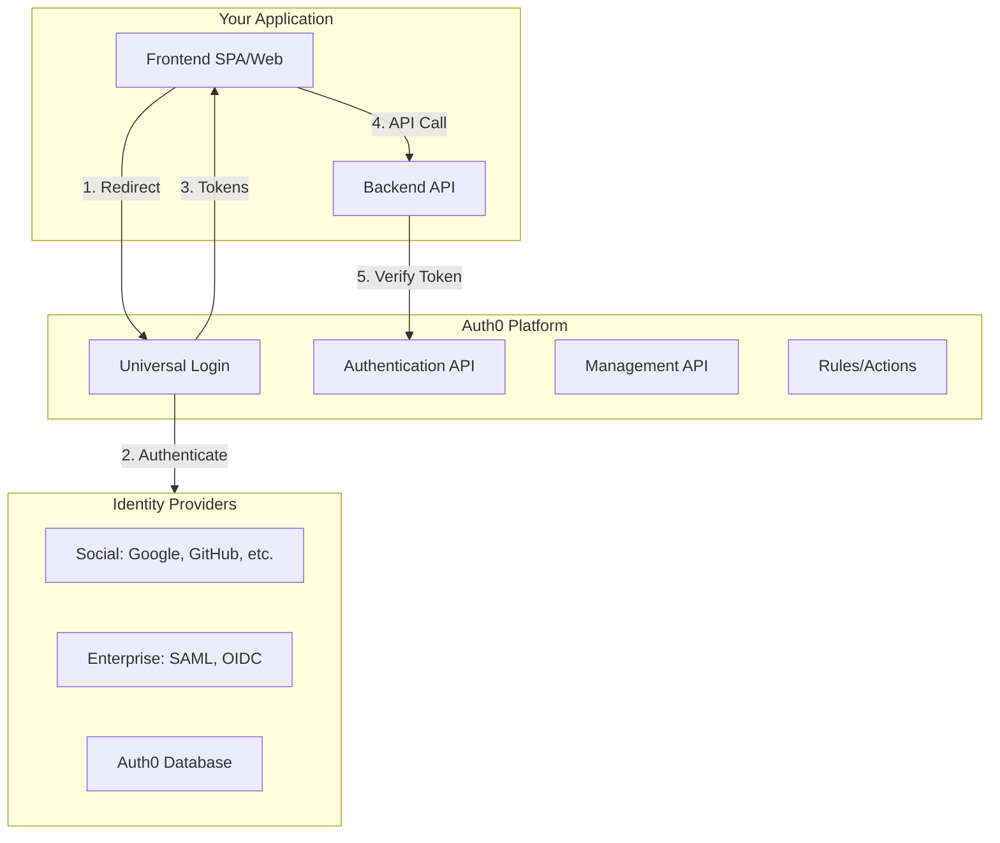
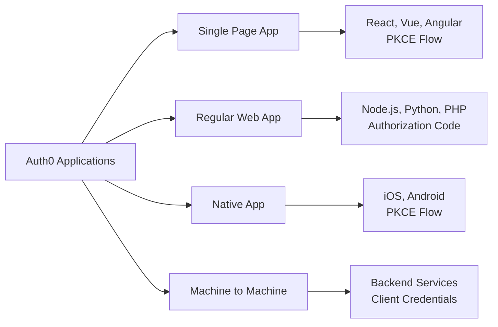
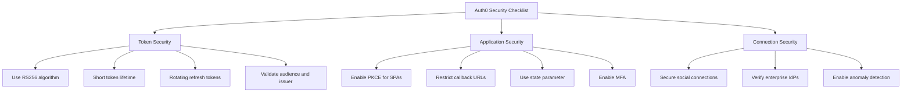

# How to Configure OAuth2 with Auth0

Author: [nawazdhandala](https://www.github.com/nawazdhandala)

Tags: OAuth2, Auth0, Authentication, Security, Identity, Single Sign-On

Description: A complete guide to configuring OAuth2 authentication with Auth0, including setup, integration patterns, and best practices.

---

Auth0 is a popular identity platform that simplifies implementing OAuth2 authentication in your applications. This guide walks you through setting up Auth0 for various OAuth2 flows, from basic configuration to advanced scenarios.

## Auth0 Architecture Overview

Before diving into configuration, let us understand how Auth0 fits into your authentication architecture.



## Step 1: Create and Configure Auth0 Application

First, set up your application in the Auth0 dashboard.

### Application Types



### Configuration via Management API

```javascript
// auth0-setup.js
// Configure Auth0 application programmatically

const { ManagementClient } = require('auth0');

const management = new ManagementClient({
    domain: 'your-tenant.auth0.com',
    clientId: 'MANAGEMENT_API_CLIENT_ID',
    clientSecret: 'MANAGEMENT_API_CLIENT_SECRET',
    scope: 'create:clients update:clients read:clients'
});

// Create a Single Page Application
async function createSPAApplication() {
    const client = await management.createClient({
        name: 'My React App',
        app_type: 'spa',

        // OAuth2 settings
        token_endpoint_auth_method: 'none',  // Public client, no secret

        // Allowed URLs
        callbacks: [
            'http://localhost:3000/callback',
            'https://myapp.example.com/callback'
        ],
        allowed_logout_urls: [
            'http://localhost:3000',
            'https://myapp.example.com'
        ],
        web_origins: [
            'http://localhost:3000',
            'https://myapp.example.com'
        ],

        // Grant types
        grant_types: [
            'authorization_code',
            'refresh_token'
        ],

        // Token settings
        jwt_configuration: {
            alg: 'RS256',
            lifetime_in_seconds: 36000
        },

        // Refresh token settings
        refresh_token: {
            rotation_type: 'rotating',
            expiration_type: 'expiring',
            token_lifetime: 2592000,  // 30 days
            idle_token_lifetime: 1296000  // 15 days
        }
    });

    console.log('Created SPA application:', client.client_id);
    return client;
}

// Create a Machine-to-Machine Application
async function createM2MApplication() {
    const client = await management.createClient({
        name: 'My Backend Service',
        app_type: 'non_interactive',

        // M2M uses client credentials
        token_endpoint_auth_method: 'client_secret_post',

        grant_types: [
            'client_credentials'
        ]
    });

    // Grant access to an API
    await management.createClientGrant({
        client_id: client.client_id,
        audience: 'https://api.example.com',
        scope: ['read:users', 'write:users']
    });

    console.log('Created M2M application:', client.client_id);
    return client;
}
```

## Step 2: Configure API (Resource Server)

Register your API in Auth0 to protect it with OAuth2.

```javascript
// api-setup.js
// Configure Auth0 API (Resource Server)

async function createAPI() {
    const api = await management.createResourceServer({
        name: 'My API',
        identifier: 'https://api.example.com',  // This becomes the audience

        // Token settings
        signing_alg: 'RS256',
        token_lifetime: 86400,  // 24 hours
        token_lifetime_for_web: 7200,  // 2 hours for browser clients

        // Enable RBAC
        enforce_policies: true,

        // Scopes/permissions
        scopes: [
            { value: 'read:users', description: 'Read user information' },
            { value: 'write:users', description: 'Create and update users' },
            { value: 'delete:users', description: 'Delete users' },
            { value: 'read:reports', description: 'View reports' }
        ]
    });

    console.log('Created API:', api.identifier);
    return api;
}

// Create permissions and assign to roles
async function setupRBAC() {
    // Create a role
    const adminRole = await management.createRole({
        name: 'Admin',
        description: 'Full access to all resources'
    });

    // Assign permissions to role
    await management.addPermissionsInRole(
        { id: adminRole.id },
        {
            permissions: [
                { resource_server_identifier: 'https://api.example.com', permission_name: 'read:users' },
                { resource_server_identifier: 'https://api.example.com', permission_name: 'write:users' },
                { resource_server_identifier: 'https://api.example.com', permission_name: 'delete:users' }
            ]
        }
    );

    return adminRole;
}
```

## Step 3: Implement Frontend Authentication

### React SPA with Auth0 SDK

```javascript
// auth-config.js
// Auth0 configuration for React application

export const auth0Config = {
    domain: 'your-tenant.auth0.com',
    clientId: 'YOUR_SPA_CLIENT_ID',

    authorizationParams: {
        // API audience for access tokens
        audience: 'https://api.example.com',

        // Request offline_access for refresh tokens
        scope: 'openid profile email offline_access',

        // Redirect after login
        redirect_uri: window.location.origin + '/callback'
    },

    // Use rotating refresh tokens
    useRefreshTokens: true,

    // Cache tokens in memory (more secure than localStorage)
    cacheLocation: 'memory'
};
```

```javascript
// App.js
// React application with Auth0 integration

import React from 'react';
import { Auth0Provider, useAuth0 } from '@auth0/auth0-react';
import { auth0Config } from './auth-config';

function App() {
    return (
        <Auth0Provider {...auth0Config}>
            <Router>
                <Routes>
                    <Route path="/" element={<Home />} />
                    <Route path="/callback" element={<Callback />} />
                    <Route path="/dashboard" element={<ProtectedRoute><Dashboard /></ProtectedRoute>} />
                </Routes>
            </Router>
        </Auth0Provider>
    );
}

// Protected route component
function ProtectedRoute({ children }) {
    const { isAuthenticated, isLoading, loginWithRedirect } = useAuth0();

    if (isLoading) {
        return <div>Loading...</div>;
    }

    if (!isAuthenticated) {
        loginWithRedirect();
        return null;
    }

    return children;
}

// Component using Auth0
function Dashboard() {
    const { user, getAccessTokenSilently, logout } = useAuth0();
    const [data, setData] = React.useState(null);

    const fetchProtectedData = async () => {
        try {
            // Get access token for API
            const token = await getAccessTokenSilently({
                authorizationParams: {
                    audience: 'https://api.example.com'
                }
            });

            // Call protected API
            const response = await fetch('https://api.example.com/users', {
                headers: {
                    Authorization: `Bearer ${token}`
                }
            });

            setData(await response.json());
        } catch (error) {
            console.error('API call failed:', error);
        }
    };

    return (
        <div>
            <h1>Welcome, {user.name}</h1>
            <button onClick={fetchProtectedData}>Load Data</button>
            <button onClick={() => logout({ returnTo: window.location.origin })}>
                Logout
            </button>
            {data && <pre>{JSON.stringify(data, null, 2)}</pre>}
        </div>
    );
}
```

## Step 4: Implement Backend Token Validation

### Express.js API with Auth0

```javascript
// server.js
// Express API protected by Auth0

const express = require('express');
const { auth, requiredScopes } = require('express-oauth2-jwt-bearer');

const app = express();

// Configure JWT validation middleware
const checkJwt = auth({
    audience: 'https://api.example.com',
    issuerBaseURL: 'https://your-tenant.auth0.com/',
    tokenSigningAlg: 'RS256'
});

// Public endpoint - no authentication required
app.get('/api/public', (req, res) => {
    res.json({ message: 'This is public' });
});

// Protected endpoint - requires valid token
app.get('/api/protected', checkJwt, (req, res) => {
    // Access token payload is available in req.auth
    res.json({
        message: 'This is protected',
        user: req.auth.payload.sub
    });
});

// Endpoint requiring specific scope
app.get('/api/users', checkJwt, requiredScopes('read:users'), (req, res) => {
    res.json({
        users: [
            { id: 1, name: 'Alice' },
            { id: 2, name: 'Bob' }
        ]
    });
});

// Endpoint with multiple required scopes
app.delete('/api/users/:id',
    checkJwt,
    requiredScopes('read:users', 'delete:users'),
    (req, res) => {
        res.json({ message: `User ${req.params.id} deleted` });
    }
);

// Custom scope checking
function checkPermission(permission) {
    return (req, res, next) => {
        const permissions = req.auth.payload.permissions || [];

        if (!permissions.includes(permission)) {
            return res.status(403).json({
                error: 'insufficient_permissions',
                message: `Missing required permission: ${permission}`
            });
        }

        next();
    };
}

app.post('/api/users',
    checkJwt,
    checkPermission('write:users'),
    (req, res) => {
        res.json({ message: 'User created' });
    }
);

// Error handling
app.use((err, req, res, next) => {
    if (err.name === 'UnauthorizedError') {
        return res.status(401).json({
            error: 'invalid_token',
            message: err.message
        });
    }
    next(err);
});

app.listen(3001, () => console.log('API running on port 3001'));
```

## Step 5: Machine-to-Machine Authentication

### Client Credentials Flow

```javascript
// m2m-client.js
// Machine-to-machine authentication with Auth0

const axios = require('axios');

class Auth0M2MClient {
    constructor(config) {
        this.domain = config.domain;
        this.clientId = config.clientId;
        this.clientSecret = config.clientSecret;
        this.audience = config.audience;

        this.token = null;
        this.tokenExpiry = null;
    }

    async getToken() {
        // Return cached token if still valid
        if (this.token && this.tokenExpiry > Date.now()) {
            return this.token;
        }

        // Request new token
        const response = await axios.post(
            `https://${this.domain}/oauth/token`,
            {
                grant_type: 'client_credentials',
                client_id: this.clientId,
                client_secret: this.clientSecret,
                audience: this.audience
            },
            {
                headers: { 'Content-Type': 'application/json' }
            }
        );

        this.token = response.data.access_token;
        // Cache with buffer time (refresh 5 minutes before expiry)
        this.tokenExpiry = Date.now() + ((response.data.expires_in - 300) * 1000);

        return this.token;
    }

    async callAPI(endpoint, options = {}) {
        const token = await this.getToken();

        return axios({
            ...options,
            url: `${this.audience}${endpoint}`,
            headers: {
                ...options.headers,
                Authorization: `Bearer ${token}`
            }
        });
    }
}

// Usage
const client = new Auth0M2MClient({
    domain: 'your-tenant.auth0.com',
    clientId: 'M2M_CLIENT_ID',
    clientSecret: 'M2M_CLIENT_SECRET',
    audience: 'https://api.example.com'
});

// Call protected API
const users = await client.callAPI('/users');
```

## Step 6: Configure Auth0 Actions

Auth0 Actions allow you to customize the authentication flow.

```javascript
// action-enrich-token.js
// Auth0 Action to add custom claims to tokens

exports.onExecutePostLogin = async (event, api) => {
    // Add custom claims to ID token
    api.idToken.setCustomClaim('https://myapp.com/roles', event.authorization?.roles || []);
    api.idToken.setCustomClaim('https://myapp.com/department', event.user.user_metadata?.department);

    // Add custom claims to access token
    api.accessToken.setCustomClaim('https://myapp.com/roles', event.authorization?.roles || []);

    // Add user metadata
    if (event.user.user_metadata) {
        api.idToken.setCustomClaim('https://myapp.com/user_metadata', event.user.user_metadata);
    }

    // Conditional claim based on application
    if (event.client.client_id === 'ADMIN_APP_CLIENT_ID') {
        api.accessToken.setCustomClaim('https://myapp.com/admin', true);
    }
};
```

```javascript
// action-rate-limit.js
// Auth0 Action to implement rate limiting

exports.onExecutePostLogin = async (event, api) => {
    const auth0 = require('auth0');

    // Get login attempts in last hour
    const management = new auth0.ManagementClient({
        domain: event.secrets.domain,
        clientId: event.secrets.clientId,
        clientSecret: event.secrets.clientSecret
    });

    // Check for suspicious activity
    const logs = await management.getLogs({
        q: `type:f AND user_id:"${event.user.user_id}" AND date:[${getOneHourAgo()} TO *]`,
        per_page: 10
    });

    if (logs.length >= 5) {
        // Too many failed attempts
        api.access.deny('Too many failed login attempts. Please try again later.');
        return;
    }

    // Check for login from new device/location
    if (isNewDevice(event)) {
        api.multifactor.enable('any');
    }
};

function getOneHourAgo() {
    const date = new Date(Date.now() - 3600000);
    return date.toISOString();
}

function isNewDevice(event) {
    // Implement device fingerprinting logic
    return false;
}
```

## Step 7: Social and Enterprise Connections

### Configure Social Login

```javascript
// connections-setup.js
// Configure social and enterprise connections

async function setupGoogleConnection() {
    await management.createConnection({
        name: 'google-oauth2',
        strategy: 'google-oauth2',

        options: {
            client_id: 'GOOGLE_CLIENT_ID',
            client_secret: 'GOOGLE_CLIENT_SECRET',

            // Requested scopes
            scope: ['email', 'profile'],

            // Allowed mobile client IDs for native apps
            allowed_audiences: [
                'ANDROID_CLIENT_ID',
                'IOS_CLIENT_ID'
            ]
        },

        // Enable for specific applications
        enabled_clients: [
            'SPA_CLIENT_ID',
            'MOBILE_CLIENT_ID'
        ]
    });
}

async function setupSAMLConnection() {
    await management.createConnection({
        name: 'enterprise-saml',
        strategy: 'samlp',

        options: {
            // SAML IdP metadata URL
            metadataUrl: 'https://idp.example.com/metadata',

            // Or manual configuration
            signInEndpoint: 'https://idp.example.com/sso',
            signOutEndpoint: 'https://idp.example.com/slo',
            signingCert: '-----BEGIN CERTIFICATE-----...',

            // Attribute mappings
            fieldsMap: {
                'email': 'http://schemas.xmlsoap.org/ws/2005/05/identity/claims/emailaddress',
                'given_name': 'http://schemas.xmlsoap.org/ws/2005/05/identity/claims/givenname',
                'family_name': 'http://schemas.xmlsoap.org/ws/2005/05/identity/claims/surname'
            }
        },

        enabled_clients: ['ENTERPRISE_APP_CLIENT_ID']
    });
}
```

## Step 8: Implement Logout

### Proper Logout Implementation

```javascript
// logout.js
// Complete logout implementation

import { useAuth0 } from '@auth0/auth0-react';

function LogoutButton() {
    const { logout } = useAuth0();

    const handleLogout = () => {
        logout({
            // Clear Auth0 session
            logoutParams: {
                // Redirect after logout
                returnTo: window.location.origin,

                // If using federated logout (sign out of social/enterprise IdP)
                federated: true
            }
        });
    };

    return <button onClick={handleLogout}>Logout</button>;
}

// Backend logout endpoint (for session-based apps)
app.get('/logout', (req, res) => {
    // Clear local session
    req.session.destroy();

    // Build Auth0 logout URL
    const logoutUrl = new URL(`https://${auth0Domain}/v2/logout`);
    logoutUrl.searchParams.set('client_id', clientId);
    logoutUrl.searchParams.set('returnTo', `${req.protocol}://${req.get('host')}`);

    res.redirect(logoutUrl.toString());
});
```

## Security Best Practices



### Security Configuration Checklist

```javascript
// security-config.js
// Security best practices configuration

// 1. Configure secure token settings
const tokenSettings = {
    // Use asymmetric signing
    signing_alg: 'RS256',

    // Short access token lifetime
    token_lifetime: 3600,  // 1 hour

    // Shorter for browser clients
    token_lifetime_for_web: 1800  // 30 minutes
};

// 2. Configure secure refresh token settings
const refreshTokenSettings = {
    // Rotate refresh tokens on use
    rotation_type: 'rotating',

    // Expire unused refresh tokens
    expiration_type: 'expiring',

    // Absolute lifetime
    token_lifetime: 2592000,  // 30 days

    // Idle timeout
    idle_token_lifetime: 86400  // 1 day
};

// 3. Enable attack protection
const attackProtection = {
    brute_force_protection: {
        enabled: true,
        max_attempts: 10,
        mode: 'count_per_identifier'
    },

    suspicious_ip_throttling: {
        enabled: true
    },

    breached_password_detection: {
        enabled: true,
        method: 'standard'
    }
};

// 4. CORS configuration
const corsSettings = {
    // Only allow specific origins
    web_origins: [
        'https://myapp.example.com'
    ],

    // No wildcard origins
    // NEVER use 'http://localhost:*' in production
};
```

## Troubleshooting Common Issues

### Issue 1: Token Validation Fails

```javascript
// debug-token.js
// Debug token validation issues

const jwt = require('jsonwebtoken');
const jwksClient = require('jwks-rsa');

async function debugToken(token, auth0Domain, audience) {
    // Decode without verification to inspect claims
    const decoded = jwt.decode(token, { complete: true });

    console.log('Token Header:', decoded.header);
    console.log('Token Payload:', decoded.payload);

    // Check common issues
    const issues = [];

    // Check issuer
    const expectedIssuer = `https://${auth0Domain}/`;
    if (decoded.payload.iss !== expectedIssuer) {
        issues.push(`Issuer mismatch: expected ${expectedIssuer}, got ${decoded.payload.iss}`);
    }

    // Check audience
    const aud = Array.isArray(decoded.payload.aud)
        ? decoded.payload.aud
        : [decoded.payload.aud];
    if (!aud.includes(audience)) {
        issues.push(`Audience mismatch: expected ${audience}, got ${aud.join(', ')}`);
    }

    // Check expiration
    if (decoded.payload.exp * 1000 < Date.now()) {
        issues.push(`Token expired at ${new Date(decoded.payload.exp * 1000)}`);
    }

    // Verify signature
    const client = jwksClient({
        jwksUri: `https://${auth0Domain}/.well-known/jwks.json`
    });

    try {
        const key = await client.getSigningKey(decoded.header.kid);
        jwt.verify(token, key.getPublicKey(), {
            algorithms: ['RS256'],
            issuer: expectedIssuer,
            audience: audience
        });
        console.log('Signature verification: PASSED');
    } catch (error) {
        issues.push(`Signature verification failed: ${error.message}`);
    }

    if (issues.length > 0) {
        console.log('\nIssues found:');
        issues.forEach(issue => console.log(`  - ${issue}`));
    } else {
        console.log('\nToken is valid!');
    }
}
```

### Issue 2: CORS Errors

```javascript
// Check Auth0 application settings for allowed origins
// Ensure your frontend origin is in the "Allowed Web Origins" list

// Common mistake: trailing slash
// WRONG: https://myapp.example.com/
// RIGHT: https://myapp.example.com

// For local development
// Add: http://localhost:3000
```

## Conclusion

Auth0 provides a robust OAuth2 implementation that handles the complexity of authentication and authorization. By following this guide, you can configure Auth0 for single-page applications, regular web apps, and machine-to-machine scenarios. Remember to implement proper security measures including short token lifetimes, refresh token rotation, and attack protection features. Always test your configuration thoroughly before deploying to production.
