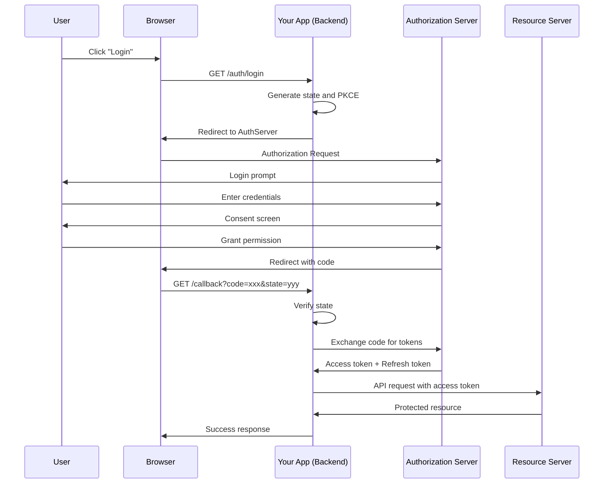
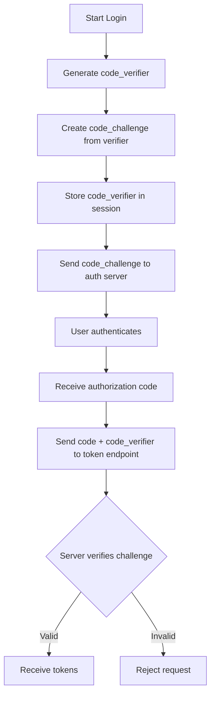
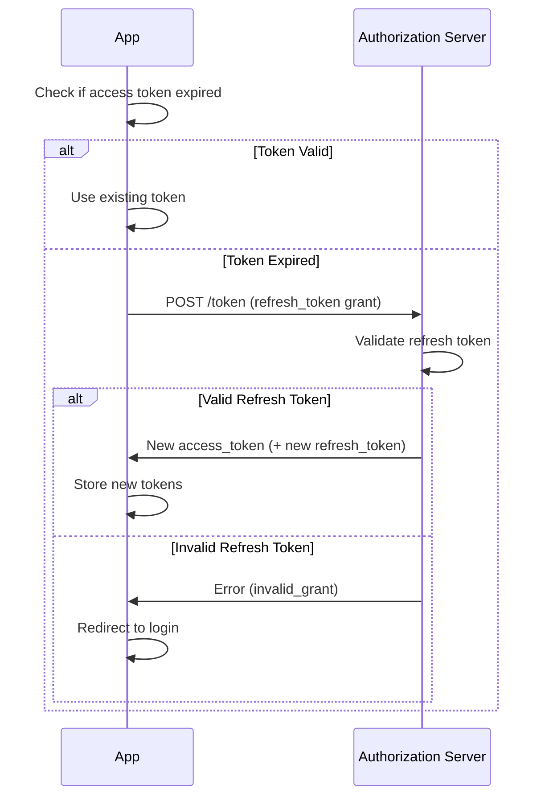
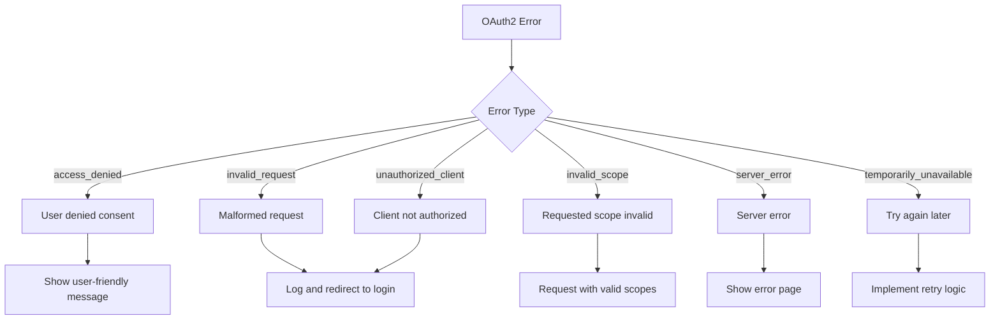

# How to Handle OAuth2 Authorization Code Flow

Author: [nawazdhandala](https://github.com/nawazdhandala)

Tags: OAuth2, Authentication, Security, API, Authorization, Web Development

Description: A comprehensive guide to implementing the OAuth2 Authorization Code flow with PKCE, including security best practices and complete code examples.

---

The Authorization Code flow is the most secure OAuth2 flow for web applications and is recommended for any application that can securely store a client secret. This guide covers the complete implementation, including the PKCE extension for enhanced security.

## Understanding the Authorization Code Flow

The Authorization Code flow involves exchanging an authorization code for tokens. This two-step process keeps the access token secure by never exposing it to the browser's URL bar.



## Setting Up the Authorization Request

### Basic Implementation Without PKCE

```python
# auth.py - Basic Authorization Code Flow
import os
import secrets
from urllib.parse import urlencode
from flask import Flask, redirect, request, session, jsonify
import requests

app = Flask(__name__)
app.secret_key = os.environ.get('FLASK_SECRET_KEY')

# OAuth2 Configuration
OAUTH_CONFIG = {
    'client_id': os.environ.get('OAUTH_CLIENT_ID'),
    'client_secret': os.environ.get('OAUTH_CLIENT_SECRET'),
    'authorization_endpoint': 'https://auth.example.com/oauth/authorize',
    'token_endpoint': 'https://auth.example.com/oauth/token',
    'redirect_uri': os.environ.get('OAUTH_REDIRECT_URI'),
    'scopes': ['openid', 'profile', 'email']
}


@app.route('/auth/login')
def login():
    """Initiate the authorization code flow."""
    # Generate state for CSRF protection
    state = secrets.token_urlsafe(32)
    session['oauth_state'] = state

    # Store the return URL for post-login redirect
    session['return_to'] = request.args.get('return_to', '/')

    # Build the authorization URL
    params = {
        'response_type': 'code',
        'client_id': OAUTH_CONFIG['client_id'],
        'redirect_uri': OAUTH_CONFIG['redirect_uri'],
        'scope': ' '.join(OAUTH_CONFIG['scopes']),
        'state': state
    }

    auth_url = f"{OAUTH_CONFIG['authorization_endpoint']}?{urlencode(params)}"
    return redirect(auth_url)


@app.route('/auth/callback')
def callback():
    """Handle the authorization callback."""
    # Check for errors
    error = request.args.get('error')
    if error:
        error_description = request.args.get('error_description', 'Unknown error')
        return jsonify({'error': error, 'description': error_description}), 400

    # Verify state to prevent CSRF
    received_state = request.args.get('state')
    stored_state = session.pop('oauth_state', None)

    if not stored_state or received_state != stored_state:
        return jsonify({'error': 'Invalid state parameter'}), 403

    # Get the authorization code
    code = request.args.get('code')
    if not code:
        return jsonify({'error': 'No authorization code received'}), 400

    # Exchange the code for tokens
    token_data = {
        'grant_type': 'authorization_code',
        'code': code,
        'redirect_uri': OAUTH_CONFIG['redirect_uri'],
        'client_id': OAUTH_CONFIG['client_id'],
        'client_secret': OAUTH_CONFIG['client_secret']
    }

    try:
        response = requests.post(
            OAUTH_CONFIG['token_endpoint'],
            data=token_data,
            headers={'Content-Type': 'application/x-www-form-urlencoded'}
        )
        response.raise_for_status()
        tokens = response.json()

        # Store tokens securely
        session['access_token'] = tokens['access_token']
        session['refresh_token'] = tokens.get('refresh_token')
        session['token_expires_at'] = time.time() + tokens.get('expires_in', 3600)

        # Redirect to the original destination
        return_to = session.pop('return_to', '/')
        return redirect(return_to)

    except requests.RequestException as e:
        return jsonify({'error': 'Token exchange failed', 'details': str(e)}), 500
```

## Implementing PKCE (Proof Key for Code Exchange)

PKCE adds an extra layer of security by preventing authorization code interception attacks. It is now recommended for all OAuth2 clients.



### PKCE Implementation

```python
# pkce.py - PKCE Helper Functions
import base64
import hashlib
import secrets


def generate_code_verifier(length=64):
    """
    Generate a cryptographically random code verifier.
    Length should be between 43 and 128 characters.
    """
    # Use only URL-safe characters
    return secrets.token_urlsafe(length)[:length]


def generate_code_challenge(code_verifier):
    """
    Generate code challenge from verifier using S256 method.
    challenge = BASE64URL(SHA256(verifier))
    """
    # SHA256 hash of the verifier
    digest = hashlib.sha256(code_verifier.encode('ascii')).digest()

    # Base64 URL encode without padding
    challenge = base64.urlsafe_b64encode(digest).decode('ascii')
    challenge = challenge.rstrip('=')  # Remove padding

    return challenge


def generate_pkce_pair():
    """Generate a code verifier and challenge pair."""
    verifier = generate_code_verifier()
    challenge = generate_code_challenge(verifier)
    return verifier, challenge
```

```python
# auth_pkce.py - Authorization Code Flow with PKCE
import os
import secrets
import time
from urllib.parse import urlencode
from flask import Flask, redirect, request, session, jsonify
import requests
from pkce import generate_pkce_pair

app = Flask(__name__)
app.secret_key = os.environ.get('FLASK_SECRET_KEY')

OAUTH_CONFIG = {
    'client_id': os.environ.get('OAUTH_CLIENT_ID'),
    'client_secret': os.environ.get('OAUTH_CLIENT_SECRET'),  # Optional with PKCE
    'authorization_endpoint': 'https://auth.example.com/oauth/authorize',
    'token_endpoint': 'https://auth.example.com/oauth/token',
    'redirect_uri': os.environ.get('OAUTH_REDIRECT_URI'),
    'scopes': ['openid', 'profile', 'email']
}


@app.route('/auth/login')
def login():
    """Initiate the authorization code flow with PKCE."""
    # Generate state for CSRF protection
    state = secrets.token_urlsafe(32)
    session['oauth_state'] = state

    # Generate PKCE code verifier and challenge
    code_verifier, code_challenge = generate_pkce_pair()
    session['code_verifier'] = code_verifier

    # Store return URL
    session['return_to'] = request.args.get('return_to', '/')

    # Build authorization URL with PKCE parameters
    params = {
        'response_type': 'code',
        'client_id': OAUTH_CONFIG['client_id'],
        'redirect_uri': OAUTH_CONFIG['redirect_uri'],
        'scope': ' '.join(OAUTH_CONFIG['scopes']),
        'state': state,
        'code_challenge': code_challenge,
        'code_challenge_method': 'S256'  # Always use S256, never plain
    }

    auth_url = f"{OAUTH_CONFIG['authorization_endpoint']}?{urlencode(params)}"
    return redirect(auth_url)


@app.route('/auth/callback')
def callback():
    """Handle the authorization callback with PKCE verification."""
    # Check for errors
    error = request.args.get('error')
    if error:
        error_description = request.args.get('error_description', 'Unknown error')
        return jsonify({'error': error, 'description': error_description}), 400

    # Verify state
    received_state = request.args.get('state')
    stored_state = session.pop('oauth_state', None)

    if not stored_state or received_state != stored_state:
        return jsonify({'error': 'Invalid state parameter'}), 403

    # Get the stored code verifier
    code_verifier = session.pop('code_verifier', None)
    if not code_verifier:
        return jsonify({'error': 'Missing code verifier'}), 400

    # Get the authorization code
    code = request.args.get('code')
    if not code:
        return jsonify({'error': 'No authorization code received'}), 400

    # Exchange code for tokens with PKCE verifier
    token_data = {
        'grant_type': 'authorization_code',
        'code': code,
        'redirect_uri': OAUTH_CONFIG['redirect_uri'],
        'client_id': OAUTH_CONFIG['client_id'],
        'code_verifier': code_verifier  # PKCE: Send the original verifier
    }

    # Include client_secret if available (confidential clients)
    if OAUTH_CONFIG.get('client_secret'):
        token_data['client_secret'] = OAUTH_CONFIG['client_secret']

    try:
        response = requests.post(
            OAUTH_CONFIG['token_endpoint'],
            data=token_data,
            headers={'Content-Type': 'application/x-www-form-urlencoded'}
        )
        response.raise_for_status()
        tokens = response.json()

        # Store tokens
        session['access_token'] = tokens['access_token']
        session['refresh_token'] = tokens.get('refresh_token')
        session['id_token'] = tokens.get('id_token')
        session['token_expires_at'] = time.time() + tokens.get('expires_in', 3600)

        return_to = session.pop('return_to', '/')
        return redirect(return_to)

    except requests.RequestException as e:
        return jsonify({'error': 'Token exchange failed', 'details': str(e)}), 500
```

## Node.js Implementation

```javascript
// auth.js - Complete OAuth2 Authorization Code Flow with PKCE
const express = require('express');
const crypto = require('crypto');
const axios = require('axios');
const querystring = require('querystring');

const router = express.Router();

// Configuration
const config = {
    clientId: process.env.OAUTH_CLIENT_ID,
    clientSecret: process.env.OAUTH_CLIENT_SECRET,
    authorizationEndpoint: 'https://auth.example.com/oauth/authorize',
    tokenEndpoint: 'https://auth.example.com/oauth/token',
    redirectUri: process.env.OAUTH_REDIRECT_URI,
    scopes: ['openid', 'profile', 'email']
};

// PKCE Helper Functions
function generateCodeVerifier() {
    return crypto.randomBytes(32).toString('base64url');
}

function generateCodeChallenge(verifier) {
    return crypto
        .createHash('sha256')
        .update(verifier)
        .digest('base64url');
}

function generateState() {
    return crypto.randomBytes(32).toString('hex');
}

// Initiate login
router.get('/login', (req, res) => {
    // Generate security parameters
    const state = generateState();
    const codeVerifier = generateCodeVerifier();
    const codeChallenge = generateCodeChallenge(codeVerifier);

    // Store in session
    req.session.oauthState = state;
    req.session.codeVerifier = codeVerifier;
    req.session.returnTo = req.query.return_to || '/';

    // Build authorization URL
    const params = querystring.stringify({
        response_type: 'code',
        client_id: config.clientId,
        redirect_uri: config.redirectUri,
        scope: config.scopes.join(' '),
        state: state,
        code_challenge: codeChallenge,
        code_challenge_method: 'S256'
    });

    res.redirect(`${config.authorizationEndpoint}?${params}`);
});

// Handle callback
router.get('/callback', async (req, res) => {
    const { code, state, error, error_description } = req.query;

    // Handle errors from authorization server
    if (error) {
        console.error('OAuth error:', error, error_description);
        return res.redirect(`/login?error=${encodeURIComponent(error)}`);
    }

    // Verify state
    if (state !== req.session.oauthState) {
        return res.status(403).json({ error: 'Invalid state parameter' });
    }

    // Get code verifier from session
    const codeVerifier = req.session.codeVerifier;
    if (!codeVerifier) {
        return res.status(400).json({ error: 'Missing code verifier' });
    }

    // Clean up session
    delete req.session.oauthState;
    delete req.session.codeVerifier;

    try {
        // Exchange code for tokens
        const tokenResponse = await axios.post(
            config.tokenEndpoint,
            querystring.stringify({
                grant_type: 'authorization_code',
                code: code,
                redirect_uri: config.redirectUri,
                client_id: config.clientId,
                client_secret: config.clientSecret,
                code_verifier: codeVerifier
            }),
            {
                headers: {
                    'Content-Type': 'application/x-www-form-urlencoded'
                }
            }
        );

        const tokens = tokenResponse.data;

        // Store tokens in session
        req.session.accessToken = tokens.access_token;
        req.session.refreshToken = tokens.refresh_token;
        req.session.idToken = tokens.id_token;
        req.session.tokenExpiresAt = Date.now() + (tokens.expires_in * 1000);

        // Redirect to original destination
        const returnTo = req.session.returnTo || '/';
        delete req.session.returnTo;

        res.redirect(returnTo);

    } catch (err) {
        console.error('Token exchange failed:', err.response?.data || err.message);
        res.redirect('/login?error=token_exchange_failed');
    }
});

// Logout
router.get('/logout', (req, res) => {
    // Clear session
    req.session.destroy((err) => {
        if (err) {
            console.error('Session destruction error:', err);
        }
        res.redirect('/');
    });
});

module.exports = router;
```

## Token Refresh Implementation

Refresh tokens allow obtaining new access tokens without user interaction.



```python
# token_manager.py - Token Refresh Management
import time
import threading
from flask import session
import requests

class TokenManager:
    """Manages OAuth2 tokens with automatic refresh."""

    def __init__(self, config):
        self.config = config
        self._lock = threading.Lock()

    def get_valid_token(self):
        """Get a valid access token, refreshing if necessary."""
        with self._lock:
            access_token = session.get('access_token')
            expires_at = session.get('token_expires_at', 0)

            # Check if token is expired or about to expire (5 min buffer)
            if time.time() >= expires_at - 300:
                return self._refresh_token()

            return access_token

    def _refresh_token(self):
        """Refresh the access token using the refresh token."""
        refresh_token = session.get('refresh_token')

        if not refresh_token:
            raise TokenRefreshError('No refresh token available')

        try:
            response = requests.post(
                self.config['token_endpoint'],
                data={
                    'grant_type': 'refresh_token',
                    'refresh_token': refresh_token,
                    'client_id': self.config['client_id'],
                    'client_secret': self.config['client_secret']
                },
                headers={'Content-Type': 'application/x-www-form-urlencoded'}
            )

            if response.status_code == 400:
                error_data = response.json()
                if error_data.get('error') == 'invalid_grant':
                    # Refresh token is invalid or expired
                    raise TokenRefreshError('Refresh token expired')

            response.raise_for_status()
            tokens = response.json()

            # Update session with new tokens
            session['access_token'] = tokens['access_token']
            session['token_expires_at'] = time.time() + tokens.get('expires_in', 3600)

            # Some providers issue new refresh tokens
            if 'refresh_token' in tokens:
                session['refresh_token'] = tokens['refresh_token']

            return tokens['access_token']

        except requests.RequestException as e:
            raise TokenRefreshError(f'Token refresh failed: {e}')


class TokenRefreshError(Exception):
    """Raised when token refresh fails."""
    pass


# Usage in routes
token_manager = TokenManager(OAUTH_CONFIG)

@app.route('/api/protected')
def protected_resource():
    try:
        access_token = token_manager.get_valid_token()
    except TokenRefreshError:
        # Redirect to login
        return redirect('/auth/login?return_to=' + request.path)

    # Use the token to call protected API
    response = requests.get(
        'https://api.example.com/resource',
        headers={'Authorization': f'Bearer {access_token}'}
    )
    return jsonify(response.json())
```

## Handling Different Grant Types

The Authorization Code flow can be adapted for different scenarios:

```python
# grant_types.py - Different OAuth2 Grant Types

class OAuth2Client:
    """OAuth2 client supporting multiple grant types."""

    def __init__(self, config):
        self.config = config

    def authorization_code_grant(self, code, code_verifier=None):
        """Exchange authorization code for tokens."""
        data = {
            'grant_type': 'authorization_code',
            'code': code,
            'redirect_uri': self.config['redirect_uri'],
            'client_id': self.config['client_id'],
            'client_secret': self.config['client_secret']
        }

        if code_verifier:
            data['code_verifier'] = code_verifier

        return self._token_request(data)

    def refresh_token_grant(self, refresh_token):
        """Use refresh token to get new access token."""
        data = {
            'grant_type': 'refresh_token',
            'refresh_token': refresh_token,
            'client_id': self.config['client_id'],
            'client_secret': self.config['client_secret']
        }

        return self._token_request(data)

    def client_credentials_grant(self, scope=None):
        """
        Client credentials grant for machine-to-machine auth.
        No user involved - uses client credentials directly.
        """
        data = {
            'grant_type': 'client_credentials',
            'client_id': self.config['client_id'],
            'client_secret': self.config['client_secret']
        }

        if scope:
            data['scope'] = scope if isinstance(scope, str) else ' '.join(scope)

        return self._token_request(data)

    def _token_request(self, data):
        """Make a token request to the authorization server."""
        response = requests.post(
            self.config['token_endpoint'],
            data=data,
            headers={'Content-Type': 'application/x-www-form-urlencoded'}
        )

        if response.status_code != 200:
            error_data = response.json()
            raise OAuth2Error(
                error_data.get('error'),
                error_data.get('error_description')
            )

        return response.json()


class OAuth2Error(Exception):
    """OAuth2 error with error code and description."""

    def __init__(self, error, description=None):
        self.error = error
        self.description = description
        super().__init__(f"{error}: {description}")
```

## Security Best Practices

### 1. Always Use PKCE

```python
# Even for confidential clients, PKCE adds defense in depth
def create_auth_request(use_pkce=True):
    params = {
        'response_type': 'code',
        'client_id': CLIENT_ID,
        'redirect_uri': REDIRECT_URI,
        'scope': SCOPES,
        'state': generate_state()
    }

    if use_pkce:
        verifier, challenge = generate_pkce_pair()
        session['code_verifier'] = verifier
        params['code_challenge'] = challenge
        params['code_challenge_method'] = 'S256'

    return params
```

### 2. Validate All Parameters

```python
def validate_callback_params(request, session):
    """Thoroughly validate callback parameters."""
    errors = []

    # Check for error response
    if request.args.get('error'):
        return None, request.args.get('error_description', 'Authorization failed')

    # Validate state
    received_state = request.args.get('state')
    stored_state = session.get('oauth_state')

    if not received_state:
        errors.append('Missing state parameter')
    elif not stored_state:
        errors.append('No stored state found')
    elif not secrets.compare_digest(received_state, stored_state):
        errors.append('State mismatch')

    # Validate code
    code = request.args.get('code')
    if not code:
        errors.append('Missing authorization code')

    # Validate code verifier exists (if using PKCE)
    if session.get('code_verifier') is None and session.get('using_pkce'):
        errors.append('Missing code verifier')

    if errors:
        return None, '; '.join(errors)

    return code, None
```

### 3. Secure Token Storage

```python
# Store tokens securely - never in localStorage for SPAs
# Use httpOnly cookies or server-side sessions

from flask import Flask
from flask_session import Session
import redis

app = Flask(__name__)

# Use Redis for session storage
app.config['SESSION_TYPE'] = 'redis'
app.config['SESSION_REDIS'] = redis.from_url(os.environ.get('REDIS_URL'))
app.config['SESSION_COOKIE_SECURE'] = True
app.config['SESSION_COOKIE_HTTPONLY'] = True
app.config['SESSION_COOKIE_SAMESITE'] = 'Lax'

Session(app)
```

### 4. Implement Token Binding

```python
def store_tokens_with_binding(tokens, request):
    """Store tokens with additional binding for security."""
    session['access_token'] = tokens['access_token']
    session['refresh_token'] = tokens.get('refresh_token')

    # Bind tokens to client fingerprint
    session['token_fingerprint'] = generate_fingerprint(request)

def verify_token_binding(request):
    """Verify the token is being used by the same client."""
    stored_fingerprint = session.get('token_fingerprint')
    current_fingerprint = generate_fingerprint(request)

    return secrets.compare_digest(stored_fingerprint, current_fingerprint)

def generate_fingerprint(request):
    """Generate a fingerprint from request characteristics."""
    components = [
        request.headers.get('User-Agent', ''),
        request.headers.get('Accept-Language', ''),
        # Add more stable characteristics as needed
    ]
    return hashlib.sha256('|'.join(components).encode()).hexdigest()
```

## Error Handling



```python
# error_handling.py - Comprehensive OAuth2 Error Handling

class OAuth2ErrorHandler:
    """Handle OAuth2 errors with appropriate responses."""

    ERROR_MESSAGES = {
        'access_denied': 'You declined the authorization request.',
        'invalid_request': 'The authorization request was invalid.',
        'unauthorized_client': 'This application is not authorized.',
        'unsupported_response_type': 'The response type is not supported.',
        'invalid_scope': 'The requested permissions are not valid.',
        'server_error': 'The authorization server encountered an error.',
        'temporarily_unavailable': 'The service is temporarily unavailable.',
        'invalid_grant': 'The authorization code or refresh token is invalid.',
        'invalid_client': 'Client authentication failed.'
    }

    @classmethod
    def handle_authorization_error(cls, error, error_description=None):
        """Handle errors from the authorization endpoint."""
        user_message = cls.ERROR_MESSAGES.get(error, 'An error occurred during authorization.')

        if error == 'access_denied':
            # User cancelled - not really an error
            return redirect('/')

        if error in ['server_error', 'temporarily_unavailable']:
            # Transient errors - suggest retry
            return render_template('error.html',
                message=user_message,
                can_retry=True)

        # Log the actual error for debugging
        app.logger.error(f'OAuth2 error: {error} - {error_description}')

        return render_template('error.html', message=user_message)

    @classmethod
    def handle_token_error(cls, error, error_description=None):
        """Handle errors from the token endpoint."""
        if error == 'invalid_grant':
            # Code expired or already used - restart flow
            return redirect('/auth/login')

        if error == 'invalid_client':
            # Configuration error - log and show generic message
            app.logger.critical(f'Invalid client configuration: {error_description}')
            return render_template('error.html',
                message='Authentication configuration error.')

        return cls.handle_authorization_error(error, error_description)
```

## Conclusion

The OAuth2 Authorization Code flow provides secure authentication for web applications. Key takeaways:

1. Always use PKCE for enhanced security, even with confidential clients
2. Implement proper state validation to prevent CSRF attacks
3. Store tokens securely using server-side sessions or httpOnly cookies
4. Handle token refresh automatically to maintain user sessions
5. Implement comprehensive error handling for a good user experience
6. Validate all parameters thoroughly before processing

By following these patterns and security practices, you can implement a robust OAuth2 authentication system that protects your users and their data.
