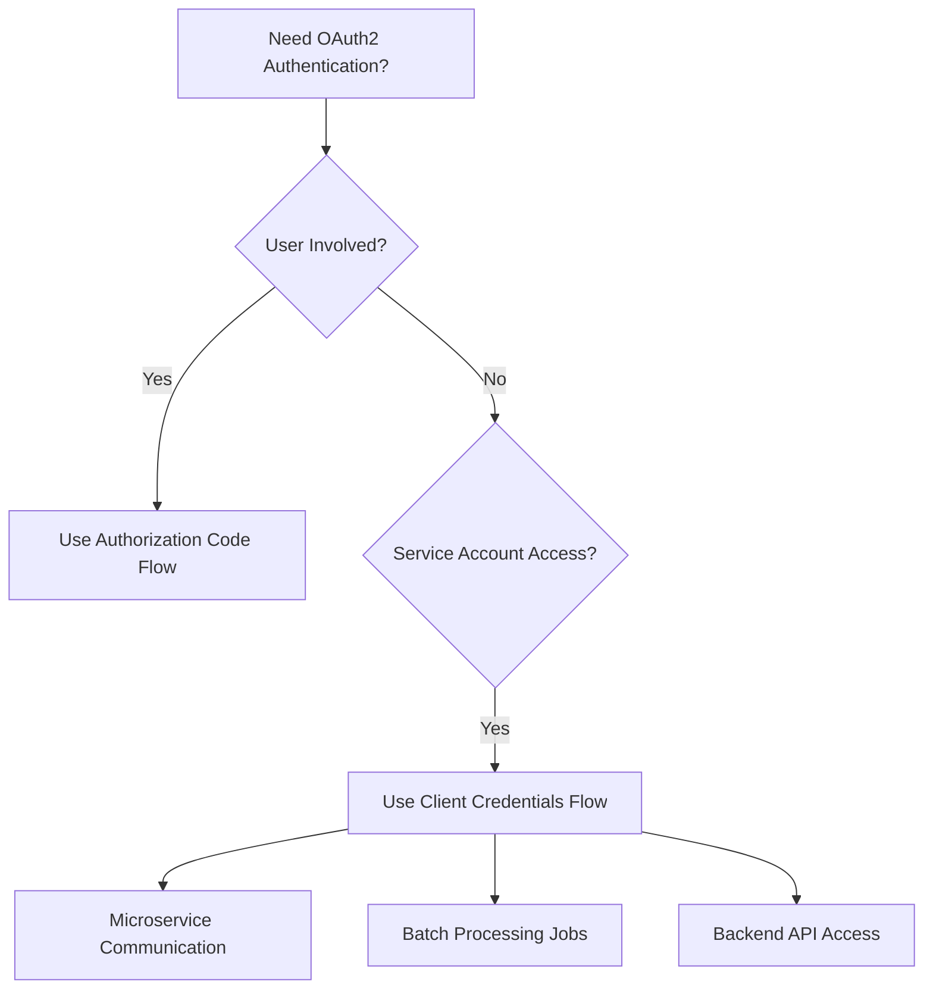
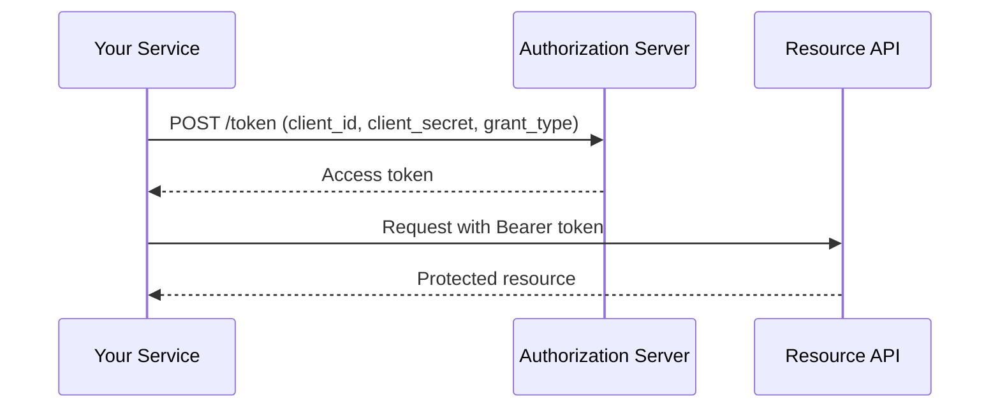

# How to Handle OAuth2 Client Credentials Flow

Author: [nawazdhandala](https://www.github.com/nawazdhandala)

Tags: OAuth2, Authentication, API, Security, Machine-to-Machine, Backend

Description: A practical guide to implementing the OAuth2 client credentials flow for server-to-server authentication, including token management, caching strategies, and security best practices.

---

The client credentials flow is designed for machine-to-machine (M2M) authentication where no user is involved. Your application authenticates directly with the OAuth2 server using its own credentials.

## When to Use Client Credentials Flow



## Basic Flow



## Implementation

```python
import requests
from dataclasses import dataclass
from typing import Optional
import time

@dataclass
class TokenResponse:
    access_token: str
    token_type: str
    expires_in: int
    expires_at: float = None

    def __post_init__(self):
        if self.expires_at is None:
            self.expires_at = time.time() + self.expires_in

class ClientCredentialsAuth:
    def __init__(self, token_url: str, client_id: str, client_secret: str, scopes: list = None):
        self.token_url = token_url
        self.client_id = client_id
        self.client_secret = client_secret
        self.scopes = scopes or []
        self._token: Optional[TokenResponse] = None

    def get_token(self) -> str:
        """Get a valid access token, refreshing if needed."""
        if self._is_token_valid():
            return self._token.access_token

        self._token = self._request_token()
        return self._token.access_token

    def _is_token_valid(self) -> bool:
        if self._token is None:
            return False
        buffer_seconds = 30
        return time.time() < (self._token.expires_at - buffer_seconds)

    def _request_token(self) -> TokenResponse:
        data = {
            "grant_type": "client_credentials",
            "client_id": self.client_id,
            "client_secret": self.client_secret
        }
        if self.scopes:
            data["scope"] = " ".join(self.scopes)

        response = requests.post(self.token_url, data=data)

        if response.status_code != 200:
            raise Exception(f"Token request failed: {response.text}")

        token_data = response.json()
        return TokenResponse(
            access_token=token_data["access_token"],
            token_type=token_data.get("token_type", "Bearer"),
            expires_in=token_data.get("expires_in", 3600)
        )

# Usage
auth = ClientCredentialsAuth(
    token_url="https://auth.example.com/oauth/token",
    client_id=os.environ["CLIENT_ID"],
    client_secret=os.environ["CLIENT_SECRET"],
    scopes=["read:data", "write:data"]
)

def call_api(endpoint: str):
    token = auth.get_token()
    return requests.get(
        f"https://api.example.com{endpoint}",
        headers={"Authorization": f"Bearer {token}"}
    )
```

## Security Best Practices

### Secure Credential Storage

Never hardcode credentials. Use environment variables or secret management services.

```python
# Good: Using environment variables
client_id = os.environ.get("CLIENT_ID")
client_secret = os.environ.get("CLIENT_SECRET")
```

### Minimal Scopes

Request only the scopes your service actually needs.

```python
# Good: Request minimal permissions
auth = ClientCredentialsAuth(scopes=["read:users"])
```

The client credentials flow is straightforward but requires careful attention to caching, error handling, and security for reliable machine-to-machine authentication.
