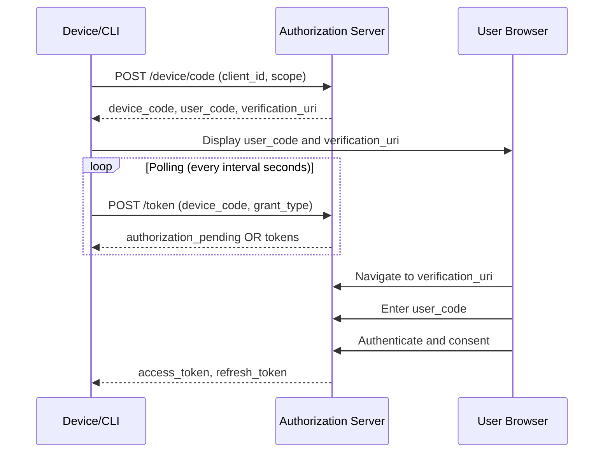
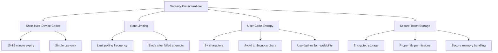

# How to Handle OAuth2 Device Authorization Flow

Author: [nawazdhandala](https://www.github.com/nawazdhandala)

Tags: OAuth2, Device Flow, Authentication, Security, API, Authorization

Description: Learn how to implement OAuth2 Device Authorization Flow for input-constrained devices like smart TVs, CLI tools, and IoT devices.

---

The OAuth2 Device Authorization Flow (also known as Device Flow or Device Code Flow) enables authentication on devices that lack a browser or have limited input capabilities. This guide covers implementation patterns, common pitfalls, and best practices for handling device authorization in your applications.

## Understanding the Device Authorization Flow

The Device Authorization Flow is designed for devices that cannot easily accept user input, such as:

- Smart TVs and streaming devices
- CLI tools and developer utilities
- IoT devices and embedded systems
- Gaming consoles



## Step 1: Request Device and User Codes

First, your device application requests a device code and user code from the authorization server.

```javascript
// device-auth.js
// Request device and user codes from the authorization server

const axios = require('axios');

async function requestDeviceCode(config) {
    const { authServerUrl, clientId, scope } = config;

    try {
        const response = await axios.post(
            `${authServerUrl}/oauth/device/code`,
            new URLSearchParams({
                client_id: clientId,
                scope: scope || 'openid profile email'
            }),
            {
                headers: {
                    'Content-Type': 'application/x-www-form-urlencoded'
                }
            }
        );

        // Response contains device_code, user_code, verification_uri
        return {
            deviceCode: response.data.device_code,
            userCode: response.data.user_code,
            verificationUri: response.data.verification_uri,
            verificationUriComplete: response.data.verification_uri_complete,
            expiresIn: response.data.expires_in,
            interval: response.data.interval || 5
        };
    } catch (error) {
        console.error('Failed to request device code:', error.message);
        throw new Error('Device code request failed');
    }
}

// Example usage
const config = {
    authServerUrl: 'https://auth.example.com',
    clientId: 'device-app-client-id',
    scope: 'openid profile email offline_access'
};

requestDeviceCode(config).then(result => {
    console.log('Please visit:', result.verificationUri);
    console.log('Enter code:', result.userCode);
});
```

## Step 2: Display Instructions to the User

Present the verification URL and user code to the user in a clear format.

```javascript
// display-instructions.js
// Display user-friendly authentication instructions

function displayAuthInstructions(deviceCodeResponse) {
    const { userCode, verificationUri, verificationUriComplete, expiresIn } = deviceCodeResponse;

    console.log('\n========================================');
    console.log('        DEVICE AUTHENTICATION          ');
    console.log('========================================\n');

    // If the server provides a complete URI with the code embedded
    if (verificationUriComplete) {
        console.log('Option 1: Scan this URL or visit directly:');
        console.log(`  ${verificationUriComplete}\n`);
    }

    console.log('Option 2: Manual verification:');
    console.log(`  1. Go to: ${verificationUri}`);
    console.log(`  2. Enter code: ${userCode}\n`);

    const expiresMinutes = Math.floor(expiresIn / 60);
    console.log(`This code expires in ${expiresMinutes} minutes.`);
    console.log('========================================\n');

    // For CLI apps, you might also generate a QR code
    generateQRCode(verificationUriComplete || verificationUri);
}

// Generate QR code for easier mobile scanning
function generateQRCode(url) {
    const qrcode = require('qrcode-terminal');

    console.log('Scan with your phone:\n');
    qrcode.generate(url, { small: true }, (qr) => {
        console.log(qr);
    });
}
```

## Step 3: Poll for Token

The device must poll the token endpoint until the user completes authentication.

```javascript
// poll-for-token.js
// Poll the authorization server for tokens

const axios = require('axios');

async function pollForToken(config, deviceCode, interval, expiresIn) {
    const { authServerUrl, clientId } = config;
    const startTime = Date.now();
    const expirationTime = startTime + (expiresIn * 1000);

    // Implement polling with proper error handling
    while (Date.now() < expirationTime) {
        try {
            const response = await axios.post(
                `${authServerUrl}/oauth/token`,
                new URLSearchParams({
                    grant_type: 'urn:ietf:params:oauth:grant-type:device_code',
                    device_code: deviceCode,
                    client_id: clientId
                }),
                {
                    headers: {
                        'Content-Type': 'application/x-www-form-urlencoded'
                    }
                }
            );

            // Success - user has authenticated
            return {
                accessToken: response.data.access_token,
                refreshToken: response.data.refresh_token,
                tokenType: response.data.token_type,
                expiresIn: response.data.expires_in,
                scope: response.data.scope
            };

        } catch (error) {
            const errorCode = error.response?.data?.error;

            switch (errorCode) {
                case 'authorization_pending':
                    // User has not yet completed authorization
                    // Continue polling
                    break;

                case 'slow_down':
                    // Server requests slower polling
                    // Increase interval by 5 seconds
                    interval += 5;
                    console.log(`Slowing down polling to ${interval} seconds`);
                    break;

                case 'access_denied':
                    // User denied the authorization request
                    throw new Error('User denied access');

                case 'expired_token':
                    // Device code has expired
                    throw new Error('Device code expired. Please restart authentication.');

                default:
                    console.error('Unexpected error:', error.message);
                    throw error;
            }
        }

        // Wait before next poll
        await sleep(interval * 1000);
    }

    throw new Error('Authentication timed out');
}

function sleep(ms) {
    return new Promise(resolve => setTimeout(resolve, ms));
}

// Export for use in main flow
module.exports = { pollForToken };
```

## Complete Device Flow Implementation

Here is a complete implementation combining all steps.

```javascript
// device-flow-client.js
// Complete OAuth2 Device Flow implementation

const axios = require('axios');
const qrcode = require('qrcode-terminal');

class DeviceFlowClient {
    constructor(config) {
        this.authServerUrl = config.authServerUrl;
        this.clientId = config.clientId;
        this.scope = config.scope || 'openid profile email';
        this.tokenStorage = config.tokenStorage || new InMemoryTokenStorage();
    }

    // Main authentication method
    async authenticate() {
        // Step 1: Request device code
        const deviceCodeResponse = await this.requestDeviceCode();

        // Step 2: Display instructions
        this.displayInstructions(deviceCodeResponse);

        // Step 3: Poll for token
        const tokens = await this.pollForToken(
            deviceCodeResponse.deviceCode,
            deviceCodeResponse.interval,
            deviceCodeResponse.expiresIn
        );

        // Step 4: Store tokens
        await this.tokenStorage.save(tokens);

        console.log('\nAuthentication successful!');
        return tokens;
    }

    async requestDeviceCode() {
        const response = await axios.post(
            `${this.authServerUrl}/oauth/device/code`,
            new URLSearchParams({
                client_id: this.clientId,
                scope: this.scope
            }),
            {
                headers: { 'Content-Type': 'application/x-www-form-urlencoded' }
            }
        );

        return {
            deviceCode: response.data.device_code,
            userCode: response.data.user_code,
            verificationUri: response.data.verification_uri,
            verificationUriComplete: response.data.verification_uri_complete,
            expiresIn: response.data.expires_in,
            interval: response.data.interval || 5
        };
    }

    displayInstructions(response) {
        console.log('\n--- Device Authentication ---\n');
        console.log(`Visit: ${response.verificationUri}`);
        console.log(`Enter code: ${response.userCode}\n`);

        if (response.verificationUriComplete) {
            console.log('Or scan this QR code:\n');
            qrcode.generate(response.verificationUriComplete, { small: true });
        }

        console.log(`\nCode expires in ${Math.floor(response.expiresIn / 60)} minutes`);
        console.log('Waiting for authentication...\n');
    }

    async pollForToken(deviceCode, interval, expiresIn) {
        const deadline = Date.now() + (expiresIn * 1000);

        while (Date.now() < deadline) {
            try {
                const response = await axios.post(
                    `${this.authServerUrl}/oauth/token`,
                    new URLSearchParams({
                        grant_type: 'urn:ietf:params:oauth:grant-type:device_code',
                        device_code: deviceCode,
                        client_id: this.clientId
                    }),
                    {
                        headers: { 'Content-Type': 'application/x-www-form-urlencoded' }
                    }
                );

                return {
                    accessToken: response.data.access_token,
                    refreshToken: response.data.refresh_token,
                    expiresIn: response.data.expires_in
                };

            } catch (error) {
                const errorCode = error.response?.data?.error;

                if (errorCode === 'authorization_pending') {
                    // Continue waiting
                } else if (errorCode === 'slow_down') {
                    interval += 5;
                } else if (errorCode === 'access_denied') {
                    throw new Error('Access denied by user');
                } else if (errorCode === 'expired_token') {
                    throw new Error('Device code expired');
                } else {
                    throw error;
                }
            }

            await this.sleep(interval * 1000);
        }

        throw new Error('Polling timeout');
    }

    sleep(ms) {
        return new Promise(resolve => setTimeout(resolve, ms));
    }
}

// Simple in-memory token storage (replace with persistent storage in production)
class InMemoryTokenStorage {
    constructor() {
        this.tokens = null;
    }

    async save(tokens) {
        this.tokens = tokens;
    }

    async get() {
        return this.tokens;
    }

    async clear() {
        this.tokens = null;
    }
}

module.exports = { DeviceFlowClient };
```

## Server-Side Implementation

If you are building an authorization server that supports device flow, here is a basic implementation.

```javascript
// device-flow-server.js
// Express server implementing device authorization endpoints

const express = require('express');
const crypto = require('crypto');
const router = express.Router();

// In-memory storage (use database in production)
const deviceCodes = new Map();
const authorizedCodes = new Map();

// Configuration
const DEVICE_CODE_EXPIRY = 600; // 10 minutes
const POLLING_INTERVAL = 5; // seconds
const USER_CODE_LENGTH = 8;

// POST /oauth/device/code - Request device code
router.post('/device/code', (req, res) => {
    const { client_id, scope } = req.body;

    // Validate client
    if (!isValidClient(client_id)) {
        return res.status(400).json({ error: 'invalid_client' });
    }

    // Generate codes
    const deviceCode = generateSecureCode(32);
    const userCode = generateUserCode(USER_CODE_LENGTH);

    // Store device code with metadata
    deviceCodes.set(deviceCode, {
        clientId: client_id,
        scope: scope,
        userCode: userCode,
        createdAt: Date.now(),
        expiresAt: Date.now() + (DEVICE_CODE_EXPIRY * 1000)
    });

    // Also map user code to device code for verification
    authorizedCodes.set(userCode, {
        deviceCode: deviceCode,
        authorized: false,
        userId: null
    });

    res.json({
        device_code: deviceCode,
        user_code: userCode,
        verification_uri: `${process.env.BASE_URL}/device`,
        verification_uri_complete: `${process.env.BASE_URL}/device?code=${userCode}`,
        expires_in: DEVICE_CODE_EXPIRY,
        interval: POLLING_INTERVAL
    });
});

// POST /oauth/token - Token endpoint (device code grant)
router.post('/token', (req, res) => {
    const { grant_type, device_code, client_id } = req.body;

    // Check grant type
    if (grant_type !== 'urn:ietf:params:oauth:grant-type:device_code') {
        return res.status(400).json({ error: 'unsupported_grant_type' });
    }

    // Find device code
    const codeData = deviceCodes.get(device_code);

    if (!codeData) {
        return res.status(400).json({ error: 'invalid_grant' });
    }

    // Check expiry
    if (Date.now() > codeData.expiresAt) {
        deviceCodes.delete(device_code);
        return res.status(400).json({ error: 'expired_token' });
    }

    // Check if authorized
    const authData = authorizedCodes.get(codeData.userCode);

    if (!authData.authorized) {
        return res.status(400).json({ error: 'authorization_pending' });
    }

    // Generate tokens
    const tokens = generateTokens(authData.userId, codeData.scope);

    // Clean up
    deviceCodes.delete(device_code);
    authorizedCodes.delete(codeData.userCode);

    res.json({
        access_token: tokens.accessToken,
        refresh_token: tokens.refreshToken,
        token_type: 'Bearer',
        expires_in: 3600,
        scope: codeData.scope
    });
});

// GET /device - User verification page
router.get('/device', (req, res) => {
    const { code } = req.query;

    res.render('device-verification', {
        userCode: code || ''
    });
});

// POST /device/verify - User submits verification code
router.post('/device/verify', authenticateUser, (req, res) => {
    const { user_code } = req.body;
    const userId = req.user.id;

    const authData = authorizedCodes.get(user_code.toUpperCase());

    if (!authData) {
        return res.status(400).json({ error: 'Invalid code' });
    }

    // Mark as authorized
    authData.authorized = true;
    authData.userId = userId;

    res.json({ message: 'Device authorized successfully' });
});

// Helper functions
function generateSecureCode(length) {
    return crypto.randomBytes(length).toString('hex');
}

function generateUserCode(length) {
    // Use only uppercase letters for easy typing
    const chars = 'ABCDEFGHJKLMNPQRSTUVWXYZ23456789';
    let code = '';
    for (let i = 0; i < length; i++) {
        code += chars.charAt(Math.floor(Math.random() * chars.length));
    }
    // Format: XXXX-XXXX
    return code.slice(0, 4) + '-' + code.slice(4);
}

function isValidClient(clientId) {
    // Implement client validation logic
    return true;
}

function generateTokens(userId, scope) {
    // Implement token generation
    return {
        accessToken: crypto.randomBytes(32).toString('hex'),
        refreshToken: crypto.randomBytes(32).toString('hex')
    };
}

module.exports = router;
```

## CLI Tool Example

Here is how to implement device flow in a command-line tool.

```javascript
#!/usr/bin/env node
// cli-auth.js
// CLI tool with device flow authentication

const { DeviceFlowClient } = require('./device-flow-client');
const fs = require('fs');
const path = require('path');
const os = require('os');

// Token storage in user's home directory
class FileTokenStorage {
    constructor(appName) {
        this.configDir = path.join(os.homedir(), `.${appName}`);
        this.tokenFile = path.join(this.configDir, 'tokens.json');

        if (!fs.existsSync(this.configDir)) {
            fs.mkdirSync(this.configDir, { mode: 0o700 });
        }
    }

    async save(tokens) {
        fs.writeFileSync(
            this.tokenFile,
            JSON.stringify(tokens, null, 2),
            { mode: 0o600 }
        );
    }

    async get() {
        try {
            const data = fs.readFileSync(this.tokenFile, 'utf8');
            return JSON.parse(data);
        } catch {
            return null;
        }
    }

    async clear() {
        try {
            fs.unlinkSync(this.tokenFile);
        } catch {
            // File may not exist
        }
    }
}

async function main() {
    const client = new DeviceFlowClient({
        authServerUrl: 'https://auth.example.com',
        clientId: 'cli-tool-client-id',
        scope: 'openid profile api:read api:write',
        tokenStorage: new FileTokenStorage('my-cli-tool')
    });

    const command = process.argv[2];

    switch (command) {
        case 'login':
            await client.authenticate();
            console.log('Login successful! You can now use the CLI.');
            break;

        case 'logout':
            await client.tokenStorage.clear();
            console.log('Logged out successfully.');
            break;

        case 'status':
            const tokens = await client.tokenStorage.get();
            if (tokens) {
                console.log('Logged in');
            } else {
                console.log('Not logged in. Run: my-cli login');
            }
            break;

        default:
            console.log('Usage: my-cli [login|logout|status]');
    }
}

main().catch(console.error);
```

## Security Best Practices



### Key Security Recommendations

1. **Device Code Lifetime**: Keep device codes short-lived (10-15 minutes maximum)

2. **User Code Format**: Use codes that are easy to type but hard to guess
   - Use uppercase letters and numbers
   - Avoid ambiguous characters (0/O, 1/I/L)
   - Add dashes for readability (ABCD-EFGH)

3. **Rate Limiting**: Implement rate limiting on both endpoints
   - Limit device code requests per client
   - Enforce polling interval strictly

4. **Token Storage**: Store tokens securely on the device
   - Use system keychain when available
   - Set restrictive file permissions
   - Encrypt sensitive data at rest

## Common Issues and Solutions

### Issue 1: Polling Too Fast

```javascript
// Handle slow_down response properly
if (errorCode === 'slow_down') {
    // RFC 8628 specifies adding 5 seconds to interval
    interval += 5;
    console.log(`Received slow_down, new interval: ${interval}s`);
}
```

### Issue 2: Device Code Expiration

```javascript
// Implement expiration handling with retry
async function authenticateWithRetry(client, maxRetries = 3) {
    for (let attempt = 1; attempt <= maxRetries; attempt++) {
        try {
            return await client.authenticate();
        } catch (error) {
            if (error.message.includes('expired') && attempt < maxRetries) {
                console.log(`\nCode expired. Starting new attempt (${attempt + 1}/${maxRetries})...\n`);
                continue;
            }
            throw error;
        }
    }
}
```

### Issue 3: Network Interruptions

```javascript
// Add retry logic for network errors
async function pollWithRetry(client, deviceCode, interval, expiresIn) {
    const maxNetworkRetries = 3;
    let networkRetries = 0;

    while (true) {
        try {
            return await client.pollOnce(deviceCode);
        } catch (error) {
            if (isNetworkError(error) && networkRetries < maxNetworkRetries) {
                networkRetries++;
                console.log(`Network error, retrying (${networkRetries}/${maxNetworkRetries})...`);
                await sleep(interval * 1000);
                continue;
            }
            throw error;
        }
    }
}

function isNetworkError(error) {
    return error.code === 'ECONNREFUSED' ||
           error.code === 'ETIMEDOUT' ||
           error.code === 'ENOTFOUND';
}
```

## Conclusion

The OAuth2 Device Authorization Flow provides a secure and user-friendly authentication method for devices with limited input capabilities. By following this guide, you can implement a robust device flow in your applications that handles edge cases gracefully and maintains security best practices. Remember to always validate device codes properly, implement appropriate rate limiting, and store tokens securely on the device.
