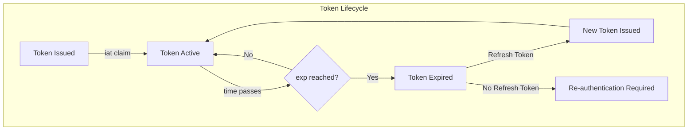
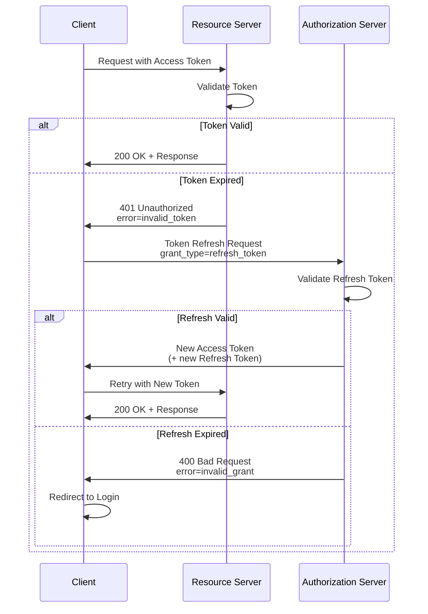
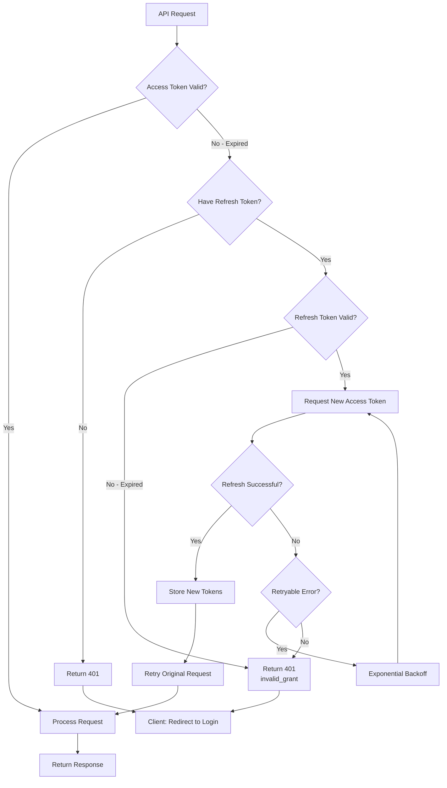
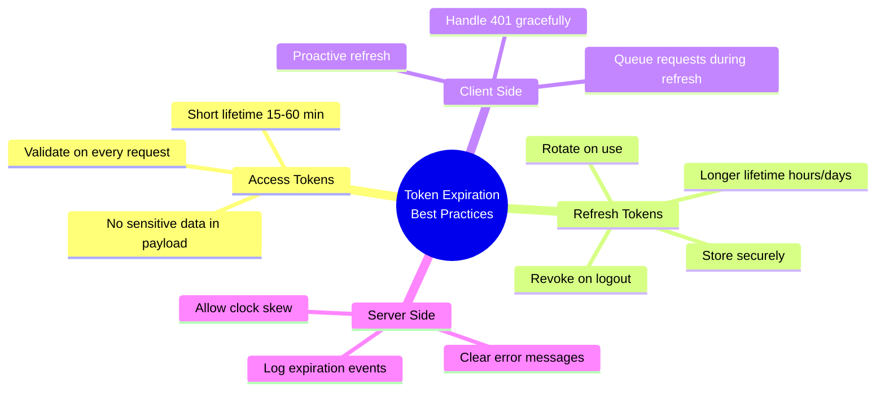

# How to Fix "Expired Token" Errors in OAuth2

Author: [nawazdhandala](https://www.github.com/nawazdhandala)

Tags: OAuth2, Token Expiration, Authentication, Refresh Tokens, Security

Description: Learn how to diagnose and fix OAuth2 expired token errors including implementing proper token refresh flows, handling edge cases, and preventing token expiration issues.

---

Expired token errors are common in OAuth2 implementations, but they can be handled gracefully with proper token lifecycle management. This guide covers comprehensive strategies for dealing with token expiration, implementing refresh flows, and preventing disruptions to user experience.

## Understanding Token Expiration



## Token Expiration Timeline

```mermaid
gantt
    title Token Lifecycle Timeline
    dateFormat  HH:mm
    axisFormat %H:%M

    section Access Token
    Token Valid           :active, t1, 00:00, 60m
    Refresh Window        :crit, t2, 00:55, 10m
    Token Expired         :done, t3, 01:00, 30m

    section Refresh Token
    Refresh Valid         :active, r1, 00:00, 24h
    Refresh Expired       :done, r2, 24:00, 1h
```

## Token Refresh Flow



## Token Manager Implementation

```javascript
// token-manager.js
// Comprehensive token lifecycle management

const EventEmitter = require('events');

class TokenManager extends EventEmitter {
    constructor(options) {
        super();

        this.tokenEndpoint = options.tokenEndpoint;
        this.clientId = options.clientId;
        this.clientSecret = options.clientSecret;

        // Token storage
        this.accessToken = null;
        this.refreshToken = null;
        this.accessTokenExpiry = null;
        this.refreshTokenExpiry = null;

        // Configuration
        this.refreshThreshold = options.refreshThreshold || 300; // 5 minutes before expiry
        this.maxRetries = options.maxRetries || 3;

        // Refresh state
        this.isRefreshing = false;
        this.refreshPromise = null;
        this.refreshTimer = null;
    }

    // Set tokens from authentication response
    setTokens(tokenResponse) {
        this.accessToken = tokenResponse.access_token;
        this.refreshToken = tokenResponse.refresh_token;

        // Calculate expiry times
        const now = Date.now();
        const expiresIn = tokenResponse.expires_in || 3600;
        this.accessTokenExpiry = now + (expiresIn * 1000);

        // Refresh token expiry (if provided, otherwise assume longer lifetime)
        if (tokenResponse.refresh_expires_in) {
            this.refreshTokenExpiry = now + (tokenResponse.refresh_expires_in * 1000);
        } else {
            // Default to 30 days if not specified
            this.refreshTokenExpiry = now + (30 * 24 * 60 * 60 * 1000);
        }

        // Schedule proactive refresh
        this.scheduleRefresh();

        this.emit('tokens_updated', {
            accessToken: this.accessToken,
            accessTokenExpiry: this.accessTokenExpiry
        });
    }

    // Check if access token is expired
    isAccessTokenExpired() {
        if (!this.accessToken || !this.accessTokenExpiry) {
            return true;
        }
        return Date.now() >= this.accessTokenExpiry;
    }

    // Check if access token needs refresh soon
    needsRefresh() {
        if (!this.accessToken || !this.accessTokenExpiry) {
            return true;
        }
        const timeUntilExpiry = this.accessTokenExpiry - Date.now();
        return timeUntilExpiry <= (this.refreshThreshold * 1000);
    }

    // Check if refresh token is expired
    isRefreshTokenExpired() {
        if (!this.refreshToken || !this.refreshTokenExpiry) {
            return true;
        }
        return Date.now() >= this.refreshTokenExpiry;
    }

    // Get valid access token, refreshing if needed
    async getAccessToken() {
        // If token is still valid, return it
        if (!this.needsRefresh()) {
            return this.accessToken;
        }

        // If already refreshing, wait for that to complete
        if (this.isRefreshing && this.refreshPromise) {
            await this.refreshPromise;
            return this.accessToken;
        }

        // Need to refresh
        await this.refresh();
        return this.accessToken;
    }

    // Refresh the access token
    async refresh() {
        // Prevent concurrent refresh attempts
        if (this.isRefreshing) {
            return this.refreshPromise;
        }

        // Check if refresh token is still valid
        if (this.isRefreshTokenExpired()) {
            this.emit('refresh_token_expired');
            throw new TokenExpiredError(
                'REFRESH_TOKEN_EXPIRED',
                'Refresh token has expired. Re-authentication required.'
            );
        }

        this.isRefreshing = true;
        this.refreshPromise = this.performRefresh();

        try {
            await this.refreshPromise;
        } finally {
            this.isRefreshing = false;
            this.refreshPromise = null;
        }
    }

    // Perform the actual refresh request
    async performRefresh() {
        let lastError;

        for (let attempt = 1; attempt <= this.maxRetries; attempt++) {
            try {
                const response = await fetch(this.tokenEndpoint, {
                    method: 'POST',
                    headers: {
                        'Content-Type': 'application/x-www-form-urlencoded'
                    },
                    body: new URLSearchParams({
                        grant_type: 'refresh_token',
                        refresh_token: this.refreshToken,
                        client_id: this.clientId,
                        ...(this.clientSecret && { client_secret: this.clientSecret })
                    })
                });

                if (!response.ok) {
                    const error = await response.json();
                    throw new TokenRefreshError(error.error, error.error_description);
                }

                const tokenResponse = await response.json();
                this.setTokens(tokenResponse);

                this.emit('tokens_refreshed', {
                    attempt,
                    accessTokenExpiry: this.accessTokenExpiry
                });

                return;

            } catch (error) {
                lastError = error;

                // Don't retry on certain errors
                if (error.code === 'invalid_grant' ||
                    error.code === 'invalid_client') {
                    break;
                }

                // Exponential backoff for retries
                if (attempt < this.maxRetries) {
                    await this.delay(Math.pow(2, attempt) * 1000);
                }
            }
        }

        // All retries failed
        this.emit('refresh_failed', lastError);

        if (lastError.code === 'invalid_grant') {
            this.emit('refresh_token_expired');
            throw new TokenExpiredError(
                'REFRESH_TOKEN_INVALID',
                'Refresh token is invalid or revoked'
            );
        }

        throw lastError;
    }

    // Schedule proactive token refresh
    scheduleRefresh() {
        // Clear existing timer
        if (this.refreshTimer) {
            clearTimeout(this.refreshTimer);
        }

        if (!this.accessTokenExpiry) return;

        // Calculate time until refresh needed
        const timeUntilRefresh = this.accessTokenExpiry - Date.now() - (this.refreshThreshold * 1000);

        if (timeUntilRefresh > 0) {
            this.refreshTimer = setTimeout(async () => {
                try {
                    await this.refresh();
                } catch (error) {
                    console.error('Proactive refresh failed:', error);
                }
            }, timeUntilRefresh);
        }
    }

    // Clear all tokens
    clear() {
        this.accessToken = null;
        this.refreshToken = null;
        this.accessTokenExpiry = null;
        this.refreshTokenExpiry = null;

        if (this.refreshTimer) {
            clearTimeout(this.refreshTimer);
            this.refreshTimer = null;
        }

        this.emit('tokens_cleared');
    }

    // Utility: delay for specified milliseconds
    delay(ms) {
        return new Promise(resolve => setTimeout(resolve, ms));
    }
}

// Custom error classes
class TokenExpiredError extends Error {
    constructor(code, message) {
        super(message);
        this.name = 'TokenExpiredError';
        this.code = code;
    }
}

class TokenRefreshError extends Error {
    constructor(code, description) {
        super(description);
        this.name = 'TokenRefreshError';
        this.code = code;
    }
}

module.exports = { TokenManager, TokenExpiredError, TokenRefreshError };
```

## HTTP Client with Automatic Token Refresh

```javascript
// http-client.js
// HTTP client that automatically handles token refresh

class AuthenticatedHttpClient {
    constructor(tokenManager, options = {}) {
        this.tokenManager = tokenManager;
        this.baseUrl = options.baseUrl || '';
        this.maxRefreshAttempts = options.maxRefreshAttempts || 1;
    }

    // Make authenticated request with automatic retry on token expiration
    async request(url, options = {}) {
        let attempts = 0;

        while (attempts <= this.maxRefreshAttempts) {
            try {
                // Get current access token
                const accessToken = await this.tokenManager.getAccessToken();

                // Make the request
                const response = await fetch(this.baseUrl + url, {
                    ...options,
                    headers: {
                        ...options.headers,
                        'Authorization': `Bearer ${accessToken}`
                    }
                });

                // Check for token expiration response
                if (response.status === 401) {
                    const errorBody = await response.clone().json().catch(() => ({}));

                    // Check if it's a token expiration error
                    if (this.isTokenExpiredError(response, errorBody)) {
                        attempts++;

                        if (attempts <= this.maxRefreshAttempts) {
                            // Force token refresh
                            await this.tokenManager.refresh();
                            continue; // Retry the request
                        }
                    }
                }

                return response;

            } catch (error) {
                // Handle token refresh errors
                if (error.name === 'TokenExpiredError') {
                    throw error; // Re-authentication required
                }

                throw error;
            }
        }
    }

    // Check if error indicates token expiration
    isTokenExpiredError(response, body) {
        // Check WWW-Authenticate header
        const wwwAuth = response.headers.get('WWW-Authenticate');
        if (wwwAuth && wwwAuth.includes('invalid_token')) {
            return true;
        }

        // Check error body
        if (body.error === 'invalid_token') {
            return true;
        }

        // Check for expiration-related messages
        const message = body.error_description || body.message || '';
        const expirationKeywords = ['expired', 'expiration', 'exp claim'];
        return expirationKeywords.some(keyword =>
            message.toLowerCase().includes(keyword)
        );
    }

    // Convenience methods
    async get(url, options = {}) {
        return this.request(url, { ...options, method: 'GET' });
    }

    async post(url, data, options = {}) {
        return this.request(url, {
            ...options,
            method: 'POST',
            headers: {
                'Content-Type': 'application/json',
                ...options.headers
            },
            body: JSON.stringify(data)
        });
    }

    async put(url, data, options = {}) {
        return this.request(url, {
            ...options,
            method: 'PUT',
            headers: {
                'Content-Type': 'application/json',
                ...options.headers
            },
            body: JSON.stringify(data)
        });
    }

    async delete(url, options = {}) {
        return this.request(url, { ...options, method: 'DELETE' });
    }
}

module.exports = { AuthenticatedHttpClient };
```

## Python Token Refresh Implementation

```python
# token_manager.py
# Python implementation of OAuth2 token refresh handling

import time
import asyncio
import aiohttp
from typing import Optional, Dict, Any, Callable
from dataclasses import dataclass
from datetime import datetime, timezone
from enum import Enum


class TokenError(Exception):
    """Base class for token-related errors."""
    def __init__(self, code: str, message: str):
        self.code = code
        self.message = message
        super().__init__(message)


class TokenExpiredError(TokenError):
    """Raised when a token has expired."""
    pass


class RefreshError(TokenError):
    """Raised when token refresh fails."""
    pass


@dataclass
class TokenData:
    """Holds OAuth2 token data."""
    access_token: str
    refresh_token: Optional[str]
    token_type: str
    expires_at: float
    refresh_expires_at: Optional[float]
    scope: Optional[str]


class TokenManager:
    """
    Manages OAuth2 token lifecycle including automatic refresh.
    """

    def __init__(
        self,
        token_endpoint: str,
        client_id: str,
        client_secret: Optional[str] = None,
        refresh_threshold: int = 300,  # seconds before expiry to refresh
        max_retries: int = 3
    ):
        self.token_endpoint = token_endpoint
        self.client_id = client_id
        self.client_secret = client_secret
        self.refresh_threshold = refresh_threshold
        self.max_retries = max_retries

        self._tokens: Optional[TokenData] = None
        self._refresh_lock = asyncio.Lock()
        self._on_token_refresh: Optional[Callable] = None

    def set_tokens(self, token_response: Dict[str, Any]) -> None:
        """Set tokens from an OAuth2 token response."""
        now = time.time()

        expires_in = token_response.get("expires_in", 3600)
        refresh_expires_in = token_response.get("refresh_expires_in")

        self._tokens = TokenData(
            access_token=token_response["access_token"],
            refresh_token=token_response.get("refresh_token"),
            token_type=token_response.get("token_type", "Bearer"),
            expires_at=now + expires_in,
            refresh_expires_at=now + refresh_expires_in if refresh_expires_in else None,
            scope=token_response.get("scope")
        )

    @property
    def access_token(self) -> Optional[str]:
        """Get current access token."""
        return self._tokens.access_token if self._tokens else None

    @property
    def refresh_token(self) -> Optional[str]:
        """Get current refresh token."""
        return self._tokens.refresh_token if self._tokens else None

    def is_access_token_expired(self) -> bool:
        """Check if access token is expired."""
        if not self._tokens:
            return True
        return time.time() >= self._tokens.expires_at

    def needs_refresh(self) -> bool:
        """Check if access token needs refresh soon."""
        if not self._tokens:
            return True
        time_until_expiry = self._tokens.expires_at - time.time()
        return time_until_expiry <= self.refresh_threshold

    def is_refresh_token_expired(self) -> bool:
        """Check if refresh token is expired."""
        if not self._tokens or not self._tokens.refresh_token:
            return True
        if not self._tokens.refresh_expires_at:
            return False  # Assume valid if no expiry set
        return time.time() >= self._tokens.refresh_expires_at

    async def get_access_token(self) -> str:
        """
        Get a valid access token, refreshing if needed.

        Returns:
            Valid access token string

        Raises:
            TokenExpiredError: If refresh token is expired
            RefreshError: If refresh fails
        """
        if not self.needs_refresh():
            return self._tokens.access_token

        # Use lock to prevent concurrent refresh attempts
        async with self._refresh_lock:
            # Double-check after acquiring lock
            if not self.needs_refresh():
                return self._tokens.access_token

            await self.refresh()
            return self._tokens.access_token

    async def refresh(self) -> None:
        """
        Refresh the access token using the refresh token.

        Raises:
            TokenExpiredError: If refresh token is expired
            RefreshError: If refresh fails after retries
        """
        if self.is_refresh_token_expired():
            raise TokenExpiredError(
                "REFRESH_TOKEN_EXPIRED",
                "Refresh token has expired. Re-authentication required."
            )

        last_error = None

        for attempt in range(1, self.max_retries + 1):
            try:
                async with aiohttp.ClientSession() as session:
                    data = {
                        "grant_type": "refresh_token",
                        "refresh_token": self._tokens.refresh_token,
                        "client_id": self.client_id
                    }
                    if self.client_secret:
                        data["client_secret"] = self.client_secret

                    async with session.post(
                        self.token_endpoint,
                        data=data
                    ) as response:
                        if response.status != 200:
                            error_body = await response.json()
                            raise RefreshError(
                                error_body.get("error", "unknown"),
                                error_body.get("error_description", "Token refresh failed")
                            )

                        token_response = await response.json()
                        self.set_tokens(token_response)

                        # Notify callback if set
                        if self._on_token_refresh:
                            self._on_token_refresh(token_response)

                        return

            except RefreshError as e:
                last_error = e
                # Don't retry on certain errors
                if e.code in ("invalid_grant", "invalid_client"):
                    break

            except Exception as e:
                last_error = RefreshError("network_error", str(e))

            # Exponential backoff
            if attempt < self.max_retries:
                await asyncio.sleep(2 ** attempt)

        # All retries failed
        if last_error.code == "invalid_grant":
            raise TokenExpiredError(
                "REFRESH_TOKEN_INVALID",
                "Refresh token is invalid or revoked"
            )

        raise last_error

    def on_token_refresh(self, callback: Callable) -> None:
        """Set callback to be called when tokens are refreshed."""
        self._on_token_refresh = callback

    def clear(self) -> None:
        """Clear all stored tokens."""
        self._tokens = None


class AuthenticatedSession:
    """
    HTTP session that automatically handles token refresh.
    """

    def __init__(
        self,
        token_manager: TokenManager,
        base_url: str = ""
    ):
        self.token_manager = token_manager
        self.base_url = base_url

    async def request(
        self,
        method: str,
        url: str,
        **kwargs
    ) -> aiohttp.ClientResponse:
        """
        Make authenticated HTTP request with automatic token refresh.
        """
        async with aiohttp.ClientSession() as session:
            for attempt in range(2):  # Try once, then retry after refresh
                try:
                    access_token = await self.token_manager.get_access_token()

                    headers = kwargs.pop("headers", {})
                    headers["Authorization"] = f"Bearer {access_token}"

                    async with session.request(
                        method,
                        self.base_url + url,
                        headers=headers,
                        **kwargs
                    ) as response:
                        # Check for token expiration response
                        if response.status == 401 and attempt == 0:
                            error_body = await response.json()
                            if self._is_token_expired_error(response, error_body):
                                # Force refresh and retry
                                await self.token_manager.refresh()
                                continue

                        return response

                except TokenExpiredError:
                    raise

        raise RefreshError("max_retries", "Request failed after token refresh")

    def _is_token_expired_error(
        self,
        response: aiohttp.ClientResponse,
        body: Dict[str, Any]
    ) -> bool:
        """Check if the error indicates token expiration."""
        # Check WWW-Authenticate header
        www_auth = response.headers.get("WWW-Authenticate", "")
        if "invalid_token" in www_auth:
            return True

        # Check error code
        if body.get("error") == "invalid_token":
            return True

        # Check error description
        description = body.get("error_description", "").lower()
        expiration_keywords = ["expired", "expiration", "exp claim"]
        return any(kw in description for kw in expiration_keywords)

    async def get(self, url: str, **kwargs) -> aiohttp.ClientResponse:
        """Make GET request."""
        return await self.request("GET", url, **kwargs)

    async def post(self, url: str, **kwargs) -> aiohttp.ClientResponse:
        """Make POST request."""
        return await self.request("POST", url, **kwargs)

    async def put(self, url: str, **kwargs) -> aiohttp.ClientResponse:
        """Make PUT request."""
        return await self.request("PUT", url, **kwargs)

    async def delete(self, url: str, **kwargs) -> aiohttp.ClientResponse:
        """Make DELETE request."""
        return await self.request("DELETE", url, **kwargs)


# Example usage
async def main():
    # Initialize token manager
    token_manager = TokenManager(
        token_endpoint="https://auth.example.com/oauth/token",
        client_id="your-client-id",
        client_secret="your-client-secret",
        refresh_threshold=300  # Refresh 5 minutes before expiry
    )

    # Set initial tokens from login
    token_manager.set_tokens({
        "access_token": "initial-access-token",
        "refresh_token": "initial-refresh-token",
        "expires_in": 3600,
        "token_type": "Bearer"
    })

    # Create authenticated session
    session = AuthenticatedSession(
        token_manager,
        base_url="https://api.example.com"
    )

    # Make requests - token refresh is handled automatically
    try:
        response = await session.get("/users/me")
        print(f"Status: {response.status}")
    except TokenExpiredError as e:
        print(f"Need to re-authenticate: {e.message}")


if __name__ == "__main__":
    asyncio.run(main())
```

## Server-Side Token Expiration Handling

```javascript
// server/token-validator.js
// Server-side middleware for handling expired tokens

const jwt = require('jsonwebtoken');

function createTokenValidator(options) {
    const {
        publicKey,
        issuer,
        audience,
        clockTolerance = 30 // seconds
    } = options;

    return async function validateToken(req, res, next) {
        const authHeader = req.headers.authorization;

        if (!authHeader || !authHeader.startsWith('Bearer ')) {
            return res.status(401).json({
                error: 'invalid_request',
                error_description: 'Missing or invalid Authorization header'
            });
        }

        const token = authHeader.slice(7);

        try {
            // Verify token
            const payload = jwt.verify(token, publicKey, {
                algorithms: ['RS256'],
                issuer,
                audience,
                clockTolerance
            });

            req.user = payload;
            req.token = token;
            next();

        } catch (error) {
            // Handle specific JWT errors
            if (error.name === 'TokenExpiredError') {
                // Token has expired
                const expiredAt = new Date(error.expiredAt).toISOString();

                res.setHeader('WWW-Authenticate',
                    `Bearer realm="api", error="invalid_token", error_description="Token expired at ${expiredAt}"`
                );

                return res.status(401).json({
                    error: 'invalid_token',
                    error_description: 'The access token has expired',
                    expired_at: expiredAt
                });
            }

            if (error.name === 'NotBeforeError') {
                // Token not yet valid
                return res.status(401).json({
                    error: 'invalid_token',
                    error_description: 'Token is not yet valid',
                    not_before: new Date(error.date).toISOString()
                });
            }

            // Other validation errors
            res.setHeader('WWW-Authenticate',
                `Bearer realm="api", error="invalid_token"`
            );

            return res.status(401).json({
                error: 'invalid_token',
                error_description: 'Token validation failed'
            });
        }
    };
}

module.exports = { createTokenValidator };
```

## Token Expiration Error Handling Flow



## Best Practices for Token Expiration



## Handling Race Conditions

```javascript
// queue-manager.js
// Handle concurrent requests during token refresh

class RequestQueue {
    constructor(tokenManager) {
        this.tokenManager = tokenManager;
        this.queue = [];
        this.isProcessing = false;
    }

    // Add request to queue if refresh is in progress
    async enqueue(requestFn) {
        if (this.tokenManager.isRefreshing) {
            // Wait for refresh to complete
            return new Promise((resolve, reject) => {
                this.queue.push({ requestFn, resolve, reject });
            });
        }

        // Execute immediately if not refreshing
        return requestFn();
    }

    // Process queued requests after refresh
    async processQueue() {
        if (this.isProcessing || this.queue.length === 0) {
            return;
        }

        this.isProcessing = true;

        while (this.queue.length > 0) {
            const { requestFn, resolve, reject } = this.queue.shift();

            try {
                const result = await requestFn();
                resolve(result);
            } catch (error) {
                reject(error);
            }
        }

        this.isProcessing = false;
    }
}

// Usage with token manager
const tokenManager = new TokenManager(config);
const requestQueue = new RequestQueue(tokenManager);

tokenManager.on('tokens_refreshed', () => {
    requestQueue.processQueue();
});

// Make requests through queue
async function makeRequest(url, options) {
    return requestQueue.enqueue(async () => {
        const token = await tokenManager.getAccessToken();
        return fetch(url, {
            ...options,
            headers: {
                ...options.headers,
                Authorization: `Bearer ${token}`
            }
        });
    });
}
```

## Summary

Handling expired tokens properly is essential for a good user experience in OAuth2 applications. Key strategies include implementing proactive token refresh before expiration, using refresh token rotation for security, handling race conditions with request queuing, providing clear error responses from the server, and always having a fallback to re-authentication when refresh tokens expire. By implementing these patterns, your application can maintain continuous access while keeping security tight.
