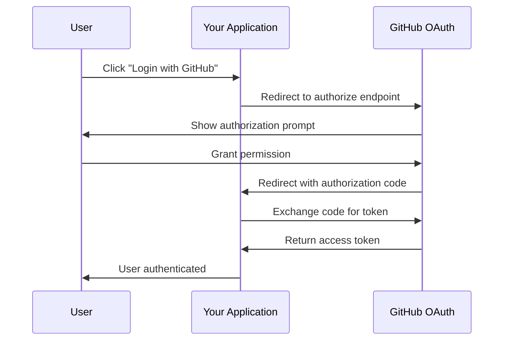

# How to Configure OAuth2 with GitHub

Author: [nawazdhandala](https://www.github.com/nawazdhandala)

Tags: OAuth2, GitHub, Authentication, Security, API, Web Development

Description: A comprehensive guide to configuring OAuth2 authentication with GitHub, including app registration, authorization flow implementation, and token management.

---

GitHub OAuth2 allows users to authenticate with your application using their GitHub accounts. This eliminates the need for users to create separate credentials while giving your application secure access to GitHub APIs on their behalf.

## How GitHub OAuth2 Works

GitHub implements the OAuth2 authorization code flow. Your application redirects users to GitHub, they authorize access, and GitHub returns an authorization code that you exchange for an access token.



## Register Your GitHub OAuth Application

Before writing code, register your application in GitHub.

### Step 1: Create OAuth App

Navigate to GitHub Settings > Developer settings > OAuth Apps > New OAuth App.

Fill in the required fields:

| Field | Example Value |
|-------|---------------|
| Application name | My Awesome App |
| Homepage URL | https://myapp.example.com |
| Authorization callback URL | https://myapp.example.com/auth/github/callback |

### Step 2: Get Your Credentials

After creation, GitHub provides:
- **Client ID**: Public identifier for your app
- **Client Secret**: Private key (never expose in client-side code)

Store these securely in environment variables.

```bash
# .env file - never commit this to version control
GITHUB_CLIENT_ID=your_client_id_here
GITHUB_CLIENT_SECRET=your_client_secret_here
GITHUB_CALLBACK_URL=https://myapp.example.com/auth/github/callback
```

## Implement the Authorization Flow

### Step 1: Create the Authorization URL

Redirect users to GitHub's authorization endpoint.

```python
# Python/Flask example
import os
import secrets
from flask import Flask, redirect, session, request
from urllib.parse import urlencode

app = Flask(__name__)
app.secret_key = os.urandom(24)

GITHUB_CLIENT_ID = os.environ.get("GITHUB_CLIENT_ID")
GITHUB_CLIENT_SECRET = os.environ.get("GITHUB_CLIENT_SECRET")
GITHUB_CALLBACK_URL = os.environ.get("GITHUB_CALLBACK_URL")

@app.route("/login/github")
def github_login():
    # Generate state parameter to prevent CSRF attacks
    state = secrets.token_urlsafe(32)
    session["oauth_state"] = state

    params = {
        "client_id": GITHUB_CLIENT_ID,
        "redirect_uri": GITHUB_CALLBACK_URL,
        "scope": "user:email read:user",
        "state": state
    }

    auth_url = f"https://github.com/login/oauth/authorize?{urlencode(params)}"
    return redirect(auth_url)
```

### Step 2: Handle the Callback

When GitHub redirects back, exchange the code for an access token.

```python
import requests

@app.route("/auth/github/callback")
def github_callback():
    # Verify state parameter
    if request.args.get("state") != session.get("oauth_state"):
        return "State mismatch - possible CSRF attack", 403

    # Check for errors
    error = request.args.get("error")
    if error:
        error_description = request.args.get("error_description", "Unknown error")
        return f"Authorization failed: {error_description}", 400

    # Get authorization code
    code = request.args.get("code")
    if not code:
        return "No authorization code received", 400

    # Exchange code for access token
    token_response = requests.post(
        "https://github.com/login/oauth/access_token",
        data={
            "client_id": GITHUB_CLIENT_ID,
            "client_secret": GITHUB_CLIENT_SECRET,
            "code": code,
            "redirect_uri": GITHUB_CALLBACK_URL
        },
        headers={"Accept": "application/json"}
    )

    token_data = token_response.json()

    if "error" in token_data:
        return f"Token exchange failed: {token_data.get('error_description')}", 400

    access_token = token_data["access_token"]

    # Store token securely (typically in session or database)
    session["github_token"] = access_token

    return redirect("/dashboard")
```

### Step 3: Use the Access Token

Make authenticated requests to the GitHub API.

```python
@app.route("/dashboard")
def dashboard():
    access_token = session.get("github_token")
    if not access_token:
        return redirect("/login/github")

    # Fetch user information
    user_response = requests.get(
        "https://api.github.com/user",
        headers={
            "Authorization": f"Bearer {access_token}",
            "Accept": "application/vnd.github.v3+json"
        }
    )

    if user_response.status_code != 200:
        session.pop("github_token", None)
        return redirect("/login/github")

    user_data = user_response.json()
    return f"Welcome, {user_data['login']}!"
```

## GitHub OAuth Scopes

Scopes define what access your application requests. Only request what you need.

| Scope | Access Level |
|-------|--------------|
| (no scope) | Public user info only |
| user:email | Read user email addresses |
| read:user | Read all user profile data |
| user | Read and write user profile data |
| repo | Full access to repositories |
| public_repo | Access to public repositories only |

## Security Best Practices

### Always Use State Parameter

The state parameter prevents CSRF attacks. Generate a unique, unpredictable value for each authorization request.

```python
import secrets

def generate_state():
    """Generate a cryptographically secure state parameter."""
    return secrets.token_urlsafe(32)
```

### Secure Token Storage

Never store tokens in localStorage or expose them to client-side JavaScript. Store in server-side session with secure cookies.

GitHub OAuth2 provides a secure, familiar authentication experience for your users. Always follow security best practices and request only necessary scopes.
