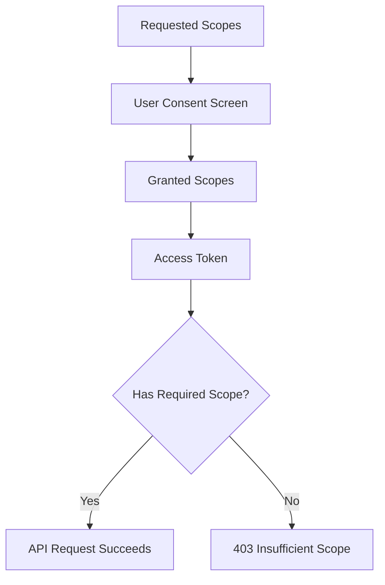
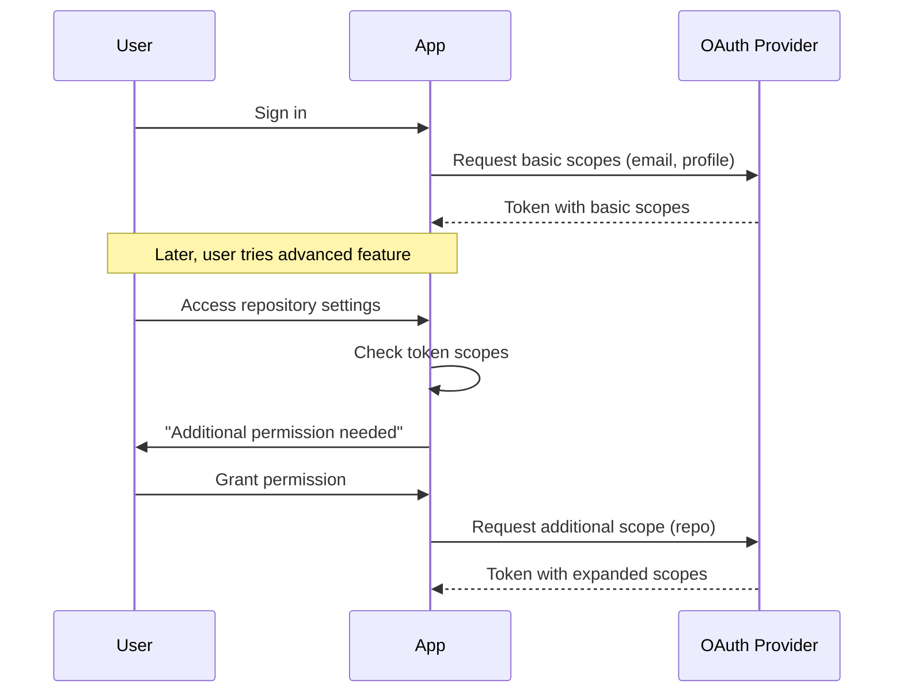

# How to Fix "Insufficient Scope" OAuth2 Errors

Author: [nawazdhandala](https://www.github.com/nawazdhandala)

Tags: OAuth2, Authentication, Security, Scopes, Troubleshooting, API

Description: Learn how to diagnose and fix OAuth2 insufficient scope errors, including scope management, incremental authorization, and best practices for requesting permissions.

---

An "insufficient scope" error occurs when your OAuth2 access token does not have the permissions required for a specific API operation. The token is valid, but it lacks authorization for what you are trying to do.

## Understanding OAuth2 Scopes

Scopes define the level of access your application has.



## Identifying Insufficient Scope Errors

```json
// Standard OAuth2 format
{
    "error": "insufficient_scope",
    "error_description": "The token does not have the required scope",
    "scope": "write:users"
}

// GitHub format
{
    "message": "Resource not accessible by integration"
}
```

### Detection Function

```python
from typing import Optional, List

class InsufficientScopeError(Exception):
    def __init__(self, message: str, required_scopes: List[str] = None):
        self.message = message
        self.required_scopes = required_scopes or []
        super().__init__(self.message)

def detect_insufficient_scope(response: dict, status_code: int) -> Optional[List[str]]:
    if status_code != 403:
        return None

    if response.get("error") == "insufficient_scope":
        required = response.get("scope", "")
        return required.split() if required else []

    error_msg = str(response.get("message", "")).lower()
    if "insufficient" in error_msg or "not accessible" in error_msg:
        return []

    return None
```

## Requesting the Right Scopes

```python
# Define scope requirements per feature
FEATURE_SCOPES = {
    "view_profile": ["read:user"],
    "edit_profile": ["read:user", "write:user"],
    "view_repos": ["read:repos"],
    "create_repos": ["read:repos", "write:repos"]
}

def get_required_scopes(features: list) -> list:
    scopes = set()
    for feature in features:
        feature_scopes = FEATURE_SCOPES.get(feature, [])
        scopes.update(feature_scopes)
    return list(scopes)
```

## Incremental Authorization

Request additional scopes only when needed.



### Implementation

```python
class IncrementalAuthManager:
    def __init__(self, user_id: str):
        self.user_id = user_id

    def has_required_scopes(self, required: list) -> bool:
        current = self.get_current_scopes()
        return set(required).issubset(current)

    def get_missing_scopes(self, required: list) -> list:
        current = self.get_current_scopes()
        return list(set(required) - current)

    def request_additional_scopes(self, additional_scopes: list) -> str:
        current = self.get_current_scopes()
        all_scopes = current.union(set(additional_scopes))
        
        params = {
            "client_id": OAUTH_CLIENT_ID,
            "scope": " ".join(all_scopes),
            "include_granted_scopes": "true"  # Google
        }
        return f"{OAUTH_AUTHORIZE_URL}?{urlencode(params)}"
```

## Best Practices

### Request Minimum Required Scopes

```python
# Good: Request only what is needed now
scopes = ["read:user", "user:email"]

# Request more later when needed
if user.wants_repo_access:
    additional_scopes = ["repo"]
```

### User-Friendly Error Messages

```python
SCOPE_DESCRIPTIONS = {
    "read:user": "view your profile information",
    "write:user": "update your profile",
    "repo": "access your repositories"
}

def get_friendly_scope_message(scopes: list) -> str:
    descriptions = [SCOPE_DESCRIPTIONS.get(s, s) for s in scopes]
    return f"This feature requires permission to {', '.join(descriptions)}."
```

Insufficient scope errors are a normal part of OAuth2 authorization. Implement proper scope management and clear user communication for the best experience.
