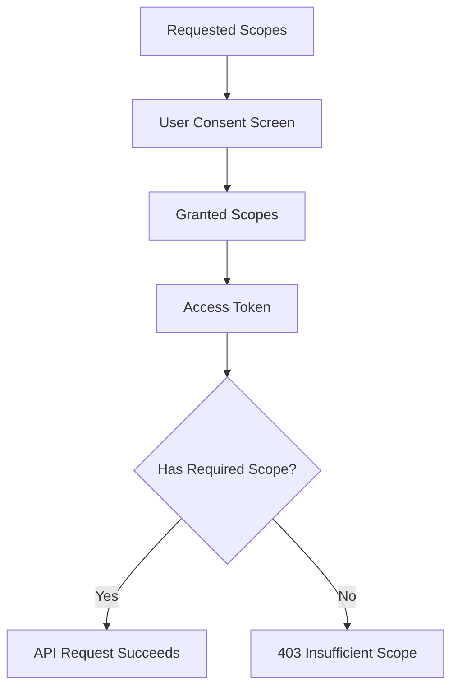
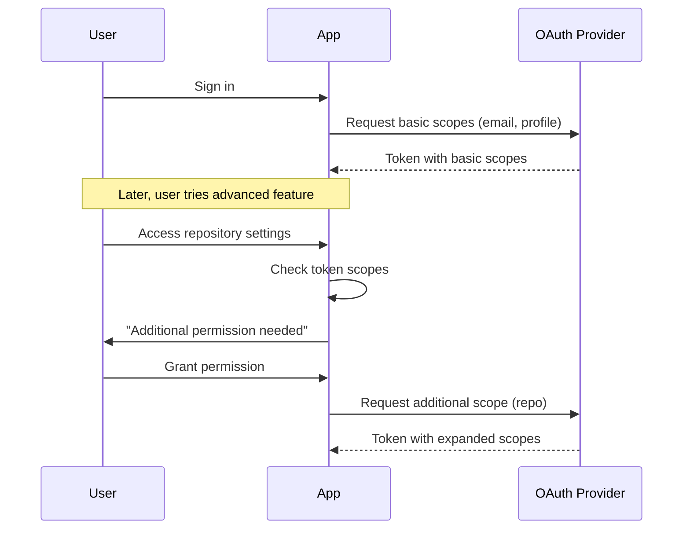

# How to Fix 'Insufficient Scope' OAuth2 Errors

Author: [nawazdhandala](https://www.github.com/nawazdhandala)

Tags: OAuth2, Authentication, Security, Scope, Troubleshooting, API

Description: Learn how to diagnose and fix OAuth2 insufficient scope errors, including scope management, incremental authorization, and best practices for requesting permissions.

---

An "insufficient scope" error occurs when your OAuth2 access token does not have the permissions required for a specific API operation. The token is valid, but it lacks authorization for what you are trying to do.

## Understanding OAuth2 Scopes

Scopes define the level of access your application has.


```mermaid
flowchart TD
    A[Access Token] --> B{Has Required Scope?}
    B -->|Yes| C[API Request Succeeds]
    B -->|No| D[403 Insufficient Scope]

    E[Requested Scopes] --> F[User Consent Screen]
    F --> G[Granted Scopes]
    G --> A
```

## Identifying Insufficient Scope Errors

```http
HTTP/1.1 403 Forbidden
WWW-Authenticate: Bearer realm="example",
                  error="insufficient_scope",
                  error_description="The token does not have the required scope",
                  scope="write:users"
```

```json
{
    "message": "Resource not accessible by integration"
}
```

### Detection Function

```python
import re
from typing import Dict, List, Optional

class InsufficientScopeError(Exception):
    def __init__(self, message: str, required_scopes: List[str] = None):
        self.message = message
        self.required_scopes = required_scopes or []
        super().__init__(self.message)

def _scope_from_www_authenticate(value: str) -> List[str]:
    match = re.search(r'\bscope="([^"]*)"', value)
    return match.group(1).split() if match and match.group(1) else []

def detect_insufficient_scope(
    response: dict,
    status_code: int,
    headers: Optional[Dict[str, str]] = None
) -> Optional[List[str]]:
    if status_code != 403:
        return None

    www_authenticate = next(
        (value for key, value in (headers or {}).items() if key.lower() == "www-authenticate"),
        ""
    )
    if "insufficient_scope" in www_authenticate:
        return _scope_from_www_authenticate(www_authenticate)

    if response.get("error") == "insufficient_scope":
        required = response.get("scope", "")
        return required.split() if required else []

    error_msg = str(response.get("message", "")).lower()
    if "insufficient" in error_msg or "not accessible" in error_msg:
        return []

    return None
```

## Requesting the Right Scopes

```python
# Define scope requirements per feature

FEATURE_SCOPES = {
    "view_profile": ["read:user"],
    "edit_profile": ["user"],
    "view_emails": ["user:email"],
    "view_repos": ["repo"],
    "create_repos": ["repo"]
}

def get_required_scopes(features: list) -> list:
    scopes = set()
    for feature in features:
        feature_scopes = FEATURE_SCOPES.get(feature, [])
        scopes.update(feature_scopes)
    return list(scopes)
```

## Incremental Authorization

Request additional scopes only when needed.


```mermaid
sequenceDiagram
    participant User
    participant App
    participant OAuth as OAuth Provider

    User->>App: Sign in
    App->>OAuth: Request basic scopes (email, profile)
    OAuth-->>App: Token with basic scopes

    Note over User,App: Later, user tries advanced feature

    User->>App: Access repository settings
    App->>App: Check token scopes
    App->>User: "Additional permission needed"
    User->>App: Grant permission
    App->>OAuth: Request additional scope (repo)
    OAuth-->>App: Token with expanded scopes
```

### Implementation

```python
from urllib.parse import urlencode

class IncrementalAuthManager:
    def __init__(
        self,
        user_id: str,
        current_scopes: list,
        client_id: str,
        redirect_uri: str,
        authorize_url: str
    ):
        self.user_id = user_id
        self.current_scopes = set(current_scopes)
        self.client_id = client_id
        self.redirect_uri = redirect_uri
        self.authorize_url = authorize_url

    def get_current_scopes(self) -> set:
        return self.current_scopes

    def has_required_scopes(self, required: list) -> bool:
        current = self.get_current_scopes()
        return set(required).issubset(current)

    def get_missing_scopes(self, required: list) -> list:
        current = self.get_current_scopes()
        return list(set(required) - current)

    def request_additional_scopes(self, additional_scopes: list) -> str:
        current = self.get_current_scopes()
        all_scopes = current.union(set(additional_scopes))
        
        params = {
            "client_id": self.client_id,
            "redirect_uri": self.redirect_uri,
            "response_type": "code",
            "scope": " ".join(all_scopes),
            "include_granted_scopes": "true"  # Google
        }
        return f"{self.authorize_url}?{urlencode(params)}"
```

## Best Practices

### Request Minimum Required Scopes

```python
# Good: Request only what is needed now
scopes = ["read:user", "user:email"]

# Request more later when needed
if user.wants_repo_access:
    additional_scopes = ["repo"]
```

### User-Friendly Error Messages

```python
SCOPE_DESCRIPTIONS = {
    "read:user": "view your profile information",
    "user": "update your profile",
    "user:email": "view your email addresses",
    "repo": "access your repositories"
}

def get_friendly_scope_message(scopes: list) -> str:
    descriptions = [SCOPE_DESCRIPTIONS.get(s, s) for s in scopes]
    return f"This feature requires permission to {', '.join(descriptions)}."
```

Insufficient scope errors are a normal part of OAuth2 authorization. Implement proper scope management and clear user communication for the best experience.
