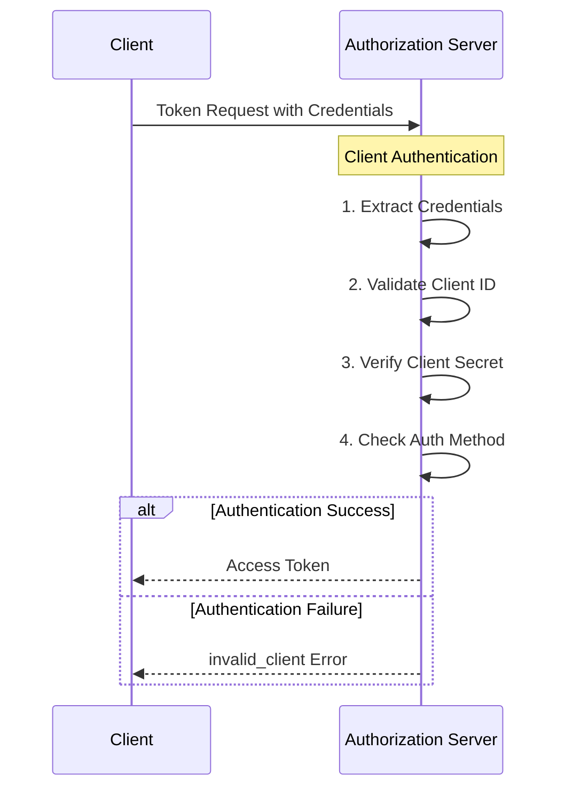
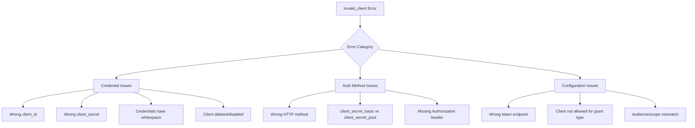
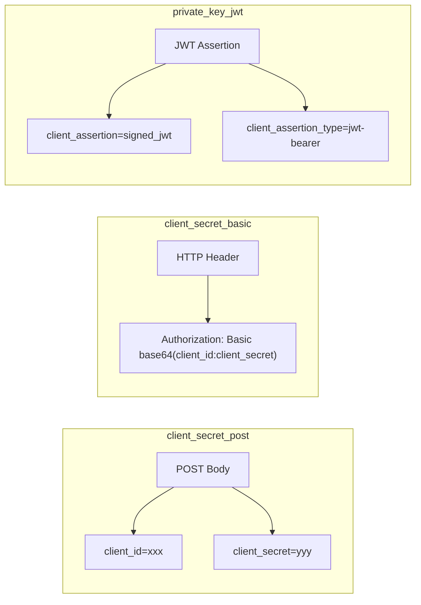

# How to Fix 'Invalid Client' OAuth2 Errors

Author: [nawazdhandala](https://www.github.com/nawazdhandala)

Tags: OAuth2, Authentication, Security, API, Troubleshooting

Description: Learn how to diagnose and fix OAuth2 invalid_client errors including credential issues, authentication method mismatches, and client configuration problems.

---

The "invalid_client" error occurs when the OAuth2 authorization server cannot authenticate the client application. This error typically indicates problems with client credentials, authentication methods, or client registration. This guide covers the common causes and solutions.

## Understanding Client Authentication



## Common Causes of Invalid Client Errors



## Cause 1: Incorrect Client Credentials

The most common cause is using wrong or mistyped credentials.

### Diagnosis

```python
# Typical error response
{
    "error": "invalid_client",
    "error_description": "Client authentication failed"
}
```

### Solution

Verify and securely manage credentials:

```python
import os
import re
from dataclasses import dataclass
from typing import Optional

@dataclass
class OAuth2ClientCredentials:
    """
    Securely manage OAuth2 client credentials.
    """
    client_id: str
    client_secret: str

    def __post_init__(self):
        """Validate credentials on initialization."""
        self._validate()

    def _validate(self):
        """
        Validate credential format and common issues.
        """
        # Check for empty values
        if not self.client_id:
            raise ValueError("Client ID cannot be empty")

        if not self.client_secret:
            raise ValueError("Client secret cannot be empty")

        # Check for whitespace issues
        if self.client_id != self.client_id.strip():
            raise ValueError(
                "Client ID has leading/trailing whitespace. "
                f"Found: '{self.client_id}'"
            )

        if self.client_secret != self.client_secret.strip():
            raise ValueError(
                "Client secret has leading/trailing whitespace"
            )

        # Check for newlines (common copy-paste issue)
        if '\n' in self.client_id or '\r' in self.client_id:
            raise ValueError("Client ID contains newline characters")

        if '\n' in self.client_secret or '\r' in self.client_secret:
            raise ValueError("Client secret contains newline characters")

        # Check minimum length (most providers require at least 10 chars)
        if len(self.client_id) < 10:
            print(f"Warning: Client ID seems short ({len(self.client_id)} chars)")

        if len(self.client_secret) < 16:
            print(f"Warning: Client secret seems short ({len(self.client_secret)} chars)")

    @classmethod
    def from_environment(
        cls,
        id_var: str = "OAUTH_CLIENT_ID",
        secret_var: str = "OAUTH_CLIENT_SECRET"
    ) -> "OAuth2ClientCredentials":
        """
        Load credentials from environment variables.
        """
        client_id = os.environ.get(id_var)
        client_secret = os.environ.get(secret_var)

        if not client_id:
            raise ValueError(f"Environment variable {id_var} not set")

        if not client_secret:
            raise ValueError(f"Environment variable {secret_var} not set")

        return cls(client_id=client_id, client_secret=client_secret)


# Diagnostic function
def diagnose_credentials(client_id: str, client_secret: str) -> None:
    """
    Print diagnostic information about credentials.
    """
    print("Credential Diagnostics")
    print("=" * 40)

    print(f"\nClient ID:")
    print(f"  Length: {len(client_id)}")
    print(f"  Preview: {client_id[:8]}...{client_id[-4:]}")
    print(f"  Has whitespace: {client_id != client_id.strip()}")
    print(f"  Has newlines: {bool(re.search(r'[\r\n]', client_id))}")

    print(f"\nClient Secret:")
    print(f"  Length: {len(client_secret)}")
    print(f"  Has whitespace: {client_secret != client_secret.strip()}")
    print(f"  Has newlines: {bool(re.search(r'[\r\n]', client_secret))}")

    # Check for common encoding issues
    try:
        client_id.encode('ascii')
    except UnicodeEncodeError:
        print("  Warning: Client ID contains non-ASCII characters")

    try:
        client_secret.encode('ascii')
    except UnicodeEncodeError:
        print("  Warning: Client secret contains non-ASCII characters")


# Usage
credentials = OAuth2ClientCredentials.from_environment()
diagnose_credentials(credentials.client_id, credentials.client_secret)
```

## Cause 2: Authentication Method Mismatch

OAuth2 supports different client authentication methods. Using the wrong method causes invalid_client errors.

### Authentication Methods



### Solution

Implement support for multiple authentication methods:

```python
import base64
import requests
from enum import Enum
from typing import Optional
import time
import jwt  # PyJWT library

class ClientAuthMethod(Enum):
    """OAuth2 client authentication methods."""
    CLIENT_SECRET_POST = "client_secret_post"
    CLIENT_SECRET_BASIC = "client_secret_basic"
    PRIVATE_KEY_JWT = "private_key_jwt"
    NONE = "none"


class OAuth2Client:
    """
    OAuth2 client with configurable authentication method.
    """

    def __init__(
        self,
        client_id: str,
        token_url: str,
        client_secret: Optional[str] = None,
        private_key: Optional[str] = None,
        auth_method: ClientAuthMethod = ClientAuthMethod.CLIENT_SECRET_POST
    ):
        self.client_id = client_id
        self.client_secret = client_secret
        self.private_key = private_key
        self.token_url = token_url
        self.auth_method = auth_method

        self._validate_auth_config()

    def _validate_auth_config(self):
        """Validate authentication configuration."""
        if self.auth_method in [
            ClientAuthMethod.CLIENT_SECRET_POST,
            ClientAuthMethod.CLIENT_SECRET_BASIC
        ]:
            if not self.client_secret:
                raise ValueError(
                    f"client_secret required for {self.auth_method.value}"
                )

        elif self.auth_method == ClientAuthMethod.PRIVATE_KEY_JWT:
            if not self.private_key:
                raise ValueError(
                    "private_key required for private_key_jwt authentication"
                )

    def request_token(
        self,
        grant_type: str,
        **params
    ) -> dict:
        """
        Request a token using the configured authentication method.
        """
        headers = {"Content-Type": "application/x-www-form-urlencoded"}
        data = {"grant_type": grant_type, **params}

        # Apply authentication based on method
        if self.auth_method == ClientAuthMethod.CLIENT_SECRET_POST:
            data["client_id"] = self.client_id
            data["client_secret"] = self.client_secret

        elif self.auth_method == ClientAuthMethod.CLIENT_SECRET_BASIC:
            credentials = f"{self.client_id}:{self.client_secret}"
            encoded = base64.b64encode(credentials.encode()).decode()
            headers["Authorization"] = f"Basic {encoded}"

        elif self.auth_method == ClientAuthMethod.PRIVATE_KEY_JWT:
            assertion = self._create_client_assertion()
            data["client_id"] = self.client_id
            data["client_assertion_type"] = (
                "urn:ietf:params:oauth:client-assertion-type:jwt-bearer"
            )
            data["client_assertion"] = assertion

        elif self.auth_method == ClientAuthMethod.NONE:
            data["client_id"] = self.client_id

        response = requests.post(self.token_url, headers=headers, data=data)

        if response.status_code != 200:
            self._handle_error(response)

        return response.json()

    def _create_client_assertion(self) -> str:
        """
        Create a signed JWT client assertion.
        """
        now = int(time.time())

        claims = {
            "iss": self.client_id,
            "sub": self.client_id,
            "aud": self.token_url,
            "exp": now + 300,  # 5 minutes
            "iat": now,
            "jti": f"{self.client_id}-{now}"  # Unique ID
        }

        return jwt.encode(
            claims,
            self.private_key,
            algorithm="RS256"
        )

    def _handle_error(self, response: requests.Response):
        """Handle error response."""
        try:
            error_data = response.json()
            error = error_data.get("error")
            description = error_data.get("error_description", "")

            if error == "invalid_client":
                raise InvalidClientError(
                    f"Client authentication failed: {description}"
                )

            raise OAuth2Error(f"{error}: {description}")

        except ValueError:
            raise OAuth2Error(f"Request failed: {response.text}")


class InvalidClientError(Exception):
    pass


class OAuth2Error(Exception):
    pass


# Detect the correct authentication method
def detect_auth_method(discovery_url: str) -> list:
    """
    Detect supported authentication methods from OAuth2 discovery document.
    """
    response = requests.get(discovery_url)
    metadata = response.json()

    supported_methods = metadata.get(
        "token_endpoint_auth_methods_supported",
        ["client_secret_basic"]  # Default per RFC
    )

    print(f"Supported authentication methods: {supported_methods}")
    return supported_methods


# Usage examples
# Method 1: client_secret_post (credentials in body)
client_post = OAuth2Client(
    client_id="your_client_id",
    client_secret="your_client_secret",
    token_url="https://auth.example.com/oauth/token",
    auth_method=ClientAuthMethod.CLIENT_SECRET_POST
)

# Method 2: client_secret_basic (credentials in Authorization header)
client_basic = OAuth2Client(
    client_id="your_client_id",
    client_secret="your_client_secret",
    token_url="https://auth.example.com/oauth/token",
    auth_method=ClientAuthMethod.CLIENT_SECRET_BASIC
)

# Method 3: private_key_jwt (signed JWT assertion)
client_jwt = OAuth2Client(
    client_id="your_client_id",
    private_key=open("private_key.pem").read(),
    token_url="https://auth.example.com/oauth/token",
    auth_method=ClientAuthMethod.PRIVATE_KEY_JWT
)
```

## Cause 3: Client Not Configured for Grant Type

The client may not be authorized for the grant type you are using.

### Diagnosis

```python
# Error when using unsupported grant type
{
    "error": "invalid_client",
    "error_description": "Client not authorized for this grant type"
}
```

### Solution

Verify client configuration and use appropriate grant types:

```python
from enum import Enum
from typing import List, Optional

class GrantType(Enum):
    """OAuth2 grant types."""
    AUTHORIZATION_CODE = "authorization_code"
    CLIENT_CREDENTIALS = "client_credentials"
    REFRESH_TOKEN = "refresh_token"
    PASSWORD = "password"  # Legacy, avoid if possible
    DEVICE_CODE = "urn:ietf:params:oauth:grant-type:device_code"


class OAuth2ClientConfig:
    """
    OAuth2 client with grant type validation.
    """

    def __init__(
        self,
        client_id: str,
        client_secret: str,
        token_url: str,
        allowed_grant_types: List[GrantType]
    ):
        self.client_id = client_id
        self.client_secret = client_secret
        self.token_url = token_url
        self.allowed_grant_types = allowed_grant_types

    def validate_grant_type(self, grant_type: GrantType) -> None:
        """
        Validate that the grant type is allowed for this client.
        """
        if grant_type not in self.allowed_grant_types:
            allowed = [g.value for g in self.allowed_grant_types]
            raise ValueError(
                f"Grant type '{grant_type.value}' not allowed for this client. "
                f"Allowed types: {allowed}"
            )

    def get_token_authorization_code(
        self,
        code: str,
        redirect_uri: str
    ) -> dict:
        """Get token using authorization code."""
        self.validate_grant_type(GrantType.AUTHORIZATION_CODE)

        return self._request_token(
            grant_type="authorization_code",
            code=code,
            redirect_uri=redirect_uri
        )

    def get_token_client_credentials(
        self,
        scope: Optional[str] = None
    ) -> dict:
        """Get token using client credentials."""
        self.validate_grant_type(GrantType.CLIENT_CREDENTIALS)

        params = {}
        if scope:
            params["scope"] = scope

        return self._request_token(
            grant_type="client_credentials",
            **params
        )

    def refresh_token(self, refresh_token: str) -> dict:
        """Refresh an access token."""
        self.validate_grant_type(GrantType.REFRESH_TOKEN)

        return self._request_token(
            grant_type="refresh_token",
            refresh_token=refresh_token
        )

    def _request_token(self, **params) -> dict:
        """Make token request."""
        import requests

        data = {
            "client_id": self.client_id,
            "client_secret": self.client_secret,
            **params
        }

        response = requests.post(self.token_url, data=data)

        if response.status_code != 200:
            error_data = response.json()
            if error_data.get("error") == "invalid_client":
                # Check if it might be a grant type issue
                self._diagnose_grant_type_issue(params.get("grant_type"))
            raise OAuth2Error(error_data)

        return response.json()

    def _diagnose_grant_type_issue(self, grant_type: str) -> None:
        """Provide diagnostic information for grant type issues."""
        print(f"\nDiagnostic: Check if client is configured for '{grant_type}'")
        print("Common configurations by application type:")
        print("  - Web apps: authorization_code, refresh_token")
        print("  - SPAs: authorization_code (with PKCE)")
        print("  - Server-to-server: client_credentials")
        print("  - Mobile apps: authorization_code (with PKCE), refresh_token")


# Usage - configure based on your OAuth2 provider settings
client = OAuth2ClientConfig(
    client_id="your_client_id",
    client_secret="your_client_secret",
    token_url="https://auth.example.com/oauth/token",
    allowed_grant_types=[
        GrantType.AUTHORIZATION_CODE,
        GrantType.REFRESH_TOKEN,
        GrantType.CLIENT_CREDENTIALS
    ]
)

# This will work if client_credentials is allowed
token = client.get_token_client_credentials(scope="read write")
```

## Cause 4: URL Encoding Issues

Special characters in credentials must be properly URL encoded.

### Solution

Properly encode credentials:

```python
import urllib.parse
import base64
import requests

class SecureOAuth2Client:
    """
    OAuth2 client with proper credential encoding.
    """

    def __init__(
        self,
        client_id: str,
        client_secret: str,
        token_url: str
    ):
        self.client_id = client_id
        self.client_secret = client_secret
        self.token_url = token_url

    def get_token_post(self, **params) -> dict:
        """
        Get token using client_secret_post with proper encoding.
        The requests library handles URL encoding for form data automatically.
        """
        data = {
            "client_id": self.client_id,
            "client_secret": self.client_secret,
            **params
        }

        # requests handles URL encoding automatically for data dict
        response = requests.post(
            self.token_url,
            data=data,
            headers={"Content-Type": "application/x-www-form-urlencoded"}
        )

        return response.json()

    def get_token_basic(self, **params) -> dict:
        """
        Get token using client_secret_basic with proper encoding.
        Credentials must be URL-encoded before base64 encoding per RFC 6749.
        """
        # URL encode the credentials first (RFC 6749 Section 2.3.1)
        encoded_id = urllib.parse.quote(self.client_id, safe="")
        encoded_secret = urllib.parse.quote(self.client_secret, safe="")

        # Then base64 encode
        credentials = f"{encoded_id}:{encoded_secret}"
        basic_auth = base64.b64encode(credentials.encode()).decode()

        response = requests.post(
            self.token_url,
            data=params,
            headers={
                "Authorization": f"Basic {basic_auth}",
                "Content-Type": "application/x-www-form-urlencoded"
            }
        )

        return response.json()


# Example with special characters
client = SecureOAuth2Client(
    client_id="my-client-id",
    client_secret="secret+with/special=chars&more",  # Special chars
    token_url="https://auth.example.com/oauth/token"
)

# Test both methods
result_post = client.get_token_post(
    grant_type="client_credentials",
    scope="read"
)

result_basic = client.get_token_basic(
    grant_type="client_credentials",
    scope="read"
)
```

## Cause 5: Client Disabled or Deleted

The client application may have been disabled or deleted from the authorization server.

### Diagnosis

```python
def check_client_status(
    introspection_url: str,
    client_id: str,
    client_secret: str
) -> dict:
    """
    Check client status using token introspection (if available).
    """
    # This is a diagnostic approach - not all providers support this
    response = requests.post(
        introspection_url,
        data={
            "client_id": client_id,
            "client_secret": client_secret,
            "token": "dummy"  # We just want to check auth
        }
    )

    if response.status_code == 401:
        return {"status": "invalid", "message": "Client credentials rejected"}
    elif response.status_code == 200:
        return {"status": "valid", "message": "Client credentials accepted"}
    else:
        return {"status": "unknown", "message": response.text}
```

### Solution

Implement client status verification:

```python
import requests
from typing import Optional

class OAuth2ClientValidator:
    """
    Validate OAuth2 client configuration before use.
    """

    def __init__(
        self,
        client_id: str,
        client_secret: str,
        discovery_url: Optional[str] = None,
        token_url: Optional[str] = None
    ):
        self.client_id = client_id
        self.client_secret = client_secret
        self.discovery_url = discovery_url
        self.token_url = token_url
        self._metadata = None

    def validate(self) -> dict:
        """
        Perform comprehensive client validation.
        """
        results = {
            "client_id": self.client_id,
            "checks": []
        }

        # Check 1: Credential format
        format_check = self._check_credential_format()
        results["checks"].append(format_check)

        # Check 2: Discovery metadata (if available)
        if self.discovery_url:
            metadata_check = self._check_discovery_metadata()
            results["checks"].append(metadata_check)

        # Check 3: Token endpoint connectivity
        if self.token_url or (self._metadata and "token_endpoint" in self._metadata):
            token_check = self._check_token_endpoint()
            results["checks"].append(token_check)

        # Overall status
        results["valid"] = all(c["passed"] for c in results["checks"])

        return results

    def _check_credential_format(self) -> dict:
        """Check credential format issues."""
        issues = []

        if not self.client_id:
            issues.append("Client ID is empty")
        elif self.client_id != self.client_id.strip():
            issues.append("Client ID has whitespace")

        if not self.client_secret:
            issues.append("Client secret is empty")
        elif self.client_secret != self.client_secret.strip():
            issues.append("Client secret has whitespace")

        return {
            "name": "Credential Format",
            "passed": len(issues) == 0,
            "issues": issues
        }

    def _check_discovery_metadata(self) -> dict:
        """Check OAuth2 discovery metadata."""
        issues = []

        try:
            response = requests.get(self.discovery_url, timeout=10)

            if response.status_code != 200:
                issues.append(f"Discovery endpoint returned {response.status_code}")
            else:
                self._metadata = response.json()

                # Check required fields
                if "token_endpoint" not in self._metadata:
                    issues.append("token_endpoint not in discovery")
                else:
                    self.token_url = self._metadata["token_endpoint"]

                # Check supported auth methods
                supported = self._metadata.get(
                    "token_endpoint_auth_methods_supported",
                    []
                )
                if supported:
                    print(f"Supported auth methods: {supported}")

        except requests.exceptions.RequestException as e:
            issues.append(f"Failed to fetch discovery: {e}")

        return {
            "name": "Discovery Metadata",
            "passed": len(issues) == 0,
            "issues": issues
        }

    def _check_token_endpoint(self) -> dict:
        """Check token endpoint with client credentials."""
        issues = []

        token_url = self.token_url or self._metadata.get("token_endpoint")

        if not token_url:
            issues.append("No token endpoint available")
            return {
                "name": "Token Endpoint",
                "passed": False,
                "issues": issues
            }

        try:
            # Try client_credentials grant (most reliable for testing)
            response = requests.post(
                token_url,
                data={
                    "grant_type": "client_credentials",
                    "client_id": self.client_id,
                    "client_secret": self.client_secret
                },
                timeout=10
            )

            if response.status_code == 200:
                # Success!
                pass
            else:
                error_data = response.json()
                error = error_data.get("error")
                description = error_data.get("error_description", "")

                if error == "invalid_client":
                    issues.append(f"Client authentication failed: {description}")
                elif error == "unauthorized_client":
                    # Client valid but not authorized for this grant
                    # This is actually OK - client exists
                    print("Note: Client valid but not authorized for client_credentials")
                else:
                    issues.append(f"Token request failed: {error} - {description}")

        except requests.exceptions.RequestException as e:
            issues.append(f"Token endpoint error: {e}")

        return {
            "name": "Token Endpoint",
            "passed": len(issues) == 0,
            "issues": issues
        }


# Usage
validator = OAuth2ClientValidator(
    client_id="your_client_id",
    client_secret="your_client_secret",
    discovery_url="https://auth.example.com/.well-known/oauth-authorization-server"
)

results = validator.validate()
print(f"\nValidation Results:")
print(f"Client ID: {results['client_id']}")
print(f"Overall Valid: {results['valid']}")

for check in results["checks"]:
    status = "PASS" if check["passed"] else "FAIL"
    print(f"\n{check['name']}: {status}")
    for issue in check.get("issues", []):
        print(f"  - {issue}")
```

## Comprehensive Diagnostic Tool

```python
import requests
import base64
import urllib.parse
from typing import Optional

def diagnose_invalid_client(
    client_id: str,
    client_secret: str,
    token_url: str,
    discovery_url: Optional[str] = None
) -> None:
    """
    Comprehensive diagnostic for invalid_client errors.
    """
    print("=" * 60)
    print("OAuth2 Invalid Client Diagnostic")
    print("=" * 60)

    # 1. Credential Analysis
    print("\n1. CREDENTIAL ANALYSIS")
    print("-" * 40)

    print(f"Client ID:")
    print(f"  Length: {len(client_id)}")
    print(f"  Has whitespace: {client_id != client_id.strip()}")
    print(f"  Preview: {client_id[:8]}...")

    print(f"\nClient Secret:")
    print(f"  Length: {len(client_secret)}")
    print(f"  Has whitespace: {client_secret != client_secret.strip()}")

    # Check for special characters that need encoding
    special_chars = set(client_secret) - set("ABCDEFGHIJKLMNOPQRSTUVWXYZabcdefghijklmnopqrstuvwxyz0123456789-._~")
    if special_chars:
        print(f"  Special characters: {special_chars} (require URL encoding)")

    # 2. Discovery Metadata
    if discovery_url:
        print("\n2. DISCOVERY METADATA")
        print("-" * 40)

        try:
            response = requests.get(discovery_url, timeout=10)
            if response.status_code == 200:
                metadata = response.json()
                print(f"Token endpoint: {metadata.get('token_endpoint')}")
                print(f"Supported auth methods: {metadata.get('token_endpoint_auth_methods_supported', ['not specified'])}")
                print(f"Supported grant types: {metadata.get('grant_types_supported', ['not specified'])}")
        except Exception as e:
            print(f"Failed to fetch discovery: {e}")

    # 3. Test Authentication Methods
    print("\n3. AUTHENTICATION METHOD TESTS")
    print("-" * 40)

    # Test client_secret_post
    print("\nTesting client_secret_post...")
    try:
        response = requests.post(
            token_url,
            data={
                "grant_type": "client_credentials",
                "client_id": client_id,
                "client_secret": client_secret
            },
            timeout=10
        )
        _print_response("client_secret_post", response)
    except Exception as e:
        print(f"  Error: {e}")

    # Test client_secret_basic
    print("\nTesting client_secret_basic...")
    try:
        # Proper encoding per RFC 6749
        encoded_id = urllib.parse.quote(client_id, safe="")
        encoded_secret = urllib.parse.quote(client_secret, safe="")
        credentials = f"{encoded_id}:{encoded_secret}"
        basic_auth = base64.b64encode(credentials.encode()).decode()

        response = requests.post(
            token_url,
            data={"grant_type": "client_credentials"},
            headers={"Authorization": f"Basic {basic_auth}"},
            timeout=10
        )
        _print_response("client_secret_basic", response)
    except Exception as e:
        print(f"  Error: {e}")

    # 4. Recommendations
    print("\n4. RECOMMENDATIONS")
    print("-" * 40)
    print("If all methods fail:")
    print("  1. Verify client_id and client_secret are correct")
    print("  2. Check if client is enabled in the OAuth2 provider")
    print("  3. Verify client is allowed for client_credentials grant")
    print("  4. Check if client secret has been rotated")
    print("  5. Contact your identity provider admin")


def _print_response(method: str, response: requests.Response) -> None:
    """Print response details."""
    print(f"  Status: {response.status_code}")

    try:
        data = response.json()
        if "access_token" in data:
            print(f"  Result: SUCCESS - Token received")
        elif "error" in data:
            print(f"  Error: {data.get('error')}")
            print(f"  Description: {data.get('error_description', 'N/A')}")
    except:
        print(f"  Response: {response.text[:200]}")


# Run diagnostic
diagnose_invalid_client(
    client_id="your_client_id",
    client_secret="your_client_secret",
    token_url="https://auth.example.com/oauth/token",
    discovery_url="https://auth.example.com/.well-known/oauth-authorization-server"
)
```

## Summary

Invalid client errors can be resolved by addressing these common causes:

| Cause | Solution |
|-------|----------|
| Wrong credentials | Verify client_id and client_secret |
| Whitespace issues | Trim credentials, check for newlines |
| Wrong auth method | Use client_secret_basic or client_secret_post as required |
| URL encoding | Properly encode special characters |
| Client disabled | Check client status in OAuth2 provider |
| Wrong grant type | Verify client is configured for the grant type |
| Wrong endpoint | Use the correct token endpoint URL |

Key best practices:
- Store credentials securely in environment variables
- Validate credential format before use
- Check OAuth2 discovery metadata for supported auth methods
- Test with different authentication methods if one fails
- Log detailed error information for debugging
- Implement proper URL encoding for special characters
