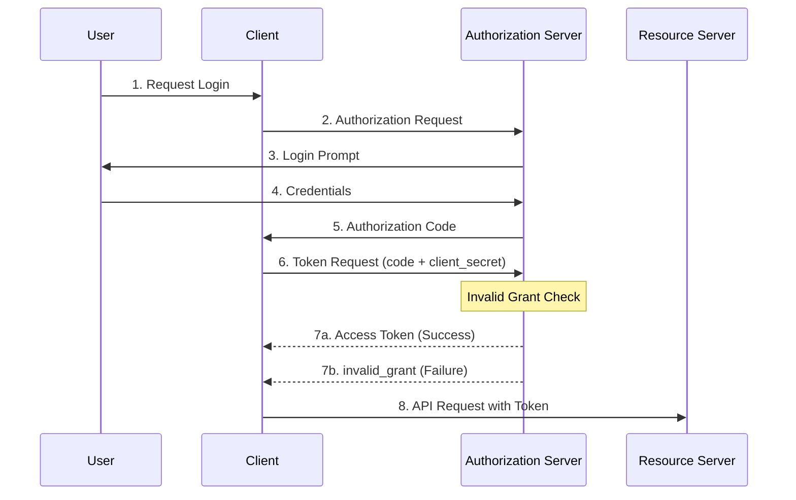
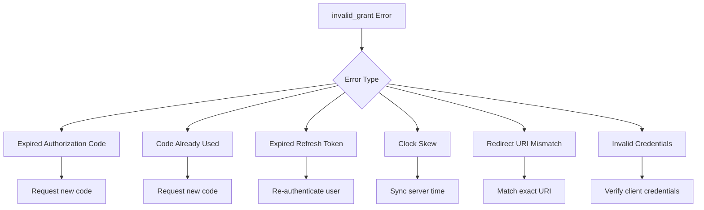
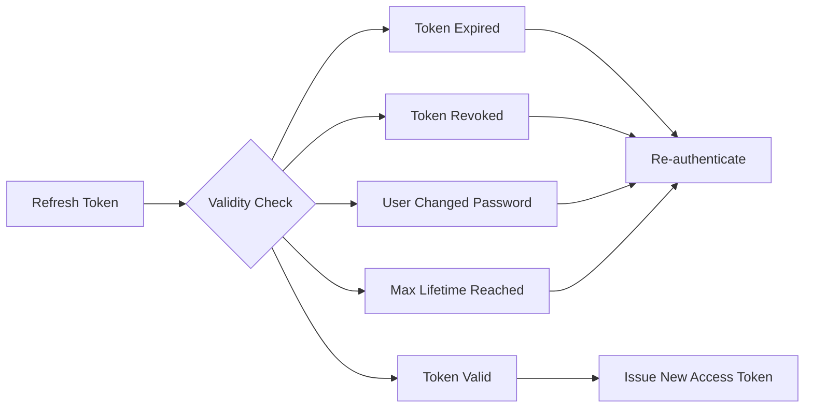

# How to Fix 'Invalid Grant' OAuth2 Errors

Author: [nawazdhandala](https://www.github.com/nawazdhandala)

Tags: OAuth2, Authentication, Security, API, Troubleshooting

Description: Learn how to diagnose and fix OAuth2 invalid_grant errors including expired tokens, authorization code reuse, clock skew, and misconfigured redirect URIs.

---

The "invalid_grant" error is one of the most common OAuth2 errors developers encounter. It occurs during the token exchange process when the authorization server rejects the grant provided by the client. This guide covers the root causes and practical solutions for each scenario.

## Understanding the OAuth2 Token Flow



## Common Causes of Invalid Grant Errors



## Cause 1: Expired Authorization Code

Authorization codes typically expire within 30 seconds to 10 minutes. If you do not exchange the code for tokens quickly, you will receive an invalid_grant error.

### Diagnosis

```python
# Example error response
{
    "error": "invalid_grant",
    "error_description": "The authorization code has expired"
}
```

### Solution

Exchange the authorization code immediately upon receiving it:

```python
import requests
import time

class OAuth2Client:
    def __init__(self, client_id, client_secret, token_url):
        self.client_id = client_id
        self.client_secret = client_secret
        self.token_url = token_url

    def exchange_code(self, authorization_code, redirect_uri):
        """
        Exchange authorization code for tokens immediately.
        Authorization codes are typically valid for 30-60 seconds.
        """
        # Exchange immediately - do not delay
        response = requests.post(
            self.token_url,
            data={
                "grant_type": "authorization_code",
                "code": authorization_code,
                "redirect_uri": redirect_uri,
                "client_id": self.client_id,
                "client_secret": self.client_secret
            },
            timeout=10  # Set reasonable timeout
        )

        if response.status_code != 200:
            error_data = response.json()
            if error_data.get("error") == "invalid_grant":
                # Code expired or already used - user must re-authenticate
                raise ExpiredCodeError(
                    "Authorization code expired. Please login again."
                )
            raise OAuth2Error(error_data)

        return response.json()


class ExpiredCodeError(Exception):
    pass


class OAuth2Error(Exception):
    pass
```

### Flask Callback Handler

```python
from flask import Flask, request, redirect, session
import secrets

app = Flask(__name__)
app.secret_key = secrets.token_hex(32)

oauth_client = OAuth2Client(
    client_id="your_client_id",
    client_secret="your_client_secret",
    token_url="https://auth.example.com/oauth/token"
)

@app.route("/callback")
def oauth_callback():
    """
    Handle OAuth2 callback and exchange code immediately.
    """
    # Verify state to prevent CSRF
    state = request.args.get("state")
    if state != session.get("oauth_state"):
        return "Invalid state parameter", 400

    # Get authorization code
    code = request.args.get("code")
    if not code:
        error = request.args.get("error")
        error_description = request.args.get("error_description")
        return f"Authorization failed: {error} - {error_description}", 400

    # Exchange code immediately - this is time-sensitive
    try:
        tokens = oauth_client.exchange_code(
            authorization_code=code,
            redirect_uri="https://yourapp.com/callback"
        )

        # Store tokens securely
        session["access_token"] = tokens["access_token"]
        session["refresh_token"] = tokens.get("refresh_token")
        session["token_expiry"] = time.time() + tokens["expires_in"]

        return redirect("/dashboard")

    except ExpiredCodeError:
        # Redirect user to login again
        return redirect("/login?error=session_expired")
```

## Cause 2: Authorization Code Reuse

OAuth2 authorization codes are single-use. If you try to use the same code twice, you will receive an invalid_grant error.

### Diagnosis

```python
# First request succeeds
POST /oauth/token
grant_type=authorization_code&code=abc123...
# Response: 200 OK with tokens

# Second request with same code fails
POST /oauth/token
grant_type=authorization_code&code=abc123...
# Response: 400 Bad Request
{
    "error": "invalid_grant",
    "error_description": "Authorization code has already been used"
}
```

### Solution

Track code usage and handle race conditions:

```python
import threading
from functools import wraps

class OAuth2TokenManager:
    def __init__(self, oauth_client):
        self.oauth_client = oauth_client
        self._pending_codes = set()
        self._lock = threading.Lock()

    def exchange_code_safely(self, code, redirect_uri):
        """
        Exchange code with protection against double-submission.
        """
        with self._lock:
            # Check if code is already being processed
            if code in self._pending_codes:
                raise CodeAlreadyProcessingError(
                    "This authorization code is already being processed"
                )
            self._pending_codes.add(code)

        try:
            # Exchange the code
            tokens = self.oauth_client.exchange_code(code, redirect_uri)
            return tokens
        finally:
            # Remove code from pending set
            with self._lock:
                self._pending_codes.discard(code)


class CodeAlreadyProcessingError(Exception):
    pass


# Using Redis for distributed environments
import redis

class DistributedOAuth2TokenManager:
    def __init__(self, oauth_client, redis_client):
        self.oauth_client = oauth_client
        self.redis = redis_client

    def exchange_code_safely(self, code, redirect_uri):
        """
        Exchange code with distributed lock to prevent double-submission.
        """
        # Create a unique lock key for this code
        lock_key = f"oauth_code_lock:{code}"

        # Try to acquire lock (expires in 30 seconds)
        acquired = self.redis.set(
            lock_key,
            "processing",
            nx=True,  # Only set if not exists
            ex=30     # Expire in 30 seconds
        )

        if not acquired:
            raise CodeAlreadyProcessingError(
                "This authorization code is already being processed"
            )

        try:
            tokens = self.oauth_client.exchange_code(code, redirect_uri)

            # Mark code as used
            used_key = f"oauth_code_used:{code}"
            self.redis.set(used_key, "1", ex=3600)  # Keep for 1 hour

            return tokens
        finally:
            # Release lock
            self.redis.delete(lock_key)
```

## Cause 3: Expired Refresh Token

Refresh tokens can expire due to inactivity, revocation, or maximum lifetime limits.

### Common Expiration Scenarios



### Solution

Implement proper refresh token handling with fallback:

```python
import time
import requests

class TokenManager:
    def __init__(self, client_id, client_secret, token_url):
        self.client_id = client_id
        self.client_secret = client_secret
        self.token_url = token_url
        self.access_token = None
        self.refresh_token = None
        self.token_expiry = 0

    def get_valid_token(self):
        """
        Get a valid access token, refreshing if necessary.
        """
        # Check if current token is still valid (with 60 second buffer)
        if self.access_token and time.time() < (self.token_expiry - 60):
            return self.access_token

        # Try to refresh
        if self.refresh_token:
            try:
                return self._refresh_access_token()
            except InvalidGrantError:
                # Refresh token is invalid - need re-authentication
                self._clear_tokens()
                raise ReauthenticationRequired(
                    "Session expired. Please login again."
                )

        raise ReauthenticationRequired("No valid tokens available")

    def _refresh_access_token(self):
        """
        Refresh the access token using the refresh token.
        """
        response = requests.post(
            self.token_url,
            data={
                "grant_type": "refresh_token",
                "refresh_token": self.refresh_token,
                "client_id": self.client_id,
                "client_secret": self.client_secret
            }
        )

        if response.status_code != 200:
            error_data = response.json()
            if error_data.get("error") == "invalid_grant":
                raise InvalidGrantError(error_data.get("error_description"))
            raise OAuth2Error(error_data)

        tokens = response.json()
        self._store_tokens(tokens)
        return self.access_token

    def _store_tokens(self, tokens):
        """Store tokens from response."""
        self.access_token = tokens["access_token"]
        self.token_expiry = time.time() + tokens["expires_in"]

        # Some providers rotate refresh tokens
        if "refresh_token" in tokens:
            self.refresh_token = tokens["refresh_token"]

    def _clear_tokens(self):
        """Clear all stored tokens."""
        self.access_token = None
        self.refresh_token = None
        self.token_expiry = 0


class InvalidGrantError(Exception):
    pass


class ReauthenticationRequired(Exception):
    pass


class OAuth2Error(Exception):
    pass
```

## Cause 4: Clock Skew

If your server's clock is significantly different from the authorization server, tokens may be rejected.

### Diagnosis

```bash
# Check server time
date

# Check NTP synchronization
timedatectl status

# Compare with external time source
curl -s http://worldtimeapi.org/api/ip | jq '.datetime'
```

### Solution

Ensure NTP synchronization:

```bash
# Install and configure NTP on Ubuntu/Debian
sudo apt-get install ntp
sudo systemctl enable ntp
sudo systemctl start ntp

# On CentOS/RHEL
sudo yum install chrony
sudo systemctl enable chronyd
sudo systemctl start chronyd

# Verify synchronization
ntpq -p
```

Handle clock skew in your application:

```python
import time
import ntplib
from datetime import datetime, timezone

class ClockSkewHandler:
    def __init__(self, ntp_server="pool.ntp.org"):
        self.ntp_server = ntp_server
        self._offset = 0
        self._last_sync = 0
        self._sync_interval = 3600  # Sync every hour

    def get_adjusted_time(self):
        """
        Get current time adjusted for clock skew.
        """
        self._sync_if_needed()
        return time.time() + self._offset

    def _sync_if_needed(self):
        """
        Sync with NTP server if interval has passed.
        """
        if time.time() - self._last_sync > self._sync_interval:
            self._sync_with_ntp()

    def _sync_with_ntp(self):
        """
        Calculate offset from NTP server.
        """
        try:
            client = ntplib.NTPClient()
            response = client.request(self.ntp_server, version=3)
            self._offset = response.offset
            self._last_sync = time.time()

            if abs(self._offset) > 5:
                print(f"Warning: Clock skew detected: {self._offset:.2f} seconds")
        except Exception as e:
            print(f"NTP sync failed: {e}")


# Use adjusted time for token validation
clock = ClockSkewHandler()

def is_token_expired(token_expiry):
    """
    Check if token is expired using adjusted time.
    """
    current_time = clock.get_adjusted_time()
    return current_time >= token_expiry
```

## Cause 5: Redirect URI Mismatch

The redirect URI in the token request must exactly match the one used in the authorization request.

### Common Mismatches

```python
# These are all different URIs:
"https://example.com/callback"      # No trailing slash
"https://example.com/callback/"     # Trailing slash
"https://www.example.com/callback"  # With www
"http://example.com/callback"       # HTTP vs HTTPS
"https://example.com/Callback"      # Case difference
```

### Solution

Ensure consistent redirect URI usage:

```python
class OAuth2Config:
    """
    Centralized OAuth2 configuration to ensure consistency.
    """
    def __init__(
        self,
        client_id,
        client_secret,
        authorization_url,
        token_url,
        redirect_uri
    ):
        self.client_id = client_id
        self.client_secret = client_secret
        self.authorization_url = authorization_url
        self.token_url = token_url
        # Normalize and store the redirect URI
        self.redirect_uri = self._normalize_uri(redirect_uri)

    def _normalize_uri(self, uri):
        """
        Normalize URI to prevent mismatches.
        """
        from urllib.parse import urlparse, urlunparse

        parsed = urlparse(uri)

        # Ensure HTTPS in production
        scheme = parsed.scheme.lower()

        # Lowercase the host
        netloc = parsed.netloc.lower()

        # Remove trailing slash from path
        path = parsed.path.rstrip("/")
        if not path:
            path = "/"

        return urlunparse((
            scheme,
            netloc,
            path,
            parsed.params,
            parsed.query,
            ""  # Remove fragment
        ))

    def get_authorization_url(self, state, scope=None):
        """
        Build authorization URL with consistent redirect_uri.
        """
        from urllib.parse import urlencode

        params = {
            "response_type": "code",
            "client_id": self.client_id,
            "redirect_uri": self.redirect_uri,  # Always use stored URI
            "state": state
        }

        if scope:
            params["scope"] = scope

        return f"{self.authorization_url}?{urlencode(params)}"

    def exchange_code(self, code):
        """
        Exchange code using consistent redirect_uri.
        """
        import requests

        response = requests.post(
            self.token_url,
            data={
                "grant_type": "authorization_code",
                "code": code,
                "redirect_uri": self.redirect_uri,  # Same URI as authorization
                "client_id": self.client_id,
                "client_secret": self.client_secret
            }
        )

        return response.json()


# Usage
config = OAuth2Config(
    client_id="your_client_id",
    client_secret="your_client_secret",
    authorization_url="https://auth.example.com/authorize",
    token_url="https://auth.example.com/token",
    redirect_uri="https://yourapp.com/callback"  # Define once
)

# Both requests will use exactly the same redirect_uri
auth_url = config.get_authorization_url(state="random_state", scope="openid profile")
tokens = config.exchange_code(code="received_code")
```

## Cause 6: Invalid Client Credentials

Using wrong client_id or client_secret can also result in invalid_grant errors on some authorization servers.

### Solution

Verify credentials and use secure storage:

```python
import os
from cryptography.fernet import Fernet

class SecureOAuth2Config:
    """
    OAuth2 configuration with secure credential handling.
    """
    def __init__(self):
        # Load from environment variables
        self.client_id = os.environ.get("OAUTH_CLIENT_ID")
        self.client_secret = os.environ.get("OAUTH_CLIENT_SECRET")

        if not self.client_id or not self.client_secret:
            raise ValueError(
                "OAUTH_CLIENT_ID and OAUTH_CLIENT_SECRET must be set"
            )

    def validate_credentials(self):
        """
        Validate that credentials are properly formatted.
        """
        # Client ID validation
        if len(self.client_id) < 10:
            raise ValueError("Client ID appears to be invalid (too short)")

        # Client secret validation
        if len(self.client_secret) < 20:
            raise ValueError("Client secret appears to be invalid (too short)")

        # Check for common mistakes
        if self.client_id.startswith(" ") or self.client_id.endswith(" "):
            raise ValueError("Client ID has leading/trailing whitespace")

        if self.client_secret.startswith(" ") or self.client_secret.endswith(" "):
            raise ValueError("Client secret has leading/trailing whitespace")

        return True


# Environment file (.env) - never commit this
# OAUTH_CLIENT_ID=your_actual_client_id
# OAUTH_CLIENT_SECRET=your_actual_client_secret
```

## Debugging Invalid Grant Errors

Create a diagnostic function to identify the root cause:

```python
import requests
from datetime import datetime
import json

def diagnose_invalid_grant(
    token_url,
    client_id,
    client_secret,
    grant_type,
    code=None,
    refresh_token=None,
    redirect_uri=None
):
    """
    Diagnose invalid_grant errors with detailed output.
    """
    print("=" * 60)
    print("OAuth2 Invalid Grant Diagnostic")
    print("=" * 60)

    # 1. Check system time
    print(f"\n1. System Time Check")
    print(f"   Local time: {datetime.now()}")
    print(f"   UTC time: {datetime.utcnow()}")

    # 2. Validate inputs
    print(f"\n2. Input Validation")
    print(f"   Token URL: {token_url}")
    print(f"   Client ID: {client_id[:8]}...{client_id[-4:]}")
    print(f"   Client Secret: {'*' * 20}")
    print(f"   Grant Type: {grant_type}")

    if redirect_uri:
        print(f"   Redirect URI: {redirect_uri}")

    if code:
        print(f"   Code length: {len(code)} chars")
        print(f"   Code preview: {code[:10]}...")

    if refresh_token:
        print(f"   Refresh token length: {len(refresh_token)} chars")

    # 3. Make the request
    print(f"\n3. Making Token Request")

    data = {
        "grant_type": grant_type,
        "client_id": client_id,
        "client_secret": client_secret
    }

    if grant_type == "authorization_code":
        data["code"] = code
        data["redirect_uri"] = redirect_uri
    elif grant_type == "refresh_token":
        data["refresh_token"] = refresh_token

    try:
        response = requests.post(token_url, data=data, timeout=10)

        print(f"   Status Code: {response.status_code}")
        print(f"   Response Headers:")
        for key, value in response.headers.items():
            if key.lower() in ["date", "content-type", "www-authenticate"]:
                print(f"      {key}: {value}")

        print(f"\n4. Response Analysis")

        try:
            response_data = response.json()
            print(f"   Response Body:")
            print(f"   {json.dumps(response_data, indent=6)}")

            if "error" in response_data:
                error = response_data["error"]
                description = response_data.get("error_description", "")

                print(f"\n5. Diagnosis")

                if "expired" in description.lower():
                    print("   CAUSE: Authorization code or refresh token has expired")
                    print("   FIX: Request a new authorization code from the user")

                elif "already been used" in description.lower():
                    print("   CAUSE: Authorization code has already been exchanged")
                    print("   FIX: Ensure code is only used once")

                elif "redirect" in description.lower():
                    print("   CAUSE: Redirect URI mismatch")
                    print("   FIX: Ensure redirect_uri exactly matches the registered one")

                elif "revoked" in description.lower():
                    print("   CAUSE: Token has been revoked")
                    print("   FIX: User must re-authenticate")

                else:
                    print(f"   CAUSE: {description or 'Unknown'}")
                    print("   FIX: Check authorization server logs for details")

        except json.JSONDecodeError:
            print(f"   Raw Response: {response.text[:500]}")

    except requests.exceptions.RequestException as e:
        print(f"   Request Failed: {e}")

    print("\n" + "=" * 60)


# Usage
diagnose_invalid_grant(
    token_url="https://auth.example.com/oauth/token",
    client_id="your_client_id",
    client_secret="your_client_secret",
    grant_type="authorization_code",
    code="received_authorization_code",
    redirect_uri="https://yourapp.com/callback"
)
```

## Summary

Invalid grant errors can be resolved by addressing these common causes:

| Cause | Solution |
|-------|----------|
| Expired authorization code | Exchange code immediately (within 30-60 seconds) |
| Code already used | Implement single-use protection with locks |
| Expired refresh token | Trigger re-authentication flow |
| Clock skew | Ensure NTP synchronization |
| Redirect URI mismatch | Use consistent, normalized URIs |
| Invalid credentials | Verify and securely store client credentials |

Key best practices:
- Exchange authorization codes immediately upon receipt
- Implement proper refresh token rotation handling
- Use distributed locks in multi-server environments
- Monitor for clock skew and sync with NTP
- Centralize OAuth2 configuration to ensure consistency
- Log detailed error information for debugging
