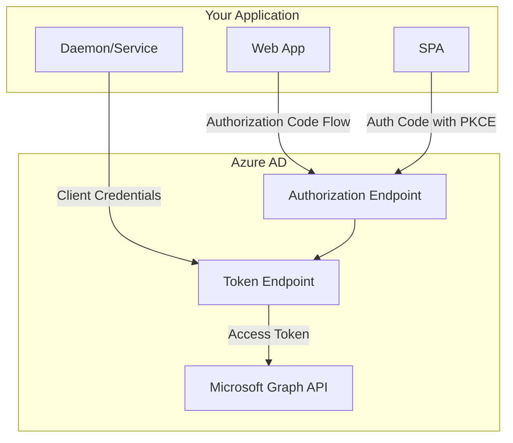

# How to Configure OAuth2 with Microsoft Azure AD

Author: [nawazdhandala](https://www.github.com/nawazdhandala)

Tags: OAuth2, Azure AD, Microsoft, Authentication, Enterprise, Security

Description: A comprehensive guide to configuring OAuth2 authentication with Microsoft Azure AD (Entra ID), including app registration, token flows, and enterprise integration patterns.

---

Microsoft Azure Active Directory (now Microsoft Entra ID) provides enterprise-grade OAuth2 authentication for millions of organizations. Integrating with Azure AD allows users to sign in with their Microsoft work or school accounts.

## Azure AD OAuth2 Architecture



## Register Your Application

Navigate to Azure Portal > Azure Active Directory > App registrations > New registration.

| Field | Description | Example |
|-------|-------------|---------|
| Name | Display name for your app | My Business App |
| Supported account types | Who can use this app | Accounts in any organizational directory |
| Redirect URI | Where to send auth responses | https://myapp.example.com/auth/callback |

### Configure Authentication

```
Azure Portal > Your App > Authentication

Platform configurations:
- Web: https://myapp.example.com/auth/callback

Implicit grant and hybrid flows:
- Access tokens: Disabled (use auth code flow)
- ID tokens: Enabled if using OpenID Connect
```

### Create Client Secret

Navigate to Certificates & secrets > New client secret. Copy the secret value immediately.

## Environment Configuration

```bash
# .env file
AZURE_AD_TENANT_ID=your-tenant-id-or-common
AZURE_AD_CLIENT_ID=your-application-client-id
AZURE_AD_CLIENT_SECRET=your-client-secret
AZURE_AD_REDIRECT_URI=https://myapp.example.com/auth/callback
```

## Implement Authorization Code Flow

```python
import os
import secrets
import requests
from flask import Flask, redirect, request, session
from urllib.parse import urlencode

TENANT_ID = os.environ["AZURE_AD_TENANT_ID"]
CLIENT_ID = os.environ["AZURE_AD_CLIENT_ID"]
CLIENT_SECRET = os.environ["AZURE_AD_CLIENT_SECRET"]
REDIRECT_URI = os.environ["AZURE_AD_REDIRECT_URI"]

AUTHORITY = f"https://login.microsoftonline.com/{TENANT_ID}"
AUTHORIZE_URL = f"{AUTHORITY}/oauth2/v2.0/authorize"
TOKEN_URL = f"{AUTHORITY}/oauth2/v2.0/token"

@app.route("/login")
def login():
    state = secrets.token_urlsafe(32)
    session["oauth_state"] = state

    params = {
        "client_id": CLIENT_ID,
        "response_type": "code",
        "redirect_uri": REDIRECT_URI,
        "scope": "openid profile email User.Read",
        "state": state,
        "prompt": "select_account"
    }

    return redirect(f"{AUTHORIZE_URL}?{urlencode(params)}")

@app.route("/auth/callback")
def callback():
    if request.args.get("state") != session.get("oauth_state"):
        return "State mismatch", 403

    error = request.args.get("error")
    if error:
        return f"Error: {request.args.get('error_description')}", 400

    code = request.args.get("code")

    response = requests.post(TOKEN_URL, data={
        "client_id": CLIENT_ID,
        "client_secret": CLIENT_SECRET,
        "code": code,
        "redirect_uri": REDIRECT_URI,
        "grant_type": "authorization_code"
    })

    tokens = response.json()
    session["access_token"] = tokens["access_token"]

    # Get user info from Microsoft Graph
    user_response = requests.get(
        "https://graph.microsoft.com/v1.0/me",
        headers={"Authorization": f"Bearer {tokens['access_token']}"}
    )
    session["user"] = user_response.json()

    return redirect("/dashboard")
```

## Common Azure AD Errors

```python
AZURE_AD_ERRORS = {
    "AADSTS50001": "Application not found in tenant",
    "AADSTS50011": "Reply URL mismatch",
    "AADSTS65001": "User or admin has not consented to use the application",
    "AADSTS70000": "Refresh token has expired or been revoked"
}

def handle_azure_error(error_response: dict) -> str:
    error_desc = error_response.get("error_description", "")
    for code, message in AZURE_AD_ERRORS.items():
        if code in error_desc:
            return message
    return error_desc or "Authentication failed"
```

## Implement Logout

```python
@app.route("/logout")
def logout():
    session.clear()
    post_logout_uri = url_for("home", _external=True)
    logout_url = (
        f"https://login.microsoftonline.com/{TENANT_ID}/oauth2/v2.0/logout"
        f"?post_logout_redirect_uri={post_logout_uri}"
    )
    return redirect(logout_url)
```

Azure AD provides enterprise-grade authentication with conditional access, multi-factor authentication, and comprehensive audit logging for secure enterprise applications.
